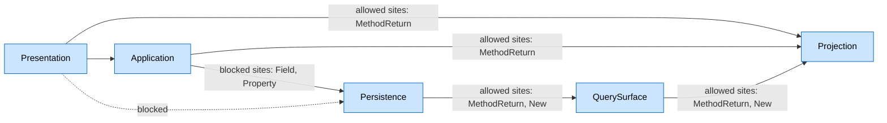
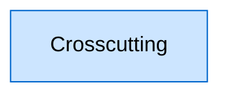
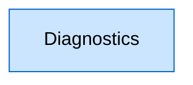
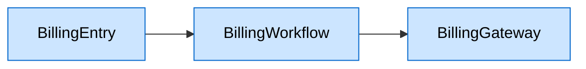
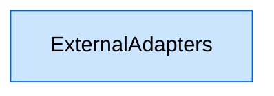
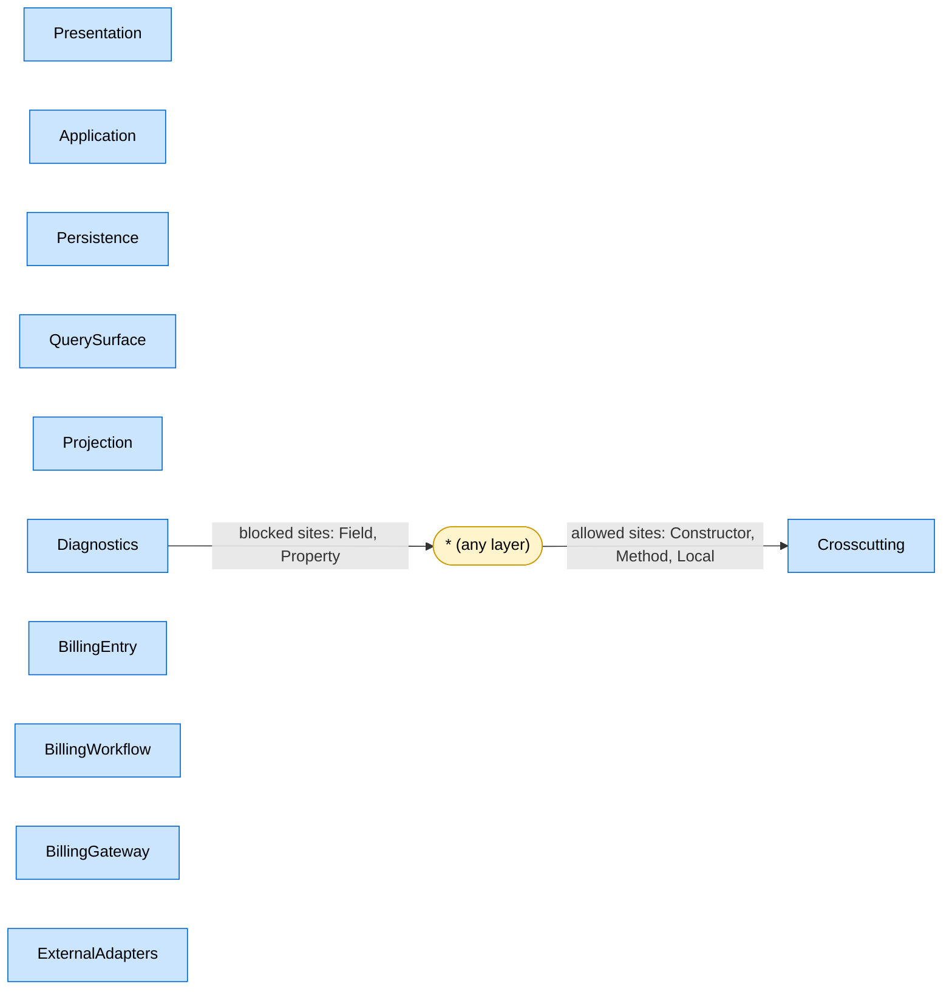

# Architecture Documentation

**Assembly**: `Example.DocumentationDemo`  
**Generated**: 2026-07-07T08:00:16Z

A deliberately busy example that documents layers, matcher rules, allowed and forbidden type policies, site filters, wildcard rules and unrelated dependency chains.

## Dependency Flow

### Dependency Chain 1: Presentation, Application, Projection, Persistence, QuerySurface

These boundaries form one connected dependency chain in the configured rules.

| Layer | Description |
|-------|-------------|
| `Presentation` | Public entry points that translate requests into application actions. |
| `Application` | Application orchestration that prepares orders without touching storage internals directly. |
| `Projection` | Projected DTOs that are safe to return after query surfaces have done their work. |
| `Persistence` | Persistence entry points owned by the application, including repository namespaces. |
| `QuerySurface` | Repository-owned fluent query builders that must be projected before leaving repository-owned code. |

| Rule | Gate | Dependency | Sites | Description |
|------|------|------------|-------|-------------|
| Allowed | `root` | `Presentation -> Application` | all sites | Presentation types may call the application layer to fulfill requests. |
| Allowed | `root` | `Presentation -> Projection` | allowed sites: MethodReturn | Presentation types may return projected DTOs, but should not depend on query surfaces or repositories. |
| Allowed | `root` | `Application -> Persistence` | blocked sites: Field, Property | Application code may use repositories, but should not retain them as mutable state in this example. |
| Allowed | `root` | `Application -> Projection` | allowed sites: MethodReturn | Application services may return projected DTOs after repository query surfaces have finished their work. |
| Allowed | `root` | `Persistence -> QuerySurface` | allowed sites: MethodReturn, New | Repositories may create and return query surfaces as fluent access points. |
| Allowed | `root` | `QuerySurface -> Projection` | allowed sites: MethodReturn, New | Query surfaces may create projections and return only those projected objects. |
| Blocked | `root` | `Presentation -> Persistence` | all sites | Presentation types must never bypass application services and access persistence directly. |

### Dependency Chain 2: Crosscutting

This boundary has no explicit named dependency chain. It may still participate through wildcard rules.

| Layer | Description |
|-------|-------------|
| `Crosscutting` | Infrastructure-shaped helpers that can be requested by any layer without changing business direction. |

### Dependency Chain 3: Diagnostics

This boundary has no explicit named dependency chain. It may still participate through wildcard rules.

| Layer | Description |
|-------|-------------|
| `Diagnostics` | Diagnostics code can inspect the application, but it should not retain long-lived references. |

### Dependency Chain 4: BillingEntry, BillingWorkflow, BillingGateway

These boundaries form one connected dependency chain in the configured rules.

| Layer | Description |
|-------|-------------|
| `BillingEntry` | A separate billing entry chain, unrelated to the primary order-processing flow. |
| `BillingWorkflow` | Billing use-case orchestration that sits behind billing entry points. |
| `BillingGateway` | External billing integration layer. |

| Rule | Gate | Dependency | Sites | Description |
|------|------|------------|-------|-------------|
| Allowed | `root` | `BillingEntry -> BillingWorkflow` | all sites | Billing entry points may call the workflow layer. |
| Allowed | `root` | `BillingWorkflow -> BillingGateway` | all sites | Billing workflows may call the payment gateway layer. |

### Dependency Chain 5: ExternalAdapters

This boundary has no explicit named dependency chain. It may still participate through wildcard rules.

| Layer | Description |
|-------|-------------|
| `ExternalAdapters` | Types supplied by a separately compiled adapters assembly. |

### Wildcard Rules

Wildcard rules apply across layer boundaries that are not fully named by the edge.

| Rule | Gate | Dependency | Sites | Description |
|------|------|------------|-------|-------------|
| Allowed | `root` | `* -> Crosscutting` | allowed sites: Constructor, Method, Local | Any layer may use crosscutting helpers, but only as short-lived collaborators. |
| Allowed | `root` | `Diagnostics -> *` | blocked sites: Field, Property | Diagnostics may inspect configured layers, but block lists prevent retained state. |

## Type Policies

| Policy | Scope | Matcher | Description |
|--------|-------|---------|-------------|
| Forbidden | `global` | `Class endsWith="Store"` | Use Repository instead. |
| Forbidden | `global` | `Namespace contains="DocumentationDemo.Legacy"` | Do not depend on legacy internals. |
| Allowed | `BillingWorkflow` | `Class startsWith="Invoice"` | Invoice is the approved workflow subject in this bounded example. |
| Forbidden | `BillingGateway` | `Class startsWith="Unsafe"` | Use an audited billing gateway. |

## Rules In Configuration Order

- **Include** `SharedApplicationRules.anl`
  Imports the primary application chain so this file can focus on crosscutting, forbidden and billing-specific rules.
  `path="SharedApplicationRules.anl"`
- **Layer** `Presentation`
  Public entry points that translate requests into application actions.
  `name="Presentation"`
  - **Class** `Class endsWith="Endpoint"`
    Endpoint suffixes are treated as public request handlers.
    `endsWith="Endpoint"`
  - **Class** `Class withAttribute="ApiController"`
    Types marked with ApiController also join the Presentation layer.
    `withAttribute="ApiController"`
- **Layer** `Application`
  Application orchestration that prepares orders without touching storage internals directly.
  `name="Application"`
  - **Class** `Class endsWith="Service"`
    Service classes coordinate use cases.
    `endsWith="Service"`
  - **Class** `Class endsWith="Manager"`
    Manager classes are accepted while older application code is being renamed.
    `endsWith="Manager"`
  - **Class** `Class inherits="ApplicationServiceBase"`
    The base class matcher catches application services even when their suffix changes.
    `inherits="ApplicationServiceBase"`
  - **Class** `Class implements="IUseCase"`
    Use-case implementations belong to the application layer.
    `implements="IUseCase"`
  - **Class** `Class withAccessModifier="private"`
    Private nested helpers can be documented with access-modifier matching without broadening public layer ownership.
    `withAccessModifier="private"`
- **Layer** `Persistence`
  Persistence entry points owned by the application, including repository namespaces.
  `name="Persistence"`
  - **Class** `Class startsWith="Order" endsWith="Repository" typeKind="Class"`
    Repository classes for orders identify persistence access; every matcher condition must pass.
    `startsWith="Order" endsWith="Repository" typeKind="Class"`
  - **Namespace** `Namespace contains="DocumentationDemo.Persistence"`
    Types in the persistence namespace are repositories or repository helpers.
    `contains="DocumentationDemo.Persistence"`
- **Layer** `QuerySurface`
  Repository-owned fluent query builders that must be projected before leaving repository-owned code.
  `name="QuerySurface"`
  - **Class** `Class endsWith="Query"`
    Query objects are transient access points, not application dependencies.
    `endsWith="Query"`
- **Layer** `Projection`
  Projected DTOs that are safe to return after query surfaces have done their work.
  `name="Projection"`
  - **Class** `Class endsWith="Projection"`
    Projection classes carry data outward without exposing query mechanics.
    `endsWith="Projection"`
- **AllowedDependency** `Presentation -> Application`
  Presentation types may call the application layer to fulfill requests.
  `from="Presentation" to="Application"`
- **AllowedDependency** `Presentation -> Projection`
  Presentation types may return projected DTOs, but should not depend on query surfaces or repositories.
  `from="Presentation" to="Projection" allowedSites="MethodReturn"`
- **AllowedDependency** `Application -> Persistence`
  Application code may use repositories, but should not retain them as mutable state in this example.
  `from="Application" to="Persistence" blockedSites="Field, Property"`
- **AllowedDependency** `Application -> Projection`
  Application services may return projected DTOs after repository query surfaces have finished their work.
  `from="Application" to="Projection" allowedSites="MethodReturn"`
- **AllowedDependency** `Persistence -> QuerySurface`
  Repositories may create and return query surfaces as fluent access points.
  `from="Persistence" to="QuerySurface" allowedSites="MethodReturn, New"`
- **AllowedDependency** `QuerySurface -> Projection`
  Query surfaces may create projections and return only those projected objects.
  `from="QuerySurface" to="Projection" allowedSites="MethodReturn, New"`
- **Forbidden** `Forbidden`
  Names and namespaces that should never become dependencies in the documented architecture.
  - **Class** `Class endsWith="Store"`
    A Store name hides persistence behind a retail metaphor; Repository is the supported persistence term.
    Diagnostic note: Use Repository instead.
    `endsWith="Store"`
    - **Fix** `Fix Repository`
      The code fix replaces the forbidden Store suffix with Repository.
      `Rename="Repository"`
  - **Namespace** `Namespace contains="DocumentationDemo.Legacy"`
    Legacy internals may exist during migration, but layered code should not take dependencies on them.
    Diagnostic note: Do not depend on legacy internals.
    `contains="DocumentationDemo.Legacy"`
    - **Exceptions** `Exceptions`
      The migration adapter is the sanctioned bridge while old code is being removed.
      - **Class** `Class typeName="LegacyAdapter"`
        LegacyAdapter is the one named exception to the legacy namespace ban.
        `typeName="LegacyAdapter"`
- **Layer** `Crosscutting`
  Infrastructure-shaped helpers that can be requested by any layer without changing business direction.
  `name="Crosscutting"`
  - **Class** `Class typeName="ILogger"`
    Logging is intentionally available across the architecture.
    `typeName="ILogger"`
  - **Class** `Class exactFullName="DocumentationDemo.Telemetry.TelemetryClient"`
    Telemetry is matched by full name so refactors do not accidentally broaden the layer.
    `exactFullName="DocumentationDemo.Telemetry.TelemetryClient"`
- **Layer** `Diagnostics`
  Diagnostics code can inspect the application, but it should not retain long-lived references.
  `name="Diagnostics"`
  - **Class** `Class endsWith="Diagnostics"`
    Diagnostics classes are operational inspection tools.
    `endsWith="Diagnostics"`
- **Layer** `BillingEntry`
  A separate billing entry chain, unrelated to the primary order-processing flow.
  `name="BillingEntry"`
  - **Namespace** `Namespace contains="DocumentationDemo.Billing.Entry"`
    Entry points for billing live under this namespace.
    `contains="DocumentationDemo.Billing.Entry"`
  - **Class** `Class endsWith="EntryPoint"`
    EntryPoint classes are the public billing entry surface.
    `endsWith="EntryPoint"`
- **Layer** `BillingWorkflow`
  Billing use-case orchestration that sits behind billing entry points.
  `name="BillingWorkflow" requireRecognizedDependencies="Constructor"`
  - **Namespace** `Namespace contains="DocumentationDemo.Billing.Workflow"`
    Workflow implementations live here.
    `contains="DocumentationDemo.Billing.Workflow"`
  - **Class** `Class endsWith="Workflow"`
    Workflow classes coordinate billing work.
    `endsWith="Workflow"`
  - **Allowed** `Allowed`
    Billing workflows use the approved Invoice naming vocabulary.
    - **Class** `Class startsWith="Invoice"`
      Invoice is the approved workflow subject in this bounded example.
      `startsWith="Invoice"`
- **Layer** `BillingGateway`
  External billing integration layer.
  `name="BillingGateway"`
  - **Namespace** `Namespace contains="DocumentationDemo.Billing.Gateways"`
    Gateway implementations live here.
    `contains="DocumentationDemo.Billing.Gateways"`
  - **Class** `Class endsWith="Gateway"`
    Gateway classes wrap external payment systems.
    `endsWith="Gateway"`
  - **Forbidden** `Forbidden`
    Unsafe gateway variants must not become dependencies.
    - **Class** `Class startsWith="Unsafe"`
      Unsafe integrations are explicitly blocked inside the billing gateway layer.
      Diagnostic note: Use an audited billing gateway.
      `startsWith="Unsafe"`
- **Layer** `ExternalAdapters`
  Types supplied by a separately compiled adapters assembly.
  `name="ExternalAdapters"`
  - **Assembly** `Assembly exactName="Example.DocumentationDemo.ExternalAdapters"`
    Assembly matching classifies referenced types without relying on namespace conventions.
    `exactName="Example.DocumentationDemo.ExternalAdapters"`
- **AllowedDependency** `* -> Crosscutting`
  Any layer may use crosscutting helpers, but only as short-lived collaborators.
  `from="*" to="Crosscutting" allowedSites="Constructor, Method, Local"`
- **AllowedDependency** `Diagnostics -> *`
  Diagnostics may inspect configured layers, but block lists prevent retained state.
  `from="Diagnostics" to="*" blockedSites="Field, Property"`
- **AllowedDependency** `BillingEntry -> BillingWorkflow`
  Billing entry points may call the workflow layer.
  `from="BillingEntry" to="BillingWorkflow"`
- **AllowedDependency** `BillingWorkflow -> BillingGateway`
  Billing workflows may call the payment gateway layer.
  `from="BillingWorkflow" to="BillingGateway"`
- **BlockedDependency** `Presentation -x-> Persistence`
  Presentation types must never bypass application services and access persistence directly.
  `from="Presentation" to="Persistence"`

