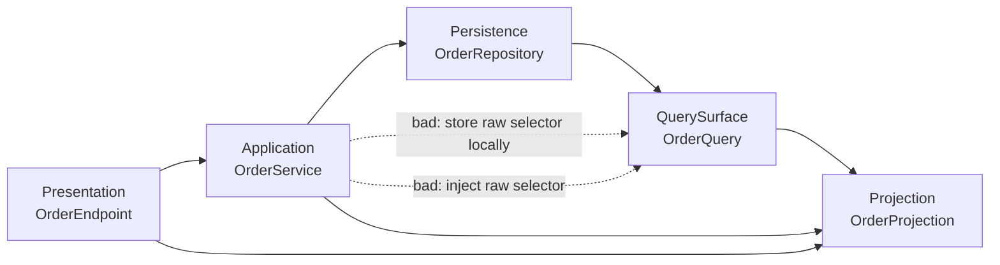

# Example.RepositoryQuerySurface

This scenario shows a persistence-owned query surface. `OrderRepository` can create `OrderQuery`, and callers can use the returned value as a short-lived fluent access point before projecting it to `OrderProjection`.

The intentional violations are `OrderService.GetOrderThroughLocalQuery()` and `OrderDashboardService(OrderQuery query)`. The first stores `OrderQuery` as a local variable with `Site=Local`; the second injects it through the constructor with `Site=Constructor`. Both put the raw query surface directly in the Application layer and produce `ARCH001`.

`OrderRepository.QueryOrders()` is allowed to return `OrderQuery` because Persistence owns that query surface. Outside layers should project it to `OrderProjection` instead of returning or injecting the raw query object.
