<!-- This README is generated from docs/*.md. Edit docs and run docs/build-readme.ps1. -->

# *A*nalyzer for **N**-dimensional **A**dvanced Architectural Layering - ANAAL IJzer

[](https://www.nuget.org/packages/RonSijm.AnaalIJzer)
[](https://www.nuget.org/packages/RonSijm.AnaalIJzer)
[](https://codecov.io/gh/RonSijm/RonSijm.AnaalIJzer)

## Introduction

A Roslyn analyzer that enforces architectural layering rules in your codebase. You define named layers and explicit allowed dependency edges in an XML file, and the analyzer ensures each type only depends on types in permitted layers - catching illegal dependencies at compile time.

---

## Naming

"IJzer" is the Dutch word for Iron. I - Ron, the creator (of this project) - have therefore decided to name this project "IJzer".

Consider: a "layered" architecture is usually drawn as a stack of horizontal bands - Controller on top, Repository at the bottom, gravity in between. This is a 1-dimensional projection, and already something of a lie. The moment you add a second axis - deployment tier, bounded context, tenant, feature module - you have a grid. Add a third and the whiteboard contains a cube. Add a fourth and you are now reasoning about a **tesseract**: 16 vertices, 32 edges, no faithful embedding in 3-space, and absolutely no chance of fitting next to the standup-room coffee machine.

A penteract has 32 vertices and 80 edges. A hexeract has 64 and 192. By the 23rd dimension you have stopped doing software architecture and started doing something closer to differential topology, or possibly mysticism - the distinction is left as an exercise for the reader.

The point, such as there is one, is that the XML config does not care about your visual limitations. It cheerfully encodes whatever lower-dimensional projection of the underlying hypercube you have conveniently decided to enforce this time, this sprint. The generated documentation shows you that projection with Mermaid diagrams and rule descriptions. This should not be mistaken for understanding. The other dimensions you forgot to project are still there, watching, waiting, occasionally producing an ARCH00X at 4:47 PM on a Friday.

ANAAL IJzer forges the shadow. The hypercube compiles in silent apathy.

---

Ok maybe not.

---

## The problem it solves

### Meta: Why a restaurant?

Architecture terms such as `Controller`, `ViewModel`, `Handler`, or `Slice` come with prior knowledge and expectations about MVC, MVVM, vertical slices, and other specific styles. Using them in the introductory examples could make an incidental name look like a rule or imply that Anaal IJzer prefers one of those architectures.

The restaurant is therefore a deliberately opinionated **example domain**, not a prescribed software architecture. Its roles are familiar enough to discuss boundaries without framework knowledge: a Customer depends on a Waiter, a Waiter depends on a Chef, and a Chef depends on the Pantry. In these examples the roles are simply layer names, and an arrow always means **“may depend on.”** Your own configuration can use whatever layers and architectural style fit your application.

Imagine a restaurant with four roles:

- A **Customer** may ask a **Waiter** for service, but should not direct a **Chef** or enter the **Pantry**
- A **Waiter** may ask a **Chef** to prepare an order
- A **Chef** may use the **Pantry**
- Peers in the same role should not command each other unless that role explicitly allows it

Without tooling, these rules live only in code-review comments and tribal knowledge. This analyzer turns them into compile errors.

How this is usually solved without this project is by creating a separate unit or integration test project to verify these concerns. This analyzer removes that need entirely - violations are reported inline as you type.

---

## How it works

You define named layers and the edges between them in an XML file. The analyzer reads that file and checks every dependency a class, record, struct, or interface introduces - constructor and method parameters, method return types, fields, properties, local variables, inheritance, attributes, static member access, `new` expressions, and generic service-locator invocations. When a type in layer A introduces a dependency on a type whose layer is not permitted for A, an error is reported on the offending syntax.

```
Customer ──► Waiter    ✅ allowed
Waiter ──► Chef        ✅ allowed
Chef ──► Pantry        ✅ allowed

Customer ──► Chef      ❌ ARCH001 - no AllowedDependency edge configured
Pantry ──► Chef        ❌ ARCH004 - wrong direction (reverse of the allowed edge)
Chef ──► Chef          ❌ ARCH005 - same layer
```

### Where it hooks into Roslyn

[Roslyn](https://github.com/dotnet/roslyn/blob/main/docs/wiki/Roslyn-Overview.md) is the .NET compiler platform behind C# and Visual Basic. Instead of exposing only a command that turns source files into assemblies, Roslyn exposes the compiler pipeline as APIs: syntax trees represent parsed source, semantic models bind syntax to symbols and types, and a `Compilation` is an immutable snapshot of the complete program being compiled.

Anaal IJzer is a C# `DiagnosticAnalyzer`. It runs inside that compiler pipeline in Visual Studio, Rider, `dotnet build`, and CI; it is not a post-build reflection scan and does not execute application code.

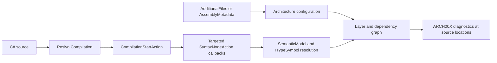

The integration points are:

1. [`ArchitecturalLevelAnalyzer`](src/Main/RonSijm.AnaalIJzer/ArchitecturalLevelAnalyzer.cs) is marked with `[DiagnosticAnalyzer(LanguageNames.CSharp)]`, which makes it discoverable as a C# analyzer.
2. For each compilation snapshot, its `CompilationStartAction` reads `Architecture.anl` from Roslyn's `AdditionalFiles`, or reads inline `AssemblyMetadata("AnaalIJzerSettings", ...)`. The parsed configuration is then reused by every callback registered for that compilation.
3. It registers `SyntaxNodeAction` callbacks only for syntax that can introduce an architectural dependency: type and constructor declarations, methods, fields, properties, locals, object creation, invocations, attributes, inheritance, and static member access. Generated code is ignored, and callbacks may run concurrently.
4. [`LayerDependencyAnalyzer`](src/Main/RonSijm.AnaalIJzer/Analysis/LayerDependencyAnalyzer.cs) uses the callback's `SemanticModel` to resolve syntax to real Roslyn symbols such as `ITypeSymbol`. This is why aliases, inferred local types, generic type arguments, implemented interfaces, and referenced types can be evaluated by their actual type identity instead of by source text alone.
5. The resolved caller and dependency symbols are matched to configured layer paths. The dependency graph evaluates the relevant boundary gates, blocked rules, site filters, recognized-dependency requirements, and forbidden patterns. A failure is returned to Roslyn with `ReportDiagnostic`, including the source location and diagnostic properties such as `Site`.
6. Configuration failures and configured cycles are reported at the end of the compilation as ARCH006 or ARCH007. If there is no configuration source, no dependency callbacks are registered and the analyzer remains silent.

Because the same analyzer participates in design-time and command-line compilations, the red squiggle in the editor and the error in CI come from the same rule evaluation.

---
## Positioning and how it usually works without this project

Anaal IJzer is a lightweight compile-time architecture guard for .NET.

It occupies the space between:
- runtime architecture tests like NetArchTest / ArchUnitNET
- heavyweight static-analysis platforms like NDepend
- old Visual Studio layer diagram validation

### The alternative: architecture tests

The standard approach is to write a dedicated test project using a library such as [NetArchTest](https://github.com/BenMorris/NetArchTest) or [ArchUnitNET](https://archunitnet.readthedocs.io/):

```csharp
// In a test project — ArchitectureTests.cs
[Fact]
public void Presentation_Should_Not_Depend_On_Persistence()
{
    var result = Types.InAssembly(typeof(OrderEndpoint).Assembly)
        .That().ResideInNamespace("MyApp.Presentation")
        .ShouldNot().HaveDependencyOn("MyApp.Persistence")
        .GetResult();

    Assert.True(result.IsSuccessful);
}
```

This works, but it has significant downsides:

1. **Slow feedback** — the violation is only visible when you run the test suite, not while you are typing. By the time CI catches it, the code is already written and often already reviewed.

2. **Wrong location** — the failure appears in a test project, not at the offending line. You see *"ArchitectureTests.Presentation_Should_Not_Depend_On_Persistence failed"*, not a red squiggle on the dependency that caused it.

3. **Wrong concern** — structural rules do not belong in a test suite alongside behaviour tests. A failing architecture test is not a regression; it is a policy violation. Mixing them obscures both.

4. **Rules live in C# instead of config** — to change which layers are allowed to talk to each other you must edit code, recompile, and re-run tests. With `Architecture.anl` you edit a file and the next build picks it up.

5. **Coverage gaps** — the rules only cover what someone explicitly wrote a test for. A missed `ShouldNot` call means a whole class of violations goes undetected. The analyzer enforces every edge in the graph unconditionally.

## Setup

### 1. Reference the analyzer

Add the analyzer package to the project you want to validate:

```powershell
dotnet add package RonSijm.AnaalIJzer
```

Or add the package reference directly to your `.csproj`:

```xml
<ItemGroup>
    <PackageReference Include="RonSijm.AnaalIJzer" Version="0.0.7" PrivateAssets="all" />
</ItemGroup>
```

`PrivateAssets="all"` keeps the analyzer as a development-time dependency and prevents it from flowing transitively to projects that reference yours.

### 2. Create the configuration file

Add a file called `Architecture.anl` to the **root of the project you want to analyze**:

```xml
<ArchitecturalLevels>

  <Layer name="Presentation">
    <Class endsWith="Endpoint" />
  </Layer>

  <Layer name="Application">
    <Class endsWith="Service" />
    <Class endsWith="Manager" />
    <Class endsWith="Coordinator" />
  </Layer>

  <Layer name="Persistence">
    <Class endsWith="Repository" />
  </Layer>

  <AllowedDependency from="Presentation" to="Application" />
  <AllowedDependency from="Application" to="Persistence" />

</ArchitecturalLevels>
```

### 3. Register the file as an AdditionalFile

Tell MSBuild to pass the file to Roslyn:

```xml
<ItemGroup>
    <AdditionalFiles Include="Architecture.anl" />
</ItemGroup>
```

If the config uses `<Include>`, register the included settings files too:

```xml
<ItemGroup>
    <AdditionalFiles Include="*.anl" />
</ItemGroup>
```

`Architecture.anl` is still XML internally: keep the `<ArchitecturalLevels>` root and the XSD schema hint if you want editor validation. The analyzer uses `Architecture.anl` as the explicit top-level settings file convention; other settings files are only read when referenced through `<Include>` or passed directly to Arse.

### 4. Share the same config with `Directory.Build.props`

If several projects should use the same `Architecture.anl`, put the XML next to a solution-level `Directory.Build.props` and register it there instead of copying the file into every project:

```xml
<Project>
  <ItemGroup>
    <PackageReference Include="RonSijm.AnaalIJzer" Version="0.0.7" PrivateAssets="all" />
    <AdditionalFiles Include="$(MSBuildThisFileDirectory)Architecture.anl" Link="Architecture.anl" />
  </ItemGroup>
</Project>
```

`Directory.Build.props` is imported by every project below its folder. `$(MSBuildThisFileDirectory)` keeps the path anchored to the props file, so every project receives the same config file regardless of where its `.csproj` lives.

If the analyzer is already referenced somewhere else, keep that reference and centralize only the config file:

```xml
<Project>
  <ItemGroup>
    <AdditionalFiles Include="$(MSBuildThisFileDirectory)Architecture.anl" Link="Architecture.anl" />
  </ItemGroup>
</Project>
```

### 5. Optional: inline settings with `AssemblyMetadata`

For small examples and throwaway projects, you can put the XML directly in code with the built-in `AssemblyMetadataAttribute`. Because the value is C#, exact type matches can use `nameof(...)` instead of fragile string literals:

```csharp
using System.Reflection;

[assembly: AssemblyMetadata("AnaalIJzerSettings", $"""
<ArchitecturalLevels>
  <Layer name="Presentation">
    <Class endsWith="Endpoint" />
  </Layer>

  <Layer name="Application">
    <Class endsWith="Service" />
  </Layer>

  <Layer name="Persistence">
    <Class typeName="{nameof(OrderRepository)}" />
  </Layer>

  <AllowedDependency from="Presentation" to="Application" />
  <AllowedDependency from="Application" to="Persistence" />
</ArchitecturalLevels>
""")]

public sealed class OrderRepository { }
```

The analyzer recognizes `AssemblyMetadata("AnaalIJzerSettings", "...")` and reads the second constructor argument as XML. No custom helper attribute or extra package reference is needed.

If both config sources exist, `Architecture.anl` wins and the inline metadata value is ignored. The "Add to exceptions" code fix edits file-based XML, including included files that own the matched rule, so inline settings are best for compact examples, not for a large team config that you expect the IDE to maintain. The simple one-file examples in this repository use `AssemblyMetadata("AnaalIJzerSettings", ...)`, and exact type-name rules use `nameof(...)` so refactors break the code at compile time instead of quietly breaking the config. Broader examples use XML files when that makes the configuration easier to read.

**Example project:** [`Example.InlineXml`](Examples/Features/Example.InlineXml)

That's it. The analyzer activates automatically for every `.cs` file in the project.

Examples use one vocabulary at a time. Explanatory diagnostics use the restaurant roles `Customer`, `Waiter`, `Chef`, and `Pantry`. Setup and reference examples use the technical layers `Presentation`, `Application`, and `Persistence`. A diagram, code block, or explanation never maps one vocabulary onto the other.

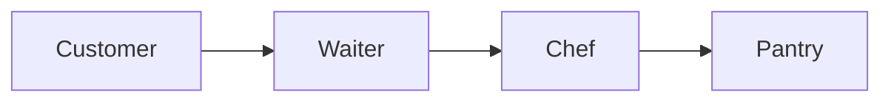

The self-contained projects under [`Examples/`](Examples/) are referenced inline where their feature is documented. Most intentionally fail with documented `ARCH00X` errors; a few demonstrate clean wildcard config or generated report/documentation output. Scenario examples, such as [`Example.RepositoryQuerySurface`](Examples/Scenarios/Example.RepositoryQuerySurface), show larger usage patterns rather than a single analyzer feature.

---

## Visual Studio companion extension

The analyzer already reports the actual `ARCH00X` diagnostics in Visual Studio. The companion extension adds editor-only context on top of those diagnostics: it shows which configured layer a type belongs to, and it can label dependency sites while you are reading code.

Build the VSIX from the repository root:

```cmd
build\Scripts\build-vs-extension.cmd
```

The script writes `RonSijm.AnaalIJzer.VisualStudio.vsix` to `build\Artifacts\VisualStudio`. Install that VSIX into Visual Studio 2026 to enable the editor companion. Each VSIX build stamps a fresh timestamp-based extension version, so Visual Studio can install a newly built local VSIX over the previous one.

The GitHub `build-vsix.yml` workflow builds and uploads the VSIX artifact on Windows. On pushes to `main`, it also submits the VSIX to Visual Studio Marketplace when the repository secret `VS_MARKETPLACE_TOKEN` is configured. Marketplace metadata lives in `src\Extensions\RonSijm.AnaalIJzer.VisualStudio\marketplace-publish.json`.

The extension reads the same `Architecture.anl` or `AssemblyMetadata("AnaalIJzerSettings", ...)` configuration as the analyzer through Visual Studio's Roslyn workspace. If no AnaalIJzer config exists, it renders nothing. If the config is invalid, the extension stays quiet and leaves the existing `ARCH006` analyzer diagnostic as the source of truth.

Layer indicators are controlled from Visual Studio 2026 Settings under `AnaalIJzer > Editor`:

| Option | Default | Meaning |
|---|---:|---|
| Show layer badges | On | Shows the resolved canonical layer path after class, interface, struct and record declarations. |
| Show layer badges when not in layer | Off | Shows a neutral `not in layer` badge for type declarations that do not match any configured layer. |
| Gutter glyphs | On | Shows a small layer marker beside layered type declarations. |
| Highlight code in layer | On | Highlights layered type declaration blocks using fixed Fonts & Colors entries named `AnaalIJzer Layer 01` through `AnaalIJzer Layer 16`, plus a subtle block outline in the editor. Layer paths map to slots deterministically by configuration document order. |
| Individual site diagnostics | Off | Each supported site has its own switch, such as `Show Constructor Site Diagnostics`, `Show Local Site Diagnostics`, `Show InterfaceImplementation Site Diagnostics`, and `Show StaticMember Site Diagnostics`. |
| Graph focus mode | Highlight current | Controls whether the dependency graph tool window shows every graph, highlights the graph that affects the active editor, or filters to only the active graph. |

You can also toggle site labels from `Tools > AnaalIJzer: Toggle Sites Diagnostics` or command search. The command turns every site label on when none are enabled, and turns every site label off when at least one is enabled. These labels do not create or suppress diagnostics; they only make the syntax site visible while the analyzer remains responsible for compile/build errors. Site labels use separate allowed, warning, unclassified, and error colors so an allowed constructor dependency does not look the same as a site-filtered or blocked dependency.

Use `View > Other Windows > AnaalIJzer: Show Dependency Graphs` or command search to open a dockable dependency-graph sidebar. The sidebar groups concrete layer rules into connected graphs and shows wildcard/global rules separately. When the active editor contains a type assigned to a layer, the configured graph focus mode can either keep all graphs visible and highlight the affected one, or show only the affected graph.

Use `Tools > AnaalIJzer: Show Status` if the editor appears quiet. It analyzes the active document and reports whether the file is part of Visual Studio's Roslyn workspace, whether settings were found, how many layer/site indicators were produced, and whether configuration issues are suppressing visual adornments.

Hovering a layered type or dependency site shows native Visual Studio QuickInfo. Layer QuickInfo shows the canonical path, ancestry, palette slot, description when configured, which layers may call the current layer, and which layers the current layer may call. Site QuickInfo shows the site name, caller, dependency, status, diagnostic ID when present, and the same denial reason used by the analyzer snapshot.

The companion writes diagnostic logs to Visual Studio's Activity Log and to an Output window pane named `AnaalIJzer`. If settings, menu commands, or editor visuals do not appear, start Visual Studio with logging enabled, reproduce the issue, and search the Activity Log for `AnaalIJzer`. If there are no `AnaalIJzer` entries at all, the VSIX package is not loading; if package initialization is present but no tagger entries appear, the editor MEF component is not being created for the active C# view.

The VSIX uses classic Visual Studio editor extension points: MEF taggers, glyphs, inline adornments, option pages and Fonts & Colors format definitions. The shared snapshot logic lives in the analyzer assembly under `RonSijm.AnaalIJzer.Editor`, so the extension does not duplicate config parsing or layer matching.

For local validation, use the [Visual Studio companion manual acceptance checklist](docs/visual-studio-companion-manual-acceptance.md). If no adornments appear, run `Tools > AnaalIJzer: Show Status` first. The extension reads analyzer `AdditionalFiles`, inline `AssemblyMetadata("AnaalIJzerSettings", ...)`, and as an editor-only convenience the nearest `Architecture.anl` above the active document; if the config is invalid, the companion intentionally renders nothing and leaves the `ARCH006` diagnostic as the source of truth.

## Arse TUI

Arse - **A**rchitecture **R**ule **S**tandalone **E**xecutable - can load a real project or solution with `MSBuildWorkspace`, so it sees the same compiled `AnaalIJzerSettings` metadata value as the analyzer. It can also generate documentation directly from a specific XML settings file.

```powershell
dotnet tool install --global RonSijm.AnaalIJzer.Arse
```

Run `arse` without arguments for the interactive terminal interface built with [RazorConsole](https://github.com/RazorConsole/RazorConsole). Path fields show matching directories and relevant files while you type. Use Up/Down to select a suggestion, Right Arrow to complete it without leaving the field, or Tab to apply the selected or shared-prefix completion before moving on. Interactive architecture inspection displays its report before writing anything; choose `Save` afterward to select the output file. Supply a command to use the same executable headlessly:

```cmd
arse generate-config --project src\MyApp\MyApp.csproj --output Architecture.anl
arse generate-config --project src\MyApp\MyApp.csproj --strategy conventions --minimum-confidence 0.95 --minimum-support 10 --generate-documentation --include-input
arse export-config --project src\MyApp\MyApp.csproj --output Architecture.anl
arse documentation --project src\MyApp\MyApp.csproj --output docs\architecture-documentation.md --force
arse documentation --config Architecture.anl --output docs\architecture-documentation.md --force
arse report        --project src\MyApp\MyApp.csproj --output docs\architectural-violations.md --force
arse report        --solution src\MyApp.slnx --output docs\architectural-violations.md --force
arse inspect       --project src\MyApp\MyApp.csproj --output docs\architecture-health.md --force
arse inspect       --solution src\MyApp.slnx --output docs\architecture-health.md --force
arse merge-config  --config Shared.anl --config Project.anl --output Architecture.anl --force
arse split-config  --config Architecture.anl --output ArchitectureRules --force
```

`generate-config` inspects source-defined types and the dependency sites already present in the project. It infers layers from the first namespace segment below the project's common namespace, falling back to familiar type suffixes such as `Controller`, `Service`, `Repository`, `Handler` and `Projection`. The command writes both `Architecture.anl` and a local `AnaalIJzer.xsd`, then runs the analyzer against the generated XML before accepting the result.

The generation strategy controls how observed dependencies become rules:

| Strategy | Behavior |
|---|---|
| `snapshot` | The default. Every observed layer edge and dependency site becomes an `AllowedDependency`, producing a passing description of the current structure. |
| `conventions` | Infers dominant edges and writes minority caller types into `<Exceptions>`, producing a passing ratchet that blocks new callers from following those outliers. |

Convention inference is configurable:

| Option | Default | Meaning |
|---|---:|---|
| `--minimum-confidence` | `0.90` | Minimum share of active caller types in a layer that must use an edge. The generator counts distinct caller types, not raw syntax occurrences. |
| `--minimum-support` | `5` | Minimum number of distinct callers that must use an edge before it can be treated as a convention. |

Think of confidence as **“is this edge popular enough?”** and support as **“have we seen enough callers to trust that percentage?”** An edge must pass both thresholds.

#### One project, different thresholds

Suppose Arse observes ten distinct active caller types in the `Presentation` layer:

| Existing callers | Observed dependency | Confidence | Support |
|---:|---|---:|---:|
| 8 endpoints | `Presentation --> Application` | `8 / 10 = 0.80` | `8` |
| 2 endpoints | `Presentation --> Persistence` | `2 / 10 = 0.20` | `2` |

An **active caller** is a distinct type in the source layer that has at least one observed outgoing dependency. An endpoint that mentions `Application` ten times still contributes one caller, not ten. The confidence and support comparisons are inclusive: an edge with confidence `0.80` and support `8` passes thresholds of exactly `0.80` and `8`.

Run convention generation several times against that same project, changing only the thresholds:

```cmd
arse generate-config --project Shop.csproj --strategy conventions --minimum-confidence 0.75 --minimum-support 5 --output Architecture.75-5.anl
arse generate-config --project Shop.csproj --strategy conventions --minimum-confidence 0.90 --minimum-support 5 --output Architecture.90-5.anl
arse generate-config --project Shop.csproj --strategy conventions --minimum-confidence 0.75 --minimum-support 9 --output Architecture.75-9.anl
arse generate-config --project Shop.csproj --strategy conventions --minimum-confidence 0.20 --minimum-support 2 --output Architecture.20-2.anl
```

The same evidence now produces four different results:

| Confidence | Support | Edges that qualify as conventions | Generated result |
|---:|---:|---|---|
| `0.75` | `5` | `Presentation --> Application` | Writes only the Application edge. The two Persistence callers become exact-name exceptions under the generated Presentation matcher. |
| `0.90` | `5` | None: `0.80` is below `0.90` | Evidence is ambiguous, so both observed edges are preserved as a snapshot and no exceptions are added. |
| `0.75` | `9` | None: support `8` is below `9` | Evidence is ambiguous, so both observed edges are preserved as a snapshot and no exceptions are added. |
| `0.20` | `2` | Both edges | Writes both edges as conventions. There are no rejected edges, so no exceptions are needed. |

The first invocation treats `Presentation --> Application` as the dominant convention. Its generated output is conceptually:

```xml
<Layer name="Presentation">
  <Namespace regex="^Shop\.Presentation(?:\.|$)">
    <Exceptions>
      <Class exactFullName="Shop.Presentation.LegacyAdminEndpoint" />
      <Class exactFullName="Shop.Presentation.ImportEndpoint" />
    </Exceptions>
  </Namespace>
</Layer>

<AllowedDependency from="Presentation" to="Application" />
```

The two outlier endpoint names are illustrative; Arse writes the actual fully qualified caller names it found. If **no** edge from a source layer reaches both thresholds, Arse does not guess: it preserves every observed edge from that layer as an ambiguous snapshot.

The executable counterpart is [`ConfigurationGenerator_AppliesDifferentThresholdsToTheSameEvidence`](src/Tests/RonSijm.AnaalIJzer.Tooling.Tests/Tooling/ToolingTests.cs#L89). Its four theory cases run this same 8/2 setup with the four threshold combinations above and verify the generated edges, ambiguity fallback, and exceptions.

Generated `<Exceptions>` use the analyzer's existing ratchet semantics: the caller is exempt from that layer matcher, so all of that caller's dependencies are grandfathered. Review these entries before adopting the file. Convention mode identifies statistically dominant structure; it cannot prove architectural intent.

Add `--generate-documentation` to write `architecture-documentation.md` beside the generated XML. The document includes the evidence counts behind inferred edges, the project types resolved by each matcher, concrete code usages permitted by each allowed dependency, generated exceptions as unclassified types, and any current analyzer violations. Add `--include-input` when the document should also contain a fenced copy of the generated XML.

`export-config` writes the evaluated inline XML, so `typeName="{nameof(OrderRepository)}"` becomes `typeName="OrderRepository"` in the persisted file. `documentation` accepts either a project for compiled inline settings and project-backed XML or a specific XML file directly. `report` accepts a project or solution; solution mode opens every C# project in the solution, runs the same analyzer pass per project, and aggregates the diagnostics into one Markdown report. `documentation` and `report` use `documentationPath` / `reportPath` from the config when the output is omitted. Solution `report` uses the first configured project as the representative settings source; if no `reportPath` is enabled there, it defaults to `architectural-violations.md` beside the solution.

`inspect` (aliases: `validate`, `doctor`, `health`) accepts a project, solution, or XML file and writes `architecture-health.md`. XML inspection reports malformed settings, missing includes, invalid matchers, unknown layer references, and configured cycles. Project inspection additionally reports unclassified or ambiguously classified types, unmatched matchers, stale exceptions, unused allowed edges, observed dependency cycles, and current analyzer violations. Solution inspection runs that same project inspection for every C# project and aggregates the findings into one report. Headless Arse exits with code `3` when findings require review.

`merge-config` recursively replaces `<Include>` elements with their referenced rules and writes one self-contained XML file. Repeated references resolving to the same path are included once. Root settings such as `requireRecognizedDependencies`, report paths, documentation paths and the XSD location are preserved and rebased relative to the merged output.

`split-config` treats `AllowedDependency` and `BlockedDependency` entries as an undirected graph for grouping purposes. When the configuration contains disconnected graphs, it writes:

- `Architecture.anl` as the new manifest.
- One `Graph.XX.<layers>.anl` file per disconnected dependency graph.
- `Shared.anl` for global rules such as `<Forbidden>`, when needed.

The manifest includes every generated file, so it remains a complete replacement for the original configuration. Wildcard dependencies connect every named layer and therefore prevent those layers from being split into separate graphs. In Arse's interactive mode, enter multiple merge inputs separated by semicolons.

Arse's interactive and headless modes share `RonSijm.AnaalIJzer.Tooling`. Its `ToolOperationCatalog`, `ToolRequest` and `ToolRunner` own the available operations, supported inputs, validation and execution behavior, keeping both modes in feature parity.

## WPF graph editor component

The WPF graph editor is the reusable visual editor behind the standalone graph editor harness and the Visual Studio dependency-graph tool window.

| Project | Purpose |
|---|---|
| `src/Main/RonSijm.AnaalIJzer.Graphing` | Shared graph view models and layout grouping. |
| `src/Main/RonSijm.AnaalIJzer.Graphing.Wpf` | WPF/Nodify controls for viewing and editing architecture graphs. |
| `src/Tools/RonSijm.AnaalIJzer.GraphEditor.Standalone` | Small executable harness for testing the WPF component outside Visual Studio. |
| `src/Extensions/RonSijm.AnaalIJzer.VisualStudio` | Hosts the same WPF component inside the Visual Studio companion extension. |

The central controls are `ArchitectureGraphEditorControl` and `ArchitectureGraphCanvas`. They consume an `ArchitectureGraphSnapshot`, render connected layer graphs left-to-right, show wildcard/global rules separately, and preserve user layout through graph editor user settings.

The editor is source-aware. It can edit XML settings files and inline `AssemblyMetadata("AnaalIJzerSettings", ...)` settings, then reload through the same configuration-reading path used by the analyzer tooling. The graph supports:

- dragging and resizing nested layer groups;
- collapsing graph groups;
- moving individual nodes without losing positions on refresh;
- creating root and child layers from context menus;
- drawing new dependencies from output connectors to input connectors;
- removing layers and dependencies;
- editing allowed/blocked dependency kind, site filters, descriptions and descendant cascading;
- editing layer matchers, scoped type policies, includes and root settings from the inspector.
- exporting the currently rendered graph surface to a PNG image.

The component itself is not a Roslyn analyzer. It edits the configuration model through `RonSijm.AnaalIJzer.ConfigurationEditing`, and hosts decide where snapshots come from. Visual Studio builds snapshots from the active Roslyn workspace. The standalone harness can open `Architecture.anl`, `.xml`, `.csproj`, `.sln`, and `.slnx` inputs. Project and solution inputs use the shared MSBuildWorkspace tooling host, choose the first project with an AnaalIJzer configuration as the editable settings source, and overlay solution-wide code evidence on the diagram.

The `Export PNG` button is part of the shared WPF control, so it is available in both the standalone graph editor and the Visual Studio dependency-graph tool window. Tests can also call `ArchitectureGraphEditorControl.ExportGraphsAsPng(...)` directly for quick render smoke checks.

To regenerate a graph image for every example project, run:

```cmd
build\Scripts\export-example-graph-images.cmd
```

The script builds the standalone graph editor, writes flat PNG artifacts to `build\Artifacts\ExampleGraphImages`, and copies each image next to its example project as `<ExampleProjectName>-Graph.png`. Intentionally invalid diagnostic examples get a placeholder image instead of stopping the whole export run.

Build the standalone harness locally from the repository root:

```cmd
build\Scripts\build-graph-editor-standalone.bat
```

The script writes the runnable output to `build\Artifacts\GraphEditor.Standalone`. You can also run the project output directly:

```cmd
src\Tools\RonSijm.AnaalIJzer.GraphEditor.Standalone\bin\Release\net10.0-windows\RonSijm.AnaalIJzer.GraphEditor.Standalone.exe path\to\Architecture.anl
src\Tools\RonSijm.AnaalIJzer.GraphEditor.Standalone\bin\Release\net10.0-windows\RonSijm.AnaalIJzer.GraphEditor.Standalone.exe path\to\MySolution.slnx
```

The GitHub `build_main.yml` workflow also builds this Windows-only editor and uploads `build\Artifacts\GraphEditor.Standalone` as a workflow artifact.

The standalone graph editor is not shipped as a `dotnet tool install` package. The .NET SDK does not support `PackAsTool` for WPF or WindowsDesktop projects, so Arse remains the command-line dotnet tool while the graph editor is distributed as a Windows executable artifact and hosted inside the Visual Studio extension.

The WPF behavior is covered by `RonSijm.AnaalIJzer.Graphing.Wpf.Tests`, including persistence from visual edits, inline-settings edits, context menus, connector-created dependencies, layout preservation, group collapse and theme behavior.

## Configuration mental model

The settings are not one large list of competing rules. They answer four different questions, in order. Imagine that every type is a person entering a restaurant: first the analyzer gives them a job badge, then checks whether that kind of person is permitted, then checks who their role may depend on, and finally checks how that dependency is used in code.

### 1. What role does this type have?

A [`<Layer>`](#layer) assigns the job badge. A type might be classified as a `Customer`, `Waiter`, `Chef`, or `Pantry` type.

Nested layers make the badge more specific. A type in `Restaurant/Kitchen/Chef` must obey the broad `Restaurant` and `Kitchen` boundary rules as well as the specific `Chef` rules. An inner boundary can add restrictions; it cannot cancel a restriction imposed by an outer boundary.

An [`<Exceptions>`](#exceptions) block tells one matcher to ignore a particular type. It does **not** grant that type permission to break one dependency rule. For example, excepting `TemporaryChef` from a `<Class endsWith="Chef">` matcher means that matcher no longer gives it the `Chef` badge. Another matcher may still classify it; if none does, the type is outside the layer graph. That makes a layer exception a broad classification exemption, not a narrow allowed edge.

[`requireRecognizedDependencies`](#requirerecognizeddependencies-attribute) lists the code sites where a dependency must receive a configured badge. Put it on the root to apply everywhere, or on a `<Layer>` to apply only to callers in that layer and its descendants. For example, `requireRecognizedDependencies="Constructor, Local"` reports ARCH002 for unknown constructor and local-variable types. At sites not listed, unknown types remain outside the layer graph without producing ARCH002.

### 2. Is this kind of type permitted?

[`<Allowed>`](#allowed-type-policy) and [`<Forbidden>`](#forbidden) are **type policies**. They inspect the dependency type itself, not the relationship between two layers.

- `<Allowed>` is a guest list: when an allowlist applies, the dependency type must match at least one entry.
- `<Forbidden>` is a deny list: a matching dependency type is rejected, even if it also appears on an allowlist.

These policies can be global or scoped to a layer. Scoped policies are inherited by nested layers, so a `Restaurant/Kitchen` policy also applies to `Restaurant/Kitchen/Chef`.

### 3. Which roles may depend on which?

[`<AllowedDependency>`](#alloweddependency) permits one layer to depend on another. In the restaurant model, `Waiter --> Chef` means a `Waiter` type may hold or introduce a reference to a `Chef` type. It describes a permitted code dependency, not the runtime order in which people speak or data moves.

[`<BlockedDependency>`](#blockeddependency) explicitly denies a matching relationship. It wins over a matching allowed edge at the same boundary.

Wildcards are only shorthand for “any layer.” For example, `from="*"` means any source layer. A wildcard does not bypass a `<Forbidden>` type policy, a `<BlockedDependency>`, or a denial at a parent boundary.

### 4. Where may the dependency appear?

An allowed relationship can be narrowed to particular [dependency sites](#site-filters) - the different ways one type can keep, receive, create, or expose another type.

- `Constructor` means the type receives the dependency when it is created.
- `Field` or `Property` means it keeps the dependency.
- `Local` means it handles the dependency temporarily inside a method.
- `MethodReturn` means it exposes the dependency to its caller.

`allowedSites` is a site allowlist: only the named sites are permitted. `blockedSites` is a site denylist: every site except the named sites is permitted. They are mutually exclusive on one dependency edge.

### Similar names, different jobs

| Pair | Difference |
|------|------------|
| `<Allowed>` / `<AllowedDependency>` | A whitelist of dependency **types** versus permission between **layers** |
| `<Forbidden>` / `<BlockedDependency>` | A rejected dependency **type** versus a rejected **layer relationship** |
| `<Exceptions>` / allowed dependencies | A matcher that ignores a type versus architectural permission to depend on a layer |
| `allowedSites` / `blockedSites` | Only these code locations are permitted versus every code location except these |
| Nested layers / nested exceptions | Cumulative architectural boundaries versus alternating exclusion and re-inclusion for one matcher |

### Rule precedence

The analyzer evaluates a discovered dependency through this pipeline. The numbered boxes are evaluation stages; the connector lines are deliberately not architecture dependency arrows.

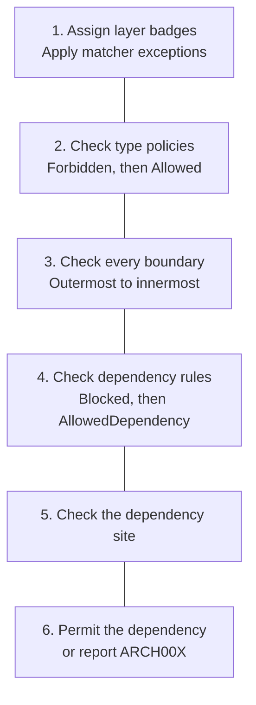

More precisely:

1. Match the caller and dependency layers, applying matcher exceptions while each rule is considered.
2. Apply global and inherited `<Forbidden>` policies. A match reports ARCH003.
3. Require the dependency type to pass every applicable global and inherited `<Allowed>` whitelist. A failure reports ARCH003.
4. Evaluate hierarchical boundary gates from outermost to innermost. The first denied boundary stops evaluation; a child boundary cannot override it.
5. At each boundary, an applicable `<BlockedDependency>` wins over matching allowed edges.
6. At least one matching `<AllowedDependency>` must permit the current dependency site.
7. Wildcards participate as ordinary matching edges; they receive no special power over blocks or type policies.
8. If a dependency type does not match a layer and its current site is listed by root-level or caller-layer `requireRecognizedDependencies`, report ARCH002.

The important distinction is that `<Allowed>` cannot create an architecture edge, `<AllowedDependency>` cannot approve a forbidden type, and `<Exceptions>` does not create a narrow allowed edge - it changes whether one matcher applies at all. Each feature answers a different question.

---

## Configuration reference

The XML root element is `<ArchitecturalLevels>`. It supports the child elements and attributes documented in the feature pages below.

| Feature | Doc file |
|---|---|
| Include files | `include.md` |
| Layers and matchers | `layers.md` |
| Allowed dependencies | `allowed-dependency.md` |
| Blocked dependencies | `blocked-dependency.md` |
| Allowed type policies | `allowed-type-policy.md` |
| Forbidden type policies | `forbidden-type-policy.md` |
| Matcher exceptions | `exceptions.md` |
| Required recognized dependency sites | `require-recognized-dependencies.md` |
| Report output settings | `report-attributes.md` |
| Documentation output settings | `documentation-attributes.md` |
| Descriptions | `description-attributes.md` |

### `<Include>`

Merges another architecture settings file into the current config. Use this when a project has a small local config but shares layer definitions or common edges from another file. The top-level config can be either `Architecture.anl` or `AssemblyMetadata("AnaalIJzerSettings", ...)`; included settings files must still be passed to Roslyn as `AdditionalFiles`.

**Example project:** [`Example.IncludeSettings`](Examples/Features/Example.IncludeSettings)

<details>
<summary>Dependency graph</summary>


</details>


**Rule:** The project file can keep project-specific edges while the included file owns shared layers and shared edges. The included settings file must also be passed to Roslyn as an `AdditionalFile`.

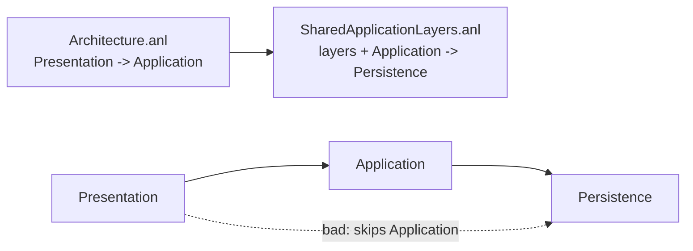

```xml
<!-- Architecture.anl -->
<ArchitecturalLevels>
  <Include path="SharedApplicationLayers.anl" />

  <AllowedDependency from="Presentation" to="Application" />
</ArchitecturalLevels>
```

```xml
<!-- SharedApplicationLayers.anl -->
<ArchitecturalLevels>
  <Layer name="Presentation">
    <Class endsWith="Endpoint" />
  </Layer>

  <Layer name="Application">
    <Class endsWith="Service" />
  </Layer>

  <Layer name="Persistence">
    <Class endsWith="Repository" />
  </Layer>

  <AllowedDependency from="Application" to="Persistence" />
</ArchitecturalLevels>
```

```csharp
// Presentation -> Application is declared by the project settings.
public class OrderEndpoint(IOrderService service) { }

// Application -> Persistence comes from the included shared settings.
public class OrderService(IOrderRepository repository) { }

// ARCH001: Presentation -> Persistence has no AllowedDependency edge.
public class AdminEndpoint(IOrderRepository repository) { }
```

`path` is resolved relative to the settings file that declares the include. Included files can include other files; files already seen during the current parse are skipped so accidental cycles do not loop forever.

Root attributes such as `requireRecognizedDependencies`, `enforceAcyclic`, `enableReport` and `enableDocumentation` are honored from included files. Root site lists from included files are combined. Layer-scoped `requireRecognizedDependencies` attributes remain on the layer elements that declare them. Report and documentation paths are resolved relative to the file that enables them.

### `<Layer>`

Defines a named group of types. The `name` attribute is referenced by `<AllowedDependency>` edges.

```xml
<Layer name="Application">
  <Class endsWith="Manager" />
  <Class startsWith="App" />
  <Class contains="Service" />
  <Namespace endsWith="Application" />
  <Assembly exactName="MyCompany.Application" />
</Layer>
```

Each `<Class>`, `<Namespace>`, or `<Assembly>` child is a matcher. Attributes on one element are combined with **AND**; separate elements are alternatives combined with **OR**. A type is assigned to a layer when every condition on any one matcher element succeeds. Exact class-name matchers take precedence; remaining matchers are evaluated in configuration order.

A `<Layer>` may also set `requireRecognizedDependencies`. That requirement applies only to callers classified into that layer or one of its nested layers:

```xml
<Layer name="AuditedKitchen" requireRecognizedDependencies="Constructor">
  <Class endsWith="AuditedChef" />
</Layer>
```

Use this when a legacy codebase is partly undefined, but one module or boundary should already require every constructor dependency to be classified.

#### Hierarchical layer boundaries

A layer can contain nested layers and dependency rules. Parent matchers define the scope in which child matchers are evaluated:

```xml
<Layer name="Ordering">
  <Namespace startsWith="ExampleCompany.Ordering" />

  <Layer name="Application">
    <Class endsWith="Service" />
  </Layer>

  <Layer name="Repository">
    <Class endsWith="Repository" />
  </Layer>

  <AllowedDependency from="Application" to="Repository" />
</Layer>
```

`ExampleCompany.Ordering.PlaceOrderService` belongs to `Ordering/Application`: it must match both the parent namespace and the child class matcher. A type inside `ExampleCompany.Ordering` that matches no child belongs directly to `Ordering`. A parent with nested layers may omit its own matcher; in that case its membership is the union of its descendants.

Names are local to their parent, so `Ordering/Application` and `Billing/Application` can coexist. Sibling names must be unique, and an individual name cannot contain `/`. Rules inside a boundary use local child names. Root-qualified paths start with `/`:

```xml
<Layer name="Ordering">
  <!-- Egress gate from Ordering/Application to a different boundary. -->
  <AllowedDependency from="Application" to="/Billing/Contracts" />
</Layer>

<Layer name="Billing">
  <!-- Ingress gate into Billing/Contracts. -->
  <AllowedDependency from="/Ordering/Application" to="Contracts" />
</Layer>

<!-- Generic relationship between the two outer boundaries. -->
<AllowedDependency from="Ordering" to="Billing" />
```

A cross-boundary dependency must pass every applicable gate. In this example, `Ordering/Application -> Billing/Contracts` requires all three rules: the root `Ordering -> Billing` relationship, the Ordering egress rule, and the Billing ingress rule. Inner rules may narrow outer permissions but cannot bypass them. Site filters are evaluated independently at every gate.

For framework-like or crosscutting layers, mark a higher-level edge with `appliesToDescendants="true"` when that one rule should satisfy descendant boundary gates too:

```xml
<AllowedDependency from="*" to="Framework" appliesToDescendants="true" />
```

Use this for intentionally ambient dependencies. Keep local egress and ingress rules for business boundaries where each parent module should decide what its children may reach.

References to a parent select its entire subtree. Shared ancestry is containment rather than a same-layer dependency: `Ordering/Application -> Ordering/Repository` is checked by the rule inside `Ordering` and does not produce ARCH005 merely because both types also belong to `Ordering`. ARCH005 applies when both types have the same deepest effective layer.

**Example project:** [`Example.NestedLayers`](Examples/Features/Example.NestedLayers)

<details>
<summary>Dependency graph</summary>

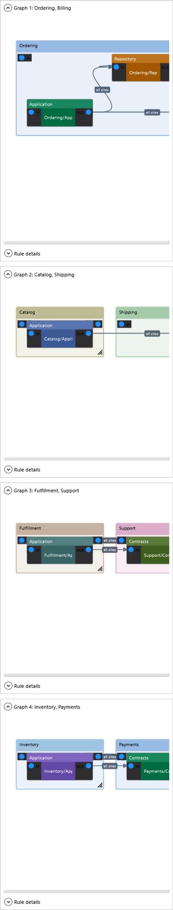

</details>


#### Matcher types

Name-based matchers (case-sensitive, no compilation required):

| Element       | Attribute       | Description |
|---------------|-----------------|-------------|
| `<Class>`     | `typeName`      | Type name equals the given string (synonym: `exactName`) |
| `<Class>`     | `exactName`     | Type name equals the given string (synonym: `typeName`) |
| `<Class>`     | `exactFullName` | Fully-qualified type name (`Namespace.TypeName`) equals the given string |
| `<Class>`     | `endsWith`      | Type name ends with the given string |
| `<Class>`     | `startsWith`    | Type name starts with the given string |
| `<Class>`     | `contains`      | Type name contains the given string |
| `<Class>`     | `regex`         | Type name matches the given .NET regular expression |
| `<Namespace>` | `exactName`     | Namespace equals the given string |
| `<Namespace>` | `endsWith`      | Namespace ends with the given string |
| `<Namespace>` | `startsWith`    | Namespace starts with the given string |
| `<Namespace>` | `contains`      | Namespace contains the given string |
| `<Namespace>` | `regex`         | Namespace string matches the given .NET regular expression |
| `<Assembly>`  | `exactName`     | Containing assembly name equals the given string |
| `<Assembly>`  | `endsWith`      | Containing assembly name ends with the given string |
| `<Assembly>`  | `startsWith`    | Containing assembly name starts with the given string |
| `<Assembly>`  | `contains`      | Containing assembly name contains the given string |
| `<Assembly>`  | `regex`         | Containing assembly name matches the given .NET regular expression |

Semantic matchers (`<Class>` only, evaluated against the resolved type symbol):

| Attribute            | Description |
|----------------------|-------------|
| `inherits`           | Type whose base-type chain contains a type with the given simple or full name (e.g. `inherits="ControllerBase"`) |
| `implements`         | Type that implements (transitively) an interface with the given simple or full name |
| `withAttribute`      | Type decorated with the given attribute. The `Attribute` suffix is optional (`withAttribute="ApiController"` ≡ `"ApiControllerAttribute"`) |
| `withAccessModifier` | Type declared with the given modifier(s). Supported tokens (case-insensitive): `public`, `internal`, `private`, `protected`, `sealed`, `abstract`, `static`, `record`. Multiple space-separated tokens require **all** to match (e.g. `withAccessModifier="public sealed"`) |
| `typeKind`           | Type has the given declared kind. Supported case-insensitive values are listed below. May be used alone. |

`typeKind` uses declaration-oriented values:

| Value | Matches |
|-------|---------|
| `Class` | Ordinary classes, excluding record classes |
| `Interface` | Interfaces |
| `Struct` | Ordinary structs, excluding record structs |
| `Record` | Record classes |
| `RecordStruct` | Record structs |
| `Enum` | Enums |
| `Delegate` | Delegates |

One or more matcher attributes are allowed per element. Every attribute on that element must match:

```xml
<Class startsWith="I"
       endsWith="Repository"
       typeKind="Interface" />

<Namespace startsWith="MyCompany."
           endsWith=".Persistence" />

<Assembly startsWith="MyCompany."
          endsWith=".Contracts" />
```

The first rule matches only interfaces whose names start with `I` and end with `Repository`. To express alternatives, add another `<Class>` element. Missing matchers, unsupported attributes, unknown `typeKind` values, and invalid regular expressions report ARCH006.

String matches are **case-sensitive** and applied to the full declared name (so `IOrderRepository` matches `endsWith="Repository"`). `regex` uses `Regex.IsMatch` semantics, so it matches anywhere in the subject unless the pattern is anchored with `^` / `$`; invalid patterns report ARCH006. Patterns are compiled once and cached, so the cost is paid only on first use.

**Example projects:** [`Example.AssemblyMatcher`](Examples/Features/Example.AssemblyMatcher), [`Example.CombinedMatchers`](Examples/Features/Example.CombinedMatchers)


```xml
<Layer name="Controllers">
  <Class inherits="ControllerBase" />
  <Class withAttribute="ApiController" />
</Layer>

<Layer name="DomainEvents">
  <Class implements="IDomainEvent" />
</Layer>

<Layer name="PublicApi">
  <Class withAccessModifier="public sealed" />
</Layer>

<Layer name="Handlers">
  <!-- Anchored: matches IFooHandler, IBarHandler, … but not "Handler" alone. -->
  <Class regex="^I[A-Z][A-Za-z0-9]*Handler$" />
</Layer>

<Forbidden>
  <Class exactFullName="System.Console" comment="Use ILogger." />
  <Namespace regex="\.Internal(\.|$)" comment="Don't reach into *.Internal namespaces." />
</Forbidden>
```

Matchers are also applied to the **generic type arguments** of a parameter, recursively. A parameter typed `Lazy<IChef>` is therefore evaluated as both `Lazy` and `IChef`. If the Customer layer may depend on Waiter but not Chef, the wrapper does not hide the Chef dependency. This works for arbitrary wrappers (`Lazy<>`, `Func<>`, `IEnumerable<>`, `Task<>`, ...) and any user-defined generic.

**Example project:** [`Example.Arch001.GenericTypeArgument`](Examples/Diagnostics/Example.Arch001.GenericTypeArgument)


**Rule:** Generic type arguments are inspected. Wrapping a forbidden dependency in `Lazy<>`, `IEnumerable<>`, `Func<>`, … does not hide it from the analyzer.

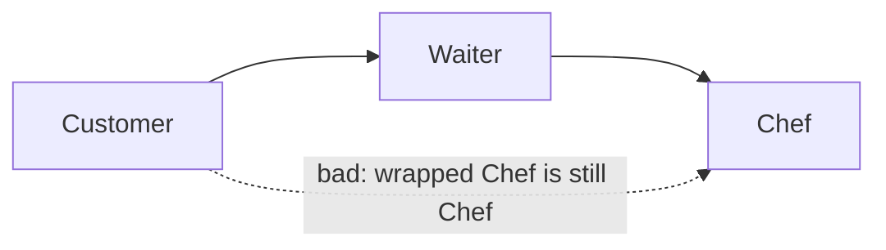

```xml
<AllowedDependency from="Customer" to="Waiter" />
<AllowedDependency from="Waiter" to="Chef" />
<!-- Customer -> Chef: intentionally omitted -->
```

```csharp
// Customer -> Waiter is allowed.
public class HungryCustomer(IWaiter waiter) { }

// ARCH001: Lazy<IChef> still contains an IChef dependency.
// Asking for a chef later is still asking for a chef.
public class PatientCustomer(Lazy<IChef> chef) { }

// ARCH001: IEnumerable<IChef> still contains IChef dependencies.
// A group of chefs is not a waiter.
public class GroupCustomer(IEnumerable<IChef> chefs) { }

// ARCH001: Func<IChef> still contains an IChef dependency.
// A promise to find a chef later does not change the boundary.
public class FutureCustomer(Func<IChef> chefFactory) { }
```

### `<AllowedDependency>`

Declares that types in layer `from` are permitted to depend on types in layer `to`. Any dependency not covered by an explicit edge (or the special `*` wildcard) is a layering violation - see [ARCH001/ARCH004/ARCH005](#diagnostics) for how the three reasons are distinguished.

```xml
<AllowedDependency from="Presentation" to="Application" />
<AllowedDependency from="Application" to="Persistence" />
```

Use `from="*"` to allow a layer to be depended on from any other layer (useful for cross-cutting concerns):

```xml
<Layer name="Crosscutting">
  <Class typeName="IIdentityContext" />
</Layer>

<AllowedDependency from="*" to="Crosscutting" />
```

With nested layers, a root wildcard still respects inner boundary gates by default. Add `appliesToDescendants="true"` when the edge is intentionally ambient, such as framework primitives or a crosscutting abstraction that every nested boundary may use:

```xml
<Layer name="Framework">
  <Class typeName="Task" />
  <Class typeName="Nullable" />
  <Class typeName="CancellationToken" />
</Layer>

<AllowedDependency from="*" to="Framework" appliesToDescendants="true" />
```

**Example project:** [`Example.CascadingDependencyRules`](Examples/Features/Example.CascadingDependencyRules)

<details>
<summary>Dependency graph</summary>


</details>


Use `to="*"` for the symmetric case - a single layer that is allowed to depend on every other configured layer. Typical example: a diagnostics / health-check layer that needs to read state from every part of the system:

```xml
<Layer name="Diagnostics">
  <Class endsWith="Diagnostics" />
</Layer>

<AllowedDependency from="Diagnostics" to="*" />
```

`from="*" to="*"` is also accepted and means "every configured layer may depend on every other configured layer". Nested boundary gates still require local rules unless the edge sets `appliesToDescendants="true"`. `<Forbidden>` types are still rejected, and unknown types at sites required by root-level or caller-layer `requireRecognizedDependencies` still report ARCH002 - the wildcard only relaxes the directed-edge requirement.

### `<BlockedDependency>`

Explicitly denies an edge even when a broader wildcard allowance would otherwise permit it. Blocked rules take precedence over every matching `<AllowedDependency>`.

```xml
<AllowedDependency from="*" to="Persistence" />
<BlockedDependency from="Presentation" to="Persistence"
                   description="Presentation types must go through Application services." />
```

Both dependency elements support `appliesToDescendants` and the same site filters. On a blocked rule, `appliesToDescendants="true"` cascades the denial into descendant boundary gates, and the filter scopes where the block applies:

```xml
<BlockedDependency from="Application" to="QuerySurface"
                   allowedSites="Field, Property, MethodReturn" />
```

**Example project:** [`Example.BlockedDependency`](Examples/Features/Example.BlockedDependency)


#### Site filters

By default, a dependency rule applies to every dependency site. Add `allowedSites` to scope it to specific sites, or `blockedSites` to apply it everywhere except the listed sites:

```xml
<AllowedDependency from="Waiter" to="PreparedDish" allowedSites="MethodReturn, Local" />
<AllowedDependency from="Chef" to="Ingredient" blockedSites="MethodReturn" />
```

The attributes are mutually exclusive. Site names are comma-separated, trimmed, and case-insensitive. Unknown site names or a rule that declares both attributes report ARCH006 and are ignored fail-closed.

Site filters also apply to wildcard edges such as `from="*"` and `to="*"`.

Arrows still mean "may depend on"; the edge label narrows where that dependency may appear. Here a Waiter may briefly hold or return a `PreparedDish`, while a Chef may use an `Ingredient` everywhere except as a method return type. That prevents a Chef API from handing raw ingredients to callers without forbidding ingredients inside the kitchen.

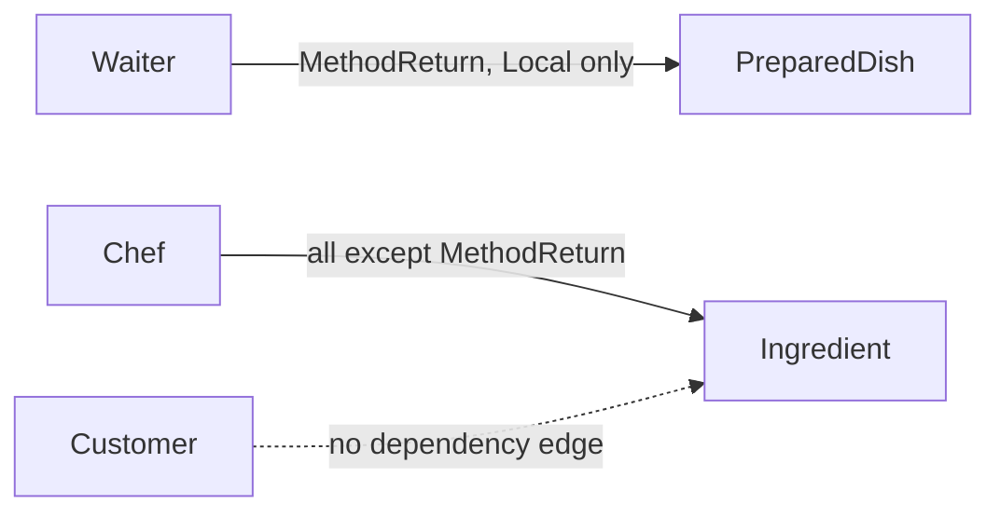

| Site | What it means | Example shape |
|------|---------------|---------------|
| `Constructor` | Constructor parameter, including primary constructors | `public Caller(DependencyType dependency) { }` |
| `Method` | Non-constructor method parameter | `public void Run(DependencyType dependency) { }` |
| `MethodReturn` | Non-constructor method return type | `public DependencyType Get() => ...;` |
| `Field` | Field declaration | `private readonly DependencyType _dependency;` |
| `Property` | Property declaration | `public DependencyType Dependency { get; set; }` |
| `Local` | Local variable declaration | `DependencyType dependency = ...;` |
| `New` | Object creation expression | `new DependencyType()` or target-typed `new()` |
| `GenericInvocation` | Generic method invocation type argument | `services.GetRequiredService<DependencyType>()` |
| `GenericArgument` | Generic type argument inside another referenced type | `Lazy<DependencyType>` or `IEnumerable<DependencyType>` |
| `Inheritance` | Base class inheritance, or interface-to-interface inheritance | `class Caller : DependencyBase` |
| `InterfaceImplementation` | Class, record, or struct implements an interface | `class Caller : IDependency` |
| `Attribute` | Attribute applied within a layered type | `[DependencyMarker] class Caller` |
| `StaticMember` | Static method, property, field, or event access | `DependencyType.Load()` |

`GenericArgument` is reported for the inner type rather than the outer wrapper. For example, `Lazy<DependencyType>` in a constructor is reported as `Site=GenericArgument`, because the architectural dependency is `DependencyType`, not `Lazy<T>`.

**Example project:** [`Example.AllowedSites`](Examples/Features/Example.AllowedSites)


#### Repository query surfaces

Site filters are useful when one layer owns a type that other layers may touch only as a short-lived access point. A repository query surface is a good example: `OrderRepository` may create and return `OrderQuery`, and `OrderQuery` may project itself to `OrderProjection`, but the Application layer should not expose `OrderQuery` in its own API or keep it around for application logic.

```xml
<ArchitecturalLevels>
  <Layer name="Application"><Class endsWith="Service" /></Layer>
  <Layer name="Persistence"><Class endsWith="Repository" /></Layer>
  <Layer name="QuerySurface"><Class endsWith="Query" /></Layer>
  <Layer name="Projection"><Class endsWith="Projection" /></Layer>

  <AllowedDependency from="Application" to="Persistence" />
  <AllowedDependency from="Application" to="Projection" />
  <AllowedDependency from="Persistence" to="QuerySurface" allowedSites="MethodReturn, New" />
  <AllowedDependency from="QuerySurface" to="Projection" />
</ArchitecturalLevels>
```

```csharp
// The service never names OrderQuery; it immediately projects the repository-owned chain.
public OrderProjection GetOrder()
    => repository.QueryOrders().ForCurrentCustomer().Project();

// ARCH001, Site=Local: application logic now retains a raw query surface.
public OrderProjection GetOrderThroughLocalQuery()
{
    OrderQuery query = repository.QueryOrders();
    return query.Project();
}

// ARCH001, Site=MethodReturn: the raw query surface leaks outside the service API.
public OrderQuery LeakQuery() => repository.QueryOrders();
```

The point is not that `OrderQuery` is forbidden everywhere. Persistence owns it, and the query surface can expose projection methods. The rule is that higher layers should carry projected objects, such as `OrderProjection`, instead of carrying persistence internals across method boundaries.

**Example project:** [`Example.RepositoryQuerySurface`](Examples/Scenarios/Example.RepositoryQuerySurface)

<details>
<summary>Dependency graph</summary>


</details>


**Example project:** [`Example.WildcardTo`](Examples/Features/Example.WildcardTo)


**Rule:** `<AllowedDependency from="Diagnostics" to="*" />` lets the `Diagnostics` layer depend on every other configured layer without listing each edge explicitly. The project builds clean - it demonstrates the *absence* of diagnostics that would otherwise fire.

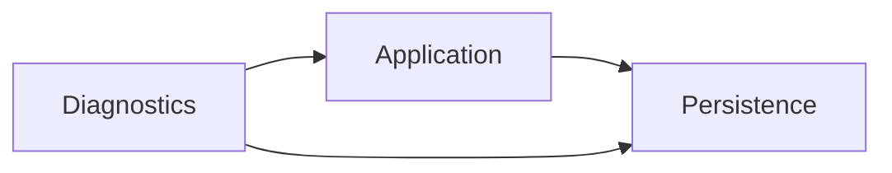

```xml
<AllowedDependency from="Application" to="Persistence" />
<AllowedDependency from="Diagnostics"  to="*" />
```

```csharp
// Diagnostics -> Application and Diagnostics -> Persistence are allowed by to="*".
public class ArchitectureDiagnostics(IOrderService service, IOrderRepository repository) { }
```

### `<Allowed>` type policy

`<Allowed>` is a whitelist for dependency types. A dependency assigned to a configured layer must match at least one `<Class>` or `<Namespace>` matcher in every applicable allow-list; otherwise the analyzer reports **ARCH003**.

At the root, the allow-list applies to every dependency that belongs to a configured layer:

```xml
<Allowed>
  <Class startsWith="Create" />
  <Class startsWith="Cancel" />
</Allowed>
```

This is useful when an architecture permits only a small vocabulary, such as command verbs. Matchers within one scope are alternatives, so the example accepts both `CreateOrderCommand` and `CancelOrderCommand` but rejects `ProcessOrderCommand`.

```csharp
public class CreateOrderCommand { }
public class CancelOrderCommand { }

// ARCH003: Process is not in the approved global verb list.
public class ProcessOrderCommand { }
public class WorkflowService(ProcessOrderCommand command) { }
```

The policy is checked when a layered type uses the dependency. It does not report on an otherwise unused type declaration.

**Example project:** [`Example.AllowedTypes`](Examples/Features/Example.AllowedTypes)

#### Layer-scoped type policies

Place `<Allowed>` or `<Forbidden>` inside a `<Layer>` to restrict the policy to dependencies classified into that layer and its descendants:

```xml
<Layer name="Command">
  <Class endsWith="Command" />
  <Allowed>
    <Class startsWith="Create" />
    <Class startsWith="Cancel" />
  </Allowed>
</Layer>

<Layer name="Query">
  <Class endsWith="Query" />
  <Forbidden>
    <Class startsWith="Delete" />
  </Forbidden>
</Layer>
```

`ProcessOrderCommand` fails the `Command` allow-list, while `DeleteOrderQuery` matches the `Query` block-list. A type named `DeleteOrderAuditRecord` in an `Audit` layer is unaffected: the `Query` policy does not leak into sibling layers.

Nested policies are cumulative. A dependency in `Ordering/Command` must satisfy allow-lists declared on both `Ordering` and `Ordering/Command`. Any matching forbidden rule denies the dependency, even when an allow-list also matches it.

**Example project:** [`Example.ScopedTypePolicies`](Examples/Features/Example.ScopedTypePolicies)

### `<Forbidden>`

Marks type patterns as explicitly disallowed. A root `<Forbidden>` policy applies globally; one nested inside a layer applies only to that layer and its descendants. When a dependency type matches an applicable forbidden pattern the analyzer reports **ARCH003** regardless of which layer the caller belongs to. An optional `<Fix Rename="…">` child element provides an automatic rename code-fix in Visual Studio / Rider.

```xml
<Forbidden>
  <Class endsWith="Store" comment="Persistence types must use the Repository suffix.">
    <Fix Rename="Repository" />
  </Class>
</Forbidden>
```

**Example project:** [`Example.Arch003.ForbiddenType`](Examples/Diagnostics/Example.Arch003.ForbiddenType)

**Rule:** Types ending in `Store` are explicitly forbidden. The `<Fix Rename="Repository">` element offers an automatic rename code-fix in Visual Studio.

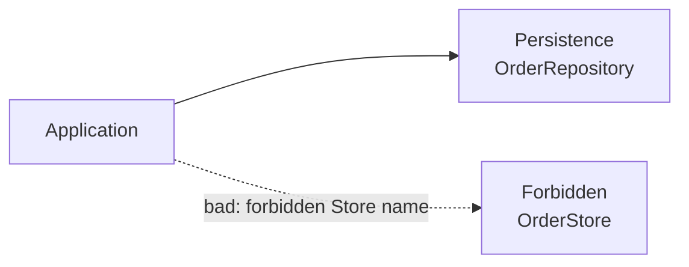

```xml
<Forbidden>
  <Class endsWith="Store" comment="Persistence types must use the Repository suffix.">
    <Fix Rename="Repository" />
  </Class>
</Forbidden>
```

```csharp
// Repository is the required persistence suffix.
public class OrderService(OrderRepository repository) { }

// ARCH003: Store is forbidden; use Repository instead.
public class OrderStore { }
public class OrderManager(OrderStore store) { }
```

### `<Exceptions>`

Every `<Class>` and `<Namespace>` matcher (including matchers inside `<Layer>`, `<Allowed>` and `<Forbidden>`) accepts a nested `<Exceptions>` block listing types that should be exempt from the rule. Exceptions support the full matcher attribute set documented in [Matcher types](#matcher-types) above, including conjunctive matcher attributes, `typeKind`, semantic matchers (`inherits`, `implements`, `withAttribute`, `withAccessModifier`), and `regex`.

When a dependency matches a rule **and** matches any of that rule's exceptions, the rule is skipped and evaluation continues with the next rule in document order. The rename code-fix is also suppressed for excepted types — if a type is allowed, the IDE will not nag with a rename suggestion.

```xml
<Forbidden>
  <Class endsWith="Store" comment="Persistence types must use the Repository suffix.">
    <Fix Rename="Repository" />
    <Exceptions>
      <!-- Pre-existing offenders grandfathered into the baseline. -->
      <Class startsWith="Legacy" />
      <Class typeName="ThirdPartyOrderStore" />
    </Exceptions>
  </Class>
</Forbidden>

<Layer name="Repository">
  <Class endsWith="Repository">
    <Exceptions>
      <!-- Test double, not a real Repository. -->
      <Class typeName="InMemoryFakeOrderRepository" />
    </Exceptions>
  </Class>
</Layer>
```

The intent is the **ratchet pattern**: lock in current violations as a baseline so the rule blocks *new* offenders without forcing a flag-day rewrite. (Unlike you - ) this mechanism is **deliberately** dumb — it does not track when an exception was added, expire it, or report on it.

**Example project:** [`Example.Exceptions`](Examples/Features/Example.Exceptions)

**Rule:** `<Exceptions>` grandfathers pre-existing offenders into the baseline. The exception in `<Forbidden>` exempts every type starting with `Legacy`; the exception inside `<Layer name="Repository">` exempts `InMemoryFakeOrderRepository` by exact name.

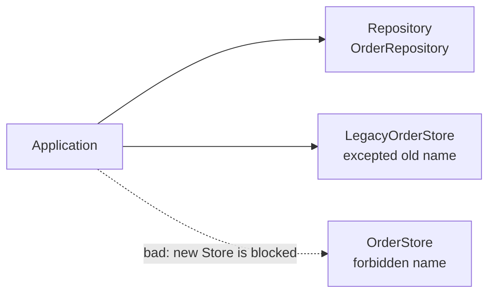

```xml
<Forbidden>
  <Class endsWith="Store" comment="Persistence types must use the Repository suffix.">
    <Fix Rename="Repository" />
    <Exceptions>
      <Class startsWith="Legacy" />
    </Exceptions>
  </Class>
</Forbidden>

<Layer name="Repository">
  <Class endsWith="Repository">
    <Exceptions>
      <Class typeName="InMemoryFakeOrderRepository" />
    </Exceptions>
  </Class>
</Layer>
```

```csharp
// Legacy Store is exempted by <Class startsWith="Legacy">.
public class LegacyOrderStore { }
public class OrderHistoryManager(LegacyOrderStore store) { }

// ARCH003: OrderStore still triggers the rule; the carve-out is scoped.
public class OrderStore { }
public class OrderManager(OrderStore store) { }
```

#### When to reach for `<Exceptions>`

- **Legacy migration / introducing the analyzer to an existing codebase.** Turn the analyzer on with complete rules from day one and add every current offender to `<Exceptions>` (the IDE code-fix does this in one keystroke). The build stays green, but every *new* violation now fails CI. Burn the list down at whatever pace fits the team - there is no migration milestone you have to hit.
- **Intentional architectural carve-outs.** One diagnostics or bootstrap module legitimately needs to see a type the rest of the codebase shouldn't. Excepting it scoped to *that one type* keeps the rule active everywhere else.
- **Third-party / vendor types** you can't rename, generated code, framework conventions, test doubles (`InMemoryFakeOrderRepository` looks like a Repository but isn't one), and any other case where the type name happens to match a pattern it doesn't semantically belong to.

#### Why `<Exceptions>` and not something like `<Baseline>`?

`<Baseline>` would presuppose the *reason* ("this is legacy debt we're grandfathering in") and invite feature creep — baseline freshness warnings, expiry dates, "ratchet down" reports, and so on. In practice exceptions get added for several different reasons (the list above), and a config file is the wrong place to assert intent. `<Exceptions>` is neutral about *why* something is excepted and leaves the policy ("when do we shrink this list?") to the team. Use an XML comment next to the entry if you want to record the reason.

#### Code fix

When the config comes from an `Architecture.anl` additional file, ARCH001/ARCH003/ARCH004/ARCH005 diagnostics register an **"Add '`TypeName`' to exceptions"** code action that appends the offending type to the originating rule's `<Exceptions>` block (creating the block if needed). Existing comments and most whitespace in the XML are preserved. Inline `AssemblyMetadata("AnaalIJzerSettings", ...)` config has no file for the IDE to edit, so this code action is not offered there. ARCH002 has no such action — it fires precisely *because* a dependency isn't classified, and adding it to an exceptions list wouldn't change that; the fix is to add the type to a `<Layer>` instead.

#### Nesting

Exceptions can be nested. Each deeper *matching* exception level flips the previous result: depth 1 excludes the type from the rule, depth 2 includes it again, depth 3 excludes it again, and so on. The algorithm finds the **deepest level at which the type matches** and uses that depth's parity to decide the outcome — so inner exceptions should use patterns that are logical subsets of their parent, making it clear which types each level applies to.

**Example project:** [`Example.NestedExceptions`](Examples/Features/Example.NestedExceptions)

**Rule:** four overlapping patterns form a specificity hierarchy, each a logical subset of its parent. The deepest matching depth for each type determines its membership (odd = excluded, even = included):

| Type | Deepest match | Depth | Result |
|------|--------------|-------|--------|
| `InMemoryOrderRepository` | `startsWith="InMemory"` | 1 (odd) | Not in Persistence |
| `InMemoryCachedOrderRepository` | `startsWith="InMemoryCached"` | 2 (even) | In Persistence, ARCH001 |
| `InMemoryCachedTestOrderRepository` | exact type name | 3 (odd) | Not in Persistence |
| `LegacyInMemoryCachedOrderRepository` | exact type name | 4 (even) | In Persistence, ARCH001 |

```xml
<Layer name="Persistence">
  <Class endsWith="Repository">
    <Exceptions>
      <Class startsWith="InMemory">
        <Exceptions>
          <Class startsWith="InMemoryCached">
            <Exceptions>
              <Class typeName="InMemoryCachedTestOrderRepository">
                <Exceptions>
                  <Class typeName="LegacyInMemoryCachedOrderRepository" />
                </Exceptions>
              </Class>
            </Exceptions>
          </Class>
        </Exceptions>
      </Class>
    </Exceptions>
  </Class>
</Layer>
```

```csharp
// Depth 1 (odd): not in Persistence.
public class OrderEndpoint(InMemoryOrderRepository repository) { }

// ARCH001: Depth 2 (even): in Persistence.
public class AdminEndpoint(InMemoryCachedOrderRepository repository) { }

// Depth 3 (odd): not in Persistence again.
public class TestEndpoint(InMemoryCachedTestOrderRepository repository) { }

// ARCH001: Depth 4 (even): in Persistence again.
public class LegacyEndpoint(LegacyInMemoryCachedOrderRepository repository) { }
```

### `requireRecognizedDependencies` attribute

`requireRecognizedDependencies` is a comma-separated list of [dependency sites](#site-filters). At each listed site, a dependency used by a layered caller must itself belong to a configured layer. An unknown type reports **ARCH002**. When the attribute is omitted, unknown types do not report ARCH002.

The attribute can be placed on `<ArchitecturalLevels>` or on a `<Layer>`:

- On `<ArchitecturalLevels>`, it applies to every layered caller.
- On `<Layer>`, it applies only to callers classified into that layer or one of its descendants.
- Root, parent-layer, and child-layer site lists are cumulative.

```xml
<ArchitecturalLevels requireRecognizedDependencies="Constructor, Local">
  ...
</ArchitecturalLevels>
```

The values are trimmed and case-insensitive. Supported values are `Constructor`, `Method`, `MethodReturn`, `Field`, `Property`, `Local`, `New`, `GenericInvocation`, `GenericArgument`, `Inheritance`, `InterfaceImplementation`, `Attribute`, and `StaticMember`. Empty or unknown values make the configuration invalid and report ARCH006.

**Example projects:** [`Example.Arch002.UnrecognizedDependency`](Examples/Diagnostics/Example.Arch002.UnrecognizedDependency), [`Example.RequiredRecognizedDependencySites`](Examples/Features/Example.RequiredRecognizedDependencySites), [`Example.LayerScopedRecognizedDependencies`](Examples/Features/Example.LayerScopedRecognizedDependencies)

**Rule:** The configured site determines where an unknown dependency is an error.

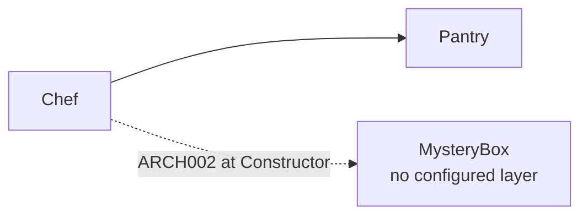

```xml
<ArchitecturalLevels requireRecognizedDependencies="Constructor">
  <Layer name="Chef"><Class endsWith="Chef" /></Layer>
  <Layer name="Pantry"><Class endsWith="Pantry" /></Layer>
  <AllowedDependency from="Chef" to="Pantry" />
</ArchitecturalLevels>
```

```csharp
// Chef -> Pantry is recognized and allowed.
public class PizzaChef(IIngredientPantry pantry) { }

// ARCH002 at Constructor: MysteryBox belongs to no configured layer.
public class ExperimentalChef(MysteryBox box) { }
```

For partial adoption, keep the root loose and require recognized dependencies only inside a stricter layer:

```xml
<ArchitecturalLevels>
  <Layer name="LegacyKitchen">
    <Class typeName="LegacyChef" />
  </Layer>

  <Layer name="AuditedKitchen" requireRecognizedDependencies="Constructor">
    <Class typeName="AuditedChef" />
  </Layer>
</ArchitecturalLevels>
```

```csharp
// Valid: LegacyKitchen does not require unknown constructor dependencies yet.
public class LegacyChef(MysteryBox box) { }

// ARCH002: AuditedKitchen requires constructor dependencies to be classified.
public class AuditedChef(MysteryBox box) { }
```

This setting controls whether ARCH002 is produced, not its severity. Use Roslyn's standard `.editorconfig` mechanism to show it as a warning:

```ini
[*.cs]
dotnet_diagnostic.ARCH002.severity = warning
```

### `enableReport` / `reportPath` attributes

When `enableReport="true"` is set on `<ArchitecturalLevels>`, Arse uses `reportPath` as the default output for `arse report`. The path is resolved relative to the config file; for inline `AssemblyMetadata("AnaalIJzerSettings", ...)`, it is resolved relative to the project file. If omitted, Arse defaults to `architectural-violations.md` next to the project. Solution-level reports use the first configured project as the representative settings source; if no `reportPath` is enabled there, Arse writes `architectural-violations.md` next to the solution.

```xml
<ArchitecturalLevels enableReport="true"
                     reportPath="../../docs/architectural-violations.md">
  …
</ArchitecturalLevels>
```

### `enableDocumentation` / `documentationPath` attributes

When `enableDocumentation="true"` is set, Arse uses `documentationPath` as the default output for `arse documentation`. The generated Markdown contains Mermaid dependency diagrams, site-filter labels, allowed and forbidden type-policy summaries with their scopes, and the XML rules with their descriptions in configuration order. Path resolution mirrors `reportPath`; the default is `architecture-documentation.md` next to the project.

```xml
<ArchitecturalLevels enableDocumentation="true"
                     documentationPath="../../docs/architecture-documentation.md"
                     description="Order-processing boundaries and query-surface rules.">
  …
</ArchitecturalLevels>
```

### `description` attributes

Every XML element that participates in the ruleset can carry a `description` attribute: `<ArchitecturalLevels>`, `<Include>`, `<Layer>`, `<Class>`, `<Namespace>`, `<Assembly>`, `<Allowed>`, `<Forbidden>`, `<Exceptions>`, `<Fix>`, `<AllowedDependency>` and `<BlockedDependency>`. Descriptions do not affect diagnostics. They exist so generated documentation can explain why a rule exists while preserving the same order as the XML.

```xml
<Layer name="QuerySurface"
       description="Repository-owned fluent query builders that must be projected before leaving repository-owned code.">
  <Class endsWith="Query"
         description="Query objects are transient access points, not application dependencies." />
</Layer>

<AllowedDependency from="Persistence" to="QuerySurface"
                   allowedSites="MethodReturn, New"
                   description="Repositories may create and return query surfaces as fluent access points." />
```

**Example project:** [`Example.DocumentationDemo`](Examples/Documentation/Example.DocumentationDemo)

<details>
<summary>Dependency graph</summary>

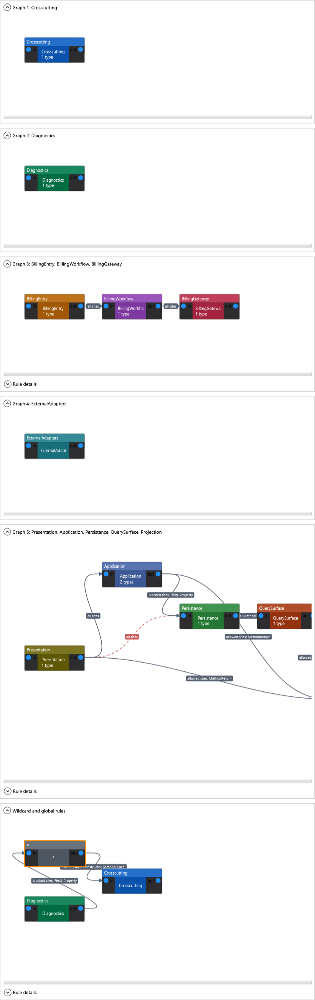

</details>


---

## Diagnostics

The analyzer ships with seven diagnostic IDs. The three dependency-direction rules (ARCH001/004/005) are split by the reason a dependency is illegal, while ARCH006 and ARCH007 protect the integrity of the configuration itself. Dependency diagnostics expose their syntactic site through the `Site` property.

| ID      | Meaning                                                      |
|---------|--------------------------------------------------------------|
| ARCH001 | Illegal layer dependency - no `<AllowedDependency>` edge permits this site |
| ARCH002 | Dependency is unrecognized at a required site                |
| ARCH003 | Type violates an applicable `<Allowed>` or `<Forbidden>` policy |
| ARCH004 | Wrong-direction dependency - reverse of a configured edge    |
| ARCH005 | Same-layer dependency                                        |
| ARCH006 | Invalid architecture configuration                           |
| ARCH007 | Cyclic allowed-dependency graph while `enforceAcyclic` is enabled |

The example projects referenced inline below are self-contained and deliberately broken so Visual Studio, Rider and `dotnet build` show the corresponding `ARCH00X` error.

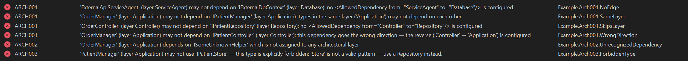

### Why three IDs for layering instead of one?

The original design folded every layering problem under `ARCH001`. The three reasons are independent and call for different remediation:

- **Missing or site-filtered edge (ARCH001)** - most often a real architectural mistake, or a sign the configuration is incomplete. Fix the dependency, add an `<AllowedDependency>` edge, or adjust the edge's `allowedSites` / `blockedSites`.
- **Wrong direction (ARCH004)** - almost always a real architectural mistake. The fix is usually inversion of control (introduce an abstraction in the lower layer), never adding a reverse edge.
- **Same layer (ARCH005)** - sometimes intentional (helper types collaborating within a layer). Many teams want to suppress this category project-wide while keeping ARCH001/004 as errors.

Splitting the IDs makes the three policies independently configurable in `.editorconfig` or `<NoWarn>`, surfaces the reason directly in the IDE error list without parsing the message, and makes the architectural intent of each rule self-documenting.

### ARCH001 - Illegal layer dependency

Reported when a type in layer A depends on a type in layer B, no `<AllowedDependency from="A" to="B"/>` permits the current dependency site, and the violation is neither a wrong-direction nor a same-layer case (those have their own IDs).

**Example output:**
```
error ARCH001: 'ImpatientCustomer' (layer Customer) may not depend on 'IChef'
  (layer Chef): no <AllowedDependency from="Customer" to="Chef"/> is configured
```

If an edge exists but a site filter excludes the current site, the diagnostic names that instead:

```text
error ARCH001: 'AllowedLocalSiteExample' (layer Caller) may not depend on 'AllowedLocalType'
  (layer AllowedLocalDependency): <AllowedDependency from="Caller" to="AllowedLocalDependency"/> is configured,
  but allowedSites does not include Constructor
```

**Example project:** [`Example.Arch001.SkipsLayer`](Examples/Diagnostics/Example.Arch001.SkipsLayer)

**Rule:** `Customer -> Waiter -> Chef` is allowed; direct `Customer -> Chef` is not.

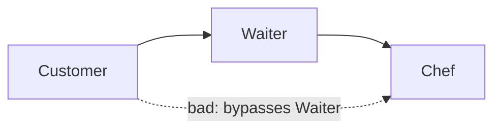

```xml
<AllowedDependency from="Customer" to="Waiter" />
<AllowedDependency from="Waiter" to="Chef" />
<!-- Customer -> Chef: intentionally omitted -->
```

```csharp
// Customer -> Waiter is allowed.
public class HungryCustomer(IWaiter waiter) { }

// ARCH001: Customer -> Chef has no AllowedDependency edge.
// A customer should ask a waiter rather than direct the chef.
public class ImpatientCustomer(IChef chef) { }
```

**Example project:** [`Example.Arch001.NoEdge`](Examples/Diagnostics/Example.Arch001.NoEdge)

**Rule:** `Customer -> Waiter -> Chef` is allowed, but no edge permits `Waiter -> Pantry`.

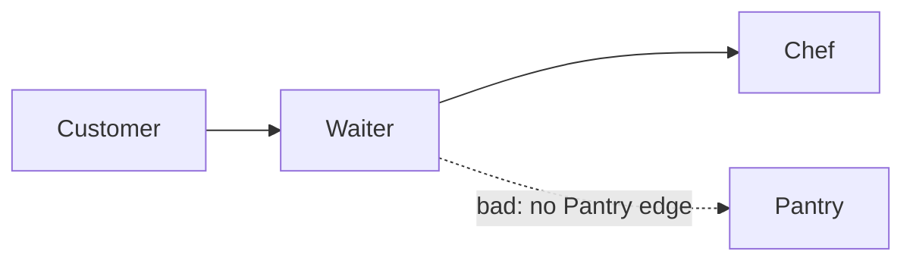

```xml
<AllowedDependency from="Customer" to="Waiter" />
<AllowedDependency from="Waiter" to="Chef" />
<!-- Waiter -> Pantry: intentionally omitted -->
```

```csharp
// Customer -> Waiter is allowed.
public class HungryCustomer(IWaiter waiter) { }

// Waiter -> Chef is allowed, but Waiter -> Pantry is not.
// The waiter passes the order to the chef rather than entering the pantry.
public class TableWaiter(IChef chef, IIngredientPantry pantry) { }
```

### ARCH002 - Unrecognized dependency

Reported when a layered type uses a dependency that does not belong to any configured layer and root-level or caller-layer `requireRecognizedDependencies` includes the current site.

**Example output:**
```
error ARCH002: 'ExperimentalChef' (layer Chef) depends on 'MysteryBox'
  which is not assigned to any architectural layer
```

#### Choose recognition sites deliberately

`Constructor` is a useful starting point when the goal is to close the injection graph without forcing DTOs and method data into architectural layers. Add other sites only when those references are part of the boundary you want to enforce.

Consider a mapper method on an Application type:

```csharp
// OrderService is in the Application layer.
public class OrderService(IOrderRepository repository)
{
    public OrderDto Map(OrderRecord record, OrderStatus status)
    {
        return new OrderDto { Id = record.Id, Status = status.ToString() };
    }
}
```

With `requireRecognizedDependencies="Constructor"`, only `IOrderRepository` must be classified. With `requireRecognizedDependencies="Constructor, Method, MethodReturn, New"`, `OrderRecord`, `OrderStatus`, and `OrderDto` must also belong to configured layers because they appear at selected sites.

At the root, the setting is site-scoped for every layered caller. On a layer, it is site-scoped for callers in that layer and its descendants, which is useful when only one area of a legacy codebase is ready to require fully classified dependencies. Recognized dependencies still pass through normal type policies and layer-edge rules.

### `enforceAcyclic` attribute

Set `enforceAcyclic="true"` to require explicit allowed dependency edges to form an acyclic graph. A cycle reports ARCH007 before code needs to use every permitted direction:

```xml
<ArchitecturalLevels enforceAcyclic="true">
  <AllowedDependency from="Ordering" to="Inventory" />
  <AllowedDependency from="Inventory" to="Billing" />
  <AllowedDependency from="Billing" to="Ordering" />
</ArchitecturalLevels>
```

Wildcard and self-edges are excluded because they do not describe a finite directional chain. An unfiltered matching `<BlockedDependency>` removes blocked directions from cycle evaluation.

**Example project:** [`Example.Arch007.CyclicGraph`](Examples/Diagnostics/Example.Arch007.CyclicGraph)

### ARCH003 - Type policy violation

Reported when a dependency type matches an applicable `<Forbidden>` pattern or does not match an applicable `<Allowed>` list. If a `<Fix Rename="…">` is configured on a forbidden pattern, Visual Studio and Rider will offer a one-click rename code-fix. When a forbidden rule comes from `Architecture.anl`, a second "Add '`TypeName`' to exceptions" code action is offered. An allow-list failure has no single originating matcher to except, so that code action is not offered.

**Example output:**
```
error ARCH003: 'ReportingService' (layer Application) may not use 'LegacyOrderStore':
  the type matches a global <Forbidden> rule: Persistence types must use the Repository suffix.
```

### ARCH004 - Wrong-direction dependency

Reported when a type in layer A depends on a type in layer B and `<AllowedDependency from="B" to="A"/>` is configured - i.e. the dependency runs in the reverse direction of a configured edge.

**Example output:**
```
error ARCH004: 'IngredientPantry' (layer Pantry) may not depend on 'IChef'
  (layer Chef): this is the reverse of the configured 'Chef -> Pantry' edge
```

**Example project:** [`Example.Arch004.WrongDirection`](Examples/Diagnostics/Example.Arch004.WrongDirection)

**Rule:** The allowed edge is `Chef -> Pantry`. Depending in the reverse direction is not allowed.

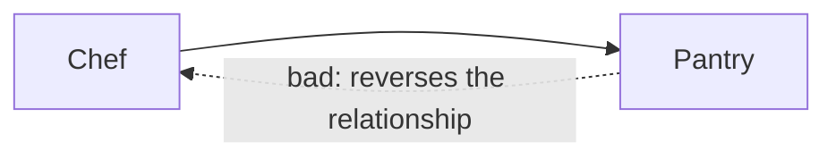

```xml
<AllowedDependency from="Chef" to="Pantry" />
<!-- Pantry -> Chef: intentionally omitted -->
```

```csharp
// Chef -> Pantry is allowed.
public class PizzaChef(IIngredientPantry pantry) { }

// ARCH004: Pantry -> Chef reverses the configured direction.
// The pantry supplies the chef; it does not direct the chef.
public class IngredientPantry(IChef chef) { }
```

### ARCH005 - Same-layer dependency

Reported when two types in the same layer depend on each other and no self-edge has been configured for that layer. By default peers within a layer are not allowed to take a hard dependency on each other; this is the safest default because intra-layer fan-out tends to grow silently into cycles.

To opt a single layer in to same-layer dependencies, declare an explicit self-edge:

```xml
<AllowedDependency from="Chef" to="Chef" />
```

With that edge in place, `PizzaChef` may depend on `ISauceChef` (both in `Chef`) without ARCH005 firing. Other layers without a self-edge keep the default prohibition.

Self-edges can also be limited to particular [dependency sites](#site-filters). This is useful, but it is not the only way to model an interface and its implementation.

#### Common use cases

**Possible: interface and implementation share one architectural role**

The interface and implementation may live in the same project, namespace, or even file. If both intentionally belong to `DataAbstraction`, allow only inheritance within that layer:

```xml
<Layer name="DataAbstraction">
  <Class endsWith="Repository" />
</Layer>

<AllowedDependency from="DataAbstraction"
                   to="DataAbstraction"
                   allowedSites="InterfaceImplementation" />
```

```csharp
// Allowed: interface implementation is an InterfaceImplementation-site dependency.
public class ExampleRepository : IExampleRepository { }

// ARCH005: Constructor is not allowed by the InterfaceImplementation-only self-edge.
public class ReportingRepository(IExampleRepository repository) { }
```

`ExampleRepository : IExampleRepository` is allowed, while constructor, field, property, and method dependencies between repository peers still report ARCH005. This deliberately permits inheritance within `DataAbstraction`; it does not mean interfaces and implementations must share a layer.

**Alternative: colocated interfaces and implementations have different architectural roles**

For a narrower model, put contracts and implementations in separate architectural layers even when they live in the same project, namespace, or file. Match interfaces first, implementations second, and allow only implementation-to-contract inheritance:

```xml
<Layer name="DataContracts">
  <Class endsWith="Repository" typeKind="Interface" />
</Layer>

<Layer name="DataImplementation">
  <Class endsWith="Repository" typeKind="Class" />
</Layer>

<AllowedDependency from="DataImplementation"
                   to="DataContracts"
                   allowedSites="InterfaceImplementation" />
```

No self-edge is needed: `ExampleRepository -> IExampleRepository` crosses from `DataImplementation` to `DataContracts` at the `InterfaceImplementation` site. Both rules use the same suffix, while `typeKind` distinguishes the contract from its implementation without relying on the `I` naming convention.

**Interfaces must come from a dedicated contracts project**

Use an assembly matcher when the project boundary itself carries architectural meaning:

```xml
<Layer name="DataContracts">
  <Assembly exactName="MyCompany.Data.Abstractions" />
</Layer>

<Layer name="DataImplementation">
  <Class endsWith="Repository" />
</Layer>

<AllowedDependency from="DataImplementation"
                   to="DataContracts"
                   allowedSites="InterfaceImplementation" />
```

An implementation may now implement a contract from `MyCompany.Data.Abstractions`. A locally declared `IExampleRepository` does not match `DataContracts`; it falls into `DataImplementation` through the class matcher and still produces ARCH005 because no self-edge exists. This enforces the separate-project convention without making it a built-in analyzer opinion.

Add other sites to `allowedSites`, or omit the site filter, when the implementation project is also intentionally allowed to consume contract types through constructors, methods, or properties. See [Site filters](#site-filters) and [Assembly matchers](#matcher-types) for the complete options.

None of these structures is built into the analyzer. `InterfaceImplementation` works for implemented interfaces, while `Inheritance` works for base classes and interface-to-interface inheritance. The matchers and edges decide which model applies.

**Example output:**
```
error ARCH005: 'PizzaChef' (layer Chef) may not depend on 'ISauceChef'
  (layer Chef): types in the same layer ('Chef') may not depend on each other
```

**Example projects:** [`Example.Arch005.SameLayer`](Examples/Diagnostics/Example.Arch005.SameLayer), [`Example.SameLayerInheritance`](Examples/Features/Example.SameLayerInheritance), [`Example.CombinedMatchers`](Examples/Features/Example.CombinedMatchers)

**Rule:** By default, types within the same layer may not depend on each other. A layer can opt in to same-layer dependencies by declaring an explicit self-edge: `<AllowedDependency from="X" to="X"/>`.

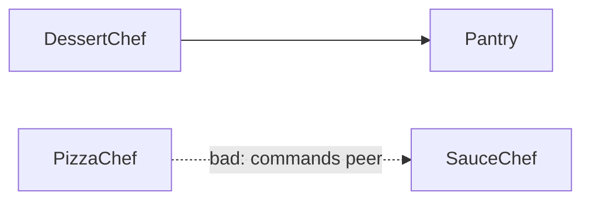

```xml
<Layer name="Chef">
  <Class endsWith="Chef" />
</Layer>
```

```csharp
// Chef -> Pantry is allowed.
public class DessertChef(IIngredientPantry pantry) { }

// ARCH005: PizzaChef and ISauceChef are both in the Chef layer.
// Chefs may share a pantry, but should not command each other directly.
public class PizzaChef(ISauceChef sauceChef) { }
```

### ARCH006 - Invalid architecture configuration

Reported when settings cannot be evaluated reliably: malformed or schema-invalid XML, missing includes, duplicate layers, invalid or ambiguous matchers, invalid site filters, or dependency rules that reference unknown layers. The analyzer no longer becomes silently inactive when configuration parsing fails.

**Example project:** [`Example.Arch006.UnknownLayer`](Examples/Diagnostics/Example.Arch006.UnknownLayer)

### ARCH007 - Cyclic architecture dependency graph

Reported when `enforceAcyclic="true"` and the explicit allowed dependency graph contains a cycle. The message prints the detected chain, for example `Ordering -> Inventory -> Billing -> Ordering`.

**Example project:** [`Example.Arch007.CyclicGraph`](Examples/Diagnostics/Example.Arch007.CyclicGraph)

### Diagnostic properties

Every layering diagnostic (ARCH001, ARCH004, ARCH005) carries a `Site` property in `Diagnostic.Properties` indicating where the dependency was found. This lets code-fix providers, custom reporters and CI dashboards filter or group by injection style without re-parsing the source.

| `Site` value        | Where the dependency was introduced                                        |
|---------------------|----------------------------------------------------------------------------|
| `Constructor`       | Constructor parameter (including primary constructors)                      |
| `Method`            | Non-constructor method parameter                                            |
| `MethodReturn`      | Non-constructor method return type                                          |
| `Field`             | Field declaration                                                           |
| `Property`          | Property declaration                                                        |
| `Local`             | Local variable declaration                                                  |
| `New`               | `new T(...)` or target-typed `new()` expression                             |
| `GenericArgument`   | Generic type argument of an outer type (`Lazy<T>`, `IEnumerable<T>`, …)     |
| `GenericInvocation` | Generic method invocation (service-locator style: `services.GetService<T>()`) |
| `Inheritance`       | Base class inheritance or interface-to-interface inheritance                 |
| `InterfaceImplementation` | Class, record, or struct implements an interface                       |
| `Attribute`         | Attribute used on a type or one of its members                              |
| `StaticMember`      | Static method, property, field, event, or reduced extension-method access   |

**Example project:** [`Example.Arch001.NonConstructorInjection`](Examples/Diagnostics/Example.Arch001.NonConstructorInjection)

**Rule:** Dependencies introduced outside the constructor are still dependencies. Fields, properties, method signatures, local variables, inheritance, interface implementation, attributes, static member access, `new` expressions and generic service-locator invocations are all checked against the configured layer edges. Classes, records, structs, and interfaces can all act as callers.

**Type-kind example:** [`Example.NonClassCallers`](Examples/Features/Example.NonClassCallers)

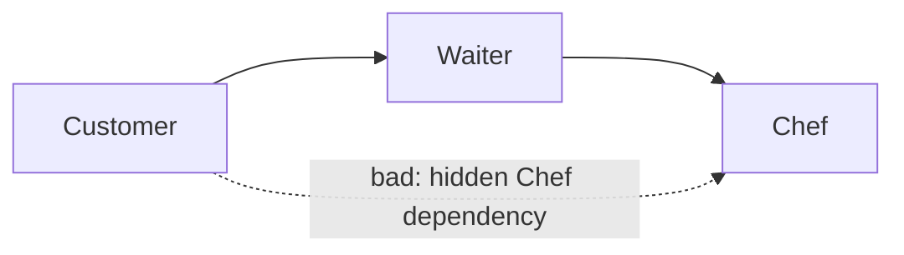

```xml
<AllowedDependency from="Customer" to="Waiter" />
<AllowedDependency from="Waiter" to="Chef" />
<!-- Customer -> Chef: intentionally omitted -->
```

```csharp
// ARCH001: field dependency
public class FieldDependencyCustomer
{
    private readonly IChef _chef = null!;
}

// ARCH001: property dependency
public class PropertyDependencyCustomer
{
    public IChef Chef { get; set; } = null!;
}

// ARCH001: method parameter
public class MethodDependencyCustomer
{
    public void OrderFrom(IChef chef) { }
}

// ARCH001: method return type
public class MethodReturnCustomer
{
    public IChef FindChef() => null!;
}

// ARCH001: creating a Chef directly
public class NewingCustomer
{
    public void Run() => _ = new DirectChef();
}

// ARCH001: a hidden lookup still bypasses the Waiter.
public class ServiceLocatorCustomer
{
    public void Run(IServiceProvider services)
        => _ = services.GetRequiredService<IChef>();
}
```

---

## Q/A

### Why are `Task` or `Nullable` blocked?

If you see a message like this:

```text
'ISsoManager' (layer Application/Contracts) may not depend on 'Task' (layer Crosscutting):
no allowed dependency gate from 'Application/Contracts' to 'Crosscutting' is configured in boundary 'Application'
```

then `Task` or `Nullable` has been classified into one of your configured layers. The analyzer does not treat framework types as forbidden by default. Once a matcher puts `Task`, `Nullable`, or another framework type in `Crosscutting`, normal layer and nested-boundary rules apply to it.

The cleanest fix is usually: do not classify framework types into application architecture layers unless you really mean to. Keep `Crosscutting` scoped to your own code:

```xml
<Layer name="Crosscutting">
  <Assembly exactName="MyCompany.Shared" />
  <Namespace startsWith="MyCompany.Shared" />
</Layer>
```

If an existing matcher is broad enough to catch `System.Threading.Tasks.Task`, `System.Nullable<T>`, or other platform types, narrow that matcher first. Use `<Exceptions>` only as a migration aid when narrowing the matcher is not immediately practical.

If you intentionally model framework or shared primitives as a layer, make that intention explicit. A separate `Framework` layer often reads better than mixing platform types into business crosscutting concerns:

```xml
<Layer name="Framework">
  <Class typeName="Task" />
  <Class typeName="Nullable" />
  <Class typeName="CancellationToken" />
</Layer>

<AllowedDependency from="*" to="Framework" appliesToDescendants="true" />
```

With nested layers, a top-level wildcard without `appliesToDescendants` is not enough. A type in `Application/Contracts` must also pass the `Application` boundary gate. Use `appliesToDescendants="true"` when the whitelist should be global-ish:

```xml
<AllowedDependency from="*" to="Crosscutting" appliesToDescendants="true" />
```

For stricter business boundaries, keep the edge local to the parent boundary instead:

```xml
<AllowedDependency from="*" to="Crosscutting" />

<Layer name="Application">
  <Layer name="Contracts">
    <Class endsWith="Manager" typeKind="Interface" />
  </Layer>

  <AllowedDependency from="Contracts" to="/Crosscutting" />
</Layer>
```

Use a site filter if the framework type should only appear in API shapes:

```xml
<AllowedDependency from="Contracts"
                   to="/Crosscutting"
                   allowedSites="MethodReturn, Property" />
```

If the diagnostic is ARCH001, the problem is a missing layer relationship. If the diagnostic is ARCH003, the type matched `<Forbidden>` or failed `<Allowed>`; fix the type policy instead.

---

## Suppressing a violation

If you have a justified exception to the rule, suppress it with a standard `#pragma` using the specific ID for the reason you want to allow (`ARCH001`, `ARCH004` or `ARCH005`):

```csharp
#pragma warning disable ARCH001 // justified: bootstrapping cross-cutting concern
public class DiagnosticsController(IHealthRepository health) : ControllerBase { }
#pragma warning restore ARCH001
```

Or use a `[SuppressMessage]` attribute on the class:

```csharp
[System.Diagnostics.CodeAnalysis.SuppressMessage(
    "Architecture", "ARCH001",
    Justification = "Bootstrapping concern that intentionally crosses layers")]
public class DiagnosticsController(IHealthRepository health) : ControllerBase { }
```

To silence one *category* across an entire project without touching individual files, add the ID to `<NoWarn>` in the `.csproj` - for example `<NoWarn>$(NoWarn);ARCH005</NoWarn>` to allow same-layer dependencies while keeping ARCH001 and ARCH004 as errors.

---

## Violation report

In addition to inline diagnostics, Arse can write a Markdown summary of every violation it finds. Enable a default path by setting `enableReport="true"` on the `<ArchitecturalLevels>` root and optionally `reportPath`, or pass `--output` directly:

```xml
<ArchitecturalLevels enableReport="true"
                     reportPath="../../docs/architectural-violations.md">
  …
</ArchitecturalLevels>
```

```cmd
arse report --project src\MyApp\MyApp.csproj --force
arse report --solution src\MyApp.slnx --output docs\architectural-violations.md --force
```

The violation report groups code dependency violations by diagnostic ID (ARCH001/002/003/004/005) and, for ARCH002, includes a **Suggested Configuration** block with `<Layer>` and `<AllowedDependency>` snippets that would resolve the unrecognized dependencies it found. Use `--project` for one assembly or `--solution` when the architecture is enforced across multiple projects. Configuration findings and cycles belong in the `inspect` health report.

- **CI dashboards** - commit the report as a build artifact and diff it across runs to track architectural drift.
- **Onboarding** - point new contributors at a single file that summarizes the project's layering health.
- **Bootstrapping** - start with `requireRecognizedDependencies="Constructor"` and `enableReport="true"` on a legacy codebase, copy the suggested `<Layer>` snippets into the config, then add more sites deliberately.

The report is written by `RonSijm.AnaalIJzer.Reporting.ArchitecturalViolationReporter`. Arse runs the analyzer in-process with Roslyn, converts the resulting diagnostics into report rows, and writes the file explicitly. Normal analyzer builds do not perform filesystem I/O.

### Example report

This repository ships a [rendered example report](Examples/Documentation/Generated/architectural-violations.md) generated from the [`Examples/Documentation/Example.ReportDemo`](Examples/Documentation/Example.ReportDemo) project, which intentionally contains one violation of each diagnostic ID. To regenerate it from the repo root:

```cmd
dotnet run --project src\Tools\RonSijm.AnaalIJzer.Arse -- report --project Examples\Documentation\Example.ReportDemo\Example.ReportDemo.csproj --force
```

**In your own codebase**, install the tool and run `arse report --project path\to\Project.csproj` or `arse report --solution path\to\Solution.slnx`. Pass `--output` to override the default path, and `--force` to overwrite an existing file.

---

## Architecture health

An application can obey every configured edge while its architecture settings quietly drift. `arse inspect` checks both the settings and, when given a project or solution, the code evidence behind them:

```cmd
arse inspect --project src\MyApp\MyApp.csproj --output docs\architecture-health.md --force
arse inspect --solution src\MyApp.slnx --output docs\architecture-health.md --force
arse inspect --config Architecture.anl --force
```

Project validation identifies unclassified and ambiguously classified types, matchers that resolve no current types, stale exceptions, unused allowed edges, configured and observed dependency cycles, and current analyzer violations. Solution validation runs the same checks for every C# project and writes one combined report. XML-only validation checks configuration validity and configured cycles without loading MSBuild.

**Example project:** [`Example.ArchitectureHealth`](Examples/Features/Example.ArchitectureHealth)

---

## Architecture documentation

For configurations that grow large - many layers, wildcard edges, site filters, includes and type policies - a single graph is not always enough. Arse can render Markdown documentation that combines [Mermaid](https://mermaid.js.org/) dependency diagrams with layer descriptions, edge descriptions, scoped allow/block type-policy summaries and the rules in the same order as the XML. Enable a default path by setting `enableDocumentation="true"` on the `<ArchitecturalLevels>` root and optionally `documentationPath`, or pass `--output` directly:

```xml
<ArchitecturalLevels enableDocumentation="true"
                     documentationPath="../../docs/architecture-documentation.md"
                     description="Order-processing boundaries and query-surface rules.">
  …
</ArchitecturalLevels>
```

The output is a single Markdown file. If the dependency graph contains unrelated chains, each connected chain gets its own section and Mermaid diagram before wildcard rules are shown. Nested layers are rendered as Mermaid subgraphs with canonical paths in the accompanying tables. For example, an order-processing chain and a billing chain are documented separately instead of being forced into one confusing graph.

XML-only documentation remains the lightweight default and does not load or compile an application:

```cmd
arse documentation --config Architecture.anl --include-input
```

For a project-backed document, add `--include-code-evidence`:

```cmd
arse documentation --project MyApplication.csproj --include-code-evidence --include-input
```

The optional code-evidence section evaluates the rules against the current Roslyn compilation. It lists the effective project types resolved through each top-level `<Class>` and `<Namespace>` matcher, concrete caller/dependency/site usages permitted by every `<AllowedDependency>`, types that remain unclassified, and current analyzer violations with diagnostic ID, dependency site, caller, dependency and source location. Matching is attributed through the analyzer's actual rule resolution, so document order, semantic matchers and nested exceptions are respected.

`--include-input` is independent of code evidence. It appends an **Input Configuration** section containing the root XML and a short note identifying it as the source for the document. With project input, `Architecture.anl` is included when present; otherwise the evaluated `AssemblyMetadata("AnaalIJzerSettings", ...)` XML is included. Without this flag, documentation output remains unchanged.

Edges with `allowedSites`, `blockedSites`, or `appliesToDescendants` are rendered with Mermaid edge labels and a table row. The table identifies the boundary gate that owns each rule, so nested egress, ingress, and cascading rules remain distinguishable even when they resolve to the same canonical endpoints. That makes allow lists, block lists, and descendant-cascading rules visible in both the picture and the text.

Descriptions are especially useful for repository query surfaces. You might allow a repository to return a transient `OrderQuery` so callers can immediately project it:

```xml
<AllowedDependency from="Persistence" to="QuerySurface"
                   allowedSites="MethodReturn, New"
                   description="Repositories may create and return query surfaces as fluent access points." />
<AllowedDependency from="QuerySurface" to="Projection"
                   allowedSites="MethodReturn, New"
                   description="Query surfaces may create projections and return only those projected objects." />
```

That documents the intent clearly: the repository owns the query surface, while outside layers should receive a projected DTO rather than keeping a queryable object around where extra application logic can creep in.

The documentation is written by `RonSijm.AnaalIJzer.Reporting.ArchitectureDocumentationGenerator`. Arse's `report` and `documentation` commands are independent - run either, both, or neither.

### Example documentation

This repository ships a [rendered documentation example](Examples/Documentation/Generated/architecture-documentation.md) generated from [`Examples/Documentation/Example.DocumentationDemo`](Examples/Documentation/Example.DocumentationDemo), which contains a deliberately busy XML settings file with descriptions on each rule node. To regenerate it from the repo root:

```cmd
Examples\Documentation\Example.DocumentationDemo\GenerateDocumentation.bat
```

The [example batch file](Examples/Documentation/Example.DocumentationDemo/GenerateDocumentation.bat) invokes Arse with `--config` and targets that example's `Architecture.anl` directly. **In your own project**, install the tool and run either `arse documentation --project path\to\Project.csproj --include-code-evidence --include-input` or `arse documentation --config path\to\Architecture.anl --include-input`. Pass `--output` to override `documentationPath`, and `--force` to overwrite an existing file.

Documentation coverage is guarded by [`ToolRunner_GeneratesDocumentationForSupportedConfigurationFeatures`](src/Tests/RonSijm.AnaalIJzer.IntegrationTests/ExampleToolingIntegrationTests.cs), which runs the real `arse documentation --config` path against a feature-matrix XML containing nested layers, descriptions, type policies, exceptions, rename fixes, site filters, wildcard rules and input inclusion.

---

## No config source = no diagnostics

If no `Architecture.anl` additional file or `AssemblyMetadata("AnaalIJzerSettings", ...)` value is present, the analyzer is completely silent. This makes the analyzer **opt-in per project**: you can reference it in a shared analyzer package and only activate it in the projects that supply config.

---

## "I still don't understand"

To get started, it's probably easiest to just download this entire repo, and look at the example projects.

---

## Design note: why generated files live in the tools

The analyzer reports `ARCH00X` diagnostics and deliberately does not write files during compilation. Roslyn analyzers run in IDEs, build servers and design-time builds, so keeping them free of filesystem side effects avoids surprising writes and keeps them closer to Roslyn's analyzer guidance.

The shared tooling engine is the explicit generation host used by both Arse modes. It can load a project with `MSBuildWorkspace` or read an XML settings file directly for documentation. For project-backed operations it reads the same `Architecture.anl` / `AssemblyMetadata("AnaalIJzerSettings", ...)` config as the analyzer and runs the analyzer in-process when a violation report is needed:

- `generate-config` inspects a project and writes a validated baseline configuration.
- `export-config` persists compiled inline `AnaalIJzerSettings` XML.
- `documentation` renders dependency diagrams and rule descriptions with `ArchitectureDocumentationGenerator`.
- `report` runs the analyzer and renders diagnostics with `ArchitecturalViolationReporter`.
- `merge-config` flattens XML files and transitive includes into one configuration.
- `split-config` extracts disconnected dependency graphs into an include-based configuration.

That keeps normal builds focused on diagnostics while still making reports and documentation easy to regenerate in CI or before committing documentation updates.

