<!-- This README is generated from docs/*.md. Edit docs and run docs/build-readme.ps1. -->

# IJzer

An **A**nalyzer for **N**-dimensional **A**dvanced **A**rchitectural **L**ayering.

[](https://www.nuget.org/packages/RonSijm.AnaalIJzer)
[](https://www.nuget.org/packages/RonSijm.AnaalIJzer)
[](https://codecov.io/gh/RonSijm/RonSijm.AnaalIJzer)

## Introduction

A Roslyn analyzer that enforces architectural layering rules in your codebase. You define named layers and explicit allowed dependency edges in an XML file, and the analyzer ensures each type only depends on types in permitted layers - catching illegal dependencies at compile time.

## Readme Meta

This README is composed from the standalone notes in [`docs/`](docs/). The generated README is generated as one full document - also because to embed this in the NuGet package and the Visual Studio landing page.

The compose order is defined in [`docs/_readme-order.txt`](docs/_readme-order.txt). After changing the individual notes, run [`docs/build-readme.ps1`](docs/build-readme.ps1) to regenerate this readme.
## Legend

| Standalone note | Use it for |
|---|---|
| [`docs/introduction.md`](docs/introduction.md) | Project overview, naming, restaurant example domain, and Roslyn background. |
| [`docs/setup.md`](docs/setup.md) | NuGet setup, `.anl` settings files, inline settings, and shared project configuration. |
| [`docs/configuration/ide-code-fixes.md`](docs/configuration/ide-code-fixes.md) | Which diagnostics have IDE fixers, what they edit, and where the analyzer tests live. |
| [`docs/components/visual-studio-addon.md`](docs/components/visual-studio-addon.md) | Visual Studio companion extension behavior, options, graph editor, and CodeLens UI. |
| [`docs/tools/arse.md`](docs/tools/arse.md) | Arse command/TUI usage, reports, generated config, documentation, and file associations. |
| [`docs/components/wpf-graph-editor.md`](docs/components/wpf-graph-editor.md) | Standalone WPF graph editor usage and graph image export. |
| [`docs/configuration/mental-model.md`](docs/configuration/mental-model.md) | Beginner-friendly rule precedence and the "four questions" model. |
| [`docs/configuration/*.md`](docs/configuration/) | Detailed settings reference for layers, dependency rules, type policies, exceptions, name rules, reports, and generated documentation. |
| [`docs/diagnostics/index.md`](docs/diagnostics/index.md) | Diagnostic overview and links to the `ARCH001` through `ARCH008` pages. |
| [`docs/q-and-a.md`](docs/q-and-a.md) | Common questions such as framework types, nested boundaries, and same-project interfaces. |
| [`docs/suppressing-violations.md`](docs/suppressing-violations.md) | Local suppression guidance. |
| [`docs/violation-report.md`](docs/violation-report.md) | Generated violation report output. |
| [`docs/architecture-health.md`](docs/architecture-health.md) | Architecture health inspection output. |
| [`docs/architecture-documentation.md`](docs/architecture-documentation.md) | Generated architecture documentation output. |
| [`docs/no-config-source.md`](docs/no-config-source.md) | What happens when no settings source is configured. |
| [`docs/getting-started-help.md`](docs/getting-started-help.md) | First-step guidance when starting from an existing codebase. |
| [`docs/design-generated-files.md`](docs/design-generated-files.md) | Generated file expectations and maintenance notes. |

---

## Naming

"IJzer" is the Dutch word for Iron. I - Ron, the creator (of this project) - have therefore decided to name this project "IJzer".

Consider: a "layered" architecture is usually drawn as a stack of horizontal bands - Controller on top, Repository at the bottom, gravity in between. This is a 1-dimensional projection, and already something of a lie. The moment you add a second axis - deployment tier, bounded context, tenant, feature module - you have a grid. Add a third and the whiteboard contains a cube. Add a fourth and you are now reasoning about a **tesseract**: 16 vertices, 32 edges, no faithful embedding in 3-space, and absolutely no chance of fitting next to the standup-room coffee machine.

A penteract has 32 vertices and 80 edges. A hexeract has 64 and 192. By the 23rd dimension you have stopped doing software architecture and started doing something closer to differential topology, or possibly mysticism - the distinction is left as an exercise for the reader.

The point, such as there is one, is that the XML config does not care about your visual limitations. It cheerfully encodes whatever lower-dimensional projection of the underlying hypercube you have conveniently decided to enforce this time, this sprint. The generated documentation shows you that projection with Mermaid diagrams and rule descriptions. This should not be mistaken for understanding. The other dimensions you forgot to project are still there, watching, waiting, occasionally producing an ARCH00X at 4:47 PM on a Friday.

ANAAL IJzer forges the shadow. The hypercube compiles in silent apathy.

---

Ok maybe not.

---

## The problem it solves

### Meta: Why a restaurant?

Architecture terms such as `Controller`, `ViewModel`, `Handler`, or `Slice` come with prior knowledge and expectations about MVC, MVVM, vertical slices, and other specific styles. Using them in the introductory examples could make an incidental name look like a rule or imply that Anaal IJzer prefers one of those architectures.

The restaurant is therefore a deliberately opinionated **example domain**, not a prescribed software architecture. Its roles are familiar enough to discuss boundaries without framework knowledge: a Customer depends on a Waiter, a Waiter depends on a Chef, and a Chef depends on the Pantry. In these examples the roles are simply layer names, and an arrow always means **“may depend on.”** Your own configuration can use whatever layers and architectural style fit your application.

Imagine a restaurant with four roles:

- A **Customer** may ask a **Waiter** for service, but should not direct a **Chef** or enter the **Pantry**
- A **Waiter** may ask a **Chef** to prepare an order
- A **Chef** may use the **Pantry**
- Peers in the same role should not command each other unless that role explicitly allows it

Without tooling, these rules live only in code-review comments and tribal knowledge. Tribal knowledge has a habit of accepting an offer elsewhere and leaving with all of the reasoning and none of the documentation. This analyzer turns them into compile errors.

How this is usually solved without this project is by creating a separate unit or integration test project to verify these concerns. This analyzer removes that need entirely - violations are reported inline as you type.

---

## How it works

You define named layers and the edges between them in an XML file. The analyzer reads that file and checks every dependency a class, record, struct, or interface introduces - constructor and method parameters, method return types, fields, properties, local variables, inheritance, attributes, static member access, `new` expressions, and generic service-locator invocations. When a type in layer A introduces a dependency on a type whose layer is not permitted for A, an error is reported on the offending syntax.

```
Customer ──► Waiter    ✅ allowed
Waiter ──► Chef        ✅ allowed
Chef ──► Pantry        ✅ allowed

Customer ──► Chef      ❌ ARCH001 - no AllowedDependency edge configured
Pantry ──► Chef        ❌ ARCH004 - wrong direction (reverse of the allowed edge)
Chef ──► Chef          ❌ ARCH005 - same layer
```

### Where it hooks into Roslyn

[Roslyn](https://github.com/dotnet/roslyn/blob/main/docs/wiki/Roslyn-Overview.md) is the .NET compiler platform behind C# and Visual Basic. Instead of exposing only a command that turns source files into assemblies, Roslyn exposes the compiler pipeline as APIs: syntax trees represent parsed source, semantic models bind syntax to symbols and types, and a `Compilation` is an immutable snapshot of the complete program being compiled.

Anaal IJzer is a C# `DiagnosticAnalyzer`. It runs inside that compiler pipeline in Visual Studio, Rider, `dotnet build`, and CI; it is not a post-build reflection scan and does not execute application code.

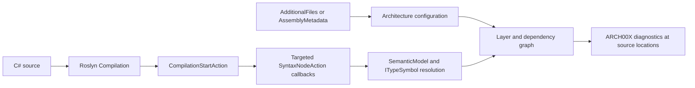
```mermaid
flowchart LR
    Source["C# source"] --> Compilation["Roslyn Compilation"]
    Settings["AdditionalFiles or AssemblyMetadata"] --> Config["Architecture configuration"]
    Compilation --> Start["CompilationStartAction"]
    Start --> Syntax["Targeted SyntaxNodeAction callbacks"]
    Syntax --> Semantics["SemanticModel and ITypeSymbol resolution"]
    Config --> Rules["Layer and dependency graph"]
    Semantics --> Rules
    Rules --> Diagnostics["ARCH00X diagnostics at source locations"]
```

The integration points are:

1. [`ArchitecturalLevelAnalyzer`](src/Main/RonSijm.AnaalIJzer.Engine/ArchitecturalLevelAnalyzer.cs) is marked with `[DiagnosticAnalyzer(LanguageNames.CSharp)]`, which makes it discoverable as a C# analyzer.
2. For each compilation snapshot, its `CompilationStartAction` reads `Architecture.anl` from Roslyn's `AdditionalFiles`, or reads inline `AssemblyMetadata("AnaalIJzerSettings", ...)`. The parsed configuration is then reused by every callback registered for that compilation.
3. It registers `SyntaxNodeAction` callbacks only for syntax that can introduce an architectural dependency: type and constructor declarations, methods, fields, properties, locals, object creation, invocations, attributes, inheritance, and static member access. Generated code is ignored, and callbacks may run concurrently.
4. [`LayerDependencyAnalyzer`](src/Main/RonSijm.AnaalIJzer.Engine/Analysis/BoundaryRules/LayerDependencies/LayerDependencyAnalyzer.cs) uses the callback's `SemanticModel` to resolve syntax to real Roslyn symbols such as `ITypeSymbol`. This is why aliases, inferred local types, generic type arguments, implemented interfaces, and referenced types can be evaluated by their actual type identity instead of by source text alone.
5. The resolved caller and dependency symbols are matched to configured layer paths. The dependency graph evaluates the relevant boundary gates, blocked rules, site filters, recognized-dependency requirements, and forbidden patterns. A failure is returned to Roslyn with `ReportDiagnostic`, including the source location and diagnostic properties such as `Site`.
6. Configuration failures and configured cycles are reported at the end of the compilation as ARCH006 or ARCH007. If there is no configuration source, no dependency callbacks are registered and the analyzer remains silent.

Because the same analyzer participates in design-time and command-line compilations, the red squiggle in the editor and the error in CI come from the same rule evaluation.

---
## Why compiler-level enforcement matters

Anaal IJzer is a compile-time architecture and structural-policy guard for .NET. It overlaps with test-runner architecture checks such as NetArchTest and ArchUnitNET, heavyweight static-analysis platforms such as NDepend, and the old Visual Studio layer-diagram validation. It is not merely another way to write the same tests.

### Architecture tests are useful, but solve a different problem

A common approach is to write a dedicated test project using a library such as [NetArchTest](https://github.com/BenMorris/NetArchTest) or [ArchUnitNET](https://archunitnet.readthedocs.io/):

```csharp
// In a test project — ArchitectureTests.cs
[Fact]
public void Presentation_Should_Not_Depend_On_Persistence()
{
    var result = Types.InAssembly(typeof(OrderEndpoint).Assembly)
        .That().ResideInNamespace("MyApp.Presentation")
        .ShouldNot().HaveDependencyOn("MyApp.Persistence")
        .GetResult();

    Assert.True(result.IsSuccessful);
}
```

That is valuable for broad assertions about an assembly or a set of published types. It is not equivalent to compiler-level enforcement:

1. **Feedback and location are different.** A test reports from the test project after somebody runs it. Anaal IJzer reports on the exact source construct during design-time analysis and compilation, so the editor squiggle and CI error point to the same dependency, return expression, or declaration.

2. **Behavioural tests only see executed paths.** A `return null`, a sentinel return value, or a `throw` deep in a branch can remain invisible until a test happens to execute that path. Static type-level architecture tests can assert a relationship between types, but they do not automatically inspect every method body and every relevant syntax site.

3. **Complete source inspection needs a compiler host.** A test suite could add custom Roslyn or IL inspection for every return, invocation, generic argument, inheritance site, or declaration it cares about. That is effectively building a compiler inspection in a test runner. Anaal IJzer is already hosted at that point: Roslyn visits every configured matching site in the compilation, including code that no test executes.

4. **Policy is distinct from behaviour.** A failing behaviour test says a scenario no longer works. A failing architectural policy says the code shape itself is not permitted, even when the scenario still works perfectly. Both are important, but they should be visible and owned separately.

5. **Configuration is the policy surface.** With `Architecture.anl`, layer relationships, type policies, site restrictions, and structural observations are explicit configuration. Changing the policy does not require inventing another test method or burying the rule in test code.

### What Anaal IJzer adds

Anaal IJzer uses Roslyn's semantic model while the compiler still knows the real symbols behind the source. This makes rules about aliases, inferred locals, generic arguments, implemented interfaces, attributes, and nested boundaries dependable rather than text-based guesses.

It can also enforce configured policies inside a method body. For example, a [`ReturnValuePolicy`](docs/configuration/return-value-policies.md) can reject a direct `return null`, an empty string, an enum-zero sentinel, or the unchanged result of a method annotated as optional. The analyzer reports each matching return expression even when the method is never exercised by a test.

For a rule that must hold at every relevant source site, runtime coverage cannot prove compliance unless it executes every possible path. A test can approximate that guarantee only by adding an equivalent static inspection. That is why compiler-level analysis is not a substitute for an architecture test: it is the direct enforcement mechanism for a different class of policy.

### Complementary tools

Architecture tests still have a place for broad checks over shipped assemblies, external binaries, or intentional test-suite-level assertions. Behavioural and integration tests remain essential for proving that the application works. Anaal IJzer complements them by making configured structural and semantic policies part of ordinary compilation, with immediate feedback at the offending line.

## Setup

### 1. Reference the analyzer

Add the analyzer package to the project you want to validate:

```powershell
dotnet add package RonSijm.AnaalIJzer
```

Or add the package reference directly to your `.csproj`:

```xml
<ItemGroup>
    <PackageReference Include="RonSijm.AnaalIJzer" Version="0.0.7" PrivateAssets="all" />
</ItemGroup>
```

`PrivateAssets="all"` keeps the analyzer as a development-time dependency and prevents it from flowing transitively to projects that reference yours. Leave it out and everyone downstream inherits your layering opinions, which is a conversation best not started inside somebody else's build log.

### 2. Create the configuration file

Add a file called `Architecture.anl` to the **root of the project you want to analyze**:

```xml
<ArchitecturalLevels>

  <Layer name="Presentation">
    <Class endsWith="Endpoint" />
  </Layer>

  <Layer name="Application">
    <Class endsWith="Service" />
    <Class endsWith="Manager" />
    <Class endsWith="Coordinator" />
  </Layer>

  <Layer name="Persistence">
    <Class endsWith="Repository" />
  </Layer>

  <AllowedDependency from="Presentation" to="Application" />
  <AllowedDependency from="Application" to="Persistence" />

</ArchitecturalLevels>
```

### Why `.anl` instead of `.xml`?

`Architecture.anl` is an XML document. The format originally used the ordinary `.xml` extension, and the XML syntax has not changed: settings still use the `<ArchitecturalLevels>` root, standard XML tooling, and the AnaalIJzer XSD schema.

The custom `.anl` extension gives the settings file an architectural identity instead of making it look like unrelated application data - a generic `Architecture.xml` tends to get filed under "legacy config of uncertain ownership" and removed during a tidy-up sprint. It also gives tools a stable file type to recognize and associate: Arse and the standalone graph editor can be registered as `.anl` handlers, while the Visual Studio companion can recognize an `.anl` file and open it in its dependency-graph editor.

Add an XSD schema hint when you want XML-aware editors to validate element and attribute names while you edit. The schema is [AnaalIJzer.xsd](src/Main/RonSijm.AnaalIJzer/Scheme/AnaalIJzer.xsd); generated configurations can place a copy beside `Architecture.anl`:

```xml
<ArchitecturalLevels xmlns:xsi="http://www.w3.org/2001/XMLSchema-instance"
                     xsi:noNamespaceSchemaLocation="AnaalIJzer.xsd">
  <!-- Rules go here. -->
</ArchitecturalLevels>
```

### 3. Register the file as an AdditionalFile

Tell MSBuild to pass the file to Roslyn:

```xml
<ItemGroup>
    <AdditionalFiles Include="Architecture.anl" />
</ItemGroup>
```

If the config uses `<Include>`, register the included settings files too:

```xml
<ItemGroup>
    <AdditionalFiles Include="*.anl" />
</ItemGroup>
```

The analyzer uses `Architecture.anl` as the explicit top-level settings file convention; other settings files are only read when referenced through `<Include>` or passed directly to Arse.

Skipping this step is the single most common setup mistake. Roslyn never receives the file, the analyzer finds no configuration, and it reports nothing - which looks exactly like a perfectly layered codebase until someone checks.

### 4. Share the same config with `Directory.Build.props`

If several projects should use the same `Architecture.anl`, put the XML next to a solution-level `Directory.Build.props` and register it there instead of copying the file into every project:

```xml
<Project>
  <ItemGroup>
    <PackageReference Include="RonSijm.AnaalIJzer" Version="0.0.7" PrivateAssets="all" />
    <AdditionalFiles Include="$(MSBuildThisFileDirectory)Architecture.anl" Link="Architecture.anl" />
  </ItemGroup>
</Project>
```

`Directory.Build.props` is imported by every project below its folder. `$(MSBuildThisFileDirectory)` keeps the path anchored to the props file, so every project receives the same config file regardless of where its `.csproj` lives. Per-project copies drift, and the copy that ends up being authoritative is never the one you edited.

If the analyzer is already referenced somewhere else, keep that reference and centralize only the config file:

```xml
<Project>
  <ItemGroup>
    <AdditionalFiles Include="$(MSBuildThisFileDirectory)Architecture.anl" Link="Architecture.anl" />
  </ItemGroup>
</Project>
```

### 5. Optional: inline settings with `AssemblyMetadata`

For small examples and throwaway projects, you can put the XML directly in code with the built-in `AssemblyMetadataAttribute`. Because the value is C#, exact type matches can use `nameof(...)` instead of fragile string literals:

```csharp
using System.Reflection;

[assembly: AssemblyMetadata("AnaalIJzerSettings", $"""
<ArchitecturalLevels>
  <Layer name="Presentation">
    <Class endsWith="Endpoint" />
  </Layer>

  <Layer name="Application">
    <Class endsWith="Service" />
  </Layer>

  <Layer name="Persistence">
    <Class typeName="{nameof(OrderRepository)}" />
  </Layer>

  <AllowedDependency from="Presentation" to="Application" />
  <AllowedDependency from="Application" to="Persistence" />
</ArchitecturalLevels>
""")]

public sealed class OrderRepository { }
```

The analyzer recognizes `AssemblyMetadata("AnaalIJzerSettings", "...")` and reads the second constructor argument as XML. No custom helper attribute or extra package reference is needed.

If both config sources exist, `Architecture.anl` wins and the inline metadata value is ignored without comment, so if carefully crafted inline rules suddenly stopped applying, look for a file someone added last week. Visual Studio and Rider code fixes can now edit both file-based settings and inline `AssemblyMetadata("AnaalIJzerSettings", ...)`, including the owning included file when a rule comes from `<Include>`. The simple one-file examples in this repository use `AssemblyMetadata("AnaalIJzerSettings", ...)`, and exact type-name rules use `nameof(...)` so refactors break the code at compile time instead of quietly breaking the config. Broader examples use XML files when that makes the configuration easier to read. See [IDE code fixes](docs/configuration/ide-code-fixes.md) for the supported fixer matrix.

**Example project:** [`Example.InlineXml`](Examples/Features/Example.InlineXml)

That's it. The analyzer activates automatically for every `.cs` file in the project.

Examples use one vocabulary at a time. Explanatory diagnostics use the restaurant roles `Customer`, `Waiter`, `Chef`, and `Pantry`. Setup and reference examples use the technical layers `Presentation`, `Application`, and `Persistence`. A diagram, code block, or explanation never maps one vocabulary onto the other, because a `Waiter` in the `Persistence` layer helps nobody.

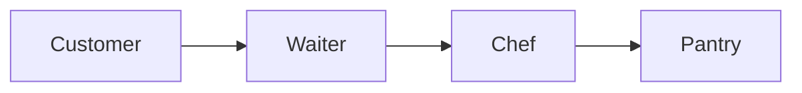
```mermaid
flowchart LR
    Customer --> Waiter --> Chef --> Pantry
```

The self-contained projects under [`Examples/`](Examples/) are referenced inline where their feature is documented. Most intentionally fail with documented `ARCH00X` errors; a few demonstrate clean wildcard config or generated report/documentation output. Scenario examples, such as [`Example.RepositoryQuerySurface`](Examples/Scenarios/Example.RepositoryQuerySurface), show larger usage patterns rather than a single analyzer feature.

---

## Visual Studio 2026 companion extension

The Visual Studio add-on is a VSIX companion for the analyzer. The analyzer remains the authority for `ARCH00X` diagnostics; the extension makes the configured architecture visible while you read and edit code. It cannot bless a dependency the analyzer rejects, however tidy the graph looks.

It adds four visual workflows to Visual Studio 2026:

- **Layer information**: badges, CodeLens-style summaries, gutter glyphs, highlights, and QuickInfo explain configured layers.
- **Sites Diagnostics**: optional inline labels identify architectural sites such as constructors, fields, locals, inheritance, and generic arguments.
- **Dependency graphs**: a dockable sidebar shows the configured layer graph, follows the active file, and can focus the graph that affects it.
- **Configuration fixes**: the graph can preview and apply the same configuration-fix proposals that appear through analyzer light bulbs and Arse.

The screenshots below isolate a setting or tightly related set of settings so a reader can tell exactly what each control changes.

### Install

Build the VSIX from the repository root:

```cmd
build\Scripts\Addon\build-vs-extension.cmd
```

The script writes `RonSijm.AnaalIJzer.VisualStudio.vsix` to `build\Artifacts\VisualStudio`. Install that VSIX into Visual Studio 2026 to enable the editor companion. Each VSIX build stamps a fresh timestamp-based extension version, so Visual Studio can install a newly built local VSIX over the previous one instead of insisting that the version you just changed is already installed.

The GitHub `build-vsix.yml` workflow builds and uploads the VSIX artifact on Windows. On pushes to `main`, it also submits the VSIX to Visual Studio Marketplace when the repository secret `VS_MARKETPLACE_TOKEN` is configured. Marketplace metadata lives in `src\Extensions\RonSijm.AnaalIJzer.VisualStudio\marketplace-publish.json`.

The extension reads the same `Architecture.anl` or `AssemblyMetadata("AnaalIJzerSettings", ...)` configuration as the analyzer through Visual Studio's Roslyn workspace. If no AnaalIJzer config exists, it renders nothing - an empty editor means "nothing is configured", not "everything is in order". If the config is invalid, the extension stays quiet and leaves the existing `ARCH006` analyzer diagnostic as the source of truth.

### Layer information on declarations

Layer indicators are controlled from Visual Studio 2026 Settings under `AnaalIJzer > Editor`:

| Option | Default | Meaning |
|---|---:|---|
| Show layer badges | On | Shows the resolved canonical layer path after a type declaration identifier. |
| Show layer metadata above declarations | On | Shows a clickable CodeLens-style AnaalIJzer summary above a type declaration. |
| Show layer badges when not in layer | Off | Shows a neutral `not in layer` badge for a type that does not match any configured layer. |
| Show global layer rules in badge hover | Off | Includes wildcard rules such as `* (any layer)` in badge hover details. |
| Show mini call graph in badge hover | On | Shows a compact one-to-one dependency chain in badge hover details when the graph is linear. |
| Gutter glyphs | On | Shows a small layer marker beside a layered type declaration. |
| Highlight code in layer | On | Shows a region-like block highlight around a layered type declaration. |
| Tint layer declaration text | Off | Applies the older line-background tint to a layered type declaration. |

Start in this settings page when you want to decide how much architectural context belongs in the editor. The controls separate fast scanning aids, such as glyphs and badges, from richer information that only appears when you hover or open CodeLens.

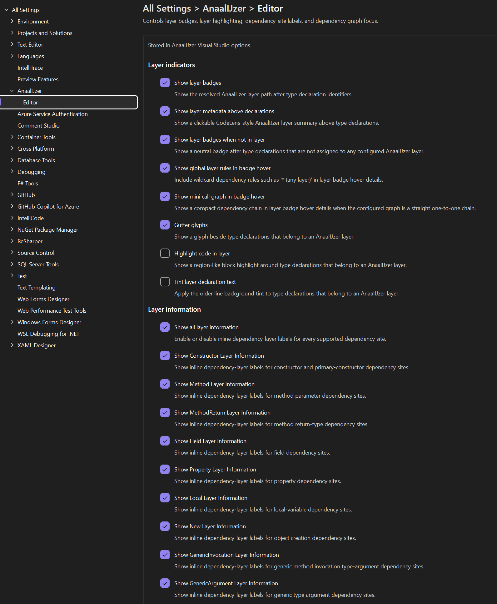

**Layer badge.** A badge gives a type its configured architectural role directly beside its declaration. It is the quickest way to answer “where does this type belong?” without leaving the file.

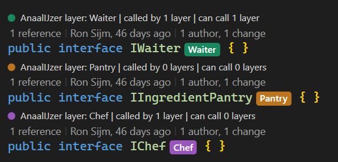

**Layer metadata above a declaration.** The CodeLens-style summary exposes the layer's immediate relationship to the rest of the graph before you open a hover card. It is useful when reading an unfamiliar file top to bottom.

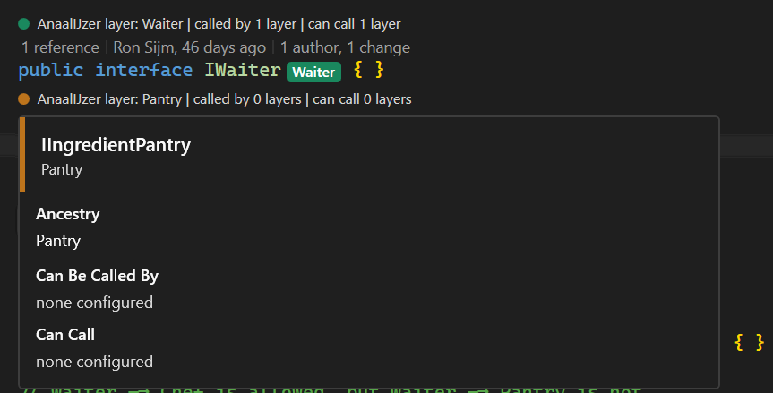

**Not in layer.** This neutral badge is deliberately opt-in: it helps distinguish a type that has not been classified from a type that simply has no dependency violation.

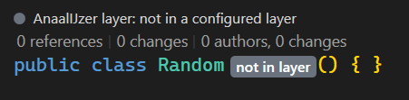

**Gutter glyph.** The glyph keeps layer information visible while the declaration itself is off to the side or collapsed, making the editor margin useful for quick file-level scanning.

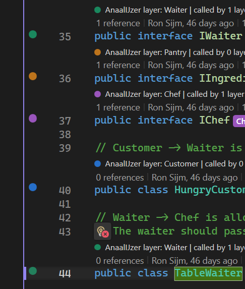

**Block highlight.** Highlighting frames the complete declaration rather than only tinting a line. That makes the boundary of the type easy to follow in a dense file.

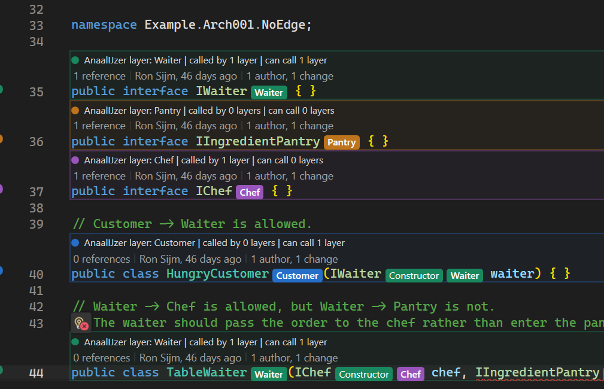

Hovering a layered type or dependency site also shows native Visual Studio QuickInfo. Layer QuickInfo shows the canonical path, ancestry, palette slot, description when configured, which layers may call the current layer, and which layers the current layer may call.

The hover complements the lightweight badge: it answers the next architectural question, “what is this layer connected to?”, including a compact call chain when the relationship is linear.

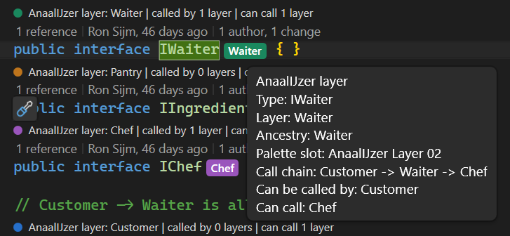

### Layer information and Sites Diagnostics at dependency sites

Layer information and Sites Diagnostics use the same supported dependency sites but answer different questions. A layer-information label says which configured layer the referenced type belongs to. A Sites Diagnostics label says where the dependency appears in C#.

`Show all layer information` enables every layer-information label. `Show all site diagnostics` enables every site label. The controls below can also be enabled independently:

| Site | Layer-information control | Sites Diagnostics control |
|---|---|---|
| Constructor | Show Constructor Layer Information | Show Constructor Site Diagnostics |
| Method | Show Method Layer Information | Show Method Site Diagnostics |
| Method return | Show MethodReturn Layer Information | Show MethodReturn Site Diagnostics |
| Field | Show Field Layer Information | Show Field Site Diagnostics |
| Property | Show Property Layer Information | Show Property Site Diagnostics |
| Local | Show Local Layer Information | Show Local Site Diagnostics |
| Object creation | Show New Layer Information | Show New Site Diagnostics |
| Generic invocation | Show GenericInvocation Layer Information | Show GenericInvocation Site Diagnostics |
| Generic argument | Show GenericArgument Layer Information | Show GenericArgument Site Diagnostics |
| Base class | Show Inheritance Layer Information | Show Inheritance Site Diagnostics |
| Implemented interface | Show InterfaceImplementation Layer Information | Show InterfaceImplementation Site Diagnostics |
| Attribute | Show Attribute Layer Information | Show Attribute Site Diagnostics |
| Static member access | Show StaticMember Layer Information | Show StaticMember Site Diagnostics |

The labels do not create or suppress diagnostics. They make the syntactic location and resolved layer visible while the analyzer remains responsible for compile/build errors. Turning a label off hides the annotation, not the rule. Separate allowed, warning, unclassified, and error colors make an allowed constructor dependency distinct from a site-filtered or blocked one.

For a clean demonstration of every site in one editor tab, open [`Example.VisualStudioSiteDiagnostics`](Examples/Documentation/Example.VisualStudioSiteDiagnostics). It deliberately has no analyzer violations, so the layer and site labels remain easy to inspect.

**A focused site explanation.** The constructor is the smallest useful example. Its label identifies where the dependency is being introduced, while the analyzer's red squiggle remains responsible for saying whether that use is legal.

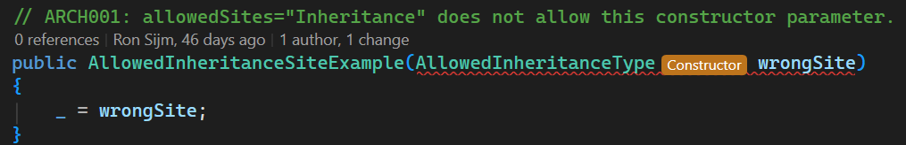

**A whole-file view.** The all-sites showcase makes it easier to see the difference between a type's layer and the code location that references it. Open the example, enable the relevant group of controls, and use the labelled lines to learn each site shape in context.

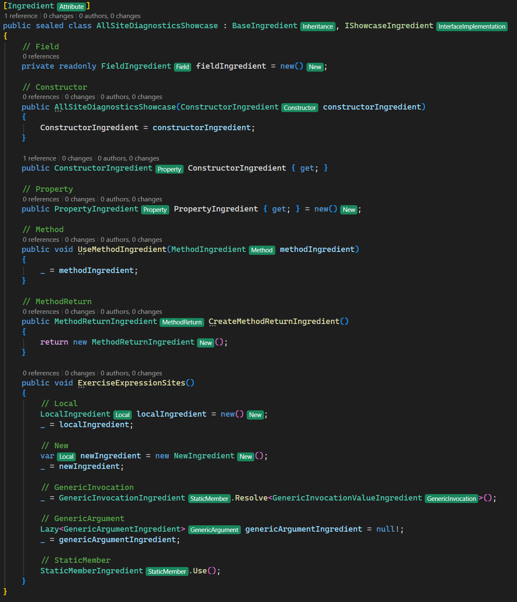

### Dependency graphs

Use `Extensions > IJzer > Show Dependency Graphs` or command search to open a dockable dependency-graph sidebar. The sidebar groups concrete layer rules into connected graphs and shows wildcard/global rules separately. The graph is the same reusable WPF editor hosted by the standalone graph editor. It supports layer grouping, user-controlled layout, connector-based dependency creation, right-click editing, nested-boundary visualization, and PNG export.

**Start with the configured structure.** With code evidence off, the graph stays focused on the intended architecture: the named layers and the allowed paths between them. This is the clearest mode for discussing or editing the rules themselves.

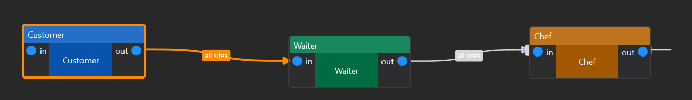

| Option | Default | Meaning |
|---|---:|---|
| Graph focus mode | Highlight current | Chooses `Show all graphs`, `Highlight current graph`, or `Filter to current graph` for the active editor. |
| Open .anl files in diagram editor | On | Opens or selects an `.anl` settings file in the graph editor automatically. |
| Include code evidence | Off | Includes matching project types and observed violations in graph snapshots. |

**Add evidence when investigating a real project.** Enabling code evidence adds matching-type counts and observed violations to the same graph. The dashed red connection in this capture turns an abstract rule into a concrete place to investigate.

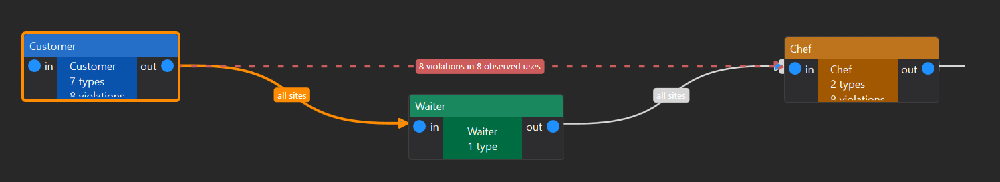

### Configuration fixes from the graph

When the graph comes from an active C# document in a loaded Visual Studio project, it exposes `Configuration fixes` in both the root inspector and the selected layer or connection inspector. The same shared configuration-fix proposal catalog is used by Roslyn light bulbs, `arse fixes`, and the standalone graph editor. It can:

- scan the active project for fixable AnaalIJzer diagnostics;
- show the target file, risk level, and preview diff for each proposal;
- apply one selected proposal and immediately refresh the graph.

You can also right-click a layer or dependency connection and jump straight to the scoped fixer view for that selection. The proposal list is filtered to the selected layer or dependency pair, so you do not have to scan every fix in the active project by hand.

Detached `.anl` files still open in the graph editor, but they do not automatically have enough Roslyn project context to offer analyzer-backed configuration fixes.

### Status and troubleshooting

Use `Extensions > IJzer > Show Status` if the editor appears quiet. It analyzes the active document and reports whether the file is part of Visual Studio's Roslyn workspace, whether settings were found, how many layer/site indicators were produced, and whether configuration issues are suppressing visual adornments. It is a faster diagnosis than the traditional method of restarting Visual Studio three times and hoping.

The companion writes diagnostic logs to Visual Studio's Activity Log and to an Output window pane named `AnaalIJzer`. If settings, menu commands, or editor visuals do not appear, start Visual Studio with logging enabled, reproduce the issue, and search the Activity Log for `AnaalIJzer`. If there are no `AnaalIJzer` entries at all, the VSIX package is not loading; if package initialization is present but no tagger entries appear, the editor MEF component is not being created for the active C# view.

For local validation, use the [Visual Studio companion manual acceptance checklist](docs/visual-studio-companion-manual-acceptance.md). If no adornments appear, run `Extensions > IJzer > Show Status` first. The extension reads analyzer `AdditionalFiles`, inline `AssemblyMetadata("AnaalIJzerSettings", ...)`, and as an editor-only convenience the nearest `Architecture.anl` above the active document; if the config is invalid, the companion intentionally renders nothing and leaves the `ARCH006` diagnostic as the source of truth.

### Technical notes

The VSIX uses classic Visual Studio editor extension points: MEF taggers, glyphs, inline adornments, option pages and Fonts & Colors format definitions. The shared snapshot logic lives in the analyzer assembly under `RonSijm.AnaalIJzer.Editor`, so the extension does not duplicate config parsing or layer matching.

## IDE code fixes

Visual Studio and Rider can now apply AnaalIJzer fixes against both:

- file-based `Architecture.anl`;
- inline `AssemblyMetadata("AnaalIJzerSettings", ...)`.

The analyzer still owns the diagnostics. The code-fix layer only proposes deterministic edits that are local, previewable, and unlikely to invent architecture by accident. Silently widening a boundary because a build went red is how a layering rule turns into a layering suggestion.

There are two families of fixes:

- **source fixes** change C# code directly;
- **configuration fixes** change `Architecture.anl` or inline `AssemblyMetadata`.

Arse reuses the same configuration-fix catalog headlessly through `arse fixes` and `arse apply-fix`. That means the light-bulb suggestions you see in the IDE and the proposal list you can review in CI or a terminal come from the same underlying fix implementations.

The Visual Studio dependency-graph tool window now reuses that same shared catalog as well. From `Extensions > IJzer > Show Dependency Graphs`, the graph can load fix proposals for the active project, preview the config diff, and apply one proposal without leaving the graph view. The root inspector shows the full project list, while selecting or right-clicking a layer or dependency connection switches to a filtered selection-scoped view.

For the broader mental model, ownership rules, and risk labels, see [Configuration fixers](docs/configuration/config-fixers.md).

### Support matrix

| Diagnostic | IDE fix support | Covered by tests |
|---|---|---|
| `ARCH001` | add missing `<AllowedDependency>`; extend `allowedSites`; relax `blockedSites`; add exception | `DependencyRuleCodeFixTests.cs`, `AddToExceptionsCodeFixTests.cs` |
| `ARCH002` | classify the unknown dependency into an existing layer; remove the current site from `requireRecognizedDependencies` globally or for the current caller layer | `RecognizedDependencyCodeFixTests.cs` |
| `ARCH003` | forbidden rule match: rename via `<Fix Rename="...">` or add exception; allow-list failure: add exact `<Class typeName="..."/>` to every applicable `<Allowed>` list | `RenameCodeFixTests.cs`, `AllowedTypePolicyCodeFixTests.cs`, `AddToExceptionsCodeFixTests.cs` |
| `ARCH004` | add the forward `<AllowedDependency>`; flip the exact configured reverse `<AllowedDependency>` when one concrete reverse rule exists; repair site filters; add exception | `DependencyRuleCodeFixTests.cs`, `AddToExceptionsCodeFixTests.cs` |
| `ARCH005` | add a same-layer self-edge, optionally site-scoped; add exception | `DependencyRuleCodeFixTests.cs`, `AddToExceptionsCodeFixTests.cs` |
| `ARCH007` | for each concrete allowed edge in a configured cycle: add a matching blocking edge, or remove that allowed edge; the user chooses the edge | `CycleDependencyCodeFixTests.cs` |
| `ARCH008` | rename the declaration when the rule compares declaration name to semantic type; add `<Allow from="..." to="..."/>` mappings, including a site-scoped variant for `RequireMatchingNames` | `DeclarationNameCodeFixTests.cs`, `NameRuleAllowMappingCodeFixTests.cs` |
| `ARCH009` | add or widen `<ApiSurface><AllowedLayer ... /></ApiSurface>`; relax `blockedSites`; disable `requireRecognizedTypes` when that is the denial | `ApiSurfacePolicyCodeFixTests.cs` |
| `ARCH010` | add a missing `<AllowedProjectReference>`; add an explicit same-group self-edge; remove the matching blocking `<BlockedProjectReference>` rule | `ProjectArchitectureCodeFixTests.cs` |
| `ARCH011` | append an exact `<Package exactName="..."/>` matcher to the matched allowed package list | `PackagePolicyCodeFixTests.cs` |
| `ARCH012` | add the reported visibility to `allowedAccessibilities`; remove it from `blockedAccessibilities`; remove a single-value blocking policy entirely | `VisibilityPolicyCodeFixTests.cs` |
| `ARCH013` | remove a disallowed property setter when the violation is exactly that accessor | `ContractPurityCodeFixTests.cs` |
| `ARCH014` | the same `ApiSurface` configuration fixes as `ARCH009` | `ApiSurfacePolicyCodeFixTests.cs` |
| `ARCH015` | add an exact `<Source exactName="..."/>` rule to the owning layer | `SourceLocationCodeFixTests.cs` |
| `ARCH016` | add a boundary `<EntryPoint>`; add a required site to `allowedSites`; remove the current site from `blockedSites` | `BoundaryEntryPointCodeFixTests.cs` |
| `ARCH018` | no configuration fix: this reports an observed source-code cycle, which configuration editing cannot honestly repair | `ExampleConfigurationFixIntegrationTests.cs` |
| `ARCH019` | add a single required base type or a single required interface when the change is unambiguous | `InheritancePolicyCodeFixTests.cs` |
| `ARCH020` | no automatic fix: a forbidden return expression does not tell the analyzer which domain result should replace it | `ReturnValuePolicyAnalyzerTests.cs` |

### Deliberate limits

- `ARCH010` and `ARCH011` are compilation-end diagnostics. The config edits exist and are covered by analyzer tests, but whether an IDE host shows them as ordinary editor light bulbs depends on how that host surfaces `Location.None` diagnostics.
- `ARCH013`, `ARCH019`, and `ARCH020` stay intentionally narrow. If the analyzer cannot tell which one deterministic edit is the right one, it does not guess. A confidently wrong automatic fix is harder to spot in review than no fix at all.
- Configuration fixers preserve the owning source where possible:
  - if a rule came from an included `.anl`, that included file is edited;
  - if the config came from inline `AssemblyMetadata`, the source file containing the assembly attribute is rewritten.

For a light-bulb-friendly baseline, start with the analyzer tests in `src/Tests/RonSijm.AnaalIJzer.Analyzer.Tests/Diagnostics/`.

For the end-to-end headless path, see `src/Tests/RonSijm.AnaalIJzer.Application.Tests/ApplicationOperations/ApplicationOperationsTests.ConfigurationFixes.cs`.

For real example-project coverage, including expected proposal titles for included `.anl`, inline `AssemblyMetadata`, site filters, name rules, source locations, and project architecture scenarios, see `src/Tests/RonSijm.AnaalIJzer.IntegrationTests/ExampleConfigurationFixIntegrationTests.cs`.

For Visual Studio graph-window state coverage, including preserving the active project context across graph refreshes, see `src/Tests/RonSijm.AnaalIJzer.VisualStudio.Tests/Graphs/ArchitectureGraphToolWindowStateTests.cs`.

## Configuration fixers

Configuration fixers are the part of AnaalIJzer that edit the architecture settings instead of editing your C# code.

For a configured cycle (`ARCH007`), the fixer presents the exact allowed edges in the cycle and lets you choose one to block or remove. It does not choose an architectural direction on your behalf. An observed source-code cycle (`ARCH018`) has no configuration fixer: changing a rule would not remove the code dependency that created it.

That distinction matters:

- a **source fix** changes code, such as renaming a declaration;
- a **configuration fix** changes `Architecture.anl` or inline `AssemblyMetadata("AnaalIJzerSettings", ...)`.

Use configuration fixers when the code is acceptable but the rule set needs a narrow, explicit update.

### What they are for

The fixers are designed for maintenance work that is repetitive but still deterministic:

- add one missing `<AllowedDependency>`;
- append one missing `allowedSites` token;
- remove one blocking `blockedSites` token;
- classify one unknown dependency into an existing layer;
- add one exception entry;
- add one allow-list or boundary entry-point item.

They are intentionally conservative. They do not try to redesign the architecture for you. A light bulb that restructures your boundaries on your behalf would be memorable in all the wrong ways.
When there is more than one plausible architecture edit, they should present named choices and let you pick one.

### Where they work

The same shared fixer catalog is reused by three hosts:

| Host | What you can do |
|---|---|
| Visual Studio / Rider light bulbs | apply source fixes and configuration fixes from diagnostics |
| Visual Studio dependency graph | preview and apply configuration fixes from the active project, including layer- and dependency-scoped graph selections |
| Arse | list proposals with `arse fixes` and apply one with `arse apply-fix` |
| WPF graph editor | load, preview, filter, and apply configuration fixes from project or solution input |

The host UI changes, but the proposal generation is shared. That keeps the terminal, graph editor, and IDE from disagreeing about what a safe config change looks like.

### Ownership rules

Every proposal targets the real owning source:

- if the rule came from the root `Architecture.anl`, that file is edited;
- if the rule came from an included `.anl`, that included file is edited;
- if the rule came from inline `AssemblyMetadata`, the source file that contains that assembly attribute is edited.

That way the fix does not silently flatten includes or move rules into the wrong file.

### Risk labels

Each proposal is ranked as one of these:

- `Safe`: a narrow edit with one obvious meaning;
- `Guided`: still deterministic, but it changes policy more directly;
- `High risk`: technically valid, but broad enough that you should read it carefully first.

In practice:

- adding a single missing site token is `Safe`;
- adding a new `<AllowedDependency>` is usually `Guided`;
- flipping one exact reverse `<AllowedDependency>` for `ARCH004` is `Guided`;
- widening API-surface policy is `High risk`.

### Typical flow

1. AnaalIJzer reports a diagnostic.
2. The fixer catalog checks whether a deterministic config edit exists.
3. A proposal is created with title, reason, target file, and preview diff.
4. The host shows that proposal.
5. You choose whether to apply it.
6. The project or config is analyzed again.

The important part is that the UI never edits XML text directly. It applies the same structured edit model the other hosts use.

### Selection-scoped graph fixes

The graph editors support two views of the same proposal list:

- a **root view** with every proposal found for the current project or solution;
- a **selection-scoped view** filtered to the chosen layer or dependency pair.

In the Visual Studio graph and the standalone WPF graph editor, right-clicking a layer or dependency connection and choosing `Show configuration fixes` switches directly to that filtered view.

That is useful when a large project has many proposals but you are only investigating one boundary.

### Current diagnostic coverage

The current configuration-fix coverage is documented in [IDE code fixes](docs/configuration/ide-code-fixes.md). That page is the support matrix; this page is the mental model.

### Where to verify it

The feature is intentionally covered at several levels:

- analyzer fixer tests: `src/Tests/RonSijm.AnaalIJzer.Analyzer.Tests/Diagnostics/`
- application-level project and solution flows: `src/Tests/RonSijm.AnaalIJzer.Application.Tests/ApplicationOperations/ApplicationOperationsTests.ConfigurationFixes.cs`
- real example-project expectations: `src/Tests/RonSijm.AnaalIJzer.IntegrationTests/ExampleConfigurationFixIntegrationTests.cs`
- WPF graph-editor selection filtering: `src/Tests/RonSijm.AnaalIJzer.GraphEditor.Wpf.Tests/Controls/ArchitectureGraphEditorControlPersistenceTests.ConfigurationFixSelection.cs`
- Visual Studio graph context preservation: `src/Tests/RonSijm.AnaalIJzer.VisualStudio.Tests/Graphs/ArchitectureGraphToolWindowStateTests.cs`
- Arse command-line support: `src/Tests/RonSijm.AnaalIJzer.Arse.Tests/`

### When not to use one

Sometimes the right fix is still a code change, not a config change:

- renaming a declaration so it matches a naming rule;
- moving a type into the correct file or folder;
- extracting an interface or projection to the right layer;
- deleting a bad dependency instead of allowing it.

AnaalIJzer should help with both kinds of repair, but it should not use a config escape hatch when the code is simply wrong. A rule relaxed to make one build green tends to be quoted six months later as deliberate design.

## Arse TUI

Arse - **A**rchitecture **R**ule **S**tandalone **E**xecutable - can load a real project or solution with `MSBuildWorkspace`, so it sees the same compiled `AnaalIJzerSettings` metadata value as the analyzer. It can also generate documentation directly from a specific XML settings file.

```powershell
dotnet tool install --global RonSijm.AnaalIJzer.Arse
```

Run `arse` without arguments for the interactive terminal interface built with [RazorConsole](https://github.com/RazorConsole/RazorConsole). Path fields show matching directories and relevant files while you type. Use Up/Down to select a suggestion, Right Arrow to complete it without leaving the field, or Tab to apply the selected or shared-prefix completion before moving on. Interactive architecture inspection displays its report before writing anything; choose `Save` afterward to select the output file. Supply a command to use the same executable headlessly:

```cmd
arse generate-config --project src\MyApp\MyApp.csproj --output Architecture.anl
arse generate-config --solution src\MyApp.slnx --strategy helpful --output Architecture.anl
arse generate-config --project src\MyApp\MyApp.csproj --strategy conventions --minimum-confidence 0.95 --minimum-support 10 --generate-documentation --include-input
arse export-config --project src\MyApp\MyApp.csproj --output Architecture.anl
arse documentation --project src\MyApp\MyApp.csproj --output docs\architecture-documentation.md --force
arse documentation --config Architecture.anl --output docs\architecture-documentation.md --force
arse report        --project src\MyApp\MyApp.csproj --output docs\architectural-violations.md --force
arse report        --solution src\MyApp.slnx --output docs\architectural-violations.md --force
arse inspect       --project src\MyApp\MyApp.csproj --output docs\architecture-health.md --force
arse inspect       --solution src\MyApp.slnx --output docs\architecture-health.md --force
arse fixes         --project src\MyApp\MyApp.csproj
arse fixes         --solution src\MyApp.slnx --output docs\architecture-fixes.md --force
arse apply-fix     --project src\MyApp\MyApp.csproj --fix-id fix-abc123
arse merge-config  --config Shared.anl --config Project.anl --output Architecture.anl --force
arse split-config  --config Architecture.anl --output ArchitectureRules --force
arse format-config --config Architecture.anl
arse explain-config --config Architecture.anl --output docs\architecture-explanation.md --force
```

`generate-config` inspects source-defined types and the dependency sites already present in the project. It infers layers from the first namespace segment below the project's common namespace, falling back to familiar type suffixes such as `Controller`, `Service`, `Repository`, `Handler` and `Projection`. The command writes both `Architecture.anl` and a local `AnaalIJzer.xsd`, then runs the analyzer against the generated XML before accepting the result - a generator that emits configuration its own analyzer rejects would not be much of a favour.

The generation strategy controls how observed dependencies become rules:

| Strategy | Behavior |
|---|---|
| `snapshot` | The default. Every observed layer edge and dependency site becomes an `AllowedDependency`, producing a passing description of the current structure. |
| `helpful` | A gentle baseline. For projects it behaves like a current-structure snapshot with softer wording. For solutions it creates one layer per C# project assembly using `<Assembly exactName="...">` and permits observed project-to-project dependency sites. |
| `conventions` | Infers dominant edges and writes minority caller types into `<Exceptions>`, producing a passing ratchet that blocks new callers from following those outliers. |

For a solution-wide baseline, generate `Architecture.anl` beside the solution or in an ancestor directory:

```cmd
arse generate-config --solution src\MyApp.slnx --strategy helpful --output Architecture.anl
arse inspect --solution src\MyApp.slnx --output build\Artifacts\architecture-health.md --force
```

Solution inspection still respects project-specific `Architecture.anl` and inline `AssemblyMetadata("AnaalIJzerSettings", ...)` first. If a project has no local config, Arse applies the nearest `Architecture.anl` found from the solution directory upward. Shared solution configs are inspected against the combined solution evidence, so assembly matchers and dependency edges are not reported as unused just because they do not apply to every project individually.

AnaalIJzer dogfoods this flow with [`build\Scripts\Arse\inspect-self-architecture.cmd`](build/Scripts/Arse/inspect-self-architecture.cmd), using a helpful solution baseline instead of a strict hand-authored policy.

Convention inference is configurable:

| Option | Default | Meaning |
|---|---:|---|
| `--minimum-confidence` | `0.90` | Minimum share of active caller types in a layer that must use an edge. The generator counts distinct caller types, not raw syntax occurrences. |
| `--minimum-support` | `5` | Minimum number of distinct callers that must use an edge before it can be treated as a convention. |

Think of confidence as **“is this edge popular enough?”** and support as **“have we seen enough callers to trust that percentage?”** An edge must pass both thresholds.

#### One project, different thresholds

Suppose Arse observes ten distinct active caller types in the `Presentation` layer:

| Existing callers | Observed dependency | Confidence | Support |
|---:|---|---:|---:|
| 8 endpoints | `Presentation --> Application` | `8 / 10 = 0.80` | `8` |
| 2 endpoints | `Presentation --> Persistence` | `2 / 10 = 0.20` | `2` |

An **active caller** is a distinct type in the source layer that has at least one observed outgoing dependency. An endpoint that mentions `Application` ten times still contributes one caller, not ten. The confidence and support comparisons are inclusive: an edge with confidence `0.80` and support `8` passes thresholds of exactly `0.80` and `8`.

Run convention generation several times against that same project, changing only the thresholds:

```cmd
arse generate-config --project Shop.csproj --strategy conventions --minimum-confidence 0.75 --minimum-support 5 --output Architecture.75-5.anl
arse generate-config --project Shop.csproj --strategy conventions --minimum-confidence 0.90 --minimum-support 5 --output Architecture.90-5.anl
arse generate-config --project Shop.csproj --strategy conventions --minimum-confidence 0.75 --minimum-support 9 --output Architecture.75-9.anl
arse generate-config --project Shop.csproj --strategy conventions --minimum-confidence 0.20 --minimum-support 2 --output Architecture.20-2.anl
```

The same evidence now produces four different results:

| Confidence | Support | Edges that qualify as conventions | Generated result |
|---:|---:|---|---|
| `0.75` | `5` | `Presentation --> Application` | Writes only the Application edge. The two Persistence callers become exact-name exceptions under the generated Presentation matcher. |
| `0.90` | `5` | None: `0.80` is below `0.90` | Evidence is ambiguous, so both observed edges are preserved as a snapshot and no exceptions are added. |
| `0.75` | `9` | None: support `8` is below `9` | Evidence is ambiguous, so both observed edges are preserved as a snapshot and no exceptions are added. |
| `0.20` | `2` | Both edges | Writes both edges as conventions. There are no rejected edges, so no exceptions are needed. |

The first invocation treats `Presentation --> Application` as the dominant convention. Its generated output is conceptually:

```xml
<Layer name="Presentation">
  <Namespace regex="^Shop\.Presentation(?:\.|$)">
    <Exceptions>
      <Class exactFullName="Shop.Presentation.LegacyAdminEndpoint" />
      <Class exactFullName="Shop.Presentation.ImportEndpoint" />
    </Exceptions>
  </Namespace>
</Layer>

<AllowedDependency from="Presentation" to="Application" />
```

The two outlier endpoint names are illustrative; Arse writes the actual fully qualified caller names it found. If **no** edge from a source layer reaches both thresholds, Arse does not guess: it preserves every observed edge from that layer as an ambiguous snapshot.

The executable counterpart lives in [`src/Tests/RonSijm.AnaalIJzer.Application.Tests/ApplicationOperations`](src/Tests/RonSijm.AnaalIJzer.Application.Tests/ApplicationOperations). The theory cases there run this same 8/2 setup with the four threshold combinations above and verify the generated edges, ambiguity fallback, and exceptions.

Generated `<Exceptions>` use the analyzer's existing ratchet semantics: the caller is exempt from that layer matcher, so all of that caller's dependencies are grandfathered. Review these entries before adopting the file. Convention mode identifies statistically dominant structure; it cannot prove architectural intent. Eight classes doing the same thing is evidence of a habit, which is not automatically evidence of a decision.

Add `--generate-documentation` to write `architecture-documentation.md` beside the generated XML. The document includes the evidence counts behind inferred edges, the project types resolved by each matcher, concrete code usages permitted by each allowed dependency, generated exceptions as unclassified types, and any current analyzer violations. Add `--include-input` when the document should also contain a fenced copy of the generated XML.

`export-config` writes the evaluated inline XML, so `typeName="{nameof(OrderRepository)}"` becomes `typeName="OrderRepository"` in the persisted file. `documentation` accepts either a project for compiled inline settings and project-backed XML or a specific XML file directly. `report` accepts a project or solution; solution mode opens every C# project in the solution, runs the same analyzer pass per project, and aggregates the diagnostics into one Markdown report. `documentation` and `report` use `documentationPath` / `reportPath` from the config when the output is omitted. Solution `report` uses the first configured project as the representative settings source; if no `reportPath` is enabled there, it defaults to `architectural-violations.md` beside the solution.

`inspect` (aliases: `validate`, `doctor`, `health`, `self-check`) accepts a project, solution, or XML file and writes `architecture-health.md`. XML inspection reports malformed settings, missing includes, invalid matchers, unknown layer references, and configured cycles. Project inspection additionally reports unclassified or ambiguously classified types, unmatched matchers, stale exceptions, unused allowed edges, observed dependency cycles, and current analyzer violations. Solution inspection runs that same project inspection for every C# project and aggregates the findings into one report. Headless Arse exits with code `3` when findings require review, which gives CI something to fail on instead of a report that everybody agrees to read later.

`merge-config` recursively replaces `<Include>` elements with their referenced rules and writes one self-contained XML file. Repeated references resolving to the same path are included once. Root settings such as `requireRecognizedDependencies`, report paths, documentation paths and the XSD location are preserved and rebased relative to the merged output.

`split-config` treats `AllowedDependency` and `BlockedDependency` entries as an undirected graph for grouping purposes. When the configuration contains disconnected graphs, it writes:

- `Architecture.anl` as the new manifest.
- One `Graph.XX.<layers>.anl` file per disconnected dependency graph.
- `Shared.anl` for global rules such as `<Forbidden>`, when needed.

The manifest includes every generated file, so it remains a complete replacement for the original configuration. Wildcard dependencies connect every named layer and therefore prevent those layers from being split into separate graphs. In Arse's interactive mode, enter multiple merge inputs separated by semicolons.

`format-config` normalizes the XML formatting of an `.anl` file. Without `--output`, it formats the input file in place. Use `--output` when you want to preview the normalized version beside the original.

`explain-config` writes a compact Markdown walkthrough of a settings file in XML order: root settings, includes, layers, matchers, dependency rules, type policies and name rules. It is intentionally shorter than generated architecture documentation and useful during review when you want to understand what a ruleset says before loading a project.

`fixes` lists configuration-backed proposals from the same Roslyn fixer catalog used by the IDE. One diagnostic may offer several proposals, for example adding a missing `AllowedDependency`, widening `allowedSites`, or relaxing `blockedSites`. Arse shows the proposals with stable ids, a risk label, the target file, and a preview diff so you can review them before applying anything.

`apply-fix` applies one of those proposal ids back to the owning settings source. If the rule came from an included `.anl`, Arse edits that included file. If the project uses inline `AssemblyMetadata("AnaalIJzerSettings", ...)`, Arse rewrites only the metadata string in the owning source file. After applying a fix, Arse reruns the proposal collection so you can immediately see what remains.

The executable coverage lives in [`src/Tests/RonSijm.AnaalIJzer.Application.Tests/ApplicationOperations/ApplicationOperationsTests.ConfigurationFixes.cs`](src/Tests/RonSijm.AnaalIJzer.Application.Tests/ApplicationOperations/ApplicationOperationsTests.ConfigurationFixes.cs). Those tests exercise both file-based and inline settings projects end to end: list proposals, apply one fix, and verify that the proposal list becomes empty afterward.

Arse's interactive and headless modes share `RonSijm.AnaalIJzer.Application`. Its `ToolOperationCatalog`, `ToolRequest` and `ToolRunner` own the available operations, supported inputs, validation and execution behavior, keeping both modes in feature parity.

## WPF graph editor component

The WPF graph editor is the reusable visual editor behind the standalone graph editor harness and the Visual Studio dependency-graph tool window.

| Project | Purpose |
|---|---|
| `src/Main/RonSijm.AnaalIJzer.Graphing` | Shared graph view models and layout grouping. |
| `src/Main/RonSijm.AnaalIJzer.Graphing.Wpf` | WPF/Nodify controls for viewing and editing architecture graphs. |
| `src/Tools/RonSijm.AnaalIJzer.GraphEditor.Standalone` | Small executable harness for testing the WPF component outside Visual Studio. |
| `src/Extensions/RonSijm.AnaalIJzer.VisualStudio` | Hosts the same WPF component inside the Visual Studio companion extension. |

The central controls are `ArchitectureGraphEditorControl` and `ArchitectureGraphCanvas`. They consume an `ArchitectureGraphSnapshot`, render connected layer graphs left-to-right, show wildcard/global rules separately, and preserve user layout through graph editor user settings.

The editor is source-aware. It can edit XML settings files and inline `AssemblyMetadata("AnaalIJzerSettings", ...)` settings, then reload through the same configuration-reading path used by the analyzer tooling. The graph supports:

- dragging and resizing nested layer groups;
- collapsing graph groups;
- moving individual nodes without losing positions on refresh;
- creating root and child layers from context menus;
- drawing new dependencies from output connectors to input connectors;
- removing layers and dependencies;
- editing allowed/blocked dependency kind, site filters, descriptions and descendant cascading;
- editing layer matchers, scoped type policies, includes and root settings from the inspector.
- exporting the currently rendered graph surface to a PNG image.

When the standalone harness is opened from a `.csproj`, `.sln`, or `.slnx`, the graph exposes `Configuration fixes` in both the root inspector and the selected layer or connection inspector. That panel uses the same shared configuration-fix catalog as the Roslyn light bulbs and `arse fixes`, shows preview diffs, and can apply one proposal and immediately reload the diagram.

Right-clicking a layer or connection also offers a direct `Show configuration fixes` entry point. The resulting inspector view filters the loaded proposal list to the selected layer or dependency pair.

The component itself is not a Roslyn analyzer; dragging a box in the editor changes configuration, not code. It edits the configuration model through `RonSijm.AnaalIJzer.ConfigurationEditing`, and hosts decide where snapshots come from. Visual Studio builds snapshots from the active Roslyn workspace. The standalone harness treats `Architecture.anl` as the normal settings file and can also open project, solution, and legacy `.xml` inputs. Project and solution inputs use the shared MSBuildWorkspace tooling host, choose the first project with an AnaalIJzer configuration as the editable settings source, and overlay solution-wide code evidence on the diagram.

The `Export PNG` button is part of the shared WPF control, so it is available in both the standalone graph editor and the Visual Studio dependency-graph tool window. Tests can also call `ArchitectureGraphEditorControl.ExportGraphsAsPng(...)` directly for quick render smoke checks.

To regenerate a graph image for every example project, run:

```cmd
build\Scripts\GraphEditor\export-example-graph-images.cmd
```

By default, the script preserves the existing repository-friendly behavior: it writes flat PNG artifacts to `build\Artifacts\ExampleGraphImages` and copies each image next to its example project as `<ExampleProjectName>-Graph.png`. Intentionally invalid diagnostic examples get a placeholder image instead of stopping the whole export run; one deliberately broken example should not take the rest of the catalog down with it.

Use `-Placement` to choose where the generated images go:

```cmd
build\Scripts\GraphEditor\export-example-graph-images.cmd -Placement Flat -OutputDirectory build\Artifacts\ExampleGraphImages
build\Scripts\GraphEditor\export-example-graph-images.cmd -Placement PreserveStructure -OutputDirectory build\Artifacts\ExampleGraphImages
build\Scripts\GraphEditor\export-example-graph-images.cmd -Placement SideBySide
build\Scripts\GraphEditor\export-example-graph-images.cmd -Placement All
```

`Flat` writes one big export folder with files such as `Example.IncludeSettings-Graph.png`. `PreserveStructure` writes under one export folder while keeping the `Examples` folder structure. `SideBySide` writes next to each example project. `FlatAndSideBySide` is the default, and `All` writes all three shapes.

Build the standalone harness locally from the repository root:

```cmd
build\Scripts\GraphEditor\build-graph-editor-standalone.bat
```

The script writes the runnable output to `build\Artifacts\GraphEditor.Standalone`. You can also run the project output directly:

```cmd
src\Tools\RonSijm.AnaalIJzer.GraphEditor.Standalone\bin\Release\net10.0-windows\RonSijm.AnaalIJzer.GraphEditor.Standalone.exe path\to\Architecture.anl
src\Tools\RonSijm.AnaalIJzer.GraphEditor.Standalone\bin\Release\net10.0-windows\RonSijm.AnaalIJzer.GraphEditor.Standalone.exe path\to\MySolution.slnx
```

Use `Tools > Associate .anl files` in the standalone editor to make Windows open `.anl` files with the graph editor. The same operation is available from the executable:

```cmd
RonSijm.AnaalIJzer.GraphEditor.Standalone.exe --associate-anl
RonSijm.AnaalIJzer.GraphEditor.Standalone.exe --unassociate-anl
```

The GitHub `build_main.yml` workflow builds this Windows-only editor, uploads `build\Artifacts\GraphEditor.Standalone` as a workflow artifact, and publishes a zipped release asset named `AnaalIJzer-GraphEditor-Standalone-<version>.zip`. If the `graph-editor-v<version>` release already exists, the workflow removes that release and tag before creating the new one.

The standalone graph editor is not shipped as a `dotnet tool install` package. The .NET SDK does not support `PackAsTool` for WPF or WindowsDesktop projects, so the packaging decision was made for us: Arse remains the command-line dotnet tool while the graph editor is distributed as a Windows executable artifact and hosted inside the Visual Studio extension.

The WPF behavior is covered by `RonSijm.AnaalIJzer.GraphEditor.Wpf.Tests`, including persistence from visual edits, inline-settings edits, context menus, connector-created dependencies, layout preservation, group collapse, theme behavior, and shared configuration-fix preview/apply behavior, including selection-scoped filtering.

## Configuration mental model

The settings are not one large list of competing rules. They answer six different questions. Imagine that every type is a person entering a restaurant: the analyzer gives them a job badge, checks whether that kind of person and their public visibility are permitted, checks who their role may depend on and how, then checks whether important names keep their meaning.

### 1. What role does this type have?

A [`<Layer>`](#layer) assigns the job badge. A type might be classified as a `Customer`, `Waiter`, `Chef`, or `Pantry` type.

Nested layers make the badge more specific. A type in `Restaurant/Kitchen/Chef` must obey the broad `Restaurant` and `Kitchen` boundary rules as well as the specific `Chef` rules. An inner boundary can add restrictions; it cannot cancel a restriction imposed by an outer boundary.

An [`<Exceptions>`](#exceptions) block tells one matcher to ignore a particular type. It does **not** grant that type permission to break one dependency rule. For example, excepting `TemporaryChef` from a `<Class endsWith="Chef">` matcher means that matcher no longer gives it the `Chef` badge. Another matcher may still classify it; if none does, the type is outside the layer graph. That makes a layer exception a broad classification exemption, not a narrow allowed edge. This is the most common misreading in the whole configuration: an exception says "this type is not a Chef", never "this Chef is excused from the rules".

[`requireRecognizedDependencies`](#requirerecognizeddependencies-attribute) lists the code sites where a dependency must receive a configured badge. Put it on the root to apply everywhere, or on a `<Layer>` to apply only to callers in that layer and its descendants. For example, `requireRecognizedDependencies="Constructor, Local"` reports ARCH002 for unknown constructor and local-variable types. At sites not listed, unknown types remain outside the layer graph without producing ARCH002.

### 2. Is this kind of type permitted?

[`<Allowed>`](#allowed-type-policy) and [`<Forbidden>`](#forbidden) are **type policies**. They inspect the dependency type itself, not the relationship between two layers.

- `<Allowed>` is a guest list: when an allowlist applies, the dependency type must match at least one entry.
- `<Forbidden>` is a deny list: a matching dependency type is rejected, even if it also appears on an allowlist.

These policies can be global or scoped to a layer. Scoped policies are inherited by nested layers, so a `Restaurant/Kitchen` policy also applies to `Restaurant/Kitchen/Chef`.

### 3. Is this declaration visible to the right audience?

[`<VisibilityPolicy>`](#visibility-policies) restricts whether types and members in a layer may be `public`, `internal`, `private`, and so on. It checks the declaration itself, not a dependency relationship. For example, a repository query surface can be required to remain `internal` even when the repository is allowed to use it.

`<Allowed>` and `<VisibilityPolicy allowedAccessibilities="...">` are different allowlists: the first permits dependency **types**, while the second permits declared **accessibilities**.

### 4. Which roles may depend on which?

[`<AllowedDependency>`](#alloweddependency) permits one layer to depend on another. In the restaurant model, `Waiter --> Chef` means a `Waiter` type may hold or introduce a reference to a `Chef` type. It describes a permitted code dependency, not the runtime order in which people speak or data moves.

[`<BlockedDependency>`](#blockeddependency) explicitly denies a matching relationship. It wins over a matching allowed edge at the same boundary.

Wildcards are only shorthand for “any layer.” For example, `from="*"` means any source layer. A wildcard does not bypass a `<Forbidden>` type policy, a `<BlockedDependency>`, or a denial at a parent boundary. `*` is an abbreviation, not diplomatic immunity.

### 5. Where may the dependency appear?

An allowed relationship can be narrowed to particular [dependency sites](#site-filters) - the different ways one type can keep, receive, create, or expose another type.

- `Constructor` means the type receives the dependency when it is created.
- `Field` or `Property` means it keeps the dependency.
- `Local` means it handles the dependency temporarily inside a method.
- `MethodReturn` means it exposes the dependency to its caller.

`allowedSites` is a site allowlist: only the named sites are permitted. `blockedSites` is a site denylist: every site except the named sites is permitted. They are mutually exclusive on one dependency edge.

### 6. Do important value names still mean the same thing?

[`<NameRules>`](#namerules) are layer-scoped semantic-name policies. They can protect primitive value movement such as `customerId` versus `orderId`, or require a declaration such as `PatientId patientId` to agree with its semantic type.

A `NameRules` policy can require names to match at selected sites, then allow narrow translations where they are intentional. For example, a `Waiter` layer might allow `reservationCustomerId` to become `customerId` only while constructing an order ticket, but still reject passing `animalId` into a `customerId` parameter.

### Similar names, different jobs

| Pair | Difference |
|------|------------|
| `<Allowed>` / `<AllowedDependency>` | A whitelist of dependency **types** versus permission between **layers** |
| `<Forbidden>` / `<BlockedDependency>` | A rejected dependency **type** versus a rejected **layer relationship** |
| `<Exceptions>` / allowed dependencies | A matcher that ignores a type versus architectural permission to depend on a layer |
| `allowedSites` / `blockedSites` | Only these code locations are permitted versus every code location except these |
| Nested layers / nested exceptions | Cumulative architectural boundaries versus alternating exclusion and re-inclusion for one matcher |
| `<AllowedDependency>` / `<NameRules><Allow>` | Permission between layers versus permission for one intentional value-name translation |
| `<Allowed>` / `<VisibilityPolicy>` | Permitted dependency types versus permitted declaration accessibilities |

### Rule precedence

The analyzer evaluates dependency-related rules through this pipeline. Visibility policies independently evaluate declarations after their layer is known. The numbered boxes are evaluation stages; the connector lines are deliberately not architecture dependency arrows.

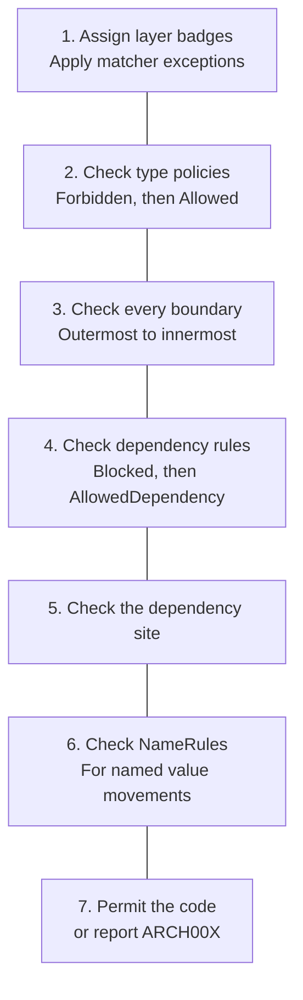
```mermaid
flowchart TD
    Classify["1. Assign layer badges<br/>Apply matcher exceptions"]
    TypePolicy["2. Check type policies<br/>Forbidden, then Allowed"]
    Boundaries["3. Check every boundary<br/>Outermost to innermost"]
    Edges["4. Check dependency rules<br/>Blocked, then AllowedDependency"]
    Sites["5. Check the dependency site"]
    Names["6. Check NameRules<br/>For named value movements"]
    Result["7. Permit the code<br/>or report ARCH00X"]

    Classify --- TypePolicy
    TypePolicy --- Boundaries
    Boundaries --- Edges
    Edges --- Sites
    Sites --- Names
    Names --- Result
```

More precisely:

1. Match the caller and dependency layers, applying matcher exceptions while each rule is considered.
2. Apply global and inherited `<Forbidden>` policies. A match reports ARCH003.
3. Require the dependency type to pass every applicable global and inherited `<Allowed>` whitelist. A failure reports ARCH003.
4. Evaluate hierarchical boundary gates from outermost to innermost. The first denied boundary stops evaluation; a child boundary cannot override it.
5. At each boundary, an applicable `<BlockedDependency>` wins over matching allowed edges.
6. At least one matching `<AllowedDependency>` must permit the current dependency site.
7. Wildcards participate as ordinary matching edges; they receive no special power over blocks or type policies.
8. If a dependency type does not match a layer and its current site is listed by root-level or caller-layer `requireRecognizedDependencies`, report ARCH002.
9. For named value movements inside the caller layer, apply inherited `<NameRules>`. A mismatch without a matching `<Allow>` mapping reports ARCH008.

The important distinction is that `<Allowed>` cannot create an architecture edge, `<AllowedDependency>` cannot approve a forbidden type, `<Exceptions>` does not create a narrow allowed edge, and `<NameRules><Allow>` does not permit a type dependency - it only permits one value-name translation. Each feature answers a different question. Most reports of "the analyzer ignores my rule" turn out to be a rule answering a question nobody asked.

---

## Configuration reference

The XML root element is `<ArchitecturalLevels>`. It supports the child elements and attributes documented in the feature pages below. Everything here is optional: a file that declares layers and a handful of allowed dependencies is already a complete and useful configuration, and most repositories never need the rest.

| Feature | Doc file |
|---|---|
| Configuration fixers | `config-fixers.md` |
| Include files | `include.md` |
| Layers and matchers | `layers.md` |
| Allowed dependencies | `allowed-dependency.md` |
| Blocked dependencies | `blocked-dependency.md` |
| Allowed type policies | `allowed-type-policy.md` |
| Forbidden type policies | `forbidden-type-policy.md` |
| Matcher exceptions | `exceptions.md` |
| Exception review policy | `exception-policy.md` |
| Name rules | `name-rules.md` |
| Visibility policies | `visibility-policies.md` |
| Inheritance policies | `inheritance-policies.md` |
| Contract purity | `contract-policies.md` |
| Return-value policies | `return-value-policies.md` |
| Project architecture | `project-architecture.md` |
| API surface policies | `api-surface.md` |
| Transitive API exposure | `transitive-api-exposure.md` |
| Boundary entry points | `boundary-entry-points.md` |
| Source locations | `source-locations.md` |
| Observed dependency cycles | `enforce-observed-acyclic.md` |
| Required recognized dependency sites | `require-recognized-dependencies.md` |
| Report output settings | `report-attributes.md` |
| Documentation output settings | `documentation-attributes.md` |
| Descriptions | `description-attributes.md` |

### `<Include>`

Merges another architecture settings file into the current config. Use this when a project has a small local config but shares layer definitions or common edges from another file. The top-level config can be either `Architecture.anl` or `AssemblyMetadata("AnaalIJzerSettings", ...)`; included settings files must still be passed to Roslyn as `AdditionalFiles`.

**Example projects:** [`Example.IncludeSettings`](Examples/Features/Example.IncludeSettings), [`Example.IncludeWildcardSettings`](Examples/Features/Example.IncludeWildcardSettings)

<details>
<summary>Dependency graph</summary>

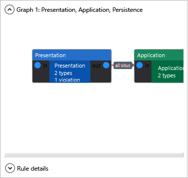

</details>


**Rule:** The project file can keep project-specific edges while the included file owns shared layers and shared edges. The included settings file must also be passed to Roslyn as an `AdditionalFile`.

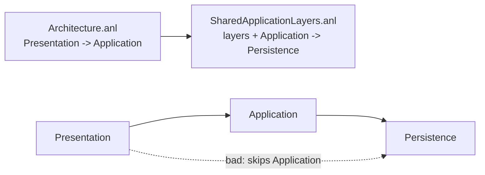
```mermaid
flowchart LR
    ProjectConfig["Architecture.anl<br/>Presentation -> Application"] --> SharedConfig["SharedApplicationLayers.anl<br/>layers + Application -> Persistence"]
    Presentation --> Application --> Persistence
    Presentation -. "bad: skips Application" .-> Persistence
```

```xml
<!-- Architecture.anl -->
<ArchitecturalLevels>
  <Include path="SharedApplicationLayers.anl" />

  <AllowedDependency from="Presentation" to="Application" />
</ArchitecturalLevels>
```

```xml
<!-- SharedApplicationLayers.anl -->
<ArchitecturalLevels>
  <Layer name="Presentation">
    <Class endsWith="Endpoint" />
  </Layer>

  <Layer name="Application">
    <Class endsWith="Service" />
  </Layer>

  <Layer name="Persistence">
    <Class endsWith="Repository" />
  </Layer>

  <AllowedDependency from="Application" to="Persistence" />
</ArchitecturalLevels>
```

```csharp
// Presentation -> Application is declared by the project settings.
public class OrderEndpoint(IOrderService service) { }

// Application -> Persistence comes from the included shared settings.
public class OrderService(IOrderRepository repository) { }

// ARCH001: Presentation -> Persistence has no AllowedDependency edge.
public class AdminEndpoint(IOrderRepository repository) { }
```

`path` is resolved relative to the settings file that declares the include. Included files can include other files; files already seen during the current parse are skipped so accidental cycles do not loop forever. Two rule files that include each other is a rite of passage, not a reason for the build to hang.

Wildcard patterns are also supported. A bare file-name wildcard such as `<Include path="*.anl" />` loads every visible `.anl` file that was passed to the analyzer as an `AdditionalFile`, so a project can keep drop-in rule packs in a local folder. A path wildcard such as `<Include path="RulePlugins/*.anl" />` is resolved relative to the declaring config file. The wildcard only sees what MSBuild handed to Roslyn, so an unregistered rule pack is invisible rather than merely ignored.

```xml
<ArchitecturalLevels>
  <Include path="*.anl" />
</ArchitecturalLevels>
```

That is most useful when the project or solution registers a rule-pack folder, for example:

```xml
<ItemGroup>
  <AdditionalFiles Include="RulePlugins\**\*.anl" />
</ItemGroup>
```

Root attributes such as `requireRecognizedDependencies`, `enforceAcyclic`, `enableReport` and `enableDocumentation` are honored from included files. Root site lists from included files are combined. Layer-scoped `requireRecognizedDependencies` attributes remain on the layer elements that declare them. Report and documentation paths are resolved relative to the file that enables them.

### `<Layer>`

Defines a named group of types. The `name` attribute is referenced by `<AllowedDependency>` edges.

```xml
<Layer name="Application">
  <Class endsWith="Manager" />
  <Class startsWith="App" />
  <Class contains="Service" />
  <Namespace endsWith="Application" />
  <Assembly exactName="MyCompany.Application" />
</Layer>
```

Each `<Class>`, `<Namespace>`, or `<Assembly>` child is a matcher. Attributes on one element are combined with **AND**; separate elements are alternatives combined with **OR**. A type is assigned to a layer when every condition on any one matcher element succeeds. Exact class-name matchers take precedence; remaining matchers are evaluated in configuration order, so the order of your alternatives is a decision whether or not you meant to make one.

For `<Class>`, you can also add inner declaration matchers when the type itself is not enough and you want to describe a recognizable shape:

```xml
<Layer name="PizzaProviderRequests">
  <Class endsWith="Request">
    <Property exactName="PizzaId" typeName="PizzaId" />
    <Field exactName="_tenantId" typeName="TenantId" />
  </Class>
</Layer>
```

That means:

- the outer `<Class>` still matches the type itself;
- each inner declaration element must be satisfied by at least one owned declaration of that kind;
- sibling declaration elements are combined with **AND**.

A `<Layer>` may also set `requireRecognizedDependencies`. That requirement applies only to callers classified into that layer or one of its nested layers:

```xml
<Layer name="AuditedKitchen" requireRecognizedDependencies="Constructor">
  <Class endsWith="AuditedChef" />
</Layer>
```

Use this when a legacy codebase is partly undefined, but one module or boundary should already require every constructor dependency to be classified.

#### Hierarchical layer boundaries

A layer can contain nested layers and dependency rules. Parent matchers define the scope in which child matchers are evaluated:

```xml
<Layer name="Ordering">
  <Namespace startsWith="ExampleCompany.Ordering" />

  <Layer name="Application">
    <Class endsWith="Service" />
  </Layer>

  <Layer name="Repository">
    <Class endsWith="Repository" />
  </Layer>

  <AllowedDependency from="Application" to="Repository" />
</Layer>
```

`ExampleCompany.Ordering.PlaceOrderService` belongs to `Ordering/Application`: it must match both the parent namespace and the child class matcher. A type inside `ExampleCompany.Ordering` that matches no child belongs directly to `Ordering`. A parent with nested layers may omit its own matcher; in that case its membership is the union of its descendants.

Names are local to their parent, so `Ordering/Application` and `Billing/Application` can coexist. Sibling names must be unique, and an individual name cannot contain `/`. Rules inside a boundary use local child names. Root-qualified paths start with `/`:

```xml
<Layer name="Ordering">
  <!-- Egress gate from Ordering/Application to a different boundary. -->
  <AllowedDependency from="Application" to="/Billing/Contracts" />
</Layer>

<Layer name="Billing">
  <!-- Ingress gate into Billing/Contracts. -->
  <AllowedDependency from="/Ordering/Application" to="Contracts" />
</Layer>

<!-- Generic relationship between the two outer boundaries. -->
<AllowedDependency from="Ordering" to="Billing" />
```

A cross-boundary dependency must pass every applicable gate. In this example, `Ordering/Application -> Billing/Contracts` requires all three rules: the root `Ordering -> Billing` relationship, the Ordering egress rule, and the Billing ingress rule. Inner rules may narrow outer permissions but cannot bypass them: a nested boundary does not get to vote itself out of its parent's rules. Site filters are evaluated independently at every gate.

For framework-like or crosscutting layers, mark a higher-level edge with `appliesToDescendants="true"` when that one rule should satisfy descendant boundary gates too:

```xml
<AllowedDependency from="*" to="Framework" appliesToDescendants="true" />
```

Use this for intentionally ambient dependencies. Keep local egress and ingress rules for business boundaries where each parent module should decide what its children may reach. Declaring everything ambient is the fastest route to a single enormous layer named after the company.

References to a parent select its entire subtree. Shared ancestry is containment rather than a same-layer dependency: `Ordering/Application -> Ordering/Repository` is checked by the rule inside `Ordering` and does not produce ARCH005 merely because both types also belong to `Ordering`. ARCH005 applies when both types have the same deepest effective layer.

**Example project:** [`Example.NestedLayers`](Examples/Features/Example.NestedLayers)

<details>
<summary>Dependency graph</summary>

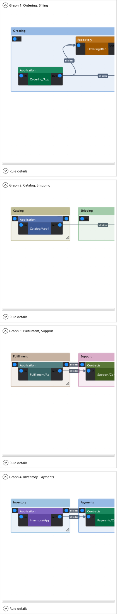

</details>


#### Matcher types

Name-based matchers (case-sensitive, no compilation required):

| Element       | Attribute       | Description |
|---------------|-----------------|-------------|
| `<Class>`     | `typeName`      | Type name equals the given string (synonym: `exactName`) |
| `<Class>`     | `exactName`     | Type name equals the given string (synonym: `typeName`) |
| `<Class>`     | `exactFullName` | Fully-qualified type name (`Namespace.TypeName`) equals the given string |
| `<Class>`     | `endsWith`      | Type name ends with the given string |
| `<Class>`     | `startsWith`    | Type name starts with the given string |
| `<Class>`     | `contains`      | Type name contains the given string |
| `<Class>`     | `regex`         | Type name matches the given .NET regular expression |
| `<Namespace>` | `exactName`     | Namespace equals the given string |
| `<Namespace>` | `endsWith`      | Namespace ends with the given string |
| `<Namespace>` | `startsWith`    | Namespace starts with the given string |
| `<Namespace>` | `contains`      | Namespace contains the given string |
| `<Namespace>` | `regex`         | Namespace string matches the given .NET regular expression |
| `<Assembly>`  | `exactName`     | Containing assembly name equals the given string |
| `<Assembly>`  | `endsWith`      | Containing assembly name ends with the given string |
| `<Assembly>`  | `startsWith`    | Containing assembly name starts with the given string |
| `<Assembly>`  | `contains`      | Containing assembly name contains the given string |
| `<Assembly>`  | `regex`         | Containing assembly name matches the given .NET regular expression |

Semantic matchers (`<Class>` only, evaluated against the resolved type symbol):

| Attribute            | Description |
|----------------------|-------------|
| `inherits`           | Type whose base-type chain contains a type with the given simple or full name (e.g. `inherits="ControllerBase"`) |
| `implements`         | Type that implements (transitively) an interface with the given simple or full name |
| `withAttribute`      | Type decorated with the given attribute. The `Attribute` suffix is optional (`withAttribute="ApiController"` ≡ `"ApiControllerAttribute"`) |
| `withAccessModifier` | Type declared with the given modifier(s). Supported tokens (case-insensitive): `public`, `internal`, `private`, `protected`, `sealed`, `abstract`, `static`, `record`. Multiple space-separated tokens require **all** to match (e.g. `withAccessModifier="public sealed"`) |
| `typeKind`           | Type has the given declared kind. Supported case-insensitive values are listed below. May be used alone. |

`typeKind` uses declaration-oriented values:

| Value | Matches |
|-------|---------|
| `Class` | Ordinary classes, excluding record classes |
| `Interface` | Interfaces |
| `Struct` | Ordinary structs, excluding record structs |
| `Record` | Record classes |
| `RecordStruct` | Record structs |
| `Enum` | Enums |
| `Delegate` | Delegates |

One or more matcher attributes are allowed per element. Every attribute on that element must match:

```xml
<Class startsWith="I"
       endsWith="Repository"
       typeKind="Interface" />

<Namespace startsWith="MyCompany."
           endsWith=".Persistence" />

<Assembly startsWith="MyCompany."
          endsWith=".Contracts" />
```

The first rule matches only interfaces whose names start with `I` and end with `Repository`. To express alternatives, add another `<Class>` element. Missing matchers, unsupported attributes, unknown `typeKind` values, and invalid regular expressions report ARCH006.

#### Structural declaration matchers

Inner declaration elements on `<Class>` reuse the same matcher attributes, but they split the meaning slightly:

- name-style attributes such as `exactName`, `startsWith`, `endsWith`, `contains`, and `regex` apply to the declaration name;
- semantic type attributes such as `typeName`, `exactFullName`, `inherits`, `implements`, and `typeKind` apply to that declaration's associated type;
- `withAttribute` and `withAccessModifier` apply to the declaration symbol itself.

Supported declaration matcher elements are:

| Element | Matches |
|---|---|
| `<Type>` | The type declaration itself |
| `<NestedType>` | A nested class, interface, struct, record, enum, or delegate |
| `<Constructor>` | An explicit instance or static constructor |
| `<Method>` | An ordinary method or explicit interface implementation |
| `<Property>` | A property or indexer |
| `<Field>` | A field |
| `<Event>` | An event |
| `<Operator>` | A user-defined operator |
| `<Conversion>` | An implicit or explicit conversion operator |

This makes "shape" rules possible without inventing a special-purpose matcher per scenario:

```xml
<Class endsWith="Request">
  <Property exactName="PizzaId" typeName="PizzaId" />
</Class>
```

That matches request types that own a `PizzaId` property of type `PizzaId`. It does not match requests that only have `DrinkId`, and it does not match requests that expose `PizzaId` through a differently named property.

String matches are **case-sensitive** and applied to the full declared name (so `IOrderRepository` matches `endsWith="Repository"`). A matcher written as `endsWith="repository"` matches nothing and complains about nothing, which costs a lively half hour to discover. `regex` uses `Regex.IsMatch` semantics, so it matches anywhere in the subject unless the pattern is anchored with `^` / `$`; invalid patterns report ARCH006. Patterns are compiled once and cached, so the cost is paid only on first use.

**Example projects:** [`Example.AssemblyMatcher`](Examples/Features/Example.AssemblyMatcher), [`Example.CombinedMatchers`](Examples/Features/Example.CombinedMatchers), [`Example.StructuralDeclarationMatchers`](Examples/Features/Example.StructuralDeclarationMatchers)


```xml
<Layer name="Controllers">
  <Class inherits="ControllerBase" />
  <Class withAttribute="ApiController" />
</Layer>

<Layer name="DomainEvents">
  <Class implements="IDomainEvent" />
</Layer>

<Layer name="PublicApi">
  <Class withAccessModifier="public sealed" />
</Layer>

<Layer name="Handlers">
  <!-- Anchored: matches IFooHandler, IBarHandler, … but not "Handler" alone. -->
  <Class regex="^I[A-Z][A-Za-z0-9]*Handler$" />
</Layer>

<Forbidden>
  <Class exactFullName="System.Console" comment="Use ILogger." />
  <Namespace regex="\.Internal(\.|$)" comment="Don't reach into *.Internal namespaces." />
</Forbidden>
```

Matchers are also applied to the **generic type arguments** of a parameter, recursively. A parameter typed `Lazy<IChef>` is therefore evaluated as both `Lazy` and `IChef`. If the Customer layer may depend on Waiter but not Chef, the wrapper does not hide the Chef dependency. This works for arbitrary wrappers (`Lazy<>`, `Func<>`, `IEnumerable<>`, `Task<>`, ...) and any user-defined generic.

**Example project:** [`Example.Arch001.GenericTypeArgument`](Examples/Diagnostics/Example.Arch001.GenericTypeArgument)


**Rule:** Generic type arguments are inspected. Wrapping a forbidden dependency in `Lazy<>`, `IEnumerable<>`, `Func<>`, … does not hide it from the analyzer.

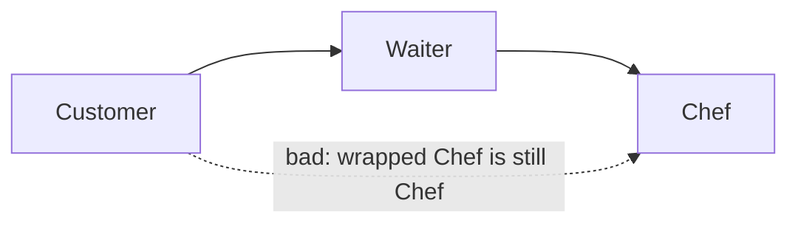
```mermaid
flowchart LR
    Customer --> Waiter --> Chef
    Customer -. "bad: wrapped Chef is still Chef" .-> Chef
```

```xml
<AllowedDependency from="Customer" to="Waiter" />
<AllowedDependency from="Waiter" to="Chef" />
<!-- Customer -> Chef: intentionally omitted -->
```

```csharp
// Customer -> Waiter is allowed.
public class HungryCustomer(IWaiter waiter) { }

// ARCH001: Lazy<IChef> still contains an IChef dependency.
// Asking for a chef later is still asking for a chef.
public class PatientCustomer(Lazy<IChef> chef) { }

// ARCH001: IEnumerable<IChef> still contains IChef dependencies.
// A group of chefs is not a waiter.
public class GroupCustomer(IEnumerable<IChef> chefs) { }

// ARCH001: Func<IChef> still contains an IChef dependency.
// A promise to find a chef later does not change the boundary.
public class FutureCustomer(Func<IChef> chefFactory) { }
```

### `<AllowedDependency>`

Declares that types in layer `from` are permitted to depend on types in layer `to`. Any dependency not covered by an explicit edge (or the special `*` wildcard) is a layering violation - see [ARCH001/ARCH004/ARCH005](#diagnostics) for how the three reasons are distinguished. The default answer is "no"; permission has to be written down somewhere other than a team's collective memory.

```xml
<AllowedDependency from="Presentation" to="Application" />
<AllowedDependency from="Application" to="Persistence" />
```

Use `from="*"` to allow a layer to be depended on from any other layer (useful for cross-cutting concerns):

```xml
<Layer name="Crosscutting">
  <Class typeName="IIdentityContext" />
</Layer>

<AllowedDependency from="*" to="Crosscutting" />
```

With nested layers, a root wildcard still respects inner boundary gates by default. Add `appliesToDescendants="true"` when the edge is intentionally ambient, such as framework primitives or a crosscutting abstraction that every nested boundary may use:

```xml
<Layer name="Framework">
  <Class typeName="Task" />
  <Class typeName="Nullable" />
  <Class typeName="CancellationToken" />
</Layer>

<AllowedDependency from="*" to="Framework" appliesToDescendants="true" />
```

**Example project:** [`Example.CascadingDependencyRules`](Examples/Features/Example.CascadingDependencyRules)

<details>
<summary>Dependency graph</summary>

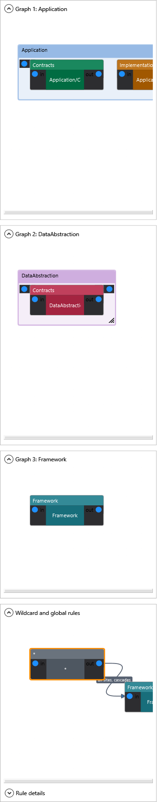

</details>


Use `to="*"` for the symmetric case - a single layer that is allowed to depend on every other configured layer. Typical example: a diagnostics / health-check layer that needs to read state from every part of the system:

```xml
<Layer name="Diagnostics">
  <Class endsWith="Diagnostics" />
</Layer>

<AllowedDependency from="Diagnostics" to="*" />
```

`from="*" to="*"` is also accepted and means "every configured layer may depend on every other configured layer". Nested boundary gates still require local rules unless the edge sets `appliesToDescendants="true"`. `<Forbidden>` types are still rejected, and unknown types at sites required by root-level or caller-layer `requireRecognizedDependencies` still report ARCH002 - the wildcard only relaxes the directed-edge requirement. It is a legal configuration; it has simply stopped describing an architecture and started describing a pile.

### `<BlockedDependency>`

Explicitly denies an edge even when a broader wildcard allowance would otherwise permit it. Blocked rules take precedence over every matching `<AllowedDependency>`, which lets a wildcard stay a broad convenience with named exceptions instead of becoming a loophole.

```xml
<AllowedDependency from="*" to="Persistence" />
<BlockedDependency from="Presentation" to="Persistence"
                   description="Presentation types must go through Application services." />
```

Both dependency elements support `appliesToDescendants` and the same site filters. On a blocked rule, `appliesToDescendants="true"` cascades the denial into descendant boundary gates, and the filter scopes where the block applies:

```xml
<BlockedDependency from="Application" to="QuerySurface"
                   allowedSites="Field, Property, MethodReturn" />
```

**Example project:** [`Example.BlockedDependency`](Examples/Features/Example.BlockedDependency)


#### Site filters

By default, a dependency rule applies to every dependency site. Add `allowedSites` to scope it to specific sites, or `blockedSites` to apply it everywhere except the listed sites:

```xml
<AllowedDependency from="Waiter" to="PreparedDish" allowedSites="MethodReturn, Local" />
<AllowedDependency from="Chef" to="Ingredient" blockedSites="MethodReturn" />
```

The attributes are mutually exclusive. Site names are comma-separated, trimmed, and case-insensitive. Unknown site names or a rule that declares both attributes report ARCH006 and are ignored fail-closed - a typo in a site list should never widen a rule by accident.

Site filters also apply to wildcard edges such as `from="*"` and `to="*"`.

Arrows still mean "may depend on"; the edge label narrows where that dependency may appear. Here a Waiter may briefly hold or return a `PreparedDish`, while a Chef may use an `Ingredient` everywhere except as a method return type. That prevents a Chef API from handing raw ingredients to callers without forbidding ingredients inside the kitchen.

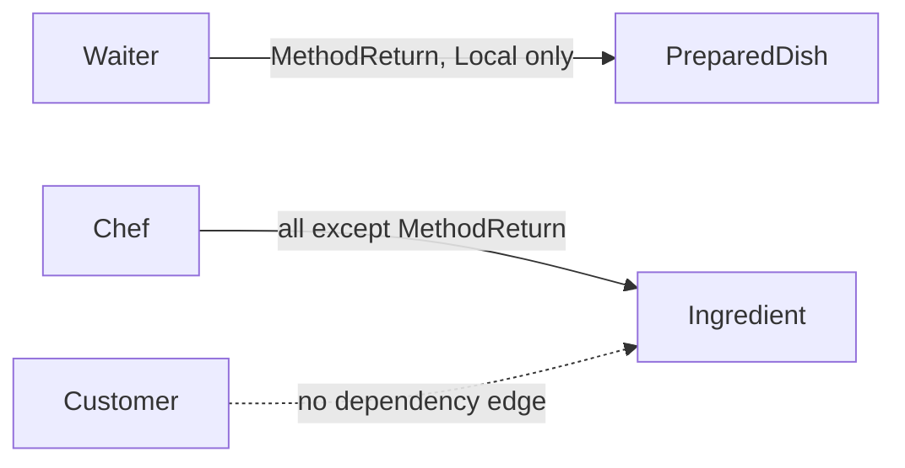
```mermaid
flowchart LR
    Waiter -->|"MethodReturn, Local only"| PreparedDish
    Chef -->|"all except MethodReturn"| Ingredient
    Customer -. "no dependency edge" .-> Ingredient
```

| Site | What it means | Example shape |
|------|---------------|---------------|
| `Constructor` | Constructor parameter, including primary constructors | `public Caller(DependencyType dependency) { }` |
| `Method` | Non-constructor method parameter | `public void Run(DependencyType dependency) { }` |
| `MethodReturn` | Non-constructor method return type | `public DependencyType Get() => ...;` |
| `Field` | Field declaration | `private readonly DependencyType _dependency;` |
| `Property` | Property declaration | `public DependencyType Dependency { get; set; }` |
| `Local` | Local variable declaration | `DependencyType dependency = ...;` |
| `New` | Object creation expression | `new DependencyType()` or target-typed `new()` |
| `GenericInvocation` | Generic method invocation type argument | `services.GetRequiredService<DependencyType>()` |
| `GenericArgument` | Generic type argument inside another referenced type | `Lazy<DependencyType>` or `IEnumerable<DependencyType>` |
| `Inheritance` | Base class inheritance, or interface-to-interface inheritance | `class Caller : DependencyBase` |
| `InterfaceImplementation` | Class, record, or struct implements an interface | `class Caller : IDependency` |
| `Attribute` | Attribute applied within a layered type | `[DependencyMarker] class Caller` |
| `StaticMember` | Static method, property, field, or event access | `DependencyType.Load()` |

`GenericArgument` is reported for the inner type rather than the outer wrapper. For example, `Lazy<DependencyType>` in a constructor is reported as `Site=GenericArgument`, because the architectural dependency is `DependencyType`, not `Lazy<T>`.

**Example project:** [`Example.AllowedSites`](Examples/Features/Example.AllowedSites)


#### Repository query surfaces

Site filters are useful when one layer owns a type that other layers may touch only as a short-lived access point. A repository query surface is a good example: `OrderRepository` may create and return `OrderQuery`, and `OrderQuery` may project itself to `OrderProjection`, but the Application layer should not expose `OrderQuery` in its own API or keep it around for application logic.

```xml
<ArchitecturalLevels>
  <Layer name="Application"><Class endsWith="Service" /></Layer>
  <Layer name="Persistence"><Class endsWith="Repository" /></Layer>
  <Layer name="QuerySurface"><Class endsWith="Query" /></Layer>
  <Layer name="Projection"><Class endsWith="Projection" /></Layer>

  <AllowedDependency from="Application" to="Persistence" />
  <AllowedDependency from="Application" to="Projection" />
  <AllowedDependency from="Persistence" to="QuerySurface" allowedSites="MethodReturn, New" />
  <AllowedDependency from="QuerySurface" to="Projection" />
</ArchitecturalLevels>
```

```csharp
// The service never names OrderQuery; it immediately projects the repository-owned chain.
public OrderProjection GetOrder()
    => repository.QueryOrders().ForCurrentCustomer().Project();

// ARCH001, Site=Local: application logic now retains a raw query surface.
public OrderProjection GetOrderThroughLocalQuery()
{
    OrderQuery query = repository.QueryOrders();
    return query.Project();
}

// ARCH001, Site=MethodReturn: the raw query surface leaks outside the service API.
public OrderQuery LeakQuery() => repository.QueryOrders();
```

The point is not that `OrderQuery` is forbidden everywhere. Persistence owns it, and the query surface can expose projection methods. The rule is that higher layers should carry projected objects, such as `OrderProjection`, instead of carrying persistence internals across method boundaries. The service that only holds a query surface briefly is usually the same service that returns one two releases later.

**Example project:** [`Example.RepositoryQuerySurface`](Examples/Scenarios/Example.RepositoryQuerySurface)

<details>
<summary>Dependency graph</summary>

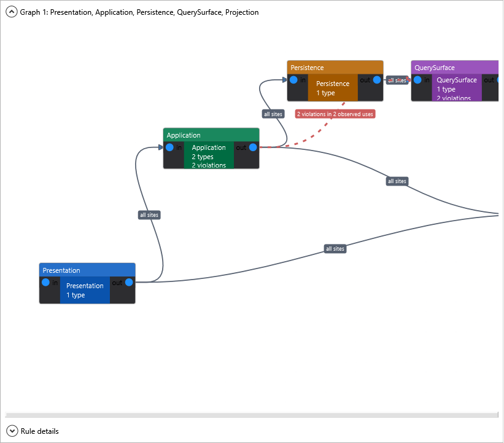

</details>


**Example project:** [`Example.WildcardTo`](Examples/Features/Example.WildcardTo)


**Rule:** `<AllowedDependency from="Diagnostics" to="*" />` lets the `Diagnostics` layer depend on every other configured layer without listing each edge explicitly. The project builds clean - it demonstrates the *absence* of diagnostics that would otherwise fire.

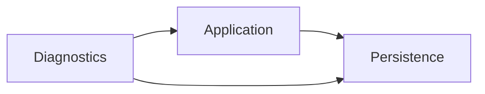
```mermaid
flowchart LR
    Application --> Persistence
    Diagnostics --> Application
    Diagnostics --> Persistence
```

```xml
<AllowedDependency from="Application" to="Persistence" />
<AllowedDependency from="Diagnostics"  to="*" />
```

```csharp
// Diagnostics -> Application and Diagnostics -> Persistence are allowed by to="*".
public class ArchitectureDiagnostics(IOrderService service, IOrderRepository repository) { }
```

### `<Allowed>` type policy

`<Allowed>` is a whitelist for dependency types. A dependency assigned to a configured layer must match at least one `<Class>` or `<Namespace>` matcher in every applicable allow-list; otherwise the analyzer reports **ARCH003**.

At the root, the allow-list applies to every dependency that belongs to a configured layer:

```xml
<Allowed>
  <Class startsWith="Create" />
  <Class startsWith="Cancel" />
</Allowed>
```

This is useful when an architecture permits only a small vocabulary, such as command verbs. Matchers within one scope are alternatives, so the example accepts both `CreateOrderCommand` and `CancelOrderCommand` but rejects `ProcessOrderCommand`. Be reasonably sure the vocabulary is closed before switching this on, because every future verb has to be negotiated through this list.

```csharp
public class CreateOrderCommand { }
public class CancelOrderCommand { }

// ARCH003: Process is not in the approved global verb list.
public class ProcessOrderCommand { }
public class WorkflowService(ProcessOrderCommand command) { }
```

The policy is checked when a layered type uses the dependency. It does not report on an otherwise unused type declaration.

**Example project:** [`Example.AllowedTypes`](Examples/Features/Example.AllowedTypes)

#### Layer-scoped type policies

Place `<Allowed>` or `<Forbidden>` inside a `<Layer>` to restrict the policy to dependencies classified into that layer and its descendants:

```xml
<Layer name="Command">
  <Class endsWith="Command" />
  <Allowed>
    <Class startsWith="Create" />
    <Class startsWith="Cancel" />
  </Allowed>
</Layer>

<Layer name="Query">
  <Class endsWith="Query" />
  <Forbidden>
    <Class startsWith="Delete" />
  </Forbidden>
</Layer>
```

`ProcessOrderCommand` fails the `Command` allow-list, while `DeleteOrderQuery` matches the `Query` block-list. A type named `DeleteOrderAuditRecord` in an `Audit` layer is unaffected: the `Query` policy does not leak into sibling layers.

Nested policies are cumulative. A dependency in `Ordering/Command` must satisfy allow-lists declared on both `Ordering` and `Ordering/Command`. Any matching forbidden rule denies the dependency, even when an allow-list also matches it: denial wins, and there is no appeals procedure.

**Example project:** [`Example.ScopedTypePolicies`](Examples/Features/Example.ScopedTypePolicies)

### `<Forbidden>`

Marks type patterns as explicitly disallowed. A root `<Forbidden>` policy applies globally; one nested inside a layer applies only to that layer and its descendants. When a dependency type matches an applicable forbidden pattern the analyzer reports **ARCH003** regardless of which layer the caller belongs to. An optional `<Fix Rename="…">` child element provides an automatic rename code-fix in Visual Studio / Rider.

Fill in the `comment` attribute. A rule that records why `Store` lost to `Repository` gets re-litigated far less often than one that simply refuses.

```xml
<Forbidden>
  <Class endsWith="Store" comment="Persistence types must use the Repository suffix.">
    <Fix Rename="Repository" />
  </Class>
</Forbidden>
```

**Example project:** [`Example.Arch003.ForbiddenType`](Examples/Diagnostics/Example.Arch003.ForbiddenType)

**Rule:** Types ending in `Store` are explicitly forbidden. The `<Fix Rename="Repository">` element offers an automatic rename code-fix in Visual Studio.

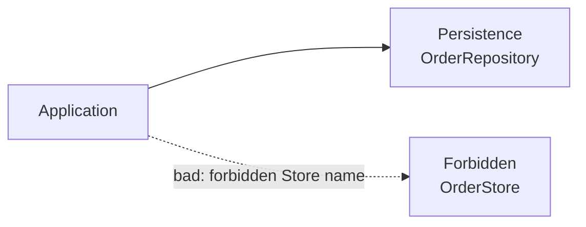
```mermaid
flowchart LR
    Application --> Persistence["Persistence<br/>OrderRepository"]
    Application -. "bad: forbidden Store name" .-> Store["Forbidden<br/>OrderStore"]
```

```xml
<Forbidden>
  <Class endsWith="Store" comment="Persistence types must use the Repository suffix.">
    <Fix Rename="Repository" />
  </Class>
</Forbidden>
```

```csharp
// Repository is the required persistence suffix.
public class OrderService(OrderRepository repository) { }

// ARCH003: Store is forbidden; use Repository instead.
public class OrderStore { }
public class OrderManager(OrderStore store) { }
```

### `<Exceptions>`

Every `<Class>` and `<Namespace>` matcher (including matchers inside `<Layer>`, `<Allowed>` and `<Forbidden>`) accepts a nested `<Exceptions>` block listing types that should be exempt from the rule. Exceptions support the full matcher attribute set documented in [Matcher types](#matcher-types) above, including conjunctive matcher attributes, `typeKind`, semantic matchers (`inherits`, `implements`, `withAttribute`, `withAccessModifier`), and `regex`.

When a dependency matches a rule **and** matches any of that rule's exceptions, the rule is skipped and evaluation continues with the next rule in document order. The rename code-fix is also suppressed for excepted types — if a type is allowed, the IDE will not nag with a rename suggestion.

```xml
<Forbidden>
  <Class endsWith="Store" comment="Persistence types must use the Repository suffix.">
    <Fix Rename="Repository" />
    <Exceptions>
      <!-- Pre-existing offenders grandfathered into the baseline. -->
      <Class startsWith="Legacy" />
      <Class typeName="ThirdPartyOrderStore" />
    </Exceptions>
  </Class>
</Forbidden>

<Layer name="Repository">
  <Class endsWith="Repository">
    <Exceptions>
      <!-- Test double, not a real Repository. -->
      <Class typeName="InMemoryFakeOrderRepository" />
    </Exceptions>
  </Class>
</Layer>
```

The intent is the **ratchet pattern**: lock in current violations as a baseline so the rule blocks *new* offenders without forcing a flag-day rewrite. This mechanism is deliberately simple: it does not track when an exception was added, expire it, or report on it. If you want expiry dates and reminders, that is what [`<ExceptionPolicy>`](docs/configuration/exception-policy.md) is for.

**Example project:** [`Example.Exceptions`](Examples/Features/Example.Exceptions)

**Rule:** `<Exceptions>` grandfathers pre-existing offenders into the baseline. The exception in `<Forbidden>` exempts every type starting with `Legacy`; the exception inside `<Layer name="Repository">` exempts `InMemoryFakeOrderRepository` by exact name.

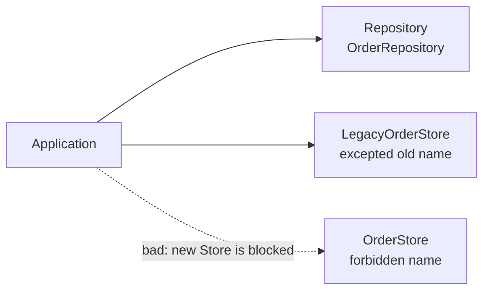
```mermaid
flowchart LR
    Application --> Repository["Repository<br/>OrderRepository"]
    Application --> Legacy["LegacyOrderStore<br/>excepted old name"]
    Application -. "bad: new Store is blocked" .-> Store["OrderStore<br/>forbidden name"]
```

```xml
<Forbidden>
  <Class endsWith="Store" comment="Persistence types must use the Repository suffix.">
    <Fix Rename="Repository" />
    <Exceptions>
      <Class startsWith="Legacy" />
    </Exceptions>
  </Class>
</Forbidden>

<Layer name="Repository">
  <Class endsWith="Repository">
    <Exceptions>
      <Class typeName="InMemoryFakeOrderRepository" />
    </Exceptions>
  </Class>
</Layer>
```

```csharp
// Legacy Store is exempted by <Class startsWith="Legacy">.
public class LegacyOrderStore { }
public class OrderHistoryManager(LegacyOrderStore store) { }

// ARCH003: OrderStore still triggers the rule; the carve-out is scoped.
public class OrderStore { }
public class OrderManager(OrderStore store) { }
```

#### When to reach for `<Exceptions>`

- **Legacy migration / introducing the analyzer to an existing codebase.** Turn the analyzer on with complete rules from day one and add every current offender to `<Exceptions>` (the IDE code-fix does this in one keystroke). The build stays green, but every *new* violation now fails CI. Burn the list down at whatever pace fits the team - there is no migration milestone you have to hit, although a list that has not shrunk in a year is making a statement about priorities all by itself.
- **Intentional architectural carve-outs.** One diagnostics or bootstrap module legitimately needs to see a type the rest of the codebase shouldn't. Excepting it scoped to *that one type* keeps the rule active everywhere else.
- **Third-party / vendor types** you can't rename, generated code, framework conventions, test doubles (`InMemoryFakeOrderRepository` looks like a Repository but isn't one), and any other case where the type name happens to match a pattern it doesn't semantically belong to.

#### Why `<Exceptions>` and not something like `<Baseline>`?

`<Baseline>` would presuppose the *reason* ("this is legacy debt we're grandfathering in") and invite feature creep — baseline freshness warnings, expiry dates, "ratchet down" reports, and so on. In practice exceptions get added for several different reasons (the list above), and a config file is the wrong place to assert intent. `<Exceptions>` is neutral about *why* something is excepted and leaves the policy ("when do we shrink this list?") to the team. Use an XML comment next to the entry if you want to record the reason.

#### Code fix

Forbidden-rule diagnostics with an originating matcher register an **"Add '`TypeName`' to exceptions"** code action that appends the offending type to that matcher's `<Exceptions>` block, creating the block if needed. This works for both `Architecture.anl` and inline `AssemblyMetadata("AnaalIJzerSettings", ...)`, and if the matcher came from an included file the fix edits that owning file instead of the top-level one.

Allow-list failures are different: there is no single matcher to except, so the IDE offers an **allow-list** fixer instead that adds an exact `<Class typeName="..."/>` matcher to every applicable `<Allowed>` list. ARCH002 also has no exception action; it offers layer classification or `requireRecognizedDependencies` relaxation because that is what actually resolves the finding.

#### Nesting

Exceptions can be nested. Each deeper *matching* exception level flips the previous result: depth 1 excludes the type from the rule, depth 2 includes it again, depth 3 excludes it again, and so on. The algorithm finds the **deepest level at which the type matches** and uses that depth's parity to decide the outcome — so inner exceptions should use patterns that are logical subsets of their parent, making it clear which types each level applies to.

**Example project:** [`Example.NestedExceptions`](Examples/Features/Example.NestedExceptions)

**Rule:** four overlapping patterns form a specificity hierarchy, each a logical subset of its parent. The deepest matching depth for each type determines its membership (odd = excluded, even = included):

| Type | Deepest match | Depth | Result |
|------|--------------|-------|--------|
| `InMemoryOrderRepository` | `startsWith="InMemory"` | 1 (odd) | Not in Persistence |
| `InMemoryCachedOrderRepository` | `startsWith="InMemoryCached"` | 2 (even) | In Persistence, ARCH001 |
| `InMemoryCachedTestOrderRepository` | exact type name | 3 (odd) | Not in Persistence |
| `LegacyInMemoryCachedOrderRepository` | exact type name | 4 (even) | In Persistence, ARCH001 |

```xml
<Layer name="Persistence">
  <Class endsWith="Repository">
    <Exceptions>
      <Class startsWith="InMemory">
        <Exceptions>
          <Class startsWith="InMemoryCached">
            <Exceptions>
              <Class typeName="InMemoryCachedTestOrderRepository">
                <Exceptions>
                  <Class typeName="LegacyInMemoryCachedOrderRepository" />
                </Exceptions>
              </Class>
            </Exceptions>
          </Class>
        </Exceptions>
      </Class>
    </Exceptions>
  </Class>
</Layer>
```

```csharp
// Depth 1 (odd): not in Persistence.
public class OrderEndpoint(InMemoryOrderRepository repository) { }

// ARCH001: Depth 2 (even): in Persistence.
public class AdminEndpoint(InMemoryCachedOrderRepository repository) { }

// Depth 3 (odd): not in Persistence again.
public class TestEndpoint(InMemoryCachedTestOrderRepository repository) { }

// ARCH001: Depth 4 (even): in Persistence again.
public class LegacyEndpoint(LegacyInMemoryCachedOrderRepository repository) { }
```

## ExceptionPolicy

`<ExceptionPolicy>` makes matcher exceptions temporary and reviewable. A carve-out that nothing ever asks about again is not temporary; it is permanent with better marketing.

Without it, `<Exceptions>` keep their existing behavior:

- no metadata is required;
- no warning is reported;
- exceptions stay active until someone edits the config.

With it, you can require metadata on every matcher directly inside an `<Exceptions>` block:

```xml
<ArchitecturalLevels>
  <ExceptionPolicy requireReason="true"
                   requireOwner="true"
                   requireExpiresOn="true"
                   warnBeforeDays="14" />

  <Layer name="Application">
    <Class endsWith="Manager">
      <Exceptions>
        <Class typeName="LegacyManager"
               reason="Migration tracked in ORDERING-142"
               owner="Ordering Team"
               expiresOn="2026-10-31" />
      </Exceptions>
    </Class>
  </Layer>
</ArchitecturalLevels>
```

Supported attributes:

| Attribute | Default | Meaning |
|---|---|---|
| `requireReason` | `false` | Require a non-empty `reason` attribute on exception matchers |
| `requireOwner` | `false` | Require a non-empty `owner` attribute on exception matchers |
| `requireExpiresOn` | `false` | Require an `expiresOn="yyyy-MM-dd"` attribute on exception matchers |
| `warnBeforeDays` | `14` | Emit `ARCH017` when an exception expires within this many days |

Behavior:

- Missing required metadata reports `ARCH017`.
- Invalid `expiresOn` reports `ARCH017`.
- Expired exceptions report `ARCH017` and fail closed.
- Expiring-soon exceptions report `ARCH017` but remain active.
- Stale exceptions are reported by Arse health inspection, not by normal project compilation.

See also:

- [`exceptions.md`](docs/configuration/exceptions.md)
- [`../diagnostics/arch017-exception-review.md`](docs/diagnostics/arch017-exception-review.md)
- [`../../Examples/Features/Example.ExceptionPolicy/Example.cs`](Examples/Features/Example.ExceptionPolicy/Example.cs)

### `<NameRules>`

`NameRules` are layer-scoped semantic-name policies. They do not create layer dependencies. They can check either a named value moving into a differently named target or a declaration identifier that disagrees with its own semantic type.

Use this when primitive values are still necessary, but you want some of the protection people often get from "honest types". To the compiler one `int` is exactly as meaningful as any other `int`, which is why swapped id arguments pass review so comfortably and reappear later as a production incident:

```xml
<Layer name="Application">
  <Class endsWith="Service" />

  <NameRules>
    <RequireMatchingNames>
      <Name endsWith="Id" />
      <Allow from="legacyCustomerId" to="customerId" allowedSites="Constructor" />
    </RequireMatchingNames>
  </NameRules>
</Layer>
```

`RequireMatchingNames` above says:

| Element | Meaning |
|---|---|
| `<Name endsWith="Id" />` | Check source or target names ending with `Id`. |
| `<Allow from="legacyCustomerId" to="customerId" />` | This intentional rename is allowed. |
| `allowedSites="Constructor"` | The rename is allowed only when calling a constructor. |

The analyzer normalizes names before comparing them. For example, `customerId` and `Customer.Id` are treated as the same meaning. `fruitId` and `animalId` are not.

```csharp
// Valid: customerId normalizes to Customer.Id.
customer.Id = customerId;

// ARCH008: animalId does not mean Customer.Id.
customer.Id = animalId;

// ARCH008: arguments are swapped.
Log(animalId, fruitId);

void Log(int fruitId, int animalId) { }
```

#### Matchers

`Name`, `Source`, and `Target` use the same matcher attributes and AND/OR behavior as layer `<Class>` matchers:

```xml
<RequireMatchingNames>
  <Name startsWith="customer" endsWith="Id" />
</RequireMatchingNames>

<RequireMatchingNames>
  <Source endsWith="RowId" />
  <Target endsWith="Id" />
  <Allow>
    <Source exactName="customerRowId" />
    <Target exactName="Customer.Id" />
  </Allow>
</RequireMatchingNames>
```

Multiple attributes on one matcher are combined with AND semantics. Multiple matcher elements are alternatives.

#### Sites

`RequireMatchingNames` and nested `Allow` mappings support the same `allowedSites` and `blockedSites` attributes as dependency edges. The first implementation reports value-name movements at these sites:

| Site | Example |
|---|---|
| `Constructor` | `new Customer(legacyCustomerId)` compared with constructor parameter `customerId` |
| `Method` | `Save(animalId)` compared with method parameter `fruitId` |
| `MethodReturn` | `return animalId;` compared with the containing method name |
| `Field` | `_fruitId = animalId` or field initializer assignment |
| `Property` | `customer.Id = animalId` or property initializer assignment |
| `Local` | `var fruitId = animalId` or `fruitId = animalId` |

Other site names remain valid in filters because the site vocabulary is shared across the analyzer, but NameRules only produce diagnostics for value movements that have both a source name and a target name.

**Example project:** [`Example.NameRules`](Examples/Features/Example.NameRules)

#### Declaration names and semantic types

`RequireDeclarationNameMatchesType` checks the declaration itself. This is useful when serializers, model binders, dependency injection, or humans rely on an identifier to describe a strongly typed value:

```xml
<Layer name="AspEndpoints">
  <Class endsWith="Endpoint" />
  <NameRules>
    <RequireDeclarationNameMatchesType allowedSites="Method, Property">
      <Type implements="IHonestType" />
    </RequireDeclarationNameMatchesType>
  </NameRules>
</Layer>
```

```csharp
public void GetPatient(PatientId patientId) { } // Allowed
public void GetPatient(DoctorId patientId) { }  // ARCH008

public PatientId PatientId { get; set; } // Allowed
public DoctorId PatientId { get; set; }  // ARCH008
```

`Type` selects semantic declared types. `Name` optionally selects declaration identifiers. Both use the same conjunctive matcher attributes as `Class`, and multiple sibling matchers are alternatives:

```xml
<RequireDeclarationNameMatchesType allowedSites="Method">
  <Type implements="IHonestType" endsWith="Id" />
  <Name endsWith="Id" />
  <Allow from="LegacyPatientIdentifier" to="patientId" />
</RequireDeclarationNameMatchesType>
```

The supported declaration sites are:

| Site | Declaration compared with its semantic type |
|---|---|
| `Constructor` | Constructor or primary-constructor parameter |
| `Method` | Ordinary method parameter |
| `MethodReturn` | Method name and return type |
| `Field` | Each declared field variable |
| `Property` | Property name and property type |
| `Local` | Explicit or `var` local variable |

These two rules answer different questions:

| Code | Responsible rule |
|---|---|
| `DoctorId patientId` | `RequireDeclarationNameMatchesType`: the declaration name disagrees with its type |
| `PatientId patientId = doctorId` | `RequireMatchingNames`: a differently named value moves into the declaration |
| `DoctorId GetPatientId()` | `RequireDeclarationNameMatchesType` at `MethodReturn` |
| `return doctorId;` from `GetPatientId` | `RequireMatchingNames` at `MethodReturn` |

Declaration rules use the semantic type, so aliases and `var` are resolved by Roslyn. Nullable value types are unwrapped. Arrays, collections, `Task<T>`, and arbitrary generic wrappers are not implicitly projected to an inner type.

**Examples:** [`Example.DeclarationNameMatchesType`](Examples/Features/Example.DeclarationNameMatchesType) covers all six declaration sites. [`Example.HonestTypeEndpointNames`](Examples/Scenarios/Example.HonestTypeEndpointNames) shows the convention-based endpoint binding use case.

### Visibility policies

`<VisibilityPolicy>` restricts the declared accessibility of types and members owned by a layer. It is opt-in and does not create or block a dependency edge. `public` is the reflex default in most codebases, and this is how a layer states otherwise without relying on a reviewer spotting the modifier.

Use an allowlist when only a small set is acceptable:

```xml
<Layer name="RepositoryQuerySurface">
  <Class endsWith="Queryable" />

  <VisibilityPolicy
    targets="Type"
    allowedAccessibilities="Internal, File"
    description="Repository query surfaces are implementation details." />
</Layer>
```

Use a blocklist when most accessibilities are acceptable:

```xml
<VisibilityPolicy
  targets="Field, Property"
  blockedAccessibilities="Public, Protected, ProtectedInternal" />
```

Exactly one of `allowedAccessibilities` and `blockedAccessibilities` is required.

#### Declaration targets

`targets` is a required, comma-separated list. Tokens are case-insensitive.

| Target | Declaration |
|---|---|
| `Type` | Top-level class, interface, struct, record, enum, or delegate |
| `NestedType` | A type declared inside another type |
| `Constructor` | Instance or static constructor |
| `Method` | Ordinary method, including an explicit interface implementation |
| `Property` | Property or indexer |
| `Field` | Field or field-like enum member |
| `Event` | Field-like or explicit event |
| `Operator` | User-defined operator |
| `Conversion` | Implicit or explicit conversion operator |

Implicit compiler-generated declarations are ignored. Partial symbols are evaluated once.

#### Accessibility values

Accessibility lists support:

| Value | C# form |
|---|---|
| `Public` | `public` |
| `Internal` | `internal` or the default for a top-level type |
| `Protected` | `protected` |
| `ProtectedInternal` | `protected internal` |
| `PrivateProtected` | `private protected` |
| `Private` | `private` or the default for a class member |
| `File` | `file` type |

The analyzer uses Roslyn symbols, not modifier text. Interface members therefore have their semantic public accessibility, and explicit interface implementations have their semantic private accessibility.

#### Nested layers

Policies apply to the owning layer and all descendants. Parent and child policies are cumulative, and every applicable policy must pass:

```xml
<Layer name="Application">
  <Assembly exactName="Restaurant.Application" />
  <VisibilityPolicy targets="Field" blockedAccessibilities="Public" />

  <Layer name="Contracts">
    <Class endsWith="Contract" />
    <VisibilityPolicy targets="Type" allowedAccessibilities="Public" />
  </Layer>
</Layer>
```

The child policy cannot override a parent failure. The first failing policy is reported from outermost to innermost.

#### What this rule does not mean

- Visibility policies check a declaration's own accessibility. A public nested class inside an internal parent is still declared `Public`.
- Whether a declaration is effectively visible outside all its containing types is exposed to documentation and editor tooling for context, but it does not change `ARCH012`.
- Whether a public signature exposes a forbidden layer is a separate API-surface concern (`ARCH009`).
- Whether an interface or contract contains an allowed kind of member is a separate contract-purity concern (`ARCH013`).

Arse includes visibility findings in `inspect`, `report`, generated documentation, and code evidence. The standalone WPF editor and Visual Studio graph inspector provide checkable target/accessibility controls and autosave the same `.anl` or inline metadata source.

**Example project:** [`Example.Arch012.VisibilityPolicy`](Examples/Diagnostics/Example.Arch012.VisibilityPolicy)

### Inheritance policies

`<InheritancePolicy>` requires declarations in a layer to inherit a specific base type or implement specific interfaces. It is opt-in and separate from dependency permission, visibility, and contract purity.

Use it when a layer has a semantic base contract that every declaration must follow. The usual alternative is a base type everyone remembers to inherit, except in the one entity that was added the week before a release:

```xml
<Layer name="PersistenceEntities">
  <Namespace startsWith="Shop.Persistence" />

  <InheritancePolicy
    typeKinds="Class, Record"
    requiredBaseTypes="Entity, AggregateRoot"
    requiredInterfaces="IAuditedEntity"
    description="Persistence entities inherit the shared entity base and auditing contract." />
</Layer>
```

#### Type-kind values

`typeKinds` is required. Tokens are case-insensitive.

| Value | Meaning |
|---|---|
| `Class` | Class declarations, excluding records |
| `Interface` | Interface declarations |
| `Struct` | Struct declarations, excluding record structs |
| `Record` | Record class declarations |
| `RecordStruct` | Record struct declarations |
| `Enum` | Enum declarations |
| `Delegate` | Delegate declarations |

#### Required contracts

At least one of `requiredBaseTypes` and `requiredInterfaces` is required.

- `requiredBaseTypes` passes when the declaration inherits **any** listed base type.
- `requiredInterfaces` passes when the declaration implements **all** listed interfaces.

Both attributes accept comma-separated simple or fully qualified type names.

```xml
<InheritancePolicy typeKinds="Class" requiredBaseTypes="Entity" />
<InheritancePolicy typeKinds="Class, Record" requiredInterfaces="IAuditedEntity, ISoftDelete" />
<InheritancePolicy typeKinds="Class" requiredBaseTypes="AggregateRoot" requiredInterfaces="IAuditedEntity" />
```

#### Combining with structural class matchers

`<InheritancePolicy>` becomes especially useful when the layer itself is defined by a structural class matcher:

```xml
<Layer name="PizzaProviderRequests">
  <Class endsWith="Request">
    <Property exactName="PizzaId" typeName="PizzaId" />
  </Class>

  <InheritancePolicy
    typeKinds="Class"
    requiredInterfaces="IPizzaProvider" />
</Layer>
```

That reads as: request types that own a `PizzaId` property must implement `IPizzaProvider`. A `DrinkRequest` does not match the layer just because it ends with `Request`, so the inheritance rule never applies to it. This is useful for drop-in rule packs where a recognizable request shape should imply another contract.

#### Nested layers

Inheritance policies apply to the owning layer and all descendants. Parent and child policies are cumulative:

```xml
<Layer name="Domain">
  <Namespace startsWith="Shop.Domain" />
  <InheritancePolicy typeKinds="Class" requiredInterfaces="IDomainType" />

  <Layer name="Entities">
    <Class endsWith="Entity" />
    <InheritancePolicy typeKinds="Class" requiredBaseTypes="Entity" />
  </Layer>
</Layer>
```

The child policy cannot override an outer denial. The first failure is reported from outermost to innermost.

#### What this rule does not mean

- Inheritance policies do not grant or deny dependency edges. That is still controlled by `<AllowedDependency>` and `<BlockedDependency>`.
- Inheritance policies do not decide whether a declaration may be `public` or `internal`. That is a visibility-policy concern (`ARCH012`).
- Inheritance policies do not replace contract purity. A type can inherit the right base class and still violate `<ContractPolicy>`.
- Inheritance policies check declarations that already exist. They do not classify a type into a layer by themselves; the layer matchers still do that.

Arse includes inheritance-policy findings in `inspect`, `report`, generated documentation, and code evidence. The standalone WPF editor and Visual Studio graph inspector expose the same settings at layer scope.

**Example projects:** [`Example.Arch019.InheritancePolicy`](Examples/Diagnostics/Example.Arch019.InheritancePolicy), [`Example.StructuralDeclarationMatchers`](Examples/Features/Example.StructuralDeclarationMatchers)

### Contract purity

`<ContractPolicy>` restricts which declaration shapes are acceptable for contract types owned by a layer. It is opt-in and separate from dependency permission, visibility, and API exposure.

Use it when a layer should stay abstract and message-like:

```xml
<Layer name="Contracts">
  <Class endsWith="Contract" typeKind="Interface" />

  <ContractPolicy
    allowedTypeKinds="Interface"
    allowedMemberKinds="Method, Property"
    allowedPropertyAccessors="Get, Init"
    allowMethodBodies="false"
    allowStaticMembers="false"
    allowNestedTypes="false"
    description="Contracts stay abstract and expose immutable state only." />
</Layer>
```

#### Type-kind values

`allowedTypeKinds` is required. Tokens are case-insensitive.

| Value | Meaning |
|---|---|
| `Class` | Class declarations, excluding records |
| `Interface` | Interface declarations |
| `Struct` | Struct declarations, excluding record structs |
| `Record` | Record class declarations |
| `RecordStruct` | Record struct declarations |
| `Enum` | Enum declarations |
| `Delegate` | Delegate declarations |

#### Member-kind values

`allowedMemberKinds` is required. Tokens are case-insensitive.

| Value | Declaration |
|---|---|
| `Constructor` | Instance or static constructor |
| `Method` | Ordinary method |
| `Property` | Property or indexer |
| `Event` | Event |
| `Field` | Field |
| `Operator` | User-defined operator |
| `Conversion` | Implicit or explicit conversion operator |

#### Property accessors

`allowedPropertyAccessors` is optional. When omitted, accessors are not restricted.

| Value | Meaning |
|---|---|
| `Get` | Getter accessor |
| `Set` | Setter accessor |
| `Init` | Init accessor |

#### Boolean settings

All booleans default to `false` when omitted.

| Attribute | Meaning when `false` |
|---|---|
| `allowMethodBodies` | Methods, accessors, and default interface members must stay body-free |
| `allowStaticMembers` | Source-declared static members are rejected |
| `allowNestedTypes` | Source-declared nested types are rejected |

#### Nested layers

Contract policies apply to the owning layer and all descendants. Parent and child policies are cumulative:

```xml
<Layer name="Application">
  <Assembly exactName="Restaurant.Application" />
  <ContractPolicy
    allowedTypeKinds="Interface, Record"
    allowedMemberKinds="Method, Property" />

  <Layer name="Contracts">
    <Class endsWith="Contract" />
    <ContractPolicy
      allowedTypeKinds="Interface"
      allowedMemberKinds="Method, Property"
      allowedPropertyAccessors="Get" />
  </Layer>
</Layer>
```

The child policy cannot override an outer denial. The first failure is reported from outermost to innermost.

#### What this rule does not mean

- Contract purity does not grant or deny dependency edges. That is still controlled by `<AllowedDependency>` and `<BlockedDependency>`.
- Contract purity does not decide whether a declaration may be `public` or `internal`. That is a visibility-policy concern (`ARCH012`).
- Contract purity does not decide whether a public signature leaks a forbidden layer. That is an API-surface concern (`ARCH009` / `ARCH014`).
- Contract purity is not inferred from a layer name such as `Contracts`; it only runs when `<ContractPolicy>` is present. A folder named `Contracts` is a naming convention, not a guarantee, no matter how firmly it is stated in a design review.

Arse includes contract-purity findings in `inspect`, `report`, generated documentation, and code evidence. The standalone WPF editor and Visual Studio graph inspector expose the same settings as token checklists and booleans.

**Focused example projects:**

- [`Example.Arch013.ContractPurity`](Examples/Diagnostics/Example.Arch013.ContractPurity) - getter-only contract properties; setters trigger `ARCH013`.
- [`Example.Arch013.ContractPurity.MethodBodyNotAllowed`](Examples/Diagnostics/Example.Arch013.ContractPurity.MethodBodyNotAllowed) - contract methods stay signature-only; default interface method bodies trigger `ARCH013`.

### Return-value policies

`<ReturnValuePolicy>` rejects configured **direct return expressions** from methods in its owning layer and descendants. It is useful when a particular return value is a sentinel that hides a decision the method should make explicitly. `return null` is such a decision: it delegates the hard part to whichever caller dereferences it first, usually in production.

It does not impose a universal “never return null” opinion. You decide which returned expressions are unacceptable:

```xml
<Layer name="Kitchen">
  <Class endsWith="Kitchen" />

  <ReturnValuePolicy description="The kitchen makes serving decisions before returning to the waiter.">
    <Literal value="null" description="No invisible empty plate." />
    <Literal value="" description="No empty menu name." />
    <Literal value="42" description="No magic slice-count fallback." />
    <Literal value="0" description="No unnamed enum-zero status." />
    <Invocation withAttribute="JetBrains.Annotations.CanBeNullAttribute"
                description="Optional lookup results get a real fallback." />
  </ReturnValuePolicy>
</Layer>
```

Sibling matcher elements are alternatives: returning a value matching **any** one produces `ARCH020`. Attributes on one matcher are combined, just like layer matchers.

#### Supported direct return matchers

| Child element | Matches | Typical use |
|---|---|---|
| `<Literal>` | A direct literal, including `null`, `""`, numeric values, booleans, and enum casts | `<Literal value="null" />`, `<Literal value="0" />` |
| `<Invocation>` | A direct method invocation | `<Invocation withAttribute="JetBrains.Annotations.CanBeNullAttribute" />` |
| `<New>` | A direct `new` / target-typed `new()` result | Forbid returning a raw mutable implementation |
| `<Identifier>` | A directly returned identifier | Forbid returning a known sentinel variable |
| `<MemberAccess>` | A directly returned property or field access | Forbid a static `None` / `Empty` member where appropriate |

`Literal` has a dedicated `value` attribute. It deliberately supports an empty value, so `<Literal value="" />` means an empty string. Numeric enum casts are unwrapped before matching, so `<Literal value="0" />` also catches `return (PizzaStatus)0;`.

The usual matcher attributes also work where Roslyn can resolve the expression: `typeName`, `exactName`, `exactFullName`, `endsWith`, `startsWith`, `contains`, `regex`, `inherits`, `implements`, `withAttribute`, `withAccessModifier`, and `typeKind`. For example, the annotation matcher above uses the invoked method symbol’s attribute name. That remains configuration-driven: AnaalIJzer does not reference `JetBrains.Annotations`.

The analyzer only rejects values returned **unchanged**. A handling expression such as `lookup.FindPizza() ?? Pizza.Margherita` is not a direct `Invocation` return, because the kitchen has made an explicit fallback decision.

Return-value policies are cumulative through nested layers. An outer policy applies to a child layer, and a child cannot cancel an outer forbidden expression.

There is intentionally no code fix for `ARCH020`: the configuration identifies an unacceptable result, but only the application can decide the correct replacement.

**Focused examples:**

- [`Example.Arch020.ExplicitNullReturn`](Examples/Diagnostics/Example.Arch020.ExplicitNullReturn) - `Literal value="null"` rejects a direct null return.
- [`Example.Arch020.AnnotatedInvocationReturn`](Examples/Diagnostics/Example.Arch020.AnnotatedInvocationReturn) - an annotation matcher rejects returning an optional lookup unchanged.
- [`Example.Arch020.ConfiguredLiteralReturns`](Examples/Diagnostics/Example.Arch020.ConfiguredLiteralReturns) - empty-string, numeric, and enum-zero sentinels are configuration values.

## Project Architecture

`ProjectArchitecture` adds rules for `.csproj` references.

Use it when the problem is at project level rather than type level:

- one project should not reference another project at all;
- a project reference is architecturally wrong even if no code uses it yet;
- solution topology matters separately from type dependency rules.

Project references also have a habit of outliving their reason: the code that needed them is deleted, the reference stays, and two years later somebody treats it as intended design.

### Example

```xml
<ArchitecturalLevels>
  <ProjectArchitecture requireRecognizedProjects="true">
    <ProjectGroup name="Presentation">
      <Project endsWith=".Web" />
    </ProjectGroup>

    <ProjectGroup name="Application">
      <Project endsWith=".Application" />
    </ProjectGroup>

    <ProjectGroup name="Domain">
      <Project endsWith=".Domain" />
    </ProjectGroup>

    <AllowedProjectReference from="Presentation" to="Application" />
    <AllowedProjectReference from="Application" to="Domain" />
  </ProjectArchitecture>
</ArchitecturalLevels>
```

With that configuration:

- `Shop.Web -> Shop.Application` is allowed
- `Shop.Application -> Shop.Domain` is allowed
- `Shop.Web -> Shop.Domain` raises `ARCH010`

### Matchers

`Project` matchers are textual and apply to the project file name without `.csproj`.

Supported attributes:

| Attribute | Meaning |
|---|---|
| `typeName` | Exact match |
| `exactName` | Exact match |
| `startsWith` | Prefix match |
| `endsWith` | Suffix match |
| `contains` | Substring match |
| `regex` | Regular expression |

Attributes on one `Project` element are combined with AND semantics.
Separate `Project` elements inside one `ProjectGroup` are alternatives.

### Rules

Supported edges:

```xml
<AllowedProjectReference from="Presentation" to="Application" />
<BlockedProjectReference from="Domain" to="Infrastructure" />
<AllowedProjectReference from="Tests" to="*" />
<AllowedProjectReference from="*" to="Shared" />
```

Notes:

- `*` means any configured project group
- blocked rules win over allowed rules
- if a source group has at least one allowed rule, that source enters allowlist mode
- same-group references need an explicit self-edge while that source is in allowlist mode
- `allowedSites`, `blockedSites`, and `appliesToDescendants` do not apply here

### Recognition

`requireRecognizedProjects` defaults to `false`.

When enabled:

- the source project must match a `ProjectGroup`
- the target project must match a `ProjectGroup`

If either side is unrecognized, `ARCH010` reports that directly.

### Build Integration

Roslyn does not reliably expose project-reference provenance by itself.

The analyzer package therefore ships a `buildTransitive` target that writes a small project-reference manifest and adds it as an analyzer `AdditionalFile`. Less elegant than asking the compiler, and it has the distinct advantage of working.

Arse and solution inspection do not need that generated manifest because they can inspect `MSBuildWorkspace` project references directly.

### IDE Fix Support

For deterministic cases, the config fixer layer can update project architecture rules too:

- `ARCH010` can add a missing `<AllowedProjectReference from="..." to="..." />`
- same-group `ARCH010` can add an explicit self-edge
- blocked-edge `ARCH010` can remove the matching `<BlockedProjectReference ... />`
- `ARCH011` can append an exact `<Package exactName="..."/>` matcher to the matched allowed package list

Because `ARCH010` and `ARCH011` are compilation-end diagnostics, host UX varies a little: build reports and host tooling are the most reliable surfaces, while editor light-bulb visibility depends on how the IDE exposes `Location.None` diagnostics.

## API surface policies

An `<AllowedDependency>` answers whether code may **use** another layer. An `<ApiSurface>` answers a different question: whether an externally visible declaration may **expose** that layer to its callers. Using a type internally is a private arrangement; returning it in a public signature is a promise to everyone downstream, made without a meeting.

This distinction is useful for repository-owned fluent query surfaces. An application service may use a `LollyQueryable` internally, but its public API should return a stable `LollyProjection` contract:

```xml
<Layer name="Application">
  <Class endsWith="Service" />

  <ApiSurface description="Public application APIs expose contracts only.">
    <AllowedLayer path="/Contracts" />
    <BlockedLayer path="/RepositoryQuerySurface" />
  </ApiSurface>
</Layer>

<Layer name="Contracts">
  <Class endsWith="Projection" />
</Layer>

<Layer name="RepositoryQuerySurface">
  <Class endsWith="Queryable" />
</Layer>

<!-- Internal use remains a separate dependency decision. -->
<AllowedDependency from="Application" to="RepositoryQuerySurface" />
```

```csharp
public class CandyOrderingService
{
    // Allowed: the public result is a contract.
    public LollyProjection OrderProjectedLolly() => null!;

    // Allowed: a private implementation detail is not external API.
    private LollyQueryable BuildQuery() => null!;

    // ARCH009: a repository-owned query surface escapes through public API.
    public LollyQueryable OrderRawLolly() => null!;
}
```

### Evaluation rules

- The policy applies to its layer and all descendant layers.
- Parent and child policies are cumulative; a child cannot override a parent denial.
- A matching `<BlockedLayer>` wins over an `<AllowedLayer>`.
- If one or more `<AllowedLayer>` entries apply at the current site, the exposed recognized type must match one of them.
- A parent layer path selects its complete subtree.
- By default, unclassified framework and third-party types are ignored.
- Set `requireRecognizedTypes="true"` to reject unclassified exposed types too.
- Only externally visible declarations are checked: `public`, `protected`, and `protected internal`, through an externally visible containing-type chain.

### API sites

| Site | Exposed declaration |
|---|---|
| `Constructor` | Constructor parameter |
| `Method` | Method or delegate parameter |
| `MethodReturn` | Method or delegate return type |
| `Property` | Property, indexer type, or indexer parameter |
| `Field` | Field or event type |
| `Inheritance` | Base class |
| `InterfaceImplementation` | Implemented interface |
| `GenericArgument` | Generic arguments and nested signature parts |
| `Attribute` | Attribute type on an externally visible declaration |

`allowedSites` makes an API layer rule apply only at the listed sites. `blockedSites` makes it apply everywhere except the listed sites:

```xml
<AllowedLayer path="/Contracts" allowedSites="Method, MethodReturn, Property" />
<BlockedLayer path="/RepositoryQuerySurface" blockedSites="Method" />
```

Locals, object creation, generic invocation, and static member access are implementation behavior rather than API declarations, so `<ApiSurface>` does not inspect them.

To inspect the public object graph behind an allowed signature type, enable [`TransitiveExposure`](docs/configuration/transitive-api-exposure.md). Direct violations remain ARCH009; hidden violations reached through a permitted contract report ARCH014.

**Example project:** [`Example.Arch009.ApiSurfaceLeakage`](Examples/Diagnostics/Example.Arch009.ApiSurfaceLeakage)

## Transitive API exposure

Direct API checks stop at the declared signature type. A contract can therefore look safe while its public object graph exposes a repository-owned type one step later:

```text
CandyOrderingService.OrderRawLolly
    -> CandyReceipt.RawQuery
    -> LollyQueryable
```

Add `<TransitiveExposure>` to an existing `<ApiSurface>` to inspect that object graph. A query surface rarely gets published through a receipt property on purpose; it arrives because that property was convenient on a Tuesday.

```xml
<Layer name="Application">
  <Class endsWith="Service" />

  <ApiSurface description="Public application APIs expose contracts only.">
    <TransitiveExposure
        maxDepth="3"
        description="Follow public contract members for hidden repository surfaces." />
    <AllowedLayer path="/Contracts" />
    <BlockedLayer path="/RepositoryQuerySurface" />
  </ApiSurface>
</Layer>
```

`maxDepth` defaults to `3` and accepts values from `1` through `10`. Traversal is opt-in: omitting `<TransitiveExposure>` preserves direct ARCH009 behavior.

The analyzer performs a breadth-first traversal and reports the shortest forbidden path. It follows externally visible fields, events, properties, indexers, method and constructor signatures, base types, interfaces, constraints, arrays, tuples, nullable values, delegates, and generic arguments. Private implementation details are ignored.

Traversal is:

- bounded by `maxDepth`;
- cached per compilation;
- cycle-safe for self-referential and mutually recursive contracts;
- cancellable;
- stopped at unrecognized types unless `requireRecognizedTypes="true"` makes the unrecognized exposure itself invalid.

The nested member's own API site is evaluated against `allowedSites` and `blockedSites`. A property reached through a public contract therefore uses `Property`, even when the root contract was exposed at `MethodReturn`.

A directly forbidden signature still reports ARCH009 only. ARCH014 is reserved for a permitted root type whose public object graph reaches a forbidden type.

**Example project:** [`Example.Arch014.TransitiveExposure`](Examples/Diagnostics/Example.Arch014.TransitiveExposure)

## Boundary entry points

`<EntryPoints>` lets a parent boundary say which child layers or specific dependency types are valid external doors into that boundary.

Restaurant version:

- the kitchen may have several rooms inside it;
- outside staff may enter through the service counter;
- they should not walk straight into the cooking area.

That is different from `<AllowedDependency>`:

- `<AllowedDependency>` says whether one role may depend on another at all;
- `<EntryPoints>` says which part of a boundary is the allowed doorway after the dependency is otherwise legal.

Example:

```xml
<Layer name="Ordering">
  <Namespace startsWith="Shop.Ordering" />

  <EntryPoints>
    <EntryPoint layer="Contracts" />
    <EntryPoint allowedSites="Method">
      <Class endsWith="OrderingFacade" />
    </EntryPoint>
  </EntryPoints>

  <Layer name="Contracts">
    <Class typeKind="Interface" />
  </Layer>

  <Layer name="Implementation">
    <Class typeKind="Class" />
  </Layer>
</Layer>
```

Rules:

- no `<EntryPoints>` means no `ARCH016`;
- entry points only restrict callers outside the owning boundary;
- internal calls inside the same boundary are unchanged;
- nested boundaries are cumulative from outermost to innermost;
- entry points never grant a dependency that `<AllowedDependency>` would deny.

A door is only meaningful in a wall that already exists.

### Selector forms

Each `<EntryPoint>` uses exactly one selector form:

| Form | Meaning |
|---|---|
| `layer="Contracts"` | permit entry through that descendant layer subtree |
| matcher elements | permit entry through dependency types matching `<Class>`, `<Namespace>`, or `<Assembly>` |

`allowedSites` and `blockedSites` work the same way as on dependency edges.

### Example

See [`Example.Arch016.BoundaryEntryPoints`](Examples/Diagnostics/Example.Arch016.BoundaryEntryPoints), where `Presentation -> Ordering` is allowed in general, but only `Ordering/Contracts` is a valid external entry point.

## Source locations

`<SourceLocations>` lets a layer say where its types are allowed to live on disk. This is separate from layer matching:

- layer matchers answer "what role does this type have?";
- source locations answer "does that role live in the right project or folder?"

Folder structure is the first thing a newcomer reads and among the last things anyone keeps honest.

Restaurant version:

- the type may still be a `Chef`;
- `SourceLocations` checks whether that chef is actually in the kitchen, not wandering around the pantry office.

Example:

```xml
<Layer name="Ordering">
  <Namespace startsWith="Shop.Ordering" />

  <SourceLocations relativeTo="Project">
    <Source startsWith="Ordering/" />
    <Source startsWith="Contracts/Ordering/" assemblyName="Shop.Contracts" />
  </SourceLocations>
</Layer>
```

`<Source>` uses the same textual matcher attributes as other text-based matching:

| Attribute | Meaning |
|---|---|
| `typeName` | Exact normalized path text |
| `exactName` | Exact normalized path text |
| `startsWith` | Path prefix |
| `endsWith` | Path suffix |
| `contains` | Path fragment |
| `regex` | Regular expression against the normalized path |
| `assemblyName` | Optional exact compilation assembly name that must also match |

Attributes on one `<Source>` are combined with AND semantics. Separate `<Source>` elements are alternatives.

### `relativeTo`

| Value | Base path |
|---|---|
| `Project` | `MSBuildProjectDirectory` |
| `Configuration` | The physical `.anl` file that declared the rule |
| `Absolute` | The full normalized source path |

Default: `Project`.

`Configuration` is only valid for file-based settings. Inline `AssemblyMetadata("AnaalIJzerSettings", ...)` has no physical settings directory, so that combination reports `ARCH006`.

### Partial types

Every declaration of a partial type must satisfy every applicable source-location policy. One correctly placed file does not hide one misplaced file.

### Nested layers

Source-location policies are cumulative through ancestry:

- a parent layer policy still applies to child layers;
- a child can add more specific ownership rules;
- a child cannot relax a parent source-location rule.

### Example

See [`Example.SourceLocations`](Examples/Features/Example.SourceLocations), where one `SweetShop.Ordering` type is correctly placed under `Ordering/` and another is deliberately misplaced under `Infrastructure/`.

## Observed dependency cycles

`enforceObservedAcyclic="true"` tells AnaalIJzer to inspect the dependencies that actually occur in source code and fail when those observed edges form a cycle.

This is different from `enforceAcyclic`:

- `enforceAcyclic` checks the configured `<AllowedDependency>` graph;
- `enforceObservedAcyclic` checks the dependencies the code is currently using.

Example:

```xml
<ArchitecturalLevels enforceObservedAcyclic="true">
  <Layer name="Ordering">
    <Namespace startsWith="Shop.Ordering" />
  </Layer>

  <Layer name="Notifications">
    <Namespace startsWith="Shop.Notifications" />
  </Layer>

  <AllowedDependency from="Ordering" to="Notifications" />
  <AllowedDependency from="Notifications" to="Ordering" />
</ArchitecturalLevels>
```

That configuration is still legal as a configured graph. It only becomes `ARCH018` when code really uses both directions and closes the cycle. Permission for two layers to talk both ways is cheap; a codebase where neither can be changed without the other is the expensive part.

Restaurant version:

- the restaurant manual may allow the waiter and the chef to talk both ways;
- `enforceObservedAcyclic` asks whether the current staff behavior has actually turned that into a loop where each role now waits on the next.

Behavior:

- default is `false`;
- accepted values are `true`, `false`, `1`, and `0`;
- invalid values report `ARCH006` and disable observed-cycle enforcement;
- a project build only sees cycles inside that compilation;
- `arse inspect --solution` can also find cross-project observed cycles.

See [`Example.Arch018.ObservedCycle`](Examples/Diagnostics/Example.Arch018.ObservedCycle).

### `requireRecognizedDependencies` attribute

`requireRecognizedDependencies` is a comma-separated list of [dependency sites](#site-filters). At each listed site, a dependency used by a layered caller must itself belong to a configured layer. An unknown type reports **ARCH002**. When the attribute is omitted, unknown types do not report ARCH002 - otherwise a brand-new config would flag every framework type in the project before lunch, and be switched off shortly after.

The attribute can be placed on `<ArchitecturalLevels>` or on a `<Layer>`:

- On `<ArchitecturalLevels>`, it applies to every layered caller.
- On `<Layer>`, it applies only to callers classified into that layer or one of its descendants.
- Root, parent-layer, and child-layer site lists are cumulative.

```xml
<ArchitecturalLevels requireRecognizedDependencies="Constructor, Local">
  ...
</ArchitecturalLevels>
```

The values are trimmed and case-insensitive. Supported values are `Constructor`, `Method`, `MethodReturn`, `Field`, `Property`, `Local`, `New`, `GenericInvocation`, `GenericArgument`, `Inheritance`, `InterfaceImplementation`, `Attribute`, and `StaticMember`. Empty or unknown values make the configuration invalid and report ARCH006.

**Example projects:** [`Example.Arch002.UnrecognizedDependency`](Examples/Diagnostics/Example.Arch002.UnrecognizedDependency), [`Example.RequiredRecognizedDependencySites`](Examples/Features/Example.RequiredRecognizedDependencySites), [`Example.LayerScopedRecognizedDependencies`](Examples/Features/Example.LayerScopedRecognizedDependencies)

**Rule:** The configured site determines where an unknown dependency is an error.

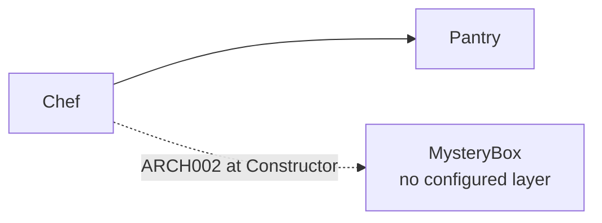
```mermaid
flowchart LR
    Chef --> Pantry
    Chef -. "ARCH002 at Constructor" .-> Mystery["MysteryBox<br/>no configured layer"]
```

```xml
<ArchitecturalLevels requireRecognizedDependencies="Constructor">
  <Layer name="Chef"><Class endsWith="Chef" /></Layer>
  <Layer name="Pantry"><Class endsWith="Pantry" /></Layer>
  <AllowedDependency from="Chef" to="Pantry" />
</ArchitecturalLevels>
```

```csharp
// Chef -> Pantry is recognized and allowed.
public class PizzaChef(IIngredientPantry pantry) { }

// ARCH002 at Constructor: MysteryBox belongs to no configured layer.
public class ExperimentalChef(MysteryBox box) { }
```

For partial adoption, keep the root loose and require recognized dependencies only inside a stricter layer:

```xml
<ArchitecturalLevels>
  <Layer name="LegacyKitchen">
    <Class typeName="LegacyChef" />
  </Layer>

  <Layer name="AuditedKitchen" requireRecognizedDependencies="Constructor">
    <Class typeName="AuditedChef" />
  </Layer>
</ArchitecturalLevels>
```

```csharp
// Valid: LegacyKitchen does not require unknown constructor dependencies yet.
public class LegacyChef(MysteryBox box) { }

// ARCH002: AuditedKitchen requires constructor dependencies to be classified.
public class AuditedChef(MysteryBox box) { }
```

This setting controls whether ARCH002 is produced, not its severity. Use Roslyn's standard `.editorconfig` mechanism to show it as a warning:

```ini
[*.cs]
dotnet_diagnostic.ARCH002.severity = warning
```

### `enableReport` / `reportPath` attributes

When `enableReport="true"` is set on `<ArchitecturalLevels>`, Arse uses `reportPath` as the default output for `arse report`. Fixing the path in configuration keeps CI and local runs writing to the same file, instead of two reports disagreeing with each other from different folders. The path is resolved relative to the config file; for inline `AssemblyMetadata("AnaalIJzerSettings", ...)`, it is resolved relative to the project file. If omitted, Arse defaults to `architectural-violations.md` next to the project. Solution-level reports use the first configured project as the representative settings source; if no `reportPath` is enabled there, Arse writes `architectural-violations.md` next to the solution.

```xml
<ArchitecturalLevels enableReport="true"
                     reportPath="../../docs/architectural-violations.md">
  …
</ArchitecturalLevels>
```

### `enableDocumentation` / `documentationPath` attributes

When `enableDocumentation="true"` is set, Arse uses `documentationPath` as the default output for `arse documentation`. The generated Markdown contains Mermaid dependency diagrams, site-filter labels, allowed and forbidden type-policy summaries with their scopes, and the XML rules with their descriptions in configuration order. Path resolution mirrors `reportPath`; the default is `architecture-documentation.md` next to the project. Generated documentation is only accurate while it is still being generated, which is exactly why the path belongs in configuration rather than in someone's shell history.

```xml
<ArchitecturalLevels enableDocumentation="true"
                     documentationPath="../../docs/architecture-documentation.md"
                     description="Order-processing boundaries and query-surface rules.">
  …
</ArchitecturalLevels>
```

### `description` attributes

Every XML element that participates in the ruleset can carry a `description` attribute: `<ArchitecturalLevels>`, `<Include>`, `<Layer>`, `<Class>`, `<Namespace>`, `<Assembly>`, `<Allowed>`, `<Forbidden>`, `<Exceptions>`, `<Fix>`, `<AllowedDependency>`, `<BlockedDependency>`, `<NameRules>`, `<RequireMatchingNames>`, `<RequireDeclarationNameMatchesType>`, `<VisibilityPolicy>`, `<InheritancePolicy>`, `<ApiSurface>`, `<AllowedLayer>`, `<BlockedLayer>`, `<Type>`, `<NestedType>`, `<Constructor>`, `<Method>`, `<Property>`, `<Field>`, `<Event>`, `<Operator>`, `<Conversion>`, `<Name>`, `<Source>`, `<Target>` and `<Allow>`. Descriptions do not affect diagnostics. They exist so generated documentation can explain why a rule exists while preserving the same order as the XML. It is the cheapest available place to record intent: without it, a future reviewer has to guess why the rule is there, and guesswork usually resolves in favour of deleting it.

```xml
<Layer name="QuerySurface"
       description="Repository-owned fluent query builders that must be projected before leaving repository-owned code.">
  <Class endsWith="Query"
         description="Query objects are transient access points, not application dependencies." />
</Layer>

<AllowedDependency from="Persistence" to="QuerySurface"
                   allowedSites="MethodReturn, New"
                   description="Repositories may create and return query surfaces as fluent access points." />
```

**Example project:** [`Example.DocumentationDemo`](Examples/Documentation/Example.DocumentationDemo)

<details>
<summary>Dependency graph</summary>

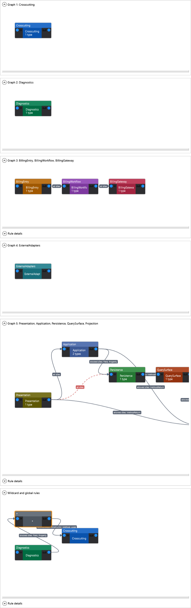

</details>


---

## Diagnostics

The analyzer ships with twenty diagnostic IDs. The three dependency-direction rules (ARCH001/004/005) are split by the reason a dependency is illegal, while ARCH006 and ARCH007 protect the integrity of the configuration itself. Dependency, name-rule, API-surface, and return-value diagnostics expose their syntactic site through the `Site` property where applicable.

| ID      | Meaning                                                      |
|---------|--------------------------------------------------------------|
| ARCH001 | Illegal layer dependency - no `<AllowedDependency>` edge permits this site |
| ARCH002 | Dependency is unrecognized at a required site                |
| ARCH003 | Type violates an applicable `<Allowed>` or `<Forbidden>` policy |
| ARCH004 | Wrong-direction dependency - reverse of a configured edge    |
| ARCH005 | Same-layer dependency                                        |
| ARCH006 | Invalid architecture configuration                           |
| ARCH007 | Cyclic allowed-dependency graph while `enforceAcyclic` is enabled |
| ARCH008 | Name rule violation                                          |
| ARCH009 | Externally visible API exposes a type rejected by its layer policy |
| ARCH010 | Direct project reference violates `ProjectArchitecture`      |
| ARCH011 | Direct package reference violates `ProjectArchitecture`      |
| ARCH012 | Declared accessibility violates a layer visibility policy    |
| ARCH013 | Contract declaration shape violates a layer contract policy  |
| ARCH014 | Allowed API root transitively exposes a type rejected by its layer policy |
| ARCH015 | Layer source declaration is outside an allowed source location |
| ARCH016 | Dependency enters a boundary through a disallowed entry point |
| ARCH017 | Architecture exception metadata, expiry, or stale state requires review |
| ARCH018 | Observed source dependencies form a cycle between configured layers |
| ARCH019 | Declared base type or implemented interfaces violate a layer inheritance policy |
| ARCH020 | A direct returned expression violates a layer return-value policy |

The example projects referenced inline below are self-contained and deliberately broken so Visual Studio, Rider and `dotnet build` show the corresponding `ARCH00X` error. They fail on purpose; the repository is not having a bad day.

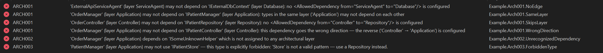

### Why three IDs for layering instead of one?

The original design folded every layering problem under `ARCH001`. The three reasons are independent and call for different remediation:

- **Missing or site-filtered edge (ARCH001)** - most often a real architectural mistake, or a sign the configuration is incomplete. Fix the dependency, add an `<AllowedDependency>` edge, or adjust the edge's `allowedSites` / `blockedSites`.
- **Wrong direction (ARCH004)** - almost always a real architectural mistake. The fix is usually inversion of control (introduce an abstraction in the lower layer), never adding a reverse edge.
- **Same layer (ARCH005)** - sometimes intentional (helper types collaborating within a layer). Many teams want to suppress this category project-wide while keeping ARCH001/004 as errors.

Splitting the IDs makes the three policies independently configurable in `.editorconfig` or `<NoWarn>`, surfaces the reason directly in the IDE error list without parsing the message, and makes the architectural intent of each rule self-documenting. A single shared ID is easier to implement and much harder to triage: "layering error, one of three unrelated causes" is not a useful line to meet in a build log.

### ARCH001 - Illegal layer dependency

Reported when a type in layer A depends on a type in layer B, no `<AllowedDependency from="A" to="B"/>` permits the current dependency site, and the violation is neither a wrong-direction nor a same-layer case (those have their own IDs).

**Example output:**
```
error ARCH001: 'ImpatientCustomer' (layer Customer) may not depend on 'IChef'
  (layer Chef): no <AllowedDependency from="Customer" to="Chef"/> is configured
```

If an edge exists but a site filter excludes the current site, the diagnostic names that instead - the most common surprise on this rule, because the dependency itself is permitted, just not in that shape:

```text
error ARCH001: 'AllowedLocalSiteExample' (layer Caller) may not depend on 'AllowedLocalType'
  (layer AllowedLocalDependency): <AllowedDependency from="Caller" to="AllowedLocalDependency"/> is configured,
  but allowedSites does not include Constructor
```

**Example project:** [`Example.Arch001.SkipsLayer`](Examples/Diagnostics/Example.Arch001.SkipsLayer)

**Rule:** `Customer -> Waiter -> Chef` is allowed; direct `Customer -> Chef` is not.

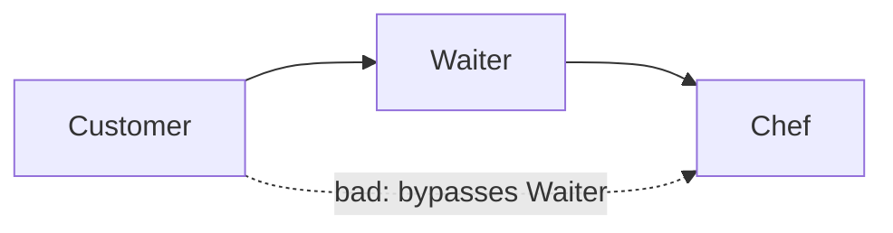
```mermaid
flowchart LR
    Customer --> Waiter --> Chef
    Customer -. "bad: bypasses Waiter" .-> Chef
```

```xml
<AllowedDependency from="Customer" to="Waiter" />
<AllowedDependency from="Waiter" to="Chef" />
<!-- Customer -> Chef: intentionally omitted -->
```

```csharp
// Customer -> Waiter is allowed.
public class HungryCustomer(IWaiter waiter) { }

// ARCH001: Customer -> Chef has no AllowedDependency edge.
// A customer should ask a waiter rather than direct the chef.
public class ImpatientCustomer(IChef chef) { }
```

**Example project:** [`Example.Arch001.NoEdge`](Examples/Diagnostics/Example.Arch001.NoEdge)

**Rule:** `Customer -> Waiter -> Chef` is allowed, but no edge permits `Waiter -> Pantry`.

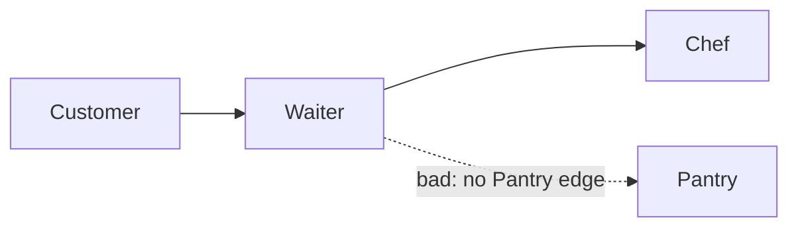
```mermaid
flowchart LR
    Customer --> Waiter --> Chef
    Waiter -. "bad: no Pantry edge" .-> Pantry
```

```xml
<AllowedDependency from="Customer" to="Waiter" />
<AllowedDependency from="Waiter" to="Chef" />
<!-- Waiter -> Pantry: intentionally omitted -->
```

```csharp
// Customer -> Waiter is allowed.
public class HungryCustomer(IWaiter waiter) { }

// Waiter -> Chef is allowed, but Waiter -> Pantry is not.
// The waiter passes the order to the chef rather than entering the pantry.
public class TableWaiter(IChef chef, IIngredientPantry pantry) { }
```

### ARCH002 - Unrecognized dependency

Reported when a layered type uses a dependency that does not belong to any configured layer and root-level or caller-layer `requireRecognizedDependencies` includes the current site.

**Example output:**
```
error ARCH002: 'ExperimentalChef' (layer Chef) depends on 'MysteryBox'
  which is not assigned to any architectural layer
```

#### Choose recognition sites deliberately

`Constructor` is a useful starting point when the goal is to close the injection graph without forcing DTOs and method data into architectural layers. Add other sites only when those references are part of the boundary you want to enforce.

Consider a mapper method on an Application type:

```csharp
// OrderService is in the Application layer.
public class OrderService(IOrderRepository repository)
{
    public OrderDto Map(OrderRecord record, OrderStatus status)
    {
        return new OrderDto { Id = record.Id, Status = status.ToString() };
    }
}
```

With `requireRecognizedDependencies="Constructor"`, only `IOrderRepository` must be classified. With `requireRecognizedDependencies="Constructor, Method, MethodReturn, New"`, `OrderRecord`, `OrderStatus`, and `OrderDto` must also belong to configured layers because they appear at selected sites. Whether that counts as enforcement or as paperwork depends entirely on whether those types are genuinely part of the boundary you are defending.

At the root, the setting is site-scoped for every layered caller. On a layer, it is site-scoped for callers in that layer and its descendants, which is useful when only one area of a legacy codebase is ready to require fully classified dependencies. Recognized dependencies still pass through normal type policies and layer-edge rules.

#### IDE code fixes

When the dependency really does belong to a known role, the IDE can classify it into an existing layer by adding an exact `<Class typeName="..."/>` matcher. When the site was enforced too aggressively, the IDE can also remove the current site from `requireRecognizedDependencies` either globally or for the current caller layer.

### `enforceAcyclic` attribute

Set `enforceAcyclic="true"` to require explicit allowed dependency edges to form an acyclic graph. A cycle reports ARCH007 before code needs to use every permitted direction, on the grounds that a cycle you have merely authorised is still a cycle waiting for a deadline to discover it:

```xml
<ArchitecturalLevels enforceAcyclic="true">
  <AllowedDependency from="Ordering" to="Inventory" />
  <AllowedDependency from="Inventory" to="Billing" />
  <AllowedDependency from="Billing" to="Ordering" />
</ArchitecturalLevels>
```

Wildcard and self-edges are excluded because they do not describe a finite directional chain. An unfiltered matching `<BlockedDependency>` removes blocked directions from cycle evaluation.

**Example project:** [`Example.Arch007.CyclicGraph`](Examples/Diagnostics/Example.Arch007.CyclicGraph)

### ARCH003 - Type policy violation

Reported when a dependency type matches an applicable `<Forbidden>` pattern or does not match an applicable `<Allowed>` list. The two causes read similarly in an error list but mean different things: one type is specifically unwelcome, the other simply never made the guest list. If a `<Fix Rename="…">` is configured on a forbidden pattern, Visual Studio and Rider will offer a one-click rename code-fix. Forbidden-rule matches can also add the type to that rule's `<Exceptions>` block. Allow-list failures use a different fixer: the IDE can add an exact `<Class typeName="..."/>` matcher to every applicable `<Allowed>` list.

**Example output:**
```
error ARCH003: 'ReportingService' (layer Application) may not use 'LegacyOrderStore':
  the type matches a global <Forbidden> rule: Persistence types must use the Repository suffix.
```

### ARCH004 - Wrong-direction dependency

Reported when a type in layer A depends on a type in layer B and `<AllowedDependency from="B" to="A"/>` is configured - i.e. the dependency runs in the reverse direction of a configured edge. It gets its own ID because adding the reverse edge is such an inviting fix and so seldom the correct one.

**Example output:**
```
error ARCH004: 'IngredientPantry' (layer Pantry) may not depend on 'IChef'
  (layer Chef): this is the reverse of the configured 'Chef -> Pantry' edge
```

**Example project:** [`Example.Arch004.WrongDirection`](Examples/Diagnostics/Example.Arch004.WrongDirection)

**Rule:** The allowed edge is `Chef -> Pantry`. Depending in the reverse direction is not allowed.


```mermaid
flowchart LR
    Chef --> Pantry
    Pantry -. "bad: reverses the relationship" .-> Chef
```

```xml
<AllowedDependency from="Chef" to="Pantry" />
<!-- Pantry -> Chef: intentionally omitted -->
```

```csharp
// Chef -> Pantry is allowed.
public class PizzaChef(IIngredientPantry pantry) { }

// ARCH004: Pantry -> Chef reverses the configured direction.
// The pantry supplies the chef; it does not direct the chef.
public class IngredientPantry(IChef chef) { }
```

### ARCH005 - Same-layer dependency

Reported when two types in the same layer depend on each other and no self-edge has been configured for that layer. By default peers within a layer are not allowed to take a hard dependency on each other; this is the safest default because intra-layer fan-out tends to grow unnoticed into a web that no one designed and everyone maintains.

To opt a single layer in to same-layer dependencies, declare an explicit self-edge:

```xml
<AllowedDependency from="Chef" to="Chef" />
```

With that edge in place, `PizzaChef` may depend on `ISauceChef` (both in `Chef`) without ARCH005 firing. Other layers without a self-edge keep the default prohibition.

Self-edges can also be limited to particular [dependency sites](#site-filters). This is useful, but it is not the only way to model an interface and its implementation.

#### Common use cases

**Possible: interface and implementation share one architectural role**

The interface and implementation may live in the same project, namespace, or even file. If both intentionally belong to `DataAbstraction`, allow only inheritance within that layer:

```xml
<Layer name="DataAbstraction">
  <Class endsWith="Repository" />
</Layer>

<AllowedDependency from="DataAbstraction"
                   to="DataAbstraction"
                   allowedSites="InterfaceImplementation" />
```

```csharp
// Allowed: interface implementation is an InterfaceImplementation-site dependency.
public class ExampleRepository : IExampleRepository { }

// ARCH005: Constructor is not allowed by the InterfaceImplementation-only self-edge.
public class ReportingRepository(IExampleRepository repository) { }
```

`ExampleRepository : IExampleRepository` is allowed, while constructor, field, property, and method dependencies between repository peers still report ARCH005. This deliberately permits inheritance within `DataAbstraction`; it does not mean interfaces and implementations must share a layer.

**Alternative: colocated interfaces and implementations have different architectural roles**

For a narrower model, put contracts and implementations in separate architectural layers even when they live in the same project, namespace, or file. Match interfaces first, implementations second, and allow only implementation-to-contract inheritance:

```xml
<Layer name="DataContracts">
  <Class endsWith="Repository" typeKind="Interface" />
</Layer>

<Layer name="DataImplementation">
  <Class endsWith="Repository" typeKind="Class" />
</Layer>

<AllowedDependency from="DataImplementation"
                   to="DataContracts"
                   allowedSites="InterfaceImplementation" />
```

No self-edge is needed: `ExampleRepository -> IExampleRepository` crosses from `DataImplementation` to `DataContracts` at the `InterfaceImplementation` site. Both rules use the same suffix, while `typeKind` distinguishes the contract from its implementation without relying on the `I` naming convention.

**Interfaces must come from a dedicated contracts project**

Use an assembly matcher when the project boundary itself carries architectural meaning:

```xml
<Layer name="DataContracts">
  <Assembly exactName="MyCompany.Data.Abstractions" />
</Layer>

<Layer name="DataImplementation">
  <Class endsWith="Repository" />
</Layer>

<AllowedDependency from="DataImplementation"
                   to="DataContracts"
                   allowedSites="InterfaceImplementation" />
```

An implementation may now implement a contract from `MyCompany.Data.Abstractions`. A locally declared `IExampleRepository` does not match `DataContracts`; it falls into `DataImplementation` through the class matcher and still produces ARCH005 because no self-edge exists. This enforces the separate-project convention without making it a built-in analyzer opinion.

Add other sites to `allowedSites`, or omit the site filter, when the implementation project is also intentionally allowed to consume contract types through constructors, methods, or properties. See [Site filters](#site-filters) and [Assembly matchers](#matcher-types) for the complete options.

None of these structures is built into the analyzer. `InterfaceImplementation` works for implemented interfaces, while `Inheritance` works for base classes and interface-to-interface inheritance. The matchers and edges decide which model applies.

**Example output:**
```
error ARCH005: 'PizzaChef' (layer Chef) may not depend on 'ISauceChef'
  (layer Chef): types in the same layer ('Chef') may not depend on each other
```

**Example projects:** [`Example.Arch005.SameLayer`](Examples/Diagnostics/Example.Arch005.SameLayer), [`Example.SameLayerInheritance`](Examples/Features/Example.SameLayerInheritance), [`Example.CombinedMatchers`](Examples/Features/Example.CombinedMatchers)

**Rule:** By default, types within the same layer may not depend on each other. A layer can opt in to same-layer dependencies by declaring an explicit self-edge: `<AllowedDependency from="X" to="X"/>`.

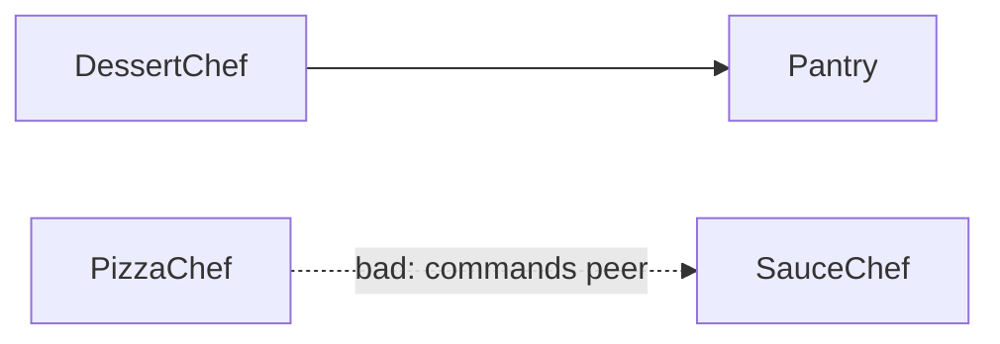
```mermaid
flowchart LR
    DessertChef --> Pantry
    PizzaChef -. "bad: commands peer" .-> SauceChef
```

```xml
<Layer name="Chef">
  <Class endsWith="Chef" />
</Layer>
```

```csharp
// Chef -> Pantry is allowed.
public class DessertChef(IIngredientPantry pantry) { }

// ARCH005: PizzaChef and ISauceChef are both in the Chef layer.
// Chefs may share a pantry, but should not command each other directly.
public class PizzaChef(ISauceChef sauceChef) { }
```

### ARCH006 - Invalid architecture configuration

Reported when settings cannot be evaluated reliably: malformed or schema-invalid XML, missing includes, duplicate layers, invalid or ambiguous matchers, invalid site filters, or dependency rules that reference unknown layers. The analyzer no longer becomes silently inactive when configuration parsing fails, because a misspelled layer name used to produce the same clean build as a flawless codebase - flattering, but not informative.

**Example project:** [`Example.Arch006.UnknownLayer`](Examples/Diagnostics/Example.Arch006.UnknownLayer)

### ARCH007 - Cyclic architecture dependency graph

Reported when `enforceAcyclic="true"` and the explicit allowed dependency graph contains a cycle. The message prints the detected chain, for example `Ordering -> Inventory -> Billing -> Ordering`, so the loop does not have to be reconstructed by hand from three rules written on three different days.

**Example project:** [`Example.Arch007.CyclicGraph`](Examples/Diagnostics/Example.Arch007.CyclicGraph)

### ARCH008 - Name rule violation

Reported when a value movement or declaration inside a layer matches an applicable `<NameRules>` policy, but the compared names do not normalize to the same meaning and no matching `<Allow>` mapping permits that site. Most findings turn out to be a misleading name rather than wrong behaviour, which is precisely the point: the name is what the next reader believes.

Example message:

```text
'OrderService' (layer Application) violates name rule 'RequireMatchingNames' at Property:
source 'animalId' normalizes to 'animal.id', target 'Customer.Id' normalizes to 'customer.id'
```

Declaration/type example:

```text
'PatientEndpoint' (layer AspEndpoints) violates name rule
'RequireDeclarationNameMatchesType' at Method: type 'DoctorId' normalizes to
'doctor.id', declaration name 'patientId' normalizes to 'patient.id'
```

**Examples:** [`Example.NameRules`](Examples/Features/Example.NameRules), [`Example.DeclarationNameMatchesType`](Examples/Features/Example.DeclarationNameMatchesType), and [`Example.HonestTypeEndpointNames`](Examples/Scenarios/Example.HonestTypeEndpointNames).

Typical fixes:

- Pass or assign the value with the matching meaning.
- Rename the local, parameter, field, or property when the code is correct but the name is misleading.
- Add a narrow `<Allow>` mapping when the translation is intentional.
- Scope that mapping with `allowedSites` or `blockedSites` when it should only be valid in one kind of code location.

### ARCH009 - API surface leakage

ARCH009 means an externally visible declaration exposes a type rejected by the owning layer's `<ApiSurface>` policy. It tracks the gap between what your code uses and what your callers can see; callers only ever notice the second one.

```text
'CandyOrderingService' (layer Application) exposes 'LollyQueryable'
(layer RepositoryQuerySurface) at MethodReturn: the API surface policy
in layer 'Application' blocks layer '/RepositoryQuerySurface' at MethodReturn
```

The diagnostic is reported on the exposed type syntax. Its properties include the caller and exposed type/layer, canonical API `Site`, `ApiMemberName`, exact denial reason, and the originating configuration location.

Common fixes are:

- project the internal type to a contract before returning it;
- make the declaration non-public when it is an implementation detail;
- add the exposed type to the intended contract layer;
- deliberately adjust the `<ApiSurface>` policy or its site filter.

#### IDE code fixes

The IDE can add a missing `<AllowedLayer>`, widen an existing `allowedSites` list, relax `blockedSites`, and when the denial comes from `requireRecognizedTypes="true"` it can disable that requirement for the policy.

Adding an `<AllowedDependency>` is not an ARCH009 fix by itself. That edge permits internal use; it does not grant permission to publish the type as API.

**Example project:** [`Example.Arch009.ApiSurfaceLeakage`](Examples/Diagnostics/Example.Arch009.ApiSurfaceLeakage)

## ARCH010: Project Reference Violation

`ARCH010` reports an illegal direct project reference.

This is a project-topology rule, not a type-usage rule.

### Example

```text
Project 'Shop.Web' (project group Presentation) may not reference project 'Shop.Domain' (project group Domain): no AllowedProjectReference permits project group 'Presentation' to reference project group 'Domain'
```

### Typical Causes

- a direct `<ProjectReference />` skips an allowed project group
- a project reference points in the wrong architectural direction
- a blocked project edge is present
- `requireRecognizedProjects="true"` is enabled and one side matches no `ProjectGroup`
- a same-group reference exists without an explicit self-edge while that source group is in allowlist mode

### Typical Fixes

- remove the illegal `<ProjectReference />`
- move the shared abstraction into an allowed project group
- add the missing allowed project edge if the topology is intentional
- classify the unrecognized project with a `ProjectGroup`
- add an explicit self-edge if same-group references are intentionally allowed

### IDE Fix Support

When both project groups are already recognized, the config fixer layer can:

- add the missing `<AllowedProjectReference from="..." to="..." />`
- add an explicit same-group self-edge
- remove the matching blocking `<BlockedProjectReference ... />`

Because `ARCH010` is reported at compilation end, whether that action appears as a normal editor light bulb depends on the host. The edit logic itself is tested in `ProjectArchitectureCodeFixTests.cs`.

### Not The Same As

- `ARCH001`: illegal type dependency in code
- `ARCH004`: wrong-direction type dependency in code
- `ARCH005`: same-layer type dependency in code

`ARCH010` can fire even when no source file currently uses the referenced project. That is intentional: an unused reference is a standing invitation, and someone eventually accepts it.

## ARCH011: Package Reference Violation

`ARCH011` reports an illegal NuGet package reference under `ProjectArchitecture`.

This is a project-topology and dependency-policy rule, not a type-usage rule.

### Example

```text
Project 'Shop.Domain' (project group Domain) may not reference package 'Microsoft.Extensions.Logging' 9.0.0: the package does not match the Allowed package list for project group 'Domain'
```

### Typical Causes

- a project group has an allow-list package policy and the package does not match any allowed matcher
- a package matches a forbidden package matcher
- `requireRecognizedProjects="true"` is enabled and the source project matches no `ProjectGroup`
- a direct package reference is legal but its transitive package is still denied when `includeTransitive="true"` is active

### Typical Fixes

- remove the package reference from the project
- move the dependency to a project group where that package belongs
- widen the allowed package list if the dependency is intentional
- re-scope the forbidden package matcher if it is too broad
- classify the source project with a `ProjectGroup` when recognition is the actual issue

### IDE Fix Support

For the deterministic allow-list case, the config fixer layer can append an exact matcher such as:

```xml
<Package exactName="Microsoft.Extensions.Logging" />
```

That fix is only offered when the current violation is specifically an allowed-list miss. If a forbidden matcher rejected the package, the fixer does not guess by weakening that rule - somebody wrote it deliberately, and undoing it should take at least as much thought.

Because `ARCH011` is reported at compilation end, host UX depends on how the IDE surfaces `Location.None` diagnostics. The edit logic itself is covered by `PackagePolicyCodeFixTests.cs`.

### Not The Same As

- `ARCH003`: forbidden type usage in C# code
- `ARCH010`: illegal direct project reference
- `ARCH001`: illegal type dependency between layers

### ARCH012 - Visibility policy violation

Reported when a source declaration belongs to a layer with an applicable `<VisibilityPolicy>` and its declared accessibility does not pass that policy. Accessibility is quick to widen under time pressure and slow to narrow again once callers have found it.

Example:

```text
'SourLollyQueryable' (layer RepositoryQuerySurface) is declared Public:
the VisibilityPolicy for Type in layer 'RepositoryQuerySurface' allows only Internal, File
```

The diagnostic is reported on an accessibility modifier when one exists, otherwise on the declaration identifier.

Diagnostic properties include:

- `CallerTypeName`
- `CallerLayerName`
- `DeclaredSymbolName`
- `DeclarationTarget`
- `DeclaredAccessibility`
- `ViolationReason`
- the originating rule path, line, and column

Typical fixes:

- reduce the declaration's accessibility;
- narrow or change the policy when the public declaration is intentional;
- move the declaration to a layer whose visibility contract matches its responsibility.

#### IDE code fixes

For configuration-backed fixes, the IDE can add the reported accessibility to `allowedAccessibilities`, remove it from `blockedAccessibilities`, or remove a single-value blocking policy when that is the only thing it does.

**Example project:** [`Example.Arch012.VisibilityPolicy`](Examples/Diagnostics/Example.Arch012.VisibilityPolicy)

### ARCH013 - Contract purity violation

Reported when a source declaration belongs to a layer with an applicable `<ContractPolicy>` and its declaration shape does not pass that policy. A contract that has acquired setters, state, and a method body is an implementation wearing a contract's job title.

Example:

```text
'Name' (layer Contracts) violates contract purity at DisallowedPropertyAccessor:
the ContractPolicy in layer 'Contracts' allows only property accessors Get
```

The diagnostic is reported on the offending member, accessor, body, or type identifier, depending on the failing rule.

Diagnostic properties include:

- `CallerTypeName`
- `CallerLayerName`
- `DeclaredSymbolName`
- `ContractViolationKind`
- `ViolationReason`
- the originating rule path, line, and column

Typical fixes:

- remove the implementation body from the contract member;
- replace mutable setters with `get` / `init`;
- move stateful helpers or concrete implementations out of the contract layer;
- broaden the policy only when that contract shape is intentional.

**Focused example projects:**

- [`Example.Arch013.ContractPurity`](Examples/Diagnostics/Example.Arch013.ContractPurity) - property setters are rejected by `allowedPropertyAccessors="Get"`.
- [`Example.Arch013.ContractPurity.MethodBodyNotAllowed`](Examples/Diagnostics/Example.Arch013.ContractPurity.MethodBodyNotAllowed) - default interface method bodies are rejected by `allowMethodBodies="false"`.

## ARCH014 - Forbidden transitive exposure

ARCH014 reports when an externally visible declaration exposes an allowed root type whose public object graph reaches a type rejected by the owning layer's `<ApiSurface>` policy.

```csharp
public class CandyReceipt
{
    public LollyQueryable RawQuery { get; init; } = new();
}

// ARCH014: CandyOrderingService.OrderRawLolly
//          -> CandyReceipt.RawQuery
//          -> LollyQueryable
public CandyReceipt OrderRawLolly()
{
    return new CandyReceipt();
}
```

The primary location is the root signature, because that declaration publishes the unsafe graph. When the nested member is source-backed, its declaration is included as an additional diagnostic location.

Diagnostic properties include:

- `ApiMemberName` and `ExposureRootMember`;
- `ExposurePath` and `ExposureDepth`;
- `NestedMemberName` and `NestedMemberContainingType`;
- the forbidden type and layer;
- the nested member's canonical `Site`;
- the exact policy reason and configuration origin.

A direct forbidden type reports ARCH009 instead. The two diagnostics are deliberately not duplicated; one complaint per leak is sufficient.

**Example project:** [`Example.Arch014.TransitiveExposure`](Examples/Diagnostics/Example.Arch014.TransitiveExposure)

## ARCH015 - Source-location violation

`ARCH015` means a type matched a layer, but one of its source declarations is not in an allowed owned location for that layer.

Example message:

```text
'CandyOrderingService' belongs to layer 'Ordering/Application' but source file 'Infrastructure/CandyOrderingService.cs' does not match an allowed SourceLocations rule for layer 'Ordering'
```

Typical causes:

- the namespace still matches the intended layer, but the file was moved into the wrong folder;
- a partial type was split across owned and unowned locations;
- a configuration-relative rule points at the wrong base folder;
- an assembly-constrained source rule matches the folder but not the project assembly.

Typical fixes:

- move the file into the owned folder or project;
- tighten or correct the `<SourceLocations>` patterns;
- split mixed-responsibility partial declarations;
- if the layout is intentional, add an explicit `<Source>` rule that documents it.

#### IDE code fix

The IDE can add an exact `<Source exactName="..."/>` matcher for the reported file path to the owning layer's `<SourceLocations>` block. For inline metadata config, the assembly attribute is rewritten in place.

Important: folders do not classify layers by themselves. `ARCH015` only runs after the type has already been matched into a layer by the normal layer matchers. A folder tree is a claim about ownership; this rule is what checks whether the claim is still true.

See [`Example.SourceLocations`](Examples/Features/Example.SourceLocations) for a small build-verified sample.

## ARCH016 - Boundary entry-point violation

`ARCH016` reports when a dependency already passed the normal dependency graph, but still enters a boundary through the wrong child layer or type.

Example message:

```text
'CandyController' (layer Presentation) may not enter boundary 'Ordering' through 'CandyOrderingService' (layer Ordering/Implementation): the boundary permits entry only through Ordering/Contracts
```

Typical causes:

- a controller reaches into an implementation layer instead of a contract layer;
- a facade entry point is allowed only at certain sites, but the dependency appears at a blocked site;
- nested boundaries define progressively narrower external entry doors.

#### IDE code fixes

The IDE can add a missing `<EntryPoint>`, add the current site to an entry point's `allowedSites`, or remove the current site from `blockedSites` when the boundary policy is too narrow for the intended call shape.

Important precedence rule:

- if the dependency is already illegal for the usual reasons, you still get `ARCH001`, `ARCH003`, `ARCH004`, or `ARCH005`;
- `ARCH016` only appears when the dependency graph allowed the dependency first.

In restaurant terms: you are welcome in the building, just not through the kitchen window.

See [`Example.Arch016.BoundaryEntryPoints`](Examples/Diagnostics/Example.Arch016.BoundaryEntryPoints).

## ARCH017 - Architecture exception requires review

`ARCH017` is a warning about the exception itself, not about the original architectural rule.

It appears when an exception matcher:

- is missing required metadata from `<ExceptionPolicy>`;
- has an invalid `expiresOn` date;
- has already expired;
- is close to expiry;
- or, in Arse health inspection, is stale and matches no type in the inspected scope.

Example warning:

```text
Architecture exception for Class 'typeName="LegacyManager"' is missing required owner metadata
```

Typical causes:

1. The config has `<ExceptionPolicy requireOwner="true" />`, but the exception has no `owner`.
2. The exception expired before Sunday, July 26, 2026.
3. The exception was once needed, but the type it named no longer exists.

Important semantics:

- Missing or invalid required metadata makes the exception inactive.
- Expired exceptions are ignored by the matcher engine.
- If an expired exception used to suppress another diagnostic, that original diagnostic can reappear.
- Expiring-soon exceptions still suppress the original diagnostic until their expiry date.

A stale exception naming a type that was deleted two refactors ago protects nothing; it only makes the config longer and the next reader more nervous.

The warning carries these properties:

- `ExceptionMatcherKind`
- `ExceptionMatcherLabel`
- `ExceptionReason`
- `ExceptionOwner`
- `ExceptionExpiresOn`
- `ExceptionStatus`

See also:

- [`../configuration/exception-policy.md`](docs/configuration/exception-policy.md)
- [`../../Examples/Features/Example.ExceptionPolicy/Example.cs`](Examples/Features/Example.ExceptionPolicy/Example.cs)

## ARCH018 - Observed architectural dependency cycle

`ARCH018` reports when the dependencies that currently exist in source code form a cycle between configured layers.

Example message:

```text
Observed architectural dependency cycle: Ordering -> Notifications -> Ordering
```

This is intentionally different from `ARCH007`:

- `ARCH007` says the configuration permits a cycle;
- `ARCH018` says the code is currently using a cycle.

Typical causes:

- two architectural areas have started calling each other directly over time;
- one boundary grew a convenience reverse dependency;
- both directions are allowed, but the current code reality has become circular.

Nobody sets out to design a cycle. A cycle is what is left over after several individually reasonable decisions.

Important behavior:

- `ARCH018` only appears when `enforceObservedAcyclic="true"` is enabled;
- the cycle is built from observed source dependency sites, not from hypothetical allowed edges;
- direct diagnostics such as `ARCH001` and `ARCH004` still report separately;
- `arse inspect --solution` can find cross-project observed cycles that one project build cannot see by itself.

See [`Example.Arch018.ObservedCycle`](Examples/Diagnostics/Example.Arch018.ObservedCycle).

### ARCH019 - Inheritance policy violation

Reported when a source declaration belongs to a layer with an applicable `<InheritancePolicy>` and its declared base-type or interface contract does not pass that policy.

Example:

```text
'SyrupEntity' (layer PersistenceEntities) violates inheritance policy at MissingRequiredBaseType:
the InheritancePolicy in layer 'PersistenceEntities' requires one of base types Entity
```

The diagnostic is reported on the declaration identifier. The type is not wrong where it is used; it is wrong where it is declared, so that is where the squiggle goes.

Diagnostic properties include:

- `CallerTypeName`
- `CallerLayerName`
- `DeclaredSymbolName`
- `InheritanceViolationKind`
- `ViolationReason`
- the originating rule path, line, and column

Typical fixes:

- inherit the required base type;
- implement the missing interface contract;
- move the declaration out of the layer if it is not meant to follow that shared inheritance rule;
- narrow or broaden the policy only when the declaration is intentionally outside the current contract.

**Example project:** [`Example.Arch019.InheritancePolicy`](Examples/Diagnostics/Example.Arch019.InheritancePolicy)

### ARCH020 - Return-value policy violation

Reported when a method belongs to a layer with an applicable `<ReturnValuePolicy>` and returns a configured forbidden expression unchanged.

Example:

```text
'PrepareMysteryPizza' (layer Kitchen) violates return-value policy at MethodReturn:
the ReturnValuePolicy in layer 'Kitchen' blocks returned literal value="null"
```

The diagnostic is reported on the return expression. It can cover `null`, an empty string, a numeric or enum sentinel, a specific member access, object creation, or a direct call selected by semantic matcher attributes.

Diagnostic properties include:

- `CallerTypeName`
- `CallerLayerName`
- `DeclaredSymbolName`
- `Site` (`MethodReturn`)
- `ReturnValueRuleTarget`
- `ReturnValueRule`
- `ViolationReason`
- the originating rule path, line, and column

Typical fixes:

- return a meaningful value rather than the configured sentinel;
- turn an optional lookup into an explicit fallback or error result before returning it;
- move the method outside the layer only when that layer policy does not apply to it;
- narrow the policy only when that direct return is intentionally allowed.

There is no automatic code fix. The policy tells AnaalIJzer what must not escape the method; it cannot know which domain-specific value, result type, fallback, or exception behavior is correct. The analyzer recognises a sentinel; it has no opinion about what your domain should say instead.

**Focused examples:** [`Example.Arch020.ExplicitNullReturn`](Examples/Diagnostics/Example.Arch020.ExplicitNullReturn), [`Example.Arch020.AnnotatedInvocationReturn`](Examples/Diagnostics/Example.Arch020.AnnotatedInvocationReturn), and [`Example.Arch020.ConfiguredLiteralReturns`](Examples/Diagnostics/Example.Arch020.ConfiguredLiteralReturns).

### Diagnostic properties

Every dependency diagnostic (ARCH001, ARCH004, ARCH005), name-rule diagnostic (ARCH008), and API-surface diagnostic (ARCH009 and ARCH014) carries a `Site` property in `Diagnostic.Properties` indicating where the issue was found. This lets code-fix providers, custom reporters and CI dashboards filter or group by dependency style without re-parsing the source - which beats a dashboard built on regexes over diagnostic messages that breaks the day the wording improves.

ARCH012 describes declarations rather than dependency sites. It exposes `DeclarationTarget`, `DeclaredAccessibility`, and `DeclaredSymbolName` alongside the caller layer and rule-origin properties.

ARCH019 also describes declarations rather than dependency sites. It exposes `DeclaredSymbolName` and `InheritanceViolationKind` alongside the caller layer and rule-origin properties.

ARCH020 exposes `Site` as `MethodReturn`, together with `DeclaredSymbolName`, `ReturnValueRuleTarget`, and `ReturnValueRule` so reports can distinguish a forbidden literal from an invocation or member-access matcher.

ARCH009 additionally exposes `ApiMemberName`, identifying the externally visible declaration that published the dependency type.

ARCH014 adds `ExposureRootMember`, `ExposurePath`, `ExposureDepth`, `NestedMemberName`, and `NestedMemberContainingType`. Its `Site` identifies the nested public member that exposed the forbidden type rather than the root signature site.

| `Site` value        | Where the dependency was introduced                                        |
|---------------------|----------------------------------------------------------------------------|
| `Constructor`       | Constructor parameter (including primary constructors)                      |
| `Method`            | Non-constructor method parameter                                            |
| `MethodReturn`      | Non-constructor method return type                                          |
| `Field`             | Field declaration                                                           |
| `Property`          | Property declaration                                                        |
| `Local`             | Local variable declaration                                                  |
| `New`               | `new T(...)` or target-typed `new()` expression                             |
| `GenericArgument`   | Generic type argument of an outer type (`Lazy<T>`, `IEnumerable<T>`, …)     |
| `GenericInvocation` | Generic method invocation (service-locator style: `services.GetService<T>()`) |
| `Inheritance`       | Base class inheritance or interface-to-interface inheritance                 |
| `InterfaceImplementation` | Class, record, or struct implements an interface                       |
| `Attribute`         | Attribute used on a type or one of its members                              |
| `StaticMember`      | Static method, property, field, event, or reduced extension-method access   |

**Example project:** [`Example.Arch001.NonConstructorInjection`](Examples/Diagnostics/Example.Arch001.NonConstructorInjection)

**Rule:** Dependencies introduced outside the constructor are still dependencies. Fields, properties, method signatures, local variables, inheritance, interface implementation, attributes, static member access, `new` expressions and generic service-locator invocations are all checked against the configured layer edges. Classes, records, structs, and interfaces can all act as callers.

**Type-kind example:** [`Example.NonClassCallers`](Examples/Features/Example.NonClassCallers)

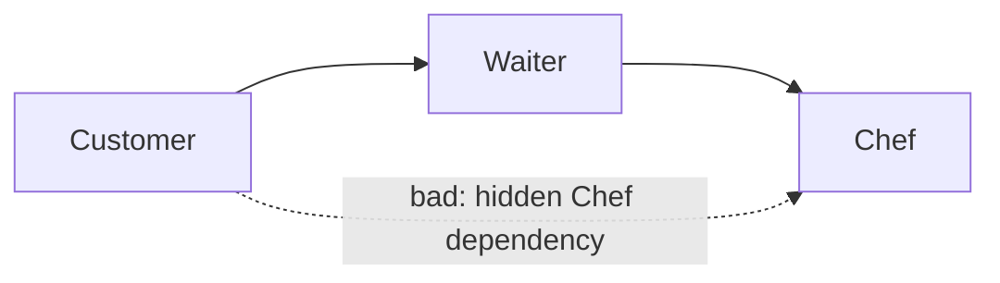
```mermaid
flowchart LR
    Customer --> Waiter --> Chef
    Customer -. "bad: hidden Chef dependency" .-> Chef
```

```xml
<AllowedDependency from="Customer" to="Waiter" />
<AllowedDependency from="Waiter" to="Chef" />
<!-- Customer -> Chef: intentionally omitted -->
```

```csharp
// ARCH001: field dependency
public class FieldDependencyCustomer
{
    private readonly IChef _chef = null!;
}

// ARCH001: property dependency
public class PropertyDependencyCustomer
{
    public IChef Chef { get; set; } = null!;
}

// ARCH001: method parameter
public class MethodDependencyCustomer
{
    public void OrderFrom(IChef chef) { }
}

// ARCH001: method return type
public class MethodReturnCustomer
{
    public IChef FindChef() => null!;
}

// ARCH001: creating a Chef directly
public class NewingCustomer
{
    public void Run() => _ = new DirectChef();
}

// ARCH001: a hidden lookup still bypasses the Waiter.
public class ServiceLocatorCustomer
{
    public void Run(IServiceProvider services)
        => _ = services.GetRequiredService<IChef>();
}
```

---

## Q/A

### Why are `Task` or `Nullable` blocked?

If you see a message like this:

```text
'ISsoManager' (layer Application/Contracts) may not depend on 'Task' (layer Crosscutting):
no allowed dependency gate from 'Application/Contracts' to 'Crosscutting' is configured in boundary 'Application'
```

then `Task` or `Nullable` has been classified into one of your configured layers. The analyzer does not treat framework types as forbidden by default; it has no particular opinion about `Task`. Something in the configuration adopted it into a layer, and the rules simply did as they were told. Once a matcher puts `Task`, `Nullable`, or another framework type in `Crosscutting`, normal layer and nested-boundary rules apply to it.

The cleanest fix is usually: do not classify framework types into application architecture layers unless you really mean to. Keep `Crosscutting` scoped to your own code:

```xml
<Layer name="Crosscutting">
  <Assembly exactName="MyCompany.Shared" />
  <Namespace startsWith="MyCompany.Shared" />
</Layer>
```

If an existing matcher is broad enough to catch `System.Threading.Tasks.Task`, `System.Nullable<T>`, or other platform types, narrow that matcher first. Use `<Exceptions>` only as a migration aid when narrowing the matcher is not immediately practical.

If you intentionally model framework or shared primitives as a layer, make that intention explicit. A separate `Framework` layer often reads better than mixing platform types into business crosscutting concerns:

```xml
<Layer name="Framework">
  <Class typeName="Task" />
  <Class typeName="Nullable" />
  <Class typeName="CancellationToken" />
</Layer>

<AllowedDependency from="*" to="Framework" appliesToDescendants="true" />
```

With nested layers, a top-level wildcard without `appliesToDescendants` is not enough. A type in `Application/Contracts` must also pass the `Application` boundary gate. Use `appliesToDescendants="true"` when the whitelist should be global-ish:

```xml
<AllowedDependency from="*" to="Crosscutting" appliesToDescendants="true" />
```

For stricter business boundaries, keep the edge local to the parent boundary instead:

```xml
<AllowedDependency from="*" to="Crosscutting" />

<Layer name="Application">
  <Layer name="Contracts">
    <Class endsWith="Manager" typeKind="Interface" />
  </Layer>

  <AllowedDependency from="Contracts" to="/Crosscutting" />
</Layer>
```

Use a site filter if the framework type should only appear in API shapes:

```xml
<AllowedDependency from="Contracts"
                   to="/Crosscutting"
                   allowedSites="MethodReturn, Property" />
```

If the diagnostic is ARCH001, the problem is a missing layer relationship. If the diagnostic is ARCH003, the type matched `<Forbidden>` or failed `<Allowed>`; fix the type policy instead.

---

## Suppressing a violation

If you have a justified exception to the rule, suppress it with a standard `#pragma` using the specific ID for the reason you want to allow (`ARCH001`, `ARCH004` or `ARCH005`):

```csharp
#pragma warning disable ARCH001 // justified: bootstrapping cross-cutting concern
public class DiagnosticsController(IHealthRepository health) : ControllerBase { }
#pragma warning restore ARCH001
```

Or use a `[SuppressMessage]` attribute on the class:

```csharp
[System.Diagnostics.CodeAnalysis.SuppressMessage(
    "Architecture", "ARCH001",
    Justification = "Bootstrapping concern that intentionally crosses layers")]
public class DiagnosticsController(IHealthRepository health) : ControllerBase { }
```

To silence one *category* across an entire project without touching individual files, add the ID to `<NoWarn>` in the `.csproj` - for example `<NoWarn>$(NoWarn);ARCH005</NoWarn>` to allow same-layer dependencies while keeping ARCH001 and ARCH004 as errors.

Write the justification either way. A suppression with a reason is a documented decision; a bare `#pragma` is a puzzle left for whoever opens the file next year.

---

## Violation report

In addition to inline diagnostics, Arse can write a Markdown summary of every violation it finds. Enable a default path by setting `enableReport="true"` on the `<ArchitecturalLevels>` root and optionally `reportPath`, or pass `--output` directly:

```xml
<ArchitecturalLevels enableReport="true"
                     reportPath="../../docs/architectural-violations.md">
  …
</ArchitecturalLevels>
```

```cmd
arse report --project src\MyApp\MyApp.csproj --force
arse report --solution src\MyApp.slnx --output docs\architectural-violations.md --force
```

The violation report groups code dependency and name-rule violations by diagnostic ID (ARCH001/002/003/004/005/008) and, for ARCH002, includes a **Suggested Configuration** block with `<Layer>` and `<AllowedDependency>` snippets that would resolve the unrecognized dependencies it found. Use `--project` for one assembly or `--solution` when the architecture is enforced across multiple projects. Configuration findings and cycles belong in the `inspect` health report.

- **CI dashboards** - commit the report as a build artifact and diff it across runs to track architectural drift.
- **Onboarding** - point new contributors at a single file that summarizes the project's layering health.
- **Bootstrapping** - start with `requireRecognizedDependencies="Constructor"` and `enableReport="true"` on a legacy codebase, copy the suggested `<Layer>` snippets into the config, then add more sites deliberately.

The report is written by `RonSijm.AnaalIJzer.Reporting.ArchitecturalViolationReporter`. Arse runs the analyzer in-process with Roslyn, converts the resulting diagnostics into report rows, and writes the file explicitly. Normal analyzer builds do not perform filesystem I/O, because an analyzer that writes files during a parallel build is a support ticket waiting to be filed.

### Example report

This repository ships a [rendered example report](Examples/Documentation/Generated/architectural-violations.md) generated from the [`Examples/Documentation/Example.ReportDemo`](Examples/Documentation/Example.ReportDemo) project, which intentionally contains one violation of each diagnostic ID. To regenerate it from the repo root:

```cmd
dotnet run --project src\Tools\RonSijm.AnaalIJzer.Arse -- report --project Examples\Documentation\Example.ReportDemo\Example.ReportDemo.csproj --force
```

**In your own codebase**, install the tool and run `arse report --project path\to\Project.csproj` or `arse report --solution path\to\Solution.slnx`. Pass `--output` to override the default path, and `--force` to overwrite an existing file.

---

## Architecture health

An application can obey every configured edge while its architecture settings quietly drift. `arse inspect` checks both the settings and, when given a project or solution, the code evidence behind them:

```cmd
arse inspect --project src\MyApp\MyApp.csproj --output docs\architecture-health.md --force
arse inspect --solution src\MyApp.slnx --output docs\architecture-health.md --force
arse inspect --config Architecture.anl --force
```

Project validation identifies unclassified and ambiguously classified types, matchers that resolve no current types, stale exceptions, unused allowed edges, configured and observed dependency cycles, and current analyzer violations. Unused edges and dead matchers are the configuration equivalent of unreachable code: harmless until somebody reads them as a statement of intent. Solution validation runs the same checks for every C# project and writes one combined report. XML-only validation checks configuration validity and configured cycles without loading MSBuild.

**Example project:** [`Example.ArchitectureHealth`](Examples/Features/Example.ArchitectureHealth)

---

## Architecture documentation

For configurations that grow large - many layers, wildcard edges, site filters, includes and type policies - a single graph is not always enough. Arse can render Markdown documentation that combines [Mermaid](https://mermaid.js.org/) dependency diagrams with layer descriptions, edge descriptions, scoped allow/block type-policy summaries and the rules in the same order as the XML. Enable a default path by setting `enableDocumentation="true"` on the `<ArchitecturalLevels>` root and optionally `documentationPath`, or pass `--output` directly:

```xml
<ArchitecturalLevels enableDocumentation="true"
                     documentationPath="../../docs/architecture-documentation.md"
                     description="Order-processing boundaries and query-surface rules.">
  …
</ArchitecturalLevels>
```

The output is a single Markdown file. If the dependency graph contains unrelated chains, each connected chain gets its own section and Mermaid diagram before wildcard rules are shown. Nested layers are rendered as Mermaid subgraphs with canonical paths in the accompanying tables. For example, an order-processing chain and a billing chain are documented separately instead of being forced into one confusing graph.

XML-only documentation remains the lightweight default and does not load or compile an application:

```cmd
arse documentation --config Architecture.anl --include-input
```

For a project-backed document, add `--include-code-evidence`:

```cmd
arse documentation --project MyApplication.csproj --include-code-evidence --include-input
```

The optional code-evidence section evaluates the rules against the current Roslyn compilation. It lists the effective project types resolved through each top-level `<Class>` and `<Namespace>` matcher, concrete caller/dependency/site usages permitted by every `<AllowedDependency>`, types that remain unclassified, and current analyzer violations with diagnostic ID, dependency site, caller, dependency and source location. Matching is attributed through the analyzer's actual rule resolution, so document order, semantic matchers and nested exceptions are respected.

`--include-input` is independent of code evidence. It appends an **Input Configuration** section containing the root XML and a short note identifying it as the source for the document. With project input, `Architecture.anl` is included when present; otherwise the evaluated `AssemblyMetadata("AnaalIJzerSettings", ...)` XML is included. Without this flag, documentation output remains unchanged.

Edges with `allowedSites`, `blockedSites`, or `appliesToDescendants` are rendered with Mermaid edge labels and a table row. The table identifies the boundary gate that owns each rule, so nested egress, ingress, and cascading rules remain distinguishable even when they resolve to the same canonical endpoints. That makes allow lists, block lists, and descendant-cascading rules visible in both the picture and the text.

Descriptions are especially useful for repository query surfaces. You might allow a repository to return a transient `OrderQuery` so callers can immediately project it:

```xml
<AllowedDependency from="Persistence" to="QuerySurface"
                   allowedSites="MethodReturn, New"
                   description="Repositories may create and return query surfaces as fluent access points." />
<AllowedDependency from="QuerySurface" to="Projection"
                   allowedSites="MethodReturn, New"
                   description="Query surfaces may create projections and return only those projected objects." />
```

That documents the intent clearly: the repository owns the query surface, while outside layers should receive a projected DTO rather than keeping a queryable object around where extra application logic can creep in. A diagram on its own shows which arrows exist; only the descriptions record why anyone drew them.

The documentation is written by `RonSijm.AnaalIJzer.Reporting.ArchitectureDocumentationGenerator`. Arse's `report` and `documentation` commands are independent - run either, both, or neither.

### Example documentation

This repository ships a [rendered documentation example](Examples/Documentation/Generated/architecture-documentation.md) generated from [`Examples/Documentation/Example.DocumentationDemo`](Examples/Documentation/Example.DocumentationDemo), which contains a deliberately busy XML settings file with descriptions on each rule node. To regenerate it from the repo root:

```cmd
Examples\Documentation\Example.DocumentationDemo\GenerateDocumentation.bat
```

The [example batch file](Examples/Documentation/Example.DocumentationDemo/GenerateDocumentation.bat) invokes Arse with `--config` and targets that example's `Architecture.anl` directly. **In your own project**, install the tool and run either `arse documentation --project path\to\Project.csproj --include-code-evidence --include-input` or `arse documentation --config path\to\Architecture.anl --include-input`. Pass `--output` to override `documentationPath`, and `--force` to overwrite an existing file.

Documentation coverage is guarded by [`ToolRunner_GeneratesDocumentationForSupportedConfigurationFeatures`](src/Tests/RonSijm.AnaalIJzer.IntegrationTests/ExampleApplicationIntegrationTests.cs), which runs the real `arse documentation --config` path against a feature-matrix XML containing nested layers, descriptions, type policies, exceptions, rename fixes, site filters, wildcard rules and input inclusion.

---

## No config source = no diagnostics

If no `Architecture.anl` additional file or `AssemblyMetadata("AnaalIJzerSettings", ...)` value is present, the analyzer is completely silent. This makes the analyzer **opt-in per project**: you can reference it in a shared analyzer package and only activate it in the projects that supply config. Adoption then happens one project at a time, which is the only pace at which adoption tends to happen at all.

---

## "I still don't understand"

To get started, it's probably easiest to just download this entire repo, and look at the example projects. They are small, self-contained, and clearly labelled where they are meant to break.

---

## Design note: why generated files live in the tools

The analyzer reports `ARCH00X` diagnostics and deliberately does not write files during compilation. Roslyn analyzers run in IDEs, build servers and design-time builds, so keeping them free of filesystem side effects avoids surprising writes and keeps them closer to Roslyn's analyzer guidance.

The shared tooling engine is the explicit generation host used by both Arse modes. It can load a project with `MSBuildWorkspace` or read an XML settings file directly for documentation. For project-backed operations it reads the same `Architecture.anl` / `AssemblyMetadata("AnaalIJzerSettings", ...)` config as the analyzer and runs the analyzer in-process when a violation report is needed:

- `generate-config` inspects a project and writes a validated baseline configuration.
- `export-config` persists compiled inline `AnaalIJzerSettings` XML.
- `documentation` renders dependency diagrams and rule descriptions with `ArchitectureDocumentationGenerator`.
- `report` runs the analyzer and renders diagnostics with `ArchitecturalViolationReporter`.
- `merge-config` flattens XML files and transitive includes into one configuration.
- `split-config` extracts disconnected dependency graphs into an include-based configuration.

That keeps normal builds focused on diagnostics while still making reports and documentation easy to regenerate in CI or before committing documentation updates. The split is deliberate: compiling a repository should not modify it.
