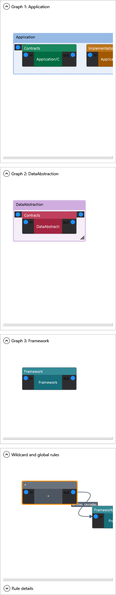

### `<AllowedDependency>`

Declares that types in layer `from` are permitted to depend on types in layer `to`. Any dependency not covered by an explicit edge (or the special `*` wildcard) is a layering violation - see [ARCH001/ARCH004/ARCH005](#diagnostics) for how the three reasons are distinguished.

```xml
<AllowedDependency from="Presentation" to="Application" />
<AllowedDependency from="Application" to="Persistence" />
```

Use `from="*"` to allow a layer to be depended on from any other layer (useful for cross-cutting concerns):

```xml
<Layer name="Crosscutting">
  <Class typeName="IIdentityContext" />
</Layer>

<AllowedDependency from="*" to="Crosscutting" />
```

With nested layers, a root wildcard still respects inner boundary gates by default. Add `appliesToDescendants="true"` when the edge is intentionally ambient, such as framework primitives or a crosscutting abstraction that every nested boundary may use:

```xml
<Layer name="Framework">
  <Class typeName="Task" />
  <Class typeName="Nullable" />
  <Class typeName="CancellationToken" />
</Layer>

<AllowedDependency from="*" to="Framework" appliesToDescendants="true" />
```

**Example project:** [`Example.CascadingDependencyRules`](../../Examples/Features/Example.CascadingDependencyRules)

<details>
<summary>Dependency graph</summary>



</details>


Use `to="*"` for the symmetric case - a single layer that is allowed to depend on every other configured layer. Typical example: a diagnostics / health-check layer that needs to read state from every part of the system:

```xml
<Layer name="Diagnostics">
  <Class endsWith="Diagnostics" />
</Layer>

<AllowedDependency from="Diagnostics" to="*" />
```

`from="*" to="*"` is also accepted and means "every configured layer may depend on every other configured layer". Nested boundary gates still require local rules unless the edge sets `appliesToDescendants="true"`. `<Forbidden>` types are still rejected, and unknown types at sites required by root-level or caller-layer `requireRecognizedDependencies` still report ARCH002 - the wildcard only relaxes the directed-edge requirement.
