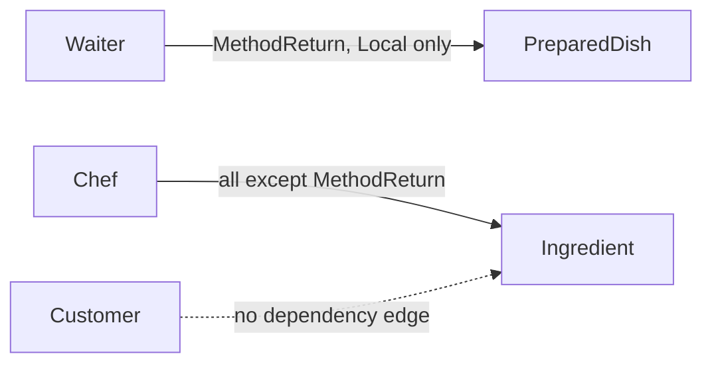
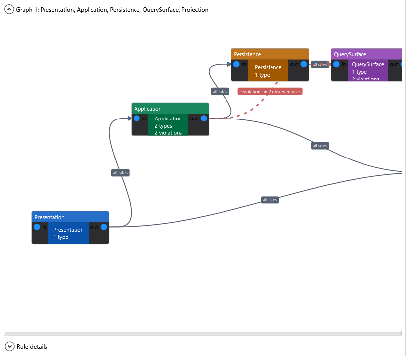
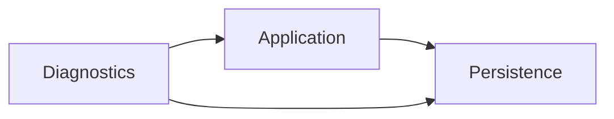

### `<BlockedDependency>`

Explicitly denies an edge even when a broader wildcard allowance would otherwise permit it. Blocked rules take precedence over every matching `<AllowedDependency>`.

```xml
<AllowedDependency from="*" to="Persistence" />
<BlockedDependency from="Presentation" to="Persistence"
                   description="Presentation types must go through Application services." />
```

Both dependency elements support `appliesToDescendants` and the same site filters. On a blocked rule, `appliesToDescendants="true"` cascades the denial into descendant boundary gates, and the filter scopes where the block applies:

```xml
<BlockedDependency from="Application" to="QuerySurface"
                   allowedSites="Field, Property, MethodReturn" />
```

**Example project:** [`Example.BlockedDependency`](../../Examples/Features/Example.BlockedDependency)


#### Site filters

By default, a dependency rule applies to every dependency site. Add `allowedSites` to scope it to specific sites, or `blockedSites` to apply it everywhere except the listed sites:

```xml
<AllowedDependency from="Waiter" to="PreparedDish" allowedSites="MethodReturn, Local" />
<AllowedDependency from="Chef" to="Ingredient" blockedSites="MethodReturn" />
```

The attributes are mutually exclusive. Site names are comma-separated, trimmed, and case-insensitive. Unknown site names or a rule that declares both attributes report ARCH006 and are ignored fail-closed.

Site filters also apply to wildcard edges such as `from="*"` and `to="*"`.

Arrows still mean "may depend on"; the edge label narrows where that dependency may appear. Here a Waiter may briefly hold or return a `PreparedDish`, while a Chef may use an `Ingredient` everywhere except as a method return type. That prevents a Chef API from handing raw ingredients to callers without forbidding ingredients inside the kitchen.



| Site | What it means | Example shape |
|------|---------------|---------------|
| `Constructor` | Constructor parameter, including primary constructors | `public Caller(DependencyType dependency) { }` |
| `Method` | Non-constructor method parameter | `public void Run(DependencyType dependency) { }` |
| `MethodReturn` | Non-constructor method return type | `public DependencyType Get() => ...;` |
| `Field` | Field declaration | `private readonly DependencyType _dependency;` |
| `Property` | Property declaration | `public DependencyType Dependency { get; set; }` |
| `Local` | Local variable declaration | `DependencyType dependency = ...;` |
| `New` | Object creation expression | `new DependencyType()` or target-typed `new()` |
| `GenericInvocation` | Generic method invocation type argument | `services.GetRequiredService<DependencyType>()` |
| `GenericArgument` | Generic type argument inside another referenced type | `Lazy<DependencyType>` or `IEnumerable<DependencyType>` |
| `Inheritance` | Base class inheritance, or interface-to-interface inheritance | `class Caller : DependencyBase` |
| `InterfaceImplementation` | Class, record, or struct implements an interface | `class Caller : IDependency` |
| `Attribute` | Attribute applied within a layered type | `[DependencyMarker] class Caller` |
| `StaticMember` | Static method, property, field, or event access | `DependencyType.Load()` |

`GenericArgument` is reported for the inner type rather than the outer wrapper. For example, `Lazy<DependencyType>` in a constructor is reported as `Site=GenericArgument`, because the architectural dependency is `DependencyType`, not `Lazy<T>`.

**Example project:** [`Example.AllowedSites`](../../Examples/Features/Example.AllowedSites)


#### Repository query surfaces

Site filters are useful when one layer owns a type that other layers may touch only as a short-lived access point. A repository query surface is a good example: `OrderRepository` may create and return `OrderQuery`, and `OrderQuery` may project itself to `OrderProjection`, but the Application layer should not expose `OrderQuery` in its own API or keep it around for application logic.

```xml
<ArchitecturalLevels>
  <Layer name="Application"><Class endsWith="Service" /></Layer>
  <Layer name="Persistence"><Class endsWith="Repository" /></Layer>
  <Layer name="QuerySurface"><Class endsWith="Query" /></Layer>
  <Layer name="Projection"><Class endsWith="Projection" /></Layer>

  <AllowedDependency from="Application" to="Persistence" />
  <AllowedDependency from="Application" to="Projection" />
  <AllowedDependency from="Persistence" to="QuerySurface" allowedSites="MethodReturn, New" />
  <AllowedDependency from="QuerySurface" to="Projection" />
</ArchitecturalLevels>
```

```csharp
// The service never names OrderQuery; it immediately projects the repository-owned chain.
public OrderProjection GetOrder()
    => repository.QueryOrders().ForCurrentCustomer().Project();

// ARCH001, Site=Local: application logic now retains a raw query surface.
public OrderProjection GetOrderThroughLocalQuery()
{
    OrderQuery query = repository.QueryOrders();
    return query.Project();
}

// ARCH001, Site=MethodReturn: the raw query surface leaks outside the service API.
public OrderQuery LeakQuery() => repository.QueryOrders();
```

The point is not that `OrderQuery` is forbidden everywhere. Persistence owns it, and the query surface can expose projection methods. The rule is that higher layers should carry projected objects, such as `OrderProjection`, instead of carrying persistence internals across method boundaries.

**Example project:** [`Example.RepositoryQuerySurface`](../../Examples/Scenarios/Example.RepositoryQuerySurface)

<details>
<summary>Dependency graph</summary>



</details>


**Example project:** [`Example.WildcardTo`](../../Examples/Features/Example.WildcardTo)


**Rule:** `<AllowedDependency from="Diagnostics" to="*" />` lets the `Diagnostics` layer depend on every other configured layer without listing each edge explicitly. The project builds clean - it demonstrates the *absence* of diagnostics that would otherwise fire.



```xml
<AllowedDependency from="Application" to="Persistence" />
<AllowedDependency from="Diagnostics"  to="*" />
```

```csharp
// Diagnostics -> Application and Diagnostics -> Persistence are allowed by to="*".
public class ArchitectureDiagnostics(IOrderService service, IOrderRepository repository) { }
```
