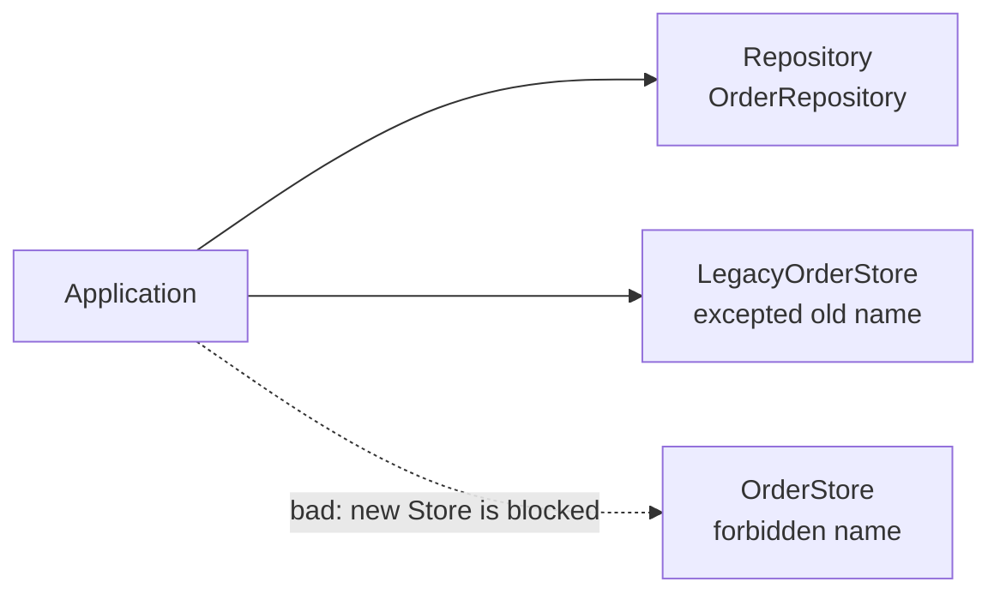

### `<Exceptions>`

Every `<Class>` and `<Namespace>` matcher (including matchers inside `<Layer>`, `<Allowed>` and `<Forbidden>`) accepts a nested `<Exceptions>` block listing types that should be exempt from the rule. Exceptions support the full matcher attribute set documented in [Matcher types](#matcher-types) above, including conjunctive matcher attributes, `typeKind`, semantic matchers (`inherits`, `implements`, `withAttribute`, `withAccessModifier`), and `regex`.

When a dependency matches a rule **and** matches any of that rule's exceptions, the rule is skipped and evaluation continues with the next rule in document order. The rename code-fix is also suppressed for excepted types — if a type is allowed, the IDE will not nag with a rename suggestion.

```xml
<Forbidden>
  <Class endsWith="Store" comment="Persistence types must use the Repository suffix.">
    <Fix Rename="Repository" />
    <Exceptions>
      <!-- Pre-existing offenders grandfathered into the baseline. -->
      <Class startsWith="Legacy" />
      <Class typeName="ThirdPartyOrderStore" />
    </Exceptions>
  </Class>
</Forbidden>

<Layer name="Repository">
  <Class endsWith="Repository">
    <Exceptions>
      <!-- Test double, not a real Repository. -->
      <Class typeName="InMemoryFakeOrderRepository" />
    </Exceptions>
  </Class>
</Layer>
```

The intent is the **ratchet pattern**: lock in current violations as a baseline so the rule blocks *new* offenders without forcing a flag-day rewrite. (Unlike you - ) this mechanism is **deliberately** dumb — it does not track when an exception was added, expire it, or report on it.

**Example project:** [`Example.Exceptions`](../../Examples/Features/Example.Exceptions)

**Rule:** `<Exceptions>` grandfathers pre-existing offenders into the baseline. The exception in `<Forbidden>` exempts every type starting with `Legacy`; the exception inside `<Layer name="Repository">` exempts `InMemoryFakeOrderRepository` by exact name.



```xml
<Forbidden>
  <Class endsWith="Store" comment="Persistence types must use the Repository suffix.">
    <Fix Rename="Repository" />
    <Exceptions>
      <Class startsWith="Legacy" />
    </Exceptions>
  </Class>
</Forbidden>

<Layer name="Repository">
  <Class endsWith="Repository">
    <Exceptions>
      <Class typeName="InMemoryFakeOrderRepository" />
    </Exceptions>
  </Class>
</Layer>
```

```csharp
// Legacy Store is exempted by <Class startsWith="Legacy">.
public class LegacyOrderStore { }
public class OrderHistoryManager(LegacyOrderStore store) { }

// ARCH003: OrderStore still triggers the rule; the carve-out is scoped.
public class OrderStore { }
public class OrderManager(OrderStore store) { }
```

#### When to reach for `<Exceptions>`

- **Legacy migration / introducing the analyzer to an existing codebase.** Turn the analyzer on with complete rules from day one and add every current offender to `<Exceptions>` (the IDE code-fix does this in one keystroke). The build stays green, but every *new* violation now fails CI. Burn the list down at whatever pace fits the team - there is no migration milestone you have to hit.
- **Intentional architectural carve-outs.** One diagnostics or bootstrap module legitimately needs to see a type the rest of the codebase shouldn't. Excepting it scoped to *that one type* keeps the rule active everywhere else.
- **Third-party / vendor types** you can't rename, generated code, framework conventions, test doubles (`InMemoryFakeOrderRepository` looks like a Repository but isn't one), and any other case where the type name happens to match a pattern it doesn't semantically belong to.

#### Why `<Exceptions>` and not something like `<Baseline>`?

`<Baseline>` would presuppose the *reason* ("this is legacy debt we're grandfathering in") and invite feature creep — baseline freshness warnings, expiry dates, "ratchet down" reports, and so on. In practice exceptions get added for several different reasons (the list above), and a config file is the wrong place to assert intent. `<Exceptions>` is neutral about *why* something is excepted and leaves the policy ("when do we shrink this list?") to the team. Use an XML comment next to the entry if you want to record the reason.

#### Code fix

When the config comes from an `Architecture.anl` additional file, ARCH001/ARCH003/ARCH004/ARCH005 diagnostics register an **"Add '`TypeName`' to exceptions"** code action that appends the offending type to the originating rule's `<Exceptions>` block (creating the block if needed). Existing comments and most whitespace in the XML are preserved. Inline `AssemblyMetadata("AnaalIJzerSettings", ...)` config has no file for the IDE to edit, so this code action is not offered there. ARCH002 has no such action — it fires precisely *because* a dependency isn't classified, and adding it to an exceptions list wouldn't change that; the fix is to add the type to a `<Layer>` instead.

#### Nesting

Exceptions can be nested. Each deeper *matching* exception level flips the previous result: depth 1 excludes the type from the rule, depth 2 includes it again, depth 3 excludes it again, and so on. The algorithm finds the **deepest level at which the type matches** and uses that depth's parity to decide the outcome — so inner exceptions should use patterns that are logical subsets of their parent, making it clear which types each level applies to.

**Example project:** [`Example.NestedExceptions`](../../Examples/Features/Example.NestedExceptions)

**Rule:** four overlapping patterns form a specificity hierarchy, each a logical subset of its parent. The deepest matching depth for each type determines its membership (odd = excluded, even = included):

| Type | Deepest match | Depth | Result |
|------|--------------|-------|--------|
| `InMemoryOrderRepository` | `startsWith="InMemory"` | 1 (odd) | Not in Persistence |
| `InMemoryCachedOrderRepository` | `startsWith="InMemoryCached"` | 2 (even) | In Persistence, ARCH001 |
| `InMemoryCachedTestOrderRepository` | exact type name | 3 (odd) | Not in Persistence |
| `LegacyInMemoryCachedOrderRepository` | exact type name | 4 (even) | In Persistence, ARCH001 |

```xml
<Layer name="Persistence">
  <Class endsWith="Repository">
    <Exceptions>
      <Class startsWith="InMemory">
        <Exceptions>
          <Class startsWith="InMemoryCached">
            <Exceptions>
              <Class typeName="InMemoryCachedTestOrderRepository">
                <Exceptions>
                  <Class typeName="LegacyInMemoryCachedOrderRepository" />
                </Exceptions>
              </Class>
            </Exceptions>
          </Class>
        </Exceptions>
      </Class>
    </Exceptions>
  </Class>
</Layer>
```

```csharp
// Depth 1 (odd): not in Persistence.
public class OrderEndpoint(InMemoryOrderRepository repository) { }

// ARCH001: Depth 2 (even): in Persistence.
public class AdminEndpoint(InMemoryCachedOrderRepository repository) { }

// Depth 3 (odd): not in Persistence again.
public class TestEndpoint(InMemoryCachedTestOrderRepository repository) { }

// ARCH001: Depth 4 (even): in Persistence again.
public class LegacyEndpoint(LegacyInMemoryCachedOrderRepository repository) { }
```
