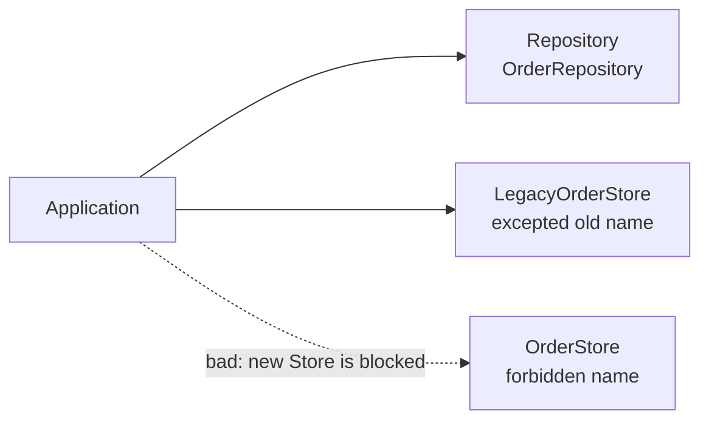

### `<Exceptions>`

Every `<Class>` and `<Namespace>` matcher can have a nested `<Exceptions>` block. That includes matchers inside `<Layer>`, `<Allowed>`, and `<Forbidden>`.

An exception can use the same matcher vocabulary as the rule it narrows:

- several attributes on one matcher, combined with AND;
- `typeKind`;
- `inherits`, `implements`, `withAttribute`, and `withAccessModifier`;
- `regex` and the normal text matchers.

When a dependency matches a rule **and** matches any of that rule's exceptions, the rule is skipped and evaluation continues with the next rule in document order. The rename code fix is also suppressed for excepted types - if a type is allowed, the IDE will not nag it with a rename suggestion.

```xml
<Forbidden>
  <Class endsWith="Store" comment="Persistence types must use the Repository suffix.">
    <Fix Rename="Repository" />
    <Exceptions>
      <!-- Pre-existing offenders grandfathered into the baseline. -->
      <Class startsWith="Legacy" />
      <Class typeName="ThirdPartyOrderStore" />
    </Exceptions>
  </Class>
</Forbidden>

<Layer name="Repository">
  <Class endsWith="Repository">
    <Exceptions>
      <!-- Test double, not a real Repository. -->
      <Class typeName="InMemoryFakeOrderRepository" />
    </Exceptions>
  </Class>
</Layer>
```

The intent is the **ratchet pattern**:

- lock current violations into a named baseline;
- block new offenders immediately;
- remove the old exceptions at whatever pace the codebase permits.

Plain exceptions do not track when they were added, expire themselves, or report reminders. If you need that, use [`<ExceptionPolicy>`](exception-policy.md). A carve-out can be simple or accountable; it should not pretend to be both.

**Example project:** [`Example.Exceptions`](../../Examples/Features/Example.Exceptions)

**Rule:** `<Exceptions>` grandfathers pre-existing offenders into the baseline. The exception in `<Forbidden>` exempts every type starting with `Legacy`; the exception inside `<Layer name="Repository">` exempts `InMemoryFakeOrderRepository` by exact name.


```mermaid
flowchart LR
    Application --> Repository["Repository<br/>OrderRepository"]
    Application --> Legacy["LegacyOrderStore<br/>excepted old name"]
    Application -. "bad: new Store is blocked" .-> Store["OrderStore<br/>forbidden name"]
```

```xml
<Forbidden>
  <Class endsWith="Store" comment="Persistence types must use the Repository suffix.">
    <Fix Rename="Repository" />
    <Exceptions>
      <Class startsWith="Legacy" />
    </Exceptions>
  </Class>
</Forbidden>

<Layer name="Repository">
  <Class endsWith="Repository">
    <Exceptions>
      <Class typeName="InMemoryFakeOrderRepository" />
    </Exceptions>
  </Class>
</Layer>
```

```csharp
// Legacy Store is exempted by <Class startsWith="Legacy">.
public class LegacyOrderStore { }
public class OrderHistoryManager(LegacyOrderStore store) { }

// ARCH_TYPE_001: OrderStore still triggers the rule; the carve-out is scoped.
public class OrderStore { }
public class OrderManager(OrderStore store) { }
```

#### When to reach for `<Exceptions>`

- **Introducing the analyzer to an existing codebase.** Enable the complete rules and add current offenders to `<Exceptions>` with the IDE code fix. The build stays green, but every new violation fails CI. Burn the list down at whatever pace fits the team. There is no migration milestone you have to hit, although a list that has not shrunk in a year is making a statement about priorities all by itself.
- **Intentional architectural carve-outs.** One diagnostics or bootstrap module legitimately needs to see a type the rest of the codebase shouldn't. Excepting it scoped to *that one type* keeps the rule active everywhere else.
- **Types that only look like a match.** This includes third-party types you cannot rename, generated code, framework conventions, and test doubles (`InMemoryFakeOrderRepository` looks like a Repository but is not one).

#### Why `<Exceptions>` and not something like `<Baseline>`?

`<Baseline>` would imply that every exemption represents legacy debt. In practice exceptions are also used for vendor types, framework conventions, generated code, and intentional carve-outs. `<Exceptions>` is neutral about why something is excepted and leaves the policy to the team. Use an XML comment to record the reason, or `<ExceptionPolicy>` when ownership and expiry must be enforced.

#### Code fix

Forbidden-rule diagnostics with an originating matcher register an **"Add '`TypeName`' to exceptions"** code action that appends the offending type to that matcher's `<Exceptions>` block, creating the block if needed. This works for both `Architecture.anl` and inline `AssemblyMetadata("AnaalIJzerSettings", ...)`, and if the matcher came from an included file the fix edits that owning file instead of the top-level one.

Allow-list failures are different: there is no single matcher to except, so the IDE offers an **allow-list** fixer instead that adds an exact `<Class typeName="..."/>` matcher to every applicable `<Allowed>` list. ARCH_DEP_002 also has no exception action; it offers layer classification or `requireRecognizedDependencies` relaxation because that is what actually resolves the finding.

#### Nesting

Exceptions can be nested. Each deeper *matching* exception level flips the previous result: depth 1 excludes the type from the rule, depth 2 includes it again, depth 3 excludes it again, and so on. The algorithm finds the **deepest level at which the type matches** and uses that depth's parity to decide the outcome — so inner exceptions should use patterns that are logical subsets of their parent, making it clear which types each level applies to.

**Example project:** [`Example.NestedExceptions`](../../Examples/Features/Example.NestedExceptions)

**Rule:** four overlapping patterns form a specificity hierarchy, each a logical subset of its parent. The deepest matching depth for each type determines its membership (odd = excluded, even = included):

| Type | Deepest match | Depth | Result |
|------|--------------|-------|--------|
| `InMemoryOrderRepository` | `startsWith="InMemory"` | 1 (odd) | Not in Persistence |
| `InMemoryCachedOrderRepository` | `startsWith="InMemoryCached"` | 2 (even) | In Persistence, ARCH_DEP_001 |
| `InMemoryCachedTestOrderRepository` | exact type name | 3 (odd) | Not in Persistence |
| `LegacyInMemoryCachedOrderRepository` | exact type name | 4 (even) | In Persistence, ARCH_DEP_001 |

```xml
<Layer name="Persistence">
  <Class endsWith="Repository">
    <Exceptions>
      <Class startsWith="InMemory">
        <Exceptions>
          <Class startsWith="InMemoryCached">
            <Exceptions>
              <Class typeName="InMemoryCachedTestOrderRepository">
                <Exceptions>
                  <Class typeName="LegacyInMemoryCachedOrderRepository" />
                </Exceptions>
              </Class>
            </Exceptions>
          </Class>
        </Exceptions>
      </Class>
    </Exceptions>
  </Class>
</Layer>
```

```csharp
// Depth 1 (odd): not in Persistence.
public class OrderEndpoint(InMemoryOrderRepository repository) { }

// ARCH_DEP_001: Depth 2 (even): in Persistence.
public class AdminEndpoint(InMemoryCachedOrderRepository repository) { }

// Depth 3 (odd): not in Persistence again.
public class TestEndpoint(InMemoryCachedTestOrderRepository repository) { }

// ARCH_DEP_001: Depth 4 (even): in Persistence again.
public class LegacyEndpoint(LegacyInMemoryCachedOrderRepository repository) { }
```
