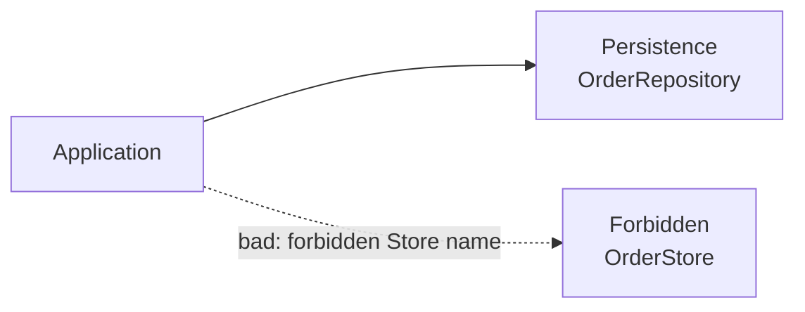

### `<Forbidden>`

Marks type patterns as explicitly disallowed. A root `<Forbidden>` policy applies globally; one nested inside a layer applies only to that layer and its descendants. When a dependency type matches an applicable forbidden pattern the analyzer reports **ARCH003** regardless of which layer the caller belongs to. An optional `<Fix Rename="…">` child element provides an automatic rename code-fix in Visual Studio / Rider.

```xml
<Forbidden>
  <Class endsWith="Store" comment="Persistence types must use the Repository suffix.">
    <Fix Rename="Repository" />
  </Class>
</Forbidden>
```

**Example project:** [`Example.Arch003.ForbiddenType`](../../Examples/Diagnostics/Example.Arch003.ForbiddenType)

**Rule:** Types ending in `Store` are explicitly forbidden. The `<Fix Rename="Repository">` element offers an automatic rename code-fix in Visual Studio.



```xml
<Forbidden>
  <Class endsWith="Store" comment="Persistence types must use the Repository suffix.">
    <Fix Rename="Repository" />
  </Class>
</Forbidden>
```

```csharp
// Repository is the required persistence suffix.
public class OrderService(OrderRepository repository) { }

// ARCH003: Store is forbidden; use Repository instead.
public class OrderStore { }
public class OrderManager(OrderStore store) { }
```
