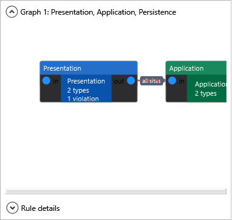
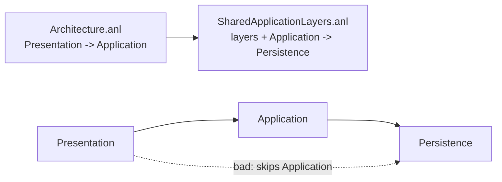

### `<Include>`

Merges another architecture settings file into the current config. Use this when a project has a small local config but shares layer definitions or common edges from another file. The top-level config can be either `Architecture.anl` or `AssemblyMetadata("AnaalIJzerSettings", ...)`; included settings files must still be passed to Roslyn as `AdditionalFiles`.

**Example project:** [`Example.IncludeSettings`](../../Examples/Features/Example.IncludeSettings)

<details>
<summary>Dependency graph</summary>



</details>


**Rule:** The project file can keep project-specific edges while the included file owns shared layers and shared edges. The included settings file must also be passed to Roslyn as an `AdditionalFile`.



```xml
<!-- Architecture.anl -->
<ArchitecturalLevels>
  <Include path="SharedApplicationLayers.anl" />

  <AllowedDependency from="Presentation" to="Application" />
</ArchitecturalLevels>
```

```xml
<!-- SharedApplicationLayers.anl -->
<ArchitecturalLevels>
  <Layer name="Presentation">
    <Class endsWith="Endpoint" />
  </Layer>

  <Layer name="Application">
    <Class endsWith="Service" />
  </Layer>

  <Layer name="Persistence">
    <Class endsWith="Repository" />
  </Layer>

  <AllowedDependency from="Application" to="Persistence" />
</ArchitecturalLevels>
```

```csharp
// Presentation -> Application is declared by the project settings.
public class OrderEndpoint(IOrderService service) { }

// Application -> Persistence comes from the included shared settings.
public class OrderService(IOrderRepository repository) { }

// ARCH001: Presentation -> Persistence has no AllowedDependency edge.
public class AdminEndpoint(IOrderRepository repository) { }
```

`path` is resolved relative to the settings file that declares the include. Included files can include other files; files already seen during the current parse are skipped so accidental cycles do not loop forever.

Root attributes such as `requireRecognizedDependencies`, `enforceAcyclic`, `enableReport` and `enableDocumentation` are honored from included files. Root site lists from included files are combined. Layer-scoped `requireRecognizedDependencies` attributes remain on the layer elements that declare them. Report and documentation paths are resolved relative to the file that enables them.
