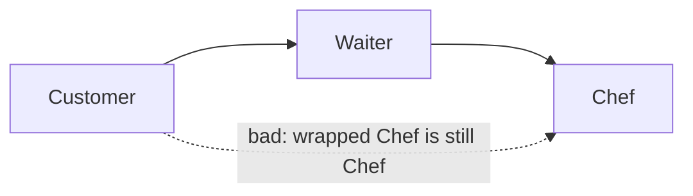

### `<Layer>`

Defines a named group of types. The `name` attribute is referenced by `<AllowedDependency>` edges.

```xml
<Layer name="Application">
  <Class endsWith="Manager" />
  <Class startsWith="App" />
  <Class contains="Service" />
  <Namespace endsWith="Application" />
  <Assembly exactName="MyCompany.Application" />
</Layer>
```

Each `<Class>`, `<Namespace>`, or `<Assembly>` child is a matcher. Attributes on one element are combined with **AND**; separate elements are alternatives combined with **OR**. A type is assigned to a layer when every condition on any one matcher element succeeds. Exact class-name matchers take precedence; remaining matchers are evaluated in configuration order.

A `<Layer>` may also set `requireRecognizedDependencies`. That requirement applies only to callers classified into that layer or one of its nested layers:

```xml
<Layer name="AuditedKitchen" requireRecognizedDependencies="Constructor">
  <Class endsWith="AuditedChef" />
</Layer>
```

Use this when a legacy codebase is partly undefined, but one module or boundary should already require every constructor dependency to be classified.

#### Hierarchical layer boundaries

A layer can contain nested layers and dependency rules. Parent matchers define the scope in which child matchers are evaluated:

```xml
<Layer name="Ordering">
  <Namespace startsWith="ExampleCompany.Ordering" />

  <Layer name="Application">
    <Class endsWith="Service" />
  </Layer>

  <Layer name="Repository">
    <Class endsWith="Repository" />
  </Layer>

  <AllowedDependency from="Application" to="Repository" />
</Layer>
```

`ExampleCompany.Ordering.PlaceOrderService` belongs to `Ordering/Application`: it must match both the parent namespace and the child class matcher. A type inside `ExampleCompany.Ordering` that matches no child belongs directly to `Ordering`. A parent with nested layers may omit its own matcher; in that case its membership is the union of its descendants.

Names are local to their parent, so `Ordering/Application` and `Billing/Application` can coexist. Sibling names must be unique, and an individual name cannot contain `/`. Rules inside a boundary use local child names. Root-qualified paths start with `/`:

```xml
<Layer name="Ordering">
  <!-- Egress gate from Ordering/Application to a different boundary. -->
  <AllowedDependency from="Application" to="/Billing/Contracts" />
</Layer>

<Layer name="Billing">
  <!-- Ingress gate into Billing/Contracts. -->
  <AllowedDependency from="/Ordering/Application" to="Contracts" />
</Layer>

<!-- Generic relationship between the two outer boundaries. -->
<AllowedDependency from="Ordering" to="Billing" />
```

A cross-boundary dependency must pass every applicable gate. In this example, `Ordering/Application -> Billing/Contracts` requires all three rules: the root `Ordering -> Billing` relationship, the Ordering egress rule, and the Billing ingress rule. Inner rules may narrow outer permissions but cannot bypass them. Site filters are evaluated independently at every gate.

For framework-like or crosscutting layers, mark a higher-level edge with `appliesToDescendants="true"` when that one rule should satisfy descendant boundary gates too:

```xml
<AllowedDependency from="*" to="Framework" appliesToDescendants="true" />
```

Use this for intentionally ambient dependencies. Keep local egress and ingress rules for business boundaries where each parent module should decide what its children may reach.

References to a parent select its entire subtree. Shared ancestry is containment rather than a same-layer dependency: `Ordering/Application -> Ordering/Repository` is checked by the rule inside `Ordering` and does not produce ARCH005 merely because both types also belong to `Ordering`. ARCH005 applies when both types have the same deepest effective layer.

**Example project:** [`Example.NestedLayers`](../../Examples/Features/Example.NestedLayers)

<details>
<summary>Dependency graph</summary>


</details>


#### Matcher types

Name-based matchers (case-sensitive, no compilation required):

| Element       | Attribute       | Description |
|---------------|-----------------|-------------|
| `<Class>`     | `typeName`      | Type name equals the given string (synonym: `exactName`) |
| `<Class>`     | `exactName`     | Type name equals the given string (synonym: `typeName`) |
| `<Class>`     | `exactFullName` | Fully-qualified type name (`Namespace.TypeName`) equals the given string |
| `<Class>`     | `endsWith`      | Type name ends with the given string |
| `<Class>`     | `startsWith`    | Type name starts with the given string |
| `<Class>`     | `contains`      | Type name contains the given string |
| `<Class>`     | `regex`         | Type name matches the given .NET regular expression |
| `<Namespace>` | `exactName`     | Namespace equals the given string |
| `<Namespace>` | `endsWith`      | Namespace ends with the given string |
| `<Namespace>` | `startsWith`    | Namespace starts with the given string |
| `<Namespace>` | `contains`      | Namespace contains the given string |
| `<Namespace>` | `regex`         | Namespace string matches the given .NET regular expression |
| `<Assembly>`  | `exactName`     | Containing assembly name equals the given string |
| `<Assembly>`  | `endsWith`      | Containing assembly name ends with the given string |
| `<Assembly>`  | `startsWith`    | Containing assembly name starts with the given string |
| `<Assembly>`  | `contains`      | Containing assembly name contains the given string |
| `<Assembly>`  | `regex`         | Containing assembly name matches the given .NET regular expression |

Semantic matchers (`<Class>` only, evaluated against the resolved type symbol):

| Attribute            | Description |
|----------------------|-------------|
| `inherits`           | Type whose base-type chain contains a type with the given simple or full name (e.g. `inherits="ControllerBase"`) |
| `implements`         | Type that implements (transitively) an interface with the given simple or full name |
| `withAttribute`      | Type decorated with the given attribute. The `Attribute` suffix is optional (`withAttribute="ApiController"` ≡ `"ApiControllerAttribute"`) |
| `withAccessModifier` | Type declared with the given modifier(s). Supported tokens (case-insensitive): `public`, `internal`, `private`, `protected`, `sealed`, `abstract`, `static`, `record`. Multiple space-separated tokens require **all** to match (e.g. `withAccessModifier="public sealed"`) |
| `typeKind`           | Type has the given declared kind. Supported case-insensitive values are listed below. May be used alone. |

`typeKind` uses declaration-oriented values:

| Value | Matches |
|-------|---------|
| `Class` | Ordinary classes, excluding record classes |
| `Interface` | Interfaces |
| `Struct` | Ordinary structs, excluding record structs |
| `Record` | Record classes |
| `RecordStruct` | Record structs |
| `Enum` | Enums |
| `Delegate` | Delegates |

One or more matcher attributes are allowed per element. Every attribute on that element must match:

```xml
<Class startsWith="I"
       endsWith="Repository"
       typeKind="Interface" />

<Namespace startsWith="MyCompany."
           endsWith=".Persistence" />

<Assembly startsWith="MyCompany."
          endsWith=".Contracts" />
```

The first rule matches only interfaces whose names start with `I` and end with `Repository`. To express alternatives, add another `<Class>` element. Missing matchers, unsupported attributes, unknown `typeKind` values, and invalid regular expressions report ARCH006.

String matches are **case-sensitive** and applied to the full declared name (so `IOrderRepository` matches `endsWith="Repository"`). `regex` uses `Regex.IsMatch` semantics, so it matches anywhere in the subject unless the pattern is anchored with `^` / `$`; invalid patterns report ARCH006. Patterns are compiled once and cached, so the cost is paid only on first use.

**Example projects:** [`Example.AssemblyMatcher`](../../Examples/Features/Example.AssemblyMatcher), [`Example.CombinedMatchers`](../../Examples/Features/Example.CombinedMatchers)


```xml
<Layer name="Controllers">
  <Class inherits="ControllerBase" />
  <Class withAttribute="ApiController" />
</Layer>

<Layer name="DomainEvents">
  <Class implements="IDomainEvent" />
</Layer>

<Layer name="PublicApi">
  <Class withAccessModifier="public sealed" />
</Layer>

<Layer name="Handlers">
  <!-- Anchored: matches IFooHandler, IBarHandler, … but not "Handler" alone. -->
  <Class regex="^I[A-Z][A-Za-z0-9]*Handler$" />
</Layer>

<Forbidden>
  <Class exactFullName="System.Console" comment="Use ILogger." />
  <Namespace regex="\.Internal(\.|$)" comment="Don't reach into *.Internal namespaces." />
</Forbidden>
```

Matchers are also applied to the **generic type arguments** of a parameter, recursively. A parameter typed `Lazy<IChef>` is therefore evaluated as both `Lazy` and `IChef`. If the Customer layer may depend on Waiter but not Chef, the wrapper does not hide the Chef dependency. This works for arbitrary wrappers (`Lazy<>`, `Func<>`, `IEnumerable<>`, `Task<>`, ...) and any user-defined generic.

**Example project:** [`Example.Arch001.GenericTypeArgument`](../../Examples/Diagnostics/Example.Arch001.GenericTypeArgument)


**Rule:** Generic type arguments are inspected. Wrapping a forbidden dependency in `Lazy<>`, `IEnumerable<>`, `Func<>`, … does not hide it from the analyzer.



```xml
<AllowedDependency from="Customer" to="Waiter" />
<AllowedDependency from="Waiter" to="Chef" />
<!-- Customer -> Chef: intentionally omitted -->
```

```csharp
// Customer -> Waiter is allowed.
public class HungryCustomer(IWaiter waiter) { }

// ARCH001: Lazy<IChef> still contains an IChef dependency.
// Asking for a chef later is still asking for a chef.
public class PatientCustomer(Lazy<IChef> chef) { }

// ARCH001: IEnumerable<IChef> still contains IChef dependencies.
// A group of chefs is not a waiter.
public class GroupCustomer(IEnumerable<IChef> chefs) { }

// ARCH001: Func<IChef> still contains an IChef dependency.
// A promise to find a chef later does not change the boundary.
public class FutureCustomer(Func<IChef> chefFactory) { }
```
