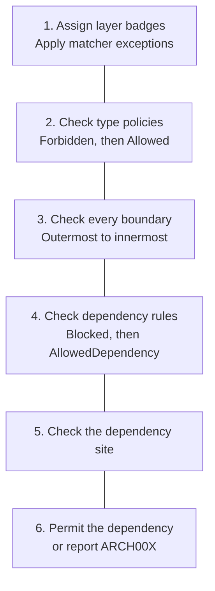

## Configuration mental model

The settings are not one large list of competing rules. They answer four different questions, in order. Imagine that every type is a person entering a restaurant: first the analyzer gives them a job badge, then checks whether that kind of person is permitted, then checks who their role may depend on, and finally checks how that dependency is used in code.

### 1. What role does this type have?

A [`<Layer>`](#layer) assigns the job badge. A type might be classified as a `Customer`, `Waiter`, `Chef`, or `Pantry` type.

Nested layers make the badge more specific. A type in `Restaurant/Kitchen/Chef` must obey the broad `Restaurant` and `Kitchen` boundary rules as well as the specific `Chef` rules. An inner boundary can add restrictions; it cannot cancel a restriction imposed by an outer boundary.

An [`<Exceptions>`](#exceptions) block tells one matcher to ignore a particular type. It does **not** grant that type permission to break one dependency rule. For example, excepting `TemporaryChef` from a `<Class endsWith="Chef">` matcher means that matcher no longer gives it the `Chef` badge. Another matcher may still classify it; if none does, the type is outside the layer graph. That makes a layer exception a broad classification exemption, not a narrow allowed edge.

[`requireRecognizedDependencies`](#requirerecognizeddependencies-attribute) lists the code sites where a dependency must receive a configured badge. Put it on the root to apply everywhere, or on a `<Layer>` to apply only to callers in that layer and its descendants. For example, `requireRecognizedDependencies="Constructor, Local"` reports ARCH002 for unknown constructor and local-variable types. At sites not listed, unknown types remain outside the layer graph without producing ARCH002.

### 2. Is this kind of type permitted?

[`<Allowed>`](#allowed-type-policy) and [`<Forbidden>`](#forbidden) are **type policies**. They inspect the dependency type itself, not the relationship between two layers.

- `<Allowed>` is a guest list: when an allowlist applies, the dependency type must match at least one entry.
- `<Forbidden>` is a deny list: a matching dependency type is rejected, even if it also appears on an allowlist.

These policies can be global or scoped to a layer. Scoped policies are inherited by nested layers, so a `Restaurant/Kitchen` policy also applies to `Restaurant/Kitchen/Chef`.

### 3. Which roles may depend on which?

[`<AllowedDependency>`](#alloweddependency) permits one layer to depend on another. In the restaurant model, `Waiter --> Chef` means a `Waiter` type may hold or introduce a reference to a `Chef` type. It describes a permitted code dependency, not the runtime order in which people speak or data moves.

[`<BlockedDependency>`](#blockeddependency) explicitly denies a matching relationship. It wins over a matching allowed edge at the same boundary.

Wildcards are only shorthand for “any layer.” For example, `from="*"` means any source layer. A wildcard does not bypass a `<Forbidden>` type policy, a `<BlockedDependency>`, or a denial at a parent boundary.

### 4. Where may the dependency appear?

An allowed relationship can be narrowed to particular [dependency sites](#site-filters) - the different ways one type can keep, receive, create, or expose another type.

- `Constructor` means the type receives the dependency when it is created.
- `Field` or `Property` means it keeps the dependency.
- `Local` means it handles the dependency temporarily inside a method.
- `MethodReturn` means it exposes the dependency to its caller.

`allowedSites` is a site allowlist: only the named sites are permitted. `blockedSites` is a site denylist: every site except the named sites is permitted. They are mutually exclusive on one dependency edge.

### Similar names, different jobs

| Pair | Difference |
|------|------------|
| `<Allowed>` / `<AllowedDependency>` | A whitelist of dependency **types** versus permission between **layers** |
| `<Forbidden>` / `<BlockedDependency>` | A rejected dependency **type** versus a rejected **layer relationship** |
| `<Exceptions>` / allowed dependencies | A matcher that ignores a type versus architectural permission to depend on a layer |
| `allowedSites` / `blockedSites` | Only these code locations are permitted versus every code location except these |
| Nested layers / nested exceptions | Cumulative architectural boundaries versus alternating exclusion and re-inclusion for one matcher |

### Rule precedence

The analyzer evaluates a discovered dependency through this pipeline. The numbered boxes are evaluation stages; the connector lines are deliberately not architecture dependency arrows.

More precisely:

1. Match the caller and dependency layers, applying matcher exceptions while each rule is considered.
2. Apply global and inherited `<Forbidden>` policies. A match reports ARCH003.
3. Require the dependency type to pass every applicable global and inherited `<Allowed>` whitelist. A failure reports ARCH003.
4. Evaluate hierarchical boundary gates from outermost to innermost. The first denied boundary stops evaluation; a child boundary cannot override it.
5. At each boundary, an applicable `<BlockedDependency>` wins over matching allowed edges.
6. At least one matching `<AllowedDependency>` must permit the current dependency site.
7. Wildcards participate as ordinary matching edges; they receive no special power over blocks or type policies.
8. If a dependency type does not match a layer and its current site is listed by root-level or caller-layer `requireRecognizedDependencies`, report ARCH002.

The important distinction is that `<Allowed>` cannot create an architecture edge, `<AllowedDependency>` cannot approve a forbidden type, and `<Exceptions>` does not create a narrow allowed edge - it changes whether one matcher applies at all. Each feature answers a different question.

---
