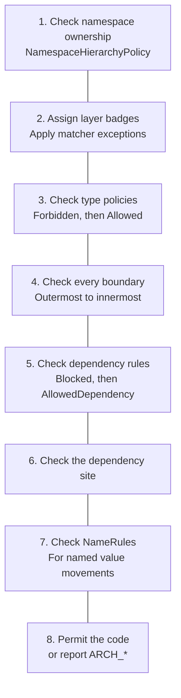

## Configuration mental model

The settings are not one large list of competing rules. They answer seven different questions:

1. What role does this type have?
2. Is this kind of type permitted?
3. Is this declaration visible to the right audience?
4. Which roles may depend on which?
5. Does namespace ownership permit this reference?
6. Where may the dependency appear?
7. Do important value names still mean the same thing?

The restaurant model gives those questions something concrete to talk about: namespace ownership controls which room may reach which other room, layers provide job badges, type and visibility policies check who is permitted, dependency rules say which jobs may rely on each other, and name rules stop `customerId` quietly turning into `animalId` somewhere along the way.

### 1. What role does this type have?

A [`<Layer>`](#layer) assigns the job badge. A type might be classified as a `Customer`, `Waiter`, `Chef`, or `Pantry` type.

Nested layers make the badge more specific. A type in `Restaurant/Kitchen/Chef` must obey the broad `Restaurant` and `Kitchen` boundary rules as well as the specific `Chef` rules. An inner boundary can add restrictions; it cannot cancel a restriction imposed by an outer boundary.

An [`<Exceptions>`](#exceptions) block tells one matcher to ignore a particular type. It does **not** grant permission to break a dependency rule.

- Excepting `TemporaryChef` from `<Class endsWith="Chef">` means that matcher no longer gives it the `Chef` badge.
- Another matcher may still classify it.
- If no other matcher does, the type is outside the layer graph.

This is the most common misreading in the whole configuration: an exception says "this type is not a Chef", never "this Chef is excused from the rules".

[`requireRecognizedDependencies`](#requirerecognizeddependencies-attribute) lists the code sites where a dependency must receive a configured badge. Put it on the root to apply everywhere, or on a `<Layer>` to apply only to callers in that layer and its descendants. For example, `requireRecognizedDependencies="Constructor, Local"` reports ARCH_DEP_002 for unknown constructor and local-variable types. At sites not listed, unknown types remain outside the layer graph without producing ARCH_DEP_002.

### 2. Is this kind of type permitted?

[`<Allowed>`](#allowed-type-policy) and [`<Forbidden>`](#forbidden) are **type policies**. They inspect the dependency type itself, not the relationship between two layers.

- `<Allowed>` is a guest list: when an allowlist applies, the dependency type must match at least one entry.
- `<Forbidden>` is a deny list: a matching dependency type is rejected, even if it also appears on an allowlist.

These policies can be global or scoped to a layer. Scoped policies are inherited by nested layers, so a `Restaurant/Kitchen` policy also applies to `Restaurant/Kitchen/Chef`.

### 3. Is this declaration visible to the right audience?

[`<VisibilityPolicy>`](#visibility-policies) restricts whether types and members in a layer may be `public`, `internal`, `private`, and so on. It checks the declaration itself, not a dependency relationship. For example, a repository query surface can be required to remain `internal` even when the repository is allowed to use it.

`<Allowed>` and `<VisibilityPolicy allowedAccessibilities="...">` are different allowlists: the first permits dependency **types**, while the second permits declared **accessibilities**.

### 4. Which roles may depend on which?

[`<AllowedDependency>`](#alloweddependency) permits one layer to depend on another. In the restaurant model, `Waiter --> Chef` means a `Waiter` type may hold or introduce a reference to a `Chef` type. It describes a permitted code dependency, not the runtime order in which people speak or data moves.

[`<BlockedDependency>`](#blockeddependency) explicitly denies a matching relationship. It wins over a matching allowed edge at the same boundary.

Wildcards are only shorthand for “any layer.” For example, `from="*"` means any source layer. A wildcard does not bypass a `<Forbidden>` type policy, a `<BlockedDependency>`, or a denial at a parent boundary. `*` is an abbreviation, not diplomatic immunity.

### 5. Does namespace ownership permit this reference?

[`<NamespaceHierarchyPolicy>`](#namespace-hierarchy-policies) protects a source ownership tree independently of layers. It compares source namespaces, not runtime conversation flow: `Restaurant.Orders` can be forbidden from reaching up into `Restaurant`, sideways into `Restaurant.Payments`, or both.

`<BlockedRelation>` has the same `allowedSites` and `blockedSites` attribute names as dependency edges, but its meaning is inverted because it filters a **block**. `allowedSites="Constructor"` means “block this namespace relationship only at constructors”; `blockedSites="Field"` means “block it everywhere except fields.”

When a namespace policy blocks a resolved reference, it produces `ARCH_NS_007` before ordinary layer rules run. A namespace policy that does not block leaves the reference for normal layer analysis.

### 6. Where may the dependency appear?

An allowed relationship can be narrowed to particular [dependency sites](#site-filters) - the different ways one type can keep, receive, create, or expose another type.

- `Constructor` means the type receives the dependency when it is created.
- `Field` or `Property` means it keeps the dependency.
- `Local` means it handles the dependency temporarily inside a method.
- `MethodReturn` means it exposes the dependency to its caller.

`allowedSites` is a site allowlist: only the named sites are permitted. `blockedSites` is a site denylist: every site except the named sites is permitted. They are mutually exclusive on one dependency edge.

### 7. Do important value names still mean the same thing?

[`<NameRules>`](#namerules) are layer-scoped semantic-name policies. They can protect primitive value movement such as `customerId` versus `orderId`, or require a declaration such as `PatientId patientId` to agree with its semantic type.

A `NameRules` policy can require names to match at selected sites, then allow narrow translations where they are intentional. For example, a `Waiter` layer might allow `reservationCustomerId` to become `customerId` only while constructing an order ticket, but still reject passing `animalId` into a `customerId` parameter.

### Similar names, different jobs

| Pair | Difference |
|------|------------|
| `<Allowed>` / `<AllowedDependency>` | A whitelist of dependency **types** versus permission between **layers** |
| `<Forbidden>` / `<BlockedDependency>` | A rejected dependency **type** versus a rejected **layer relationship** |
| `<Exceptions>` / allowed dependencies | A matcher that ignores a type versus architectural permission to depend on a layer |
| `allowedSites` / `blockedSites` | Only these code locations are permitted versus every code location except these |
| Nested layers / nested exceptions | Cumulative architectural boundaries versus alternating exclusion and re-inclusion for one matcher |
| `<AllowedDependency>` / `<NameRules><Allow>` | Permission between layers versus permission for one intentional value-name translation |
| `<Allowed>` / `<VisibilityPolicy>` | Permitted dependency types versus permitted declaration accessibilities |
| `<NamespaceHierarchyPolicy>` / `<Layer>` | Source-namespace ownership versus a type's architectural role |
| `<BlockedRelation allowedSites="...">` / `<AllowedDependency allowedSites="...">` | Sites where a namespace block applies versus sites where a layer dependency is permitted |

### Rule precedence

The analyzer evaluates dependency-related rules through this pipeline. Visibility policies independently evaluate declarations after their layer is known. The numbered boxes are evaluation stages; the connector lines are deliberately not architecture dependency arrows.

```mermaid
flowchart TD
    NamespaceOwnership["1. Check namespace ownership<br/>NamespaceHierarchyPolicy"]
    Classify["2. Assign layer badges<br/>Apply matcher exceptions"]
    TypePolicy["3. Check type policies<br/>Forbidden, then Allowed"]
    Boundaries["4. Check every boundary<br/>Outermost to innermost"]
    Edges["5. Check dependency rules<br/>Blocked, then AllowedDependency"]
    Sites["6. Check the dependency site"]
    Names["7. Check NameRules<br/>For named value movements"]
    Result["8. Permit the code<br/>or report ARCH_*"]

    NamespaceOwnership --- Classify
    Classify --- TypePolicy
    TypePolicy --- Boundaries
    Boundaries --- Edges
    Edges --- Sites
    Sites --- Names
    Names --- Result
```

More precisely:

1. Evaluate root-level `<NamespaceHierarchyPolicy>` rules for the resolved caller/dependency namespace relationship. The first matching block reports ARCH_NS_007 and stops ordinary layer dependency analysis for that reference.
2. Match the caller and dependency layers, applying matcher exceptions while each rule is considered.
3. Apply global and inherited `<Forbidden>` policies. A match reports ARCH_TYPE_001.
4. Require the dependency type to pass every applicable global and inherited `<Allowed>` whitelist. A failure reports ARCH_TYPE_001.
5. Evaluate hierarchical boundary gates from outermost to innermost. The first denied boundary stops evaluation; a child boundary cannot override it.
6. At each boundary, an applicable `<BlockedDependency>` wins over matching allowed edges.
7. At least one matching `<AllowedDependency>` must permit the current dependency site. Wildcards participate as ordinary matching edges; they receive no special power over blocks or type policies.
8. If a dependency type does not match a layer and its current site is listed by root-level or caller-layer `requireRecognizedDependencies`, report ARCH_DEP_002.
9. For named value movements inside the caller layer, apply inherited `<NameRules>`. A mismatch without a matching `<Allow>` mapping reports ARCH_NAME_008.

The important distinction is that `<Allowed>` cannot create an architecture edge, `<AllowedDependency>` cannot approve a forbidden type, `<NamespaceHierarchyPolicy>` does not classify a type into a layer, `<Exceptions>` does not create a narrow allowed edge, and `<NameRules><Allow>` does not permit a type dependency - it only permits one value-name translation. Each feature answers a different question. Most reports of "the analyzer ignores my rule" turn out to be a rule answering a question nobody asked.

---
