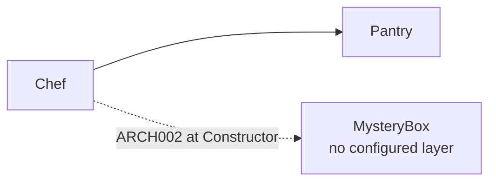

### `requireRecognizedDependencies` attribute

`requireRecognizedDependencies` is a comma-separated list of [dependency sites](#site-filters). At each listed site, a dependency used by a layered caller must itself belong to a configured layer. An unknown type reports **ARCH002**. When the attribute is omitted, unknown types do not report ARCH002.

The attribute can be placed on `<ArchitecturalLevels>` or on a `<Layer>`:

- On `<ArchitecturalLevels>`, it applies to every layered caller.
- On `<Layer>`, it applies only to callers classified into that layer or one of its descendants.
- Root, parent-layer, and child-layer site lists are cumulative.

```xml
<ArchitecturalLevels requireRecognizedDependencies="Constructor, Local">
  ...
</ArchitecturalLevels>
```

The values are trimmed and case-insensitive. Supported values are `Constructor`, `Method`, `MethodReturn`, `Field`, `Property`, `Local`, `New`, `GenericInvocation`, `GenericArgument`, `Inheritance`, `InterfaceImplementation`, `Attribute`, and `StaticMember`. Empty or unknown values make the configuration invalid and report ARCH006.

**Example projects:** [`Example.Arch002.UnrecognizedDependency`](../../Examples/Diagnostics/Example.Arch002.UnrecognizedDependency), [`Example.RequiredRecognizedDependencySites`](../../Examples/Features/Example.RequiredRecognizedDependencySites), [`Example.LayerScopedRecognizedDependencies`](../../Examples/Features/Example.LayerScopedRecognizedDependencies)

**Rule:** The configured site determines where an unknown dependency is an error.



```xml
<ArchitecturalLevels requireRecognizedDependencies="Constructor">
  <Layer name="Chef"><Class endsWith="Chef" /></Layer>
  <Layer name="Pantry"><Class endsWith="Pantry" /></Layer>
  <AllowedDependency from="Chef" to="Pantry" />
</ArchitecturalLevels>
```

```csharp
// Chef -> Pantry is recognized and allowed.
public class PizzaChef(IIngredientPantry pantry) { }

// ARCH002 at Constructor: MysteryBox belongs to no configured layer.
public class ExperimentalChef(MysteryBox box) { }
```

For partial adoption, keep the root loose and require recognized dependencies only inside a stricter layer:

```xml
<ArchitecturalLevels>
  <Layer name="LegacyKitchen">
    <Class typeName="LegacyChef" />
  </Layer>

  <Layer name="AuditedKitchen" requireRecognizedDependencies="Constructor">
    <Class typeName="AuditedChef" />
  </Layer>
</ArchitecturalLevels>
```

```csharp
// Valid: LegacyKitchen does not require unknown constructor dependencies yet.
public class LegacyChef(MysteryBox box) { }

// ARCH002: AuditedKitchen requires constructor dependencies to be classified.
public class AuditedChef(MysteryBox box) { }
```

This setting controls whether ARCH002 is produced, not its severity. Use Roslyn's standard `.editorconfig` mechanism to show it as a warning:

```ini
[*.cs]
dotnet_diagnostic.ARCH002.severity = warning
```
