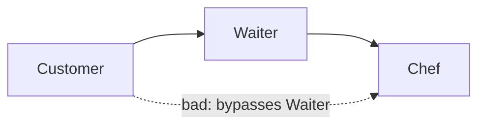
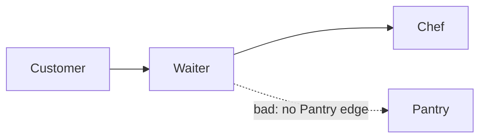

### ARCH001 - Illegal layer dependency

Reported when a type in layer A depends on a type in layer B, no `<AllowedDependency from="A" to="B"/>` permits the current dependency site, and the violation is neither a wrong-direction nor a same-layer case (those have their own IDs).

**Example output:**
```
error ARCH001: 'ImpatientCustomer' (layer Customer) may not depend on 'IChef'
  (layer Chef): no <AllowedDependency from="Customer" to="Chef"/> is configured
```

If an edge exists but a site filter excludes the current site, the diagnostic names that instead:

```text
error ARCH001: 'AllowedLocalSiteExample' (layer Caller) may not depend on 'AllowedLocalType'
  (layer AllowedLocalDependency): <AllowedDependency from="Caller" to="AllowedLocalDependency"/> is configured,
  but allowedSites does not include Constructor
```

**Example project:** [`Example.Arch001.SkipsLayer`](../../Examples/Diagnostics/Example.Arch001.SkipsLayer)

**Rule:** `Customer -> Waiter -> Chef` is allowed; direct `Customer -> Chef` is not.



```xml
<AllowedDependency from="Customer" to="Waiter" />
<AllowedDependency from="Waiter" to="Chef" />
<!-- Customer -> Chef: intentionally omitted -->
```

```csharp
// Customer -> Waiter is allowed.
public class HungryCustomer(IWaiter waiter) { }

// ARCH001: Customer -> Chef has no AllowedDependency edge.
// A customer should ask a waiter rather than direct the chef.
public class ImpatientCustomer(IChef chef) { }
```

**Example project:** [`Example.Arch001.NoEdge`](../../Examples/Diagnostics/Example.Arch001.NoEdge)

**Rule:** `Customer -> Waiter -> Chef` is allowed, but no edge permits `Waiter -> Pantry`.



```xml
<AllowedDependency from="Customer" to="Waiter" />
<AllowedDependency from="Waiter" to="Chef" />
<!-- Waiter -> Pantry: intentionally omitted -->
```

```csharp
// Customer -> Waiter is allowed.
public class HungryCustomer(IWaiter waiter) { }

// Waiter -> Chef is allowed, but Waiter -> Pantry is not.
// The waiter passes the order to the chef rather than entering the pantry.
public class TableWaiter(IChef chef, IIngredientPantry pantry) { }
```
