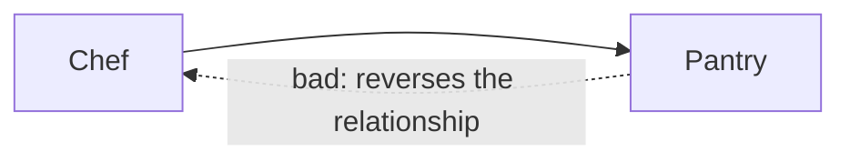

### ARCH004 - Wrong-direction dependency

Reported when a type in layer A depends on a type in layer B and `<AllowedDependency from="B" to="A"/>` is configured - i.e. the dependency runs in the reverse direction of a configured edge.

**Example output:**
```
error ARCH004: 'IngredientPantry' (layer Pantry) may not depend on 'IChef'
  (layer Chef): this is the reverse of the configured 'Chef -> Pantry' edge
```

**Example project:** [`Example.Arch004.WrongDirection`](../../Examples/Diagnostics/Example.Arch004.WrongDirection)

**Rule:** The allowed edge is `Chef -> Pantry`. Depending in the reverse direction is not allowed.



```xml
<AllowedDependency from="Chef" to="Pantry" />
<!-- Pantry -> Chef: intentionally omitted -->
```

```csharp
// Chef -> Pantry is allowed.
public class PizzaChef(IIngredientPantry pantry) { }

// ARCH004: Pantry -> Chef reverses the configured direction.
// The pantry supplies the chef; it does not direct the chef.
public class IngredientPantry(IChef chef) { }
```
