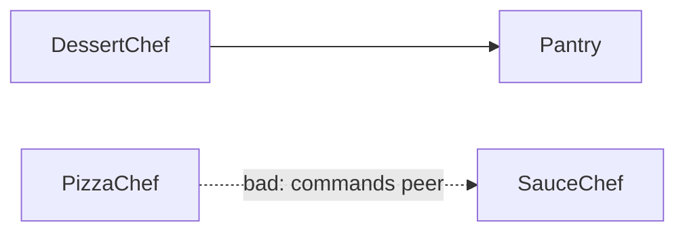

### ARCH005 - Same-layer dependency

Reported when two types in the same layer depend on each other and no self-edge has been configured for that layer. By default peers within a layer are not allowed to take a hard dependency on each other; this is the safest default because intra-layer fan-out tends to grow silently into cycles.

To opt a single layer in to same-layer dependencies, declare an explicit self-edge:

```xml
<AllowedDependency from="Chef" to="Chef" />
```

With that edge in place, `PizzaChef` may depend on `ISauceChef` (both in `Chef`) without ARCH005 firing. Other layers without a self-edge keep the default prohibition.

Self-edges can also be limited to particular [dependency sites](#site-filters). This is useful, but it is not the only way to model an interface and its implementation.

#### Common use cases

**Possible: interface and implementation share one architectural role**

The interface and implementation may live in the same project, namespace, or even file. If both intentionally belong to `DataAbstraction`, allow only inheritance within that layer:

```xml
<Layer name="DataAbstraction">
  <Class endsWith="Repository" />
</Layer>

<AllowedDependency from="DataAbstraction"
                   to="DataAbstraction"
                   allowedSites="InterfaceImplementation" />
```

```csharp
// Allowed: interface implementation is an InterfaceImplementation-site dependency.
public class ExampleRepository : IExampleRepository { }

// ARCH005: Constructor is not allowed by the InterfaceImplementation-only self-edge.
public class ReportingRepository(IExampleRepository repository) { }
```

`ExampleRepository : IExampleRepository` is allowed, while constructor, field, property, and method dependencies between repository peers still report ARCH005. This deliberately permits inheritance within `DataAbstraction`; it does not mean interfaces and implementations must share a layer.

**Alternative: colocated interfaces and implementations have different architectural roles**

For a narrower model, put contracts and implementations in separate architectural layers even when they live in the same project, namespace, or file. Match interfaces first, implementations second, and allow only implementation-to-contract inheritance:

```xml
<Layer name="DataContracts">
  <Class endsWith="Repository" typeKind="Interface" />
</Layer>

<Layer name="DataImplementation">
  <Class endsWith="Repository" typeKind="Class" />
</Layer>

<AllowedDependency from="DataImplementation"
                   to="DataContracts"
                   allowedSites="InterfaceImplementation" />
```

No self-edge is needed: `ExampleRepository -> IExampleRepository` crosses from `DataImplementation` to `DataContracts` at the `InterfaceImplementation` site. Both rules use the same suffix, while `typeKind` distinguishes the contract from its implementation without relying on the `I` naming convention.

**Interfaces must come from a dedicated contracts project**

Use an assembly matcher when the project boundary itself carries architectural meaning:

```xml
<Layer name="DataContracts">
  <Assembly exactName="MyCompany.Data.Abstractions" />
</Layer>

<Layer name="DataImplementation">
  <Class endsWith="Repository" />
</Layer>

<AllowedDependency from="DataImplementation"
                   to="DataContracts"
                   allowedSites="InterfaceImplementation" />
```

An implementation may now implement a contract from `MyCompany.Data.Abstractions`. A locally declared `IExampleRepository` does not match `DataContracts`; it falls into `DataImplementation` through the class matcher and still produces ARCH005 because no self-edge exists. This enforces the separate-project convention without making it a built-in analyzer opinion.

Add other sites to `allowedSites`, or omit the site filter, when the implementation project is also intentionally allowed to consume contract types through constructors, methods, or properties. See [Site filters](#site-filters) and [Assembly matchers](#matcher-types) for the complete options.

None of these structures is built into the analyzer. `InterfaceImplementation` works for implemented interfaces, while `Inheritance` works for base classes and interface-to-interface inheritance. The matchers and edges decide which model applies.

**Example output:**
```
error ARCH005: 'PizzaChef' (layer Chef) may not depend on 'ISauceChef'
  (layer Chef): types in the same layer ('Chef') may not depend on each other
```

**Example projects:** [`Example.Arch005.SameLayer`](../../Examples/Diagnostics/Example.Arch005.SameLayer), [`Example.SameLayerInheritance`](../../Examples/Features/Example.SameLayerInheritance), [`Example.CombinedMatchers`](../../Examples/Features/Example.CombinedMatchers)

**Rule:** By default, types within the same layer may not depend on each other. A layer can opt in to same-layer dependencies by declaring an explicit self-edge: `<AllowedDependency from="X" to="X"/>`.



```xml
<Layer name="Chef">
  <Class endsWith="Chef" />
</Layer>
```

```csharp
// Chef -> Pantry is allowed.
public class DessertChef(IIngredientPantry pantry) { }

// ARCH005: PizzaChef and ISauceChef are both in the Chef layer.
// Chefs may share a pantry, but should not command each other directly.
public class PizzaChef(ISauceChef sauceChef) { }
```
