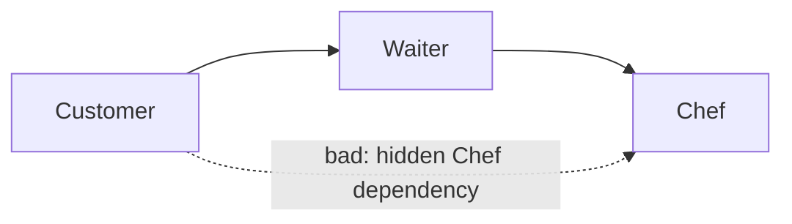

### Diagnostic properties

Every layering diagnostic (ARCH001, ARCH004, ARCH005) carries a `Site` property in `Diagnostic.Properties` indicating where the dependency was found. This lets code-fix providers, custom reporters and CI dashboards filter or group by injection style without re-parsing the source.

| `Site` value        | Where the dependency was introduced                                        |
|---------------------|----------------------------------------------------------------------------|
| `Constructor`       | Constructor parameter (including primary constructors)                      |
| `Method`            | Non-constructor method parameter                                            |
| `MethodReturn`      | Non-constructor method return type                                          |
| `Field`             | Field declaration                                                           |
| `Property`          | Property declaration                                                        |
| `Local`             | Local variable declaration                                                  |
| `New`               | `new T(...)` or target-typed `new()` expression                             |
| `GenericArgument`   | Generic type argument of an outer type (`Lazy<T>`, `IEnumerable<T>`, …)     |
| `GenericInvocation` | Generic method invocation (service-locator style: `services.GetService<T>()`) |
| `Inheritance`       | Base class inheritance or interface-to-interface inheritance                 |
| `InterfaceImplementation` | Class, record, or struct implements an interface                       |
| `Attribute`         | Attribute used on a type or one of its members                              |
| `StaticMember`      | Static method, property, field, event, or reduced extension-method access   |

**Example project:** [`Example.Arch001.NonConstructorInjection`](../../Examples/Diagnostics/Example.Arch001.NonConstructorInjection)

**Rule:** Dependencies introduced outside the constructor are still dependencies. Fields, properties, method signatures, local variables, inheritance, interface implementation, attributes, static member access, `new` expressions and generic service-locator invocations are all checked against the configured layer edges. Classes, records, structs, and interfaces can all act as callers.

**Type-kind example:** [`Example.NonClassCallers`](../../Examples/Features/Example.NonClassCallers)



```xml
<AllowedDependency from="Customer" to="Waiter" />
<AllowedDependency from="Waiter" to="Chef" />
<!-- Customer -> Chef: intentionally omitted -->
```

```csharp
// ARCH001: field dependency
public class FieldDependencyCustomer
{
    private readonly IChef _chef = null!;
}

// ARCH001: property dependency
public class PropertyDependencyCustomer
{
    public IChef Chef { get; set; } = null!;
}

// ARCH001: method parameter
public class MethodDependencyCustomer
{
    public void OrderFrom(IChef chef) { }
}

// ARCH001: method return type
public class MethodReturnCustomer
{
    public IChef FindChef() => null!;
}

// ARCH001: creating a Chef directly
public class NewingCustomer
{
    public void Run() => _ = new DirectChef();
}

// ARCH001: a hidden lookup still bypasses the Waiter.
public class ServiceLocatorCustomer
{
    public void Run(IServiceProvider services)
        => _ = services.GetRequiredService<IChef>();
}
```

---
