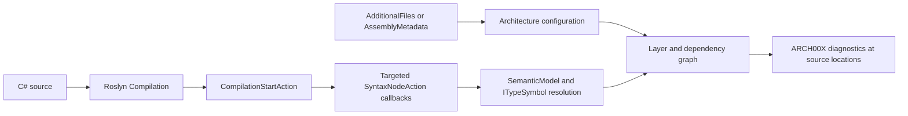

# *A*nalyzer for **N**-dimensional **A**dvanced Architectural Layering - ANAAL IJzer

[](https://www.nuget.org/packages/RonSijm.AnaalIJzer)
[](https://www.nuget.org/packages/RonSijm.AnaalIJzer)
[](https://codecov.io/gh/RonSijm/RonSijm.AnaalIJzer)

## Introduction

A Roslyn analyzer that enforces architectural layering rules in your codebase. You define named layers and explicit allowed dependency edges in an XML file, and the analyzer ensures each type only depends on types in permitted layers - catching illegal dependencies at compile time.

---

## Naming

"IJzer" is the Dutch word for Iron. I - Ron, the creator (of this project) - have therefore decided to name this project "IJzer".

Consider: a "layered" architecture is usually drawn as a stack of horizontal bands - Controller on top, Repository at the bottom, gravity in between. This is a 1-dimensional projection, and already something of a lie. The moment you add a second axis - deployment tier, bounded context, tenant, feature module - you have a grid. Add a third and the whiteboard contains a cube. Add a fourth and you are now reasoning about a **tesseract**: 16 vertices, 32 edges, no faithful embedding in 3-space, and absolutely no chance of fitting next to the standup-room coffee machine.

A penteract has 32 vertices and 80 edges. A hexeract has 64 and 192. By the 23rd dimension you have stopped doing software architecture and started doing something closer to differential topology, or possibly mysticism - the distinction is left as an exercise for the reader.

The point, such as there is one, is that the XML config does not care about your visual limitations. It cheerfully encodes whatever lower-dimensional projection of the underlying hypercube you have conveniently decided to enforce this time, this sprint. The generated documentation shows you that projection with Mermaid diagrams and rule descriptions. This should not be mistaken for understanding. The other dimensions you forgot to project are still there, watching, waiting, occasionally producing an ARCH00X at 4:47 PM on a Friday.

ANAAL IJzer forges the shadow. The hypercube compiles in silent apathy.

---

Ok maybe not.

---

## The problem it solves

### Meta: Why a restaurant?

Architecture terms such as `Controller`, `ViewModel`, `Handler`, or `Slice` come with prior knowledge and expectations about MVC, MVVM, vertical slices, and other specific styles. Using them in the introductory examples could make an incidental name look like a rule or imply that Anaal IJzer prefers one of those architectures.

The restaurant is therefore a deliberately opinionated **example domain**, not a prescribed software architecture. Its roles are familiar enough to discuss boundaries without framework knowledge: a Customer depends on a Waiter, a Waiter depends on a Chef, and a Chef depends on the Pantry. In these examples the roles are simply layer names, and an arrow always means **“may depend on.”** Your own configuration can use whatever layers and architectural style fit your application.

Imagine a restaurant with four roles:

- A **Customer** may ask a **Waiter** for service, but should not direct a **Chef** or enter the **Pantry**
- A **Waiter** may ask a **Chef** to prepare an order
- A **Chef** may use the **Pantry**
- Peers in the same role should not command each other unless that role explicitly allows it

Without tooling, these rules live only in code-review comments and tribal knowledge. This analyzer turns them into compile errors.

How this is usually solved without this project is by creating a separate unit or integration test project to verify these concerns. This analyzer removes that need entirely - violations are reported inline as you type.

---

## How it works

You define named layers and the edges between them in an XML file. The analyzer reads that file and checks every dependency a class, record, struct, or interface introduces - constructor and method parameters, method return types, fields, properties, local variables, inheritance, attributes, static member access, `new` expressions, and generic service-locator invocations. When a type in layer A introduces a dependency on a type whose layer is not permitted for A, an error is reported on the offending syntax.

```
Customer ──► Waiter    ✅ allowed
Waiter ──► Chef        ✅ allowed
Chef ──► Pantry        ✅ allowed

Customer ──► Chef      ❌ ARCH001 - no AllowedDependency edge configured
Pantry ──► Chef        ❌ ARCH004 - wrong direction (reverse of the allowed edge)
Chef ──► Chef          ❌ ARCH005 - same layer
```

### Where it hooks into Roslyn

[Roslyn](https://github.com/dotnet/roslyn/blob/main/docs/wiki/Roslyn-Overview.md) is the .NET compiler platform behind C# and Visual Basic. Instead of exposing only a command that turns source files into assemblies, Roslyn exposes the compiler pipeline as APIs: syntax trees represent parsed source, semantic models bind syntax to symbols and types, and a `Compilation` is an immutable snapshot of the complete program being compiled.

Anaal IJzer is a C# `DiagnosticAnalyzer`. It runs inside that compiler pipeline in Visual Studio, Rider, `dotnet build`, and CI; it is not a post-build reflection scan and does not execute application code.



The integration points are:

1. [`ArchitecturalLevelAnalyzer`](../src/Main/RonSijm.AnaalIJzer/ArchitecturalLevelAnalyzer.cs) is marked with `[DiagnosticAnalyzer(LanguageNames.CSharp)]`, which makes it discoverable as a C# analyzer.
2. For each compilation snapshot, its `CompilationStartAction` reads `Architecture.anl` from Roslyn's `AdditionalFiles`, or reads inline `AssemblyMetadata("AnaalIJzerSettings", ...)`. The parsed configuration is then reused by every callback registered for that compilation.
3. It registers `SyntaxNodeAction` callbacks only for syntax that can introduce an architectural dependency: type and constructor declarations, methods, fields, properties, locals, object creation, invocations, attributes, inheritance, and static member access. Generated code is ignored, and callbacks may run concurrently.
4. [`LayerDependencyAnalyzer`](../src/Main/RonSijm.AnaalIJzer/Analysis/LayerDependencyAnalyzer.cs) uses the callback's `SemanticModel` to resolve syntax to real Roslyn symbols such as `ITypeSymbol`. This is why aliases, inferred local types, generic type arguments, implemented interfaces, and referenced types can be evaluated by their actual type identity instead of by source text alone.
5. The resolved caller and dependency symbols are matched to configured layer paths. The dependency graph evaluates the relevant boundary gates, blocked rules, site filters, recognized-dependency requirements, and forbidden patterns. A failure is returned to Roslyn with `ReportDiagnostic`, including the source location and diagnostic properties such as `Site`.
6. Configuration failures and configured cycles are reported at the end of the compilation as ARCH006 or ARCH007. If there is no configuration source, no dependency callbacks are registered and the analyzer remains silent.

Because the same analyzer participates in design-time and command-line compilations, the red squiggle in the editor and the error in CI come from the same rule evaluation.

---
## Positioning and how it usually works without this project

Anaal IJzer is a lightweight compile-time architecture guard for .NET.

It occupies the space between:
- runtime architecture tests like NetArchTest / ArchUnitNET
- heavyweight static-analysis platforms like NDepend
- old Visual Studio layer diagram validation

### The alternative: architecture tests

The standard approach is to write a dedicated test project using a library such as [NetArchTest](https://github.com/BenMorris/NetArchTest) or [ArchUnitNET](https://archunitnet.readthedocs.io/):

```csharp
// In a test project — ArchitectureTests.cs
[Fact]
public void Presentation_Should_Not_Depend_On_Persistence()
{
    var result = Types.InAssembly(typeof(OrderEndpoint).Assembly)
        .That().ResideInNamespace("MyApp.Presentation")
        .ShouldNot().HaveDependencyOn("MyApp.Persistence")
        .GetResult();

    Assert.True(result.IsSuccessful);
}
```

This works, but it has significant downsides:

1. **Slow feedback** — the violation is only visible when you run the test suite, not while you are typing. By the time CI catches it, the code is already written and often already reviewed.

2. **Wrong location** — the failure appears in a test project, not at the offending line. You see *"ArchitectureTests.Presentation_Should_Not_Depend_On_Persistence failed"*, not a red squiggle on the dependency that caused it.

3. **Wrong concern** — structural rules do not belong in a test suite alongside behaviour tests. A failing architecture test is not a regression; it is a policy violation. Mixing them obscures both.

4. **Rules live in C# instead of config** — to change which layers are allowed to talk to each other you must edit code, recompile, and re-run tests. With `Architecture.anl` you edit a file and the next build picks it up.

5. **Coverage gaps** — the rules only cover what someone explicitly wrote a test for. A missed `ShouldNot` call means a whole class of violations goes undetected. The analyzer enforces every edge in the graph unconditionally.
