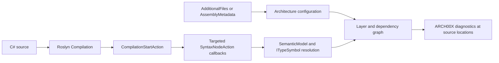

# IJzer

An **A**nalyzer for **N**-dimensional **A**dvanced **A**rchitectural **L**ayering.

[](https://www.nuget.org/packages/RonSijm.AnaalIJzer)
[](https://www.nuget.org/packages/RonSijm.AnaalIJzer)
[](https://codecov.io/gh/RonSijm/RonSijm.AnaalIJzer)

## Introduction

A Roslyn analyzer that enforces architectural layering rules in your codebase. You define named layers and explicit allowed dependency edges in an XML file, and the analyzer ensures each type only depends on types in permitted layers - catching illegal dependencies at compile time.

## Readme Meta

This README is composed from the standalone notes in [`docs/`](../docs/). The generated README is generated as one full document - also because to embed this in the NuGet package and the Visual Studio landing page.

The compose order is defined in [`docs/_readme-order.txt`](../docs/_readme-order.txt). After changing the individual notes, run [`docs/build-readme.ps1`](../docs/build-readme.ps1) to regenerate this readme.
## Legend

| Standalone note | Use it for |
|---|---|
| [`docs/introduction.md`](../docs/introduction.md) | Project overview, naming, restaurant example domain, and Roslyn background. |
| [`docs/setup.md`](../docs/setup.md) | NuGet setup, `.anl` settings files, inline settings, and shared project configuration. |
| [`docs/configuration/ide-code-fixes.md`](../docs/configuration/ide-code-fixes.md) | Which diagnostics have IDE fixers, what they edit, and where the analyzer tests live. |
| [`docs/components/visual-studio-addon.md`](../docs/components/visual-studio-addon.md) | Visual Studio companion extension behavior, options, graph editor, and CodeLens UI. |
| [`docs/tools/arse.md`](../docs/tools/arse.md) | Arse command/TUI usage, reports, generated config, documentation, and file associations. |
| [`docs/components/wpf-graph-editor.md`](../docs/components/wpf-graph-editor.md) | Standalone WPF graph editor usage and graph image export. |
| [`docs/configuration/mental-model.md`](../docs/configuration/mental-model.md) | Beginner-friendly rule precedence and the "four questions" model. |
| [`docs/configuration/*.md`](../docs/configuration/) | Detailed settings reference for layers, dependency rules, type policies, exceptions, name rules, reports, and generated documentation. |
| [`docs/diagnostics/index.md`](../docs/diagnostics/index.md) | Diagnostic overview and links to the `ARCH001` through `ARCH008` pages. |
| [`docs/q-and-a.md`](../docs/q-and-a.md) | Common questions such as framework types, nested boundaries, and same-project interfaces. |
| [`docs/suppressing-violations.md`](../docs/suppressing-violations.md) | Local suppression guidance. |
| [`docs/violation-report.md`](../docs/violation-report.md) | Generated violation report output. |
| [`docs/architecture-health.md`](../docs/architecture-health.md) | Architecture health inspection output. |
| [`docs/architecture-documentation.md`](../docs/architecture-documentation.md) | Generated architecture documentation output. |
| [`docs/no-config-source.md`](../docs/no-config-source.md) | What happens when no settings source is configured. |
| [`docs/getting-started-help.md`](../docs/getting-started-help.md) | First-step guidance when starting from an existing codebase. |
| [`docs/design-generated-files.md`](../docs/design-generated-files.md) | Generated file expectations and maintenance notes. |

---

## Naming

"IJzer" is the Dutch word for Iron. I - Ron, the creator (of this project) - have therefore decided to name this project "IJzer".

Consider: a "layered" architecture is usually drawn as a stack of horizontal bands - Controller on top, Repository at the bottom, gravity in between. This is a 1-dimensional projection, and already something of a lie. The moment you add a second axis - deployment tier, bounded context, tenant, feature module - you have a grid. Add a third and the whiteboard contains a cube. Add a fourth and you are now reasoning about a **tesseract**: 16 vertices, 32 edges, no faithful embedding in 3-space, and absolutely no chance of fitting next to the standup-room coffee machine.

A penteract has 32 vertices and 80 edges. A hexeract has 64 and 192. By the 23rd dimension you have stopped doing software architecture and started doing something closer to differential topology, or possibly mysticism - the distinction is left as an exercise for the reader.

The point, such as there is one, is that the XML config does not care about your visual limitations. It cheerfully encodes whatever lower-dimensional projection of the underlying hypercube you have conveniently decided to enforce this time, this sprint. The generated documentation shows you that projection with Mermaid diagrams and rule descriptions. This should not be mistaken for understanding. The other dimensions you forgot to project are still there, watching, waiting, occasionally producing an ARCH00X at 4:47 PM on a Friday.

ANAAL IJzer forges the shadow. The hypercube compiles in silent apathy.

---

Ok maybe not.

---

## The problem it solves

### Meta: Why a restaurant?

Architecture terms such as `Controller`, `ViewModel`, `Handler`, or `Slice` come with prior knowledge and expectations about MVC, MVVM, vertical slices, and other specific styles. Using them in the introductory examples could make an incidental name look like a rule or imply that Anaal IJzer prefers one of those architectures.

The restaurant is therefore a deliberately opinionated **example domain**, not a prescribed software architecture. Its roles are familiar enough to discuss boundaries without framework knowledge: a Customer depends on a Waiter, a Waiter depends on a Chef, and a Chef depends on the Pantry. In these examples the roles are simply layer names, and an arrow always means **“may depend on.”** Your own configuration can use whatever layers and architectural style fit your application.

Imagine a restaurant with four roles:

- A **Customer** may ask a **Waiter** for service, but should not direct a **Chef** or enter the **Pantry**
- A **Waiter** may ask a **Chef** to prepare an order
- A **Chef** may use the **Pantry**
- Peers in the same role should not command each other unless that role explicitly allows it

Without tooling, these rules live only in code-review comments and tribal knowledge. Tribal knowledge has a habit of accepting an offer elsewhere and leaving with all of the reasoning and none of the documentation. This analyzer turns them into compile errors.

How this is usually solved without this project is by creating a separate unit or integration test project to verify these concerns. This analyzer removes that need entirely - violations are reported inline as you type.

---

## How it works

You define named layers and the edges between them in an XML file. The analyzer reads that file and checks every dependency a class, record, struct, or interface introduces - constructor and method parameters, method return types, fields, properties, local variables, inheritance, attributes, static member access, `new` expressions, and generic service-locator invocations. When a type in layer A introduces a dependency on a type whose layer is not permitted for A, an error is reported on the offending syntax.

```
Customer ──► Waiter    ✅ allowed
Waiter ──► Chef        ✅ allowed
Chef ──► Pantry        ✅ allowed

Customer ──► Chef      ❌ ARCH001 - no AllowedDependency edge configured
Pantry ──► Chef        ❌ ARCH004 - wrong direction (reverse of the allowed edge)
Chef ──► Chef          ❌ ARCH005 - same layer
```

### Where it hooks into Roslyn

[Roslyn](https://github.com/dotnet/roslyn/blob/main/docs/wiki/Roslyn-Overview.md) is the .NET compiler platform behind C# and Visual Basic. Instead of exposing only a command that turns source files into assemblies, Roslyn exposes the compiler pipeline as APIs: syntax trees represent parsed source, semantic models bind syntax to symbols and types, and a `Compilation` is an immutable snapshot of the complete program being compiled.

Anaal IJzer is a C# `DiagnosticAnalyzer`. It runs inside that compiler pipeline in Visual Studio, Rider, `dotnet build`, and CI; it is not a post-build reflection scan and does not execute application code.


```mermaid
flowchart LR
    Source["C# source"] --> Compilation["Roslyn Compilation"]
    Settings["AdditionalFiles or AssemblyMetadata"] --> Config["Architecture configuration"]
    Compilation --> Start["CompilationStartAction"]
    Start --> Syntax["Targeted SyntaxNodeAction callbacks"]
    Syntax --> Semantics["SemanticModel and ITypeSymbol resolution"]
    Config --> Rules["Layer and dependency graph"]
    Semantics --> Rules
    Rules --> Diagnostics["ARCH00X diagnostics at source locations"]
```

The integration points are:

1. [`ArchitecturalLevelAnalyzer`](../src/Main/RonSijm.AnaalIJzer.Engine/ArchitecturalLevelAnalyzer.cs) is marked with `[DiagnosticAnalyzer(LanguageNames.CSharp)]`, which makes it discoverable as a C# analyzer.
2. For each compilation snapshot, its `CompilationStartAction` reads `Architecture.anl` from Roslyn's `AdditionalFiles`, or reads inline `AssemblyMetadata("AnaalIJzerSettings", ...)`. The parsed configuration is then reused by every callback registered for that compilation.
3. It registers `SyntaxNodeAction` callbacks only for syntax that can introduce an architectural dependency: type and constructor declarations, methods, fields, properties, locals, object creation, invocations, attributes, inheritance, and static member access. Generated code is ignored, and callbacks may run concurrently.
4. [`LayerDependencyAnalyzer`](../src/Main/RonSijm.AnaalIJzer.Engine/Analysis/BoundaryRules/LayerDependencies/LayerDependencyAnalyzer.cs) uses the callback's `SemanticModel` to resolve syntax to real Roslyn symbols such as `ITypeSymbol`. This is why aliases, inferred local types, generic type arguments, implemented interfaces, and referenced types can be evaluated by their actual type identity instead of by source text alone.
5. The resolved caller and dependency symbols are matched to configured layer paths. The dependency graph evaluates the relevant boundary gates, blocked rules, site filters, recognized-dependency requirements, and forbidden patterns. A failure is returned to Roslyn with `ReportDiagnostic`, including the source location and diagnostic properties such as `Site`.
6. Configuration failures and configured cycles are reported at the end of the compilation as ARCH006 or ARCH007. If there is no configuration source, no dependency callbacks are registered and the analyzer remains silent.

Because the same analyzer participates in design-time and command-line compilations, the red squiggle in the editor and the error in CI come from the same rule evaluation.

---
## Why compiler-level enforcement matters

Anaal IJzer is a compile-time architecture and structural-policy guard for .NET. It overlaps with test-runner architecture checks such as NetArchTest and ArchUnitNET, heavyweight static-analysis platforms such as NDepend, and the old Visual Studio layer-diagram validation. It is not merely another way to write the same tests.

### Architecture tests are useful, but solve a different problem

A common approach is to write a dedicated test project using a library such as [NetArchTest](https://github.com/BenMorris/NetArchTest) or [ArchUnitNET](https://archunitnet.readthedocs.io/):

```csharp
// In a test project — ArchitectureTests.cs
[Fact]
public void Presentation_Should_Not_Depend_On_Persistence()
{
    var result = Types.InAssembly(typeof(OrderEndpoint).Assembly)
        .That().ResideInNamespace("MyApp.Presentation")
        .ShouldNot().HaveDependencyOn("MyApp.Persistence")
        .GetResult();

    Assert.True(result.IsSuccessful);
}
```

That is valuable for broad assertions about an assembly or a set of published types. It is not equivalent to compiler-level enforcement:

1. **Feedback and location are different.** A test reports from the test project after somebody runs it. Anaal IJzer reports on the exact source construct during design-time analysis and compilation, so the editor squiggle and CI error point to the same dependency, return expression, or declaration.

2. **Behavioural tests only see executed paths.** A `return null`, a sentinel return value, or a `throw` deep in a branch can remain invisible until a test happens to execute that path. Static type-level architecture tests can assert a relationship between types, but they do not automatically inspect every method body and every relevant syntax site.

3. **Complete source inspection needs a compiler host.** A test suite could add custom Roslyn or IL inspection for every return, invocation, generic argument, inheritance site, or declaration it cares about. That is effectively building a compiler inspection in a test runner. Anaal IJzer is already hosted at that point: Roslyn visits every configured matching site in the compilation, including code that no test executes.

4. **Policy is distinct from behaviour.** A failing behaviour test says a scenario no longer works. A failing architectural policy says the code shape itself is not permitted, even when the scenario still works perfectly. Both are important, but they should be visible and owned separately.

5. **Configuration is the policy surface.** With `Architecture.anl`, layer relationships, type policies, site restrictions, and structural observations are explicit configuration. Changing the policy does not require inventing another test method or burying the rule in test code.

### What Anaal IJzer adds

Anaal IJzer uses Roslyn's semantic model while the compiler still knows the real symbols behind the source. This makes rules about aliases, inferred locals, generic arguments, implemented interfaces, attributes, and nested boundaries dependable rather than text-based guesses.

It can also enforce configured policies inside a method body. For example, a [`ReturnValuePolicy`](configuration/return-value-policies.md) can reject a direct `return null`, an empty string, an enum-zero sentinel, or the unchanged result of a method annotated as optional. The analyzer reports each matching return expression even when the method is never exercised by a test.

For a rule that must hold at every relevant source site, runtime coverage cannot prove compliance unless it executes every possible path. A test can approximate that guarantee only by adding an equivalent static inspection. That is why compiler-level analysis is not a substitute for an architecture test: it is the direct enforcement mechanism for a different class of policy.

### Complementary tools

Architecture tests still have a place for broad checks over shipped assemblies, external binaries, or intentional test-suite-level assertions. Behavioural and integration tests remain essential for proving that the application works. Anaal IJzer complements them by making configured structural and semantic policies part of ordinary compilation, with immediate feedback at the offending line.
